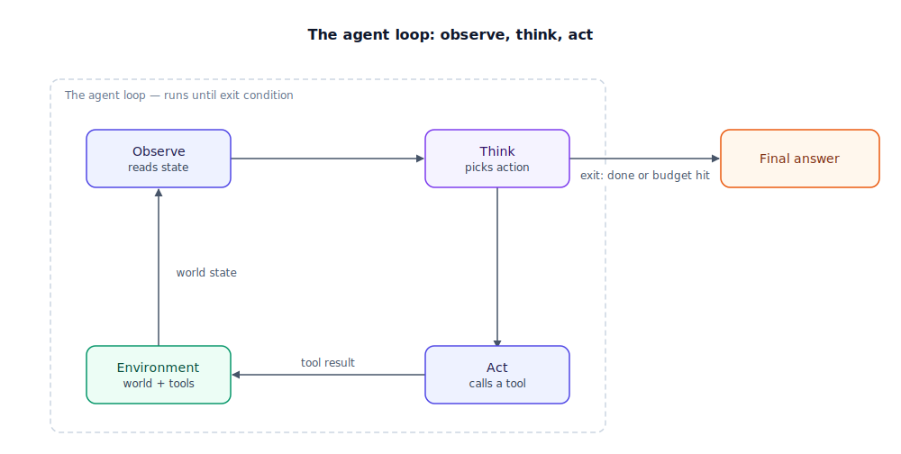

## The 30-second version

An agent is a system where the model decides its own next move, on a loop: it observes the current state of the world, reasons about what to do, takes an action through a tool, and then observes the result of that action before deciding again. What makes it an agent isn't the model itself — it's whether that loop chooses its own path, step by step, instead of following a sequence a developer wrote in advance. A single LLM (large language model) call that classifies a ticket and hands it to a fixed pipeline is not an agent; a system that reads the ticket, checks different systems depending on what it finds, and decides when it has enough evidence to act, is. Autonomy is a dial, not a switch, and turning it up trades predictability for the ability to handle situations nobody scripted for.

## The analogy

Picture three ways to get from your house to the airport.

The first is cruise control: set it to 65 and it holds that speed, reacting to exactly one signal — your current speed versus the target. It has no idea there's an airport, a route, or a merge coming up in half a mile. This is the simplest kind of automation, a feedback loop with zero judgment, and it is not an agent, however clever the algorithm underneath.

The second is a turn-by-turn navigation app. You tell it the destination once, and it computes a full route in advance. It will recalculate if you miss an exit, but the *shape* of what it can do was decided before you started driving: turn left, turn right, arrive. It never questions whether you actually want to go to the airport, and it doesn't decide to stop for gas because it noticed the tank is low — someone would have had to build that branch in ahead of time. This is a workflow: a fixed plan with a little built-in recalculation, not an open-ended decision-maker.

The third is calling a chauffeur and telling them: "Get me to the airport by 6, I have a 40-pound bag, and I'd rather pay a toll than be late." From there, the chauffeur watches the road — actual traffic, an accident two exits up, the fact that you're now running five minutes behind because you couldn't find your passport — and continuously decides what to do about it: take the toll road, skip the coffee stop, call ahead to the terminal. Nobody wrote out the full route in advance, because nobody could have. That watch-decide-act cycle, repeating for as long as the trip takes, is the agent loop. Notice what you gave up to get it: you can no longer predict exactly which streets you'll take, and if the chauffeur makes a bad call, it happens on the road, not in a spec review.

| Road trip | Agent concept |
|---|---|
| Cruise control holding 65 | A simple feedback controller — not an agent |
| Nav app's precomputed turn-by-turn route | A fixed workflow — some branching, but decided in advance |
| "Get me to the airport by 6, avoid being late" | The goal you hand the agent |
| Chauffeur checking traffic, weather, the clock | Observe |
| Chauffeur deciding whether to take the toll road | Think (reasoning over the current state) |
| Chauffeur changing lanes, taking the exit, calling ahead | Act (a tool call, or an action in the world) |
| Chauffeur noticing the new traffic after changing route | The loop repeating — re-observe after acting |
| Choosing a chauffeur over driving yourself | The autonomy-for-control trade you're making |
| Hiring a chauffeur to drive four blocks to the mailbox | An agent applied to a task that never needed one |

## How it actually works

Follow the loop in the diagram. Everything starts at **environment**: the current state the agent has to work with — a user's request, the result of the last tool call, a file, a system alert. That state flows into **observe**, where the agent reads it. From there it flows into **think**: the model reasons over what it just observed and the goal it was given, and decides on a single next action. That decision becomes **act**: the agent calls a tool — a search, a database query, an API write, a shell command — and something actually changes or gets revealed out in the world. The result flows back into the environment, and the loop turns again.

The loop doesn't run forever. Two conditions end it, shown as the exit arrow leaving "think": the model decides the goal is satisfied and produces a final answer, or an external budget — a turn limit, a time limit, a cost cap — forces a stop regardless of what the model thinks. That budget is not an optional safety feature. Without it, a confused agent has no built-in reason to ever stop calling tools.

The dashed boundary around the loop marks what separates an agent from a workflow: everything inside it is chosen dynamically, turn by turn, by the model itself, based on what it has seen so far. A workflow has the same observe-then-act shape, but the routing between steps is fixed by a developer ahead of time. No matter how many if/else branches you bolt on, those branches don't change based on the loop's own history the way an agent's next action does — a workflow's decision tree is drawn before the first request ever arrives.

## A concrete example

A billing team handles roughly 9,000 refund requests a month. Two designs were tried against the same ticket queue.

**Fixed 3-step workflow:** look up the account, apply the standard refund percentage for the customer's plan tier, issue the refund. Three API calls, well under a second, fully deterministic — the same ticket always produces the same output. It resolved 61% of tickets correctly. The other 39% were tickets where a customer had already received a partial refund in the last 30 days, was on a grandfathered plan with different terms, or was asking for something adjacent to a refund (a plan downgrade instead of a payout). The workflow had no branch for "check refund history first," so it silently applied the wrong amount rather than failing loudly.

**Agent given the goal "resolve this refund request correctly per policy":** it observes the ticket, decides it needs the account's refund history before doing anything else, calls that tool, observes a prior refund issued 12 days earlier, reasons that a proration rule applies, checks the plan-tier table, computes the adjusted amount, issues the refund, and drafts a one-line explanation. That took 6 tool calls and about 21 seconds on average, at roughly 6 cents of model cost per ticket. Correctness on the same ticket sample: 89%. The remaining 11% were genuinely ambiguous edge cases that the team routed to a human instead of letting the agent guess.

The agent didn't get better tools than the workflow had access to. It got permission to decide, per ticket, which tools to check and in what order.

## The tradeoffs that matter

| Approach | Predictability | Handles novel cases | Cost & latency | Debugging |
|---|---|---|---|---|
| Fixed workflow | Same input, same output, always | Poor — only the paths someone coded | Lowest; a handful of calls | Easy — one trace, no branching to explain |
| Branching workflow / rules engine | High, but only across anticipated branches | Moderate — bounded by how many branches you wrote | Low | Moderate — more branches to reason through |
| Agent (loop) | Path varies run to run, even on similar input | Strong — reasons over cases nobody enumerated | Scales with turns; can run 5–20x a workflow's cost | Hard — needs full trace replay to see why a path was chosen |

The honest framing: a workflow buys certainty, an agent buys reach. If you can enumerate the paths your task will ever need, a workflow gets you there for a fraction of the cost, with a trace anyone can audit in five minutes. Reach for a loop only when the paths themselves are the unknown — when the right next step depends on something you can't know until you've already taken the previous one.

## Where people go wrong

1. **Calling anything with an LLM in it "an agent."** A single model call that classifies a ticket and hands it to a fixed pipeline is a workflow with a smart step, not an agent — nothing is choosing its own path.
2. **Reaching for a loop when a script would do.** If the decision space is small and stable, an agent adds latency, cost, and unpredictability to buy flexibility you'll never use.
3. **Shipping a loop with no turn or cost budget.** Without an exit condition that doesn't depend on the model's own judgment, a stuck agent has no reason to stop.
4. **Assuming more autonomy is strictly an upgrade.** The freedom that lets an agent solve a case nobody anticipated is the same freedom that makes its behavior harder to guarantee under audit or compliance review.
5. **Never benchmarking the agent against the workflow it replaced.** Teams ship the version that impressed the demo and skip the unglamorous comparison of cost, latency, and correctness against the boring deterministic baseline.

## The interview lens

Interviewers use this topic to see whether you reach for agents because a problem needs one, or because they're the exciting answer. The tell is whether you can name the specific uncertainty that justifies the loop.

A strong sound bite: *"I don't ask whether a system uses an LLM to decide if it's an agent — I ask whether the next action is chosen by the loop itself, from what it just observed, or whether a developer already knew every branch in advance. If a human could have written the full decision tree ahead of time, I'd rather ship the cheap, auditable workflow than an agent wearing the same job."*

Likely follow-ups:

- Where's the line between "a workflow with a lot of branches" and an agent?
- How do you bound the cost of an agent that takes a wrong turn early and compounds it over many steps?
- What would make you rip an agent out of production and replace it with a fixed pipeline?

## Go deeper

- [Reasoning Loops: ReAct and Beyond](./reasoning-loops-react-and-beyond.mdx) — the mechanics of what happens inside "think."
- [Tool Use and MCP](./tool-use-and-mcp.mdx) — what "act" actually calls, and how those calls are wired up.
- [Agentic Security and Sandboxing](./agentic-security-and-sandboxing.mdx) — the risk side of the autonomy trade.
- Upstream reference: [Agent Fundamentals — AI System Design Guide](https://github.com/ombharatiya/ai-system-design-guide/blob/main/07-agentic-systems/01-agent-fundamentals.md) (MIT; see [CREDITS](../../../CREDITS.md)).
