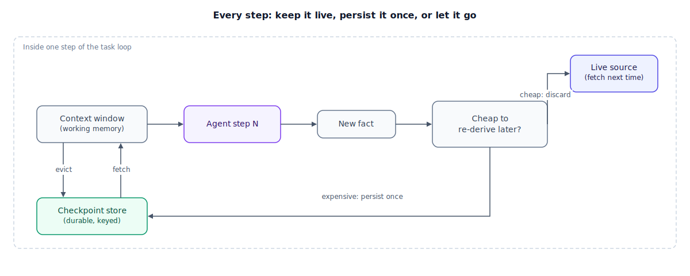

## The 30-second version

An agent working a multi-step task carries two kinds of memory: what's live in its context window right now (the current plan, recent tool results, a running scratchpad) and what's written to durable state outside that window (a checkpoint, a task log) so it survives a restart or a long gap between turns. The question at every step isn't "should I remember this?" — it's "where does this fact belong, and is it cheaper to store it or re-fetch it next time?" Treat agent state as a retrieval problem: the context window is a cache with a hard size limit, and everything that doesn't fit either gets persisted somewhere retrievable, or discarded because regenerating it later is cheaper than storing it. This chapter is scoped to state *within* one agent's task or session; for long-term, cross-session memory, see [Memory Architectures](../memory/memory-architectures.mdx).

## The analogy

You're moving apartments across town over a weekend — a multi-step job spread across two days.

At any moment you're holding a small number of things in your hands: the box you're carrying, your keys, the pizza receipt from lunch. That's working memory — fast to reach, but you can only hold so much before something drops. Everything else goes into the truck: boxes, labeled and stacked, that you're not touching right now but that exist durably and that you can pull out the moment you need them. That's persisted task state.

Before anything goes in a box, you make a call on almost every item: worth hauling across town, or cheaper to leave behind and buy new? A three-dollar spice jar isn't worth truck space — you'll just re-buy it Monday. Your grandmother's chair goes in bubble wrap, because there is no re-buying it. That's the exact decision an agent faces on every fact it produces mid-task: some things are cheap to re-derive on demand, and some aren't.

The failure mode that actually costs you the weekend isn't forgetting to pack something — it's losing the inventory list. If you can't remember which box has the router in it, you're opening every box in the truck one at a time until you find it. An agent with unindexed state looks exactly like this: the fact exists somewhere, but finding it costs as much as never having stored it.

| Moving weekend | Agent memory and state |
|---|---|
| What's in your hands right now | Context window / working memory |
| The moving truck, boxes labeled and stacked | Persisted task state (checkpoint store, task log) |
| Deciding what to box vs. re-buy later | Deciding what to persist vs. re-derive on demand |
| Grandma's chair — irreplaceable, worth the space | A fact that's expensive or impossible to reconstruct (a user decision, a one-off tool result) |
| The three-dollar spice jar you'll just re-buy | A fact that's cheap to re-fetch (today's price, current queue depth) — don't bother storing it |
| Losing the inventory list, opening every box | Unindexed state — the fact "exists" but retrieval costs as much as never storing it |
| Unpacking only tonight's boxes, not the whole truck | Loading only the relevant slice of task state back into context, not the whole history |

## How it actually works

Follow one step of a long-running task through the diagram. The **context window** holds the active plan, recent tool outputs, and a scratchpad — fast to access, but hard-capped in tokens, and gone the instant the process restarts or the window gets trimmed. Whenever a step produces a new fact worth keeping, it hits the same decision: **is this cheap to reproduce later?** If a tool call can regenerate it on demand — a live price, a queue depth, anything with a current source of truth — don't store it; storing it just risks staleness. If it isn't cheap to reproduce — a user's explicit decision, a computation that took real tool calls to produce — write it once to a **durable checkpoint** keyed by task or session ID, outside the model's context entirely.

As the task runs longer, the context window fills up and older turns get evicted. That's fine, as long as anything worth keeping was already checkpointed or summarized before it fell out — the summary stays in the live window (a compact one-line fact instead of the raw output), while the full record sits in the checkpoint store, one lookup away if a later step needs it back. That isn't "memory" in the human sense — it's retrieval: look the fact up by its key, pull back exactly that slice, leave the rest of the history alone. Agent state isn't a bigger box to remember more things in; it's an index designed well enough to find the one thing you need.

This is deliberately narrow in scope: state *inside* a single task or session — the plan, the scratchpad, the checkpoint that lets a crashed run resume. It is not the architecture for facts that should outlive the session and follow a user across weeks (see [Memory Architectures](../memory/memory-architectures.mdx)), and it isn't about optimizing what lives in the live window turn-to-turn (see [Short-Term Context Management](../memory/short-term-context.mdx)). The overlap is real — both are "state outside the context window" — but the lifetime differs: a checkpoint dies with the task; long-term memory is designed to outlive it.

## A concrete example

An agent verifies a data migration by checking 40 database tables, one per step, comparing each table's schema before and after.

**Keep everything in the live context window.** Each step's tool output (a schema diff) averages 1,500 tokens. By step 25, running context — system prompt, plan, 25 raw diffs, scratchpad — sits around 55,000 tokens, and time-to-first-token has grown from ~400 ms at step 1 to ~1.1 s at step 25, purely from context size. Assuming context grows roughly linearly from 5,000 to 60,000 tokens across 40 steps, the average call carries ~32,500 input tokens; across 40 calls that's ~1.3 million input tokens. At $3 per million input tokens, that's about **$3.90** just to keep re-sending context that mostly repeats what the model already saw.

**Persist the full record, keep a summary live.** After each check, write the full 1,500-token diff to a checkpoint keyed by `(task_id, table_name)`, and keep only a 60-token summary live ("orders: 2 columns added, 0 breaking"). Live context now grows ~60 tokens per step instead of 1,500 — after 40 steps, total context is roughly 6,000 tokens flat, no growth curve. Total input across 40 calls is ~240,000 tokens, or roughly **$0.72**. If step 33 needs the full `orders` diff again, a single checkpoint lookup returns that 1,500-token record instead of re-running the check.

Persisting once and summarizing live costs about 5x less than keeping everything live, keeps per-step latency flat instead of climbing, and still puts the full record one lookup away when a later step needs it.

## The tradeoffs that matter

| Strategy | Live-context cost | Storage cost | Recoverable after a crash? | Reach for it when |
|---|---|---|---|---|
| Keep everything in context | Grows every step; latency climbs | None | No — lost when context is trimmed or the process dies | Very short tasks (a handful of steps) |
| Persist raw, nothing live | None | Highest | Yes, fully | Facts you'll need verbatim and rarely re-check |
| Persist raw + summary live | Small, flat | Moderate | Yes — full record one lookup away | Default for multi-step tasks past ~10 steps |
| Discard, re-derive on demand | None | None | N/A — regenerated, not restored | Values that go stale fast and are cheap to look up again |

The number that matters here is the *re-derivation cost* of each fact: how expensive is it, in tool calls or wall-clock time, to reconstruct if you didn't store it? Cheap re-derivation means discarding is free insurance against staleness. Expensive re-derivation — a multi-step computation, a user's one-time answer — means the checkpoint is the only thing standing between a mid-task crash and starting over from step 1.

## Where people go wrong

- **Storing everything raw with no index.** Nothing is keyed for fast lookup — the store technically "has" the fact, but finding it later means scanning, which defeats the point of persisting it.
- **Persisting nothing and hoping the context window is enough.** Works for five-step tasks, fails the moment a process restarts mid-run — there's no way back to step 30 except running it again from step 1.
- **Persisting facts that should just be re-fetched.** Caching a live price "to save a call" quietly turns into serving stale data a few steps later.
- **Confusing a task checkpoint with long-term memory.** A checkpoint should die with the run; using it to also store durable, cross-session facts mixes two systems with different lifetimes.
- **Keeping full raw tool output live "just in case."** The single biggest avoidable cost in long-running agents — a one-line summary plus a checkpoint key almost always does the job at a fraction of the tokens.

## The interview lens

Interviewers use this topic to see whether you reach for "bigger context window" as the default fix, or actually design where a fact lives.

A strong sound bite: *"I treat everything past the current step as a retrieval problem, not a memory problem — cheap-to-refetch facts get discarded, everything expensive to reproduce gets a checkpoint key, and the live context window only ever holds a summary plus whatever the current step needs."*

Likely follow-ups:

- How do you decide checkpoint granularity? (Every step if tool calls are expensive to redo; milestones if steps are cheap and frequent checkpointing just adds write overhead.)
- What happens if the process crashes mid-task? (Resume from the last checkpoint, reload the summary trail, and re-verify the most recent step rather than trusting it blindly.)
- How does a task checkpoint differ from long-term, cross-session memory? (Different lifetime and owner — a checkpoint dies with the task; long-term memory is designed to outlive it.)

## Go deeper

- [Memory Architectures](../memory/memory-architectures.mdx) — the tiered, cross-session model this chapter deliberately stays out of.
- [Short-Term Context Management](../memory/short-term-context.mdx) — optimizing what lives in the live window turn-to-turn.
- [Durable Execution](./durable-execution.mdx) — the checkpoint/resume machinery this chapter's persistence side depends on.
- Upstream reference: [Agent Memory and State — AI System Design Guide](https://github.com/ombharatiya/ai-system-design-guide/blob/main/07-agentic-systems/05-agent-memory-and-state.md) (MIT; see [CREDITS](../../../CREDITS.md)).
