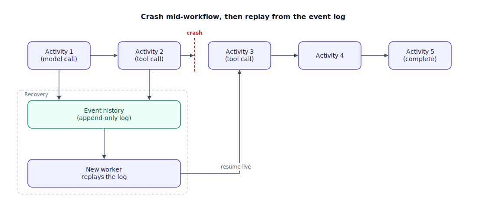

## The 30-second version

An agent run isn't a request/response call — it calls tools, waits on approvals, and carries state (see [agent-memory-and-state.mdx](./agent-memory-and-state.mdx) for what that state actually holds) across steps that can run for minutes, hours, or days. Ordinary infrastructure doesn't cooperate with that: processes get killed, nodes get recycled, deploys roll pods mid-task. A naive agent holding its state in memory loses everything when any of that happens, and a naive retry after a crash re-runs side effects that already fired — charging a card twice, sending a duplicate email. **Durable execution** is the discipline that closes both gaps: it replays exactly what already happened from a recorded log instead of guessing, and it makes each side-effecting step fire exactly once even across a crash.

## The analogy

Think of a Broadway show's cue sheet — the exact, timestamped record a stage manager keeps of every light cue, sound cue, and entrance, called live from a backstage console.

If the power drops mid-Act-2, the crew doesn't restart from the top of Act 1. They pull up the cue sheet, see precisely which cues already fired — confirmed, because each one lights a confirmation light backstage the instant it completes — and resume from the next uncalled cue. Nobody re-fires the confetti cannon that already went off just because the crew lost track during the outage; the sheet already recorded that it fired, so a "replay" of the show skips straight past it. The one genuinely dangerous moment is a cue that was *mid-fire* when the power went — did the trapdoor open before the blackout or not? That ambiguity is exactly why every cue needs its own confirmation, not a note that the crew "was probably on schedule." And if the manager holds the show at intermission for a fix, the sheet doesn't degrade — the crew picks it back up hours later at exactly the next cue. The one thing that truly breaks this system is renumbering Act 2's cues mid-run: an already-in-progress performance replaying against a renumbered sheet is a fast way to fire the wrong cue at the wrong moment.

| Broadway cue sheet | Durable execution |
|---|---|
| The timestamped log of every cue called so far | The append-only event history / workflow journal |
| A confirmation light that only lights once a cue definitively fires | An idempotency key marking a side-effecting activity as completed |
| Power outage mid-Act-2 | Process crash, node recycle, or a deploy rolling the worker |
| Resuming from the next uncalled cue instead of restarting Act 1 | Replaying the event log to reconstruct state and resume at the right step |
| Never re-firing the confetti cannon because no one could tell it already fired | Exactly-once side effects via recorded activity results, not blind retries |
| Holding the show at intermission and resuming hours later at the right cue | Durable timers and signals that survive long pauses, like a human approval wait |
| Renumbering Act 2's cues mid-run and breaking an in-progress replay | The versioning hazard — changing workflow code breaks replay of histories already in flight |

## How it actually works

Follow the top row first, then the crash. The core pattern is **workflows-as-code plus an append-only event history plus deterministic replay**. A workflow (the durable version of your agent loop) runs a sequence of **activities** — the only place side effects and non-determinism are allowed to live: a model call, a tool call, a database write. Each activity's result is recorded to the event history the moment it completes. If a worker dies at activity 3 of 5, a new worker doesn't start over — it **replays** the history, reconstructing activities 1 and 2 from their recorded results instead of re-executing them, then resumes live at activity 3.

That's why workflow code has a hard constraint: it must be **deterministic**. No direct calls to the current time, no random IDs, no raw network calls inside workflow logic — anything nondeterministic is pushed into an activity, because replay only works if re-running the workflow code produces the same sequence the log already recorded. Side-effecting activities carry an **idempotency key**, usually derived from the workflow and step IDs, so a retried call after a crash returns the already-recorded result instead of firing the side effect again — this is what makes charge-the-card or send-the-email calls exactly-once instead of at-least-once. **Durable timers** persist across restarts, so a workflow can wait days without holding a process open, and **signals** push external events — an approval, a cancellation — into a running workflow, the crash-proof version of the pause in [human-in-the-loop-patterns.mdx](./human-in-the-loop-patterns.mdx).

The tradeoff this buys is **versioning discipline**: because a long-running workflow may replay an old history, changing its code can break replay for anything already in flight unless versioned carefully — the single most-cited operational hazard, and the direct cost of getting exactly-once replay for free. The same model extends to [multi-agent-orchestration.mdx](./multi-agent-orchestration.mdx): a sub-agent call becomes a child workflow, inheriting the same guarantees as its parent, so a crash mid-delegation doesn't lose track of which sub-agent already finished.

## A concrete example

A document-processing workflow ingests 10,000 documents in one run, calling a billing API for each invoiced customer along the way, and takes roughly 6 hours end to end at about $0.003 in LLM cost per document.

- **The crash:** the worker dies at document 6,412 of 10,000, mid-run, after 3.8 hours.
- **Naive re-run cost:** without a durable log, the only safe option is starting over — 6,411 already-completed documents re-processed at $0.003 each is **$19.23 wasted**, plus roughly 3.8 hours of redone wall-clock time.
- **Durable replay cost:** with the event history, a new worker replays documents 1–6,411 from their recorded results in seconds rather than re-executing them, and resumes live at document 6,412 — the wasted cost drops from $19.23 to effectively the cost of reading a log.
- **Exactly-once side effects:** of the 6,411 completed documents, 380 triggered a billing API charge. Idempotency keys on that activity, one per document ID, mean a retried charge after the crash returns the recorded result instead of billing again. Without that key, even a 0.5% chance of a duplicate charge across 380 calls is about 2 double-billed customers per run — at an average invoice of $42, that's roughly **$84 in erroneous charges per run**, entirely avoided by a key that costs nothing to add.

## The tradeoffs that matter

| Approach | Guarantees | Operational cost | Best fit |
|---|---|---|---|
| Full durable-execution engine (e.g. Temporal) | Exactly-once side effects, durable timers, signals, replay across deploys | Highest — a separate cluster, strict determinism rules | Irreversible side effects (payments, deploys, multi-day approvals) |
| Library-based durable execution (e.g. DBOS, on your Postgres) | Exactly-once for DB-backed side effects, no separate cluster | Low — one dependency | Side effects mostly land in your own database |
| Framework-native checkpointing (e.g. LangGraph checkpointers) | Recovers workflow *state* at each step | Low — already built into the framework | Mostly-reasoning agents with recoverable, idempotent tools |
| Retry queue plus idempotency keys, no durable engine | Survives transient failures; no protection across a full crash | Lowest | Short-lived, read-only, or fully re-runnable tasks |

The honest framing: a checkpoint answers "where was I," a durable-execution log answers "what already happened." The gap between those two questions is exactly the unsafe window a naive retry falls into — and it only matters once a tool call has a side effect you can't safely repeat.

## Where people go wrong

1. **Trusting a periodic state snapshot as good enough.** The unsafe window is between executing a side effect and recording that it happened; a snapshot taken between steps doesn't close that window, only a journaled log of the steps themselves does.
2. **Writing non-deterministic code inside the workflow.** A direct `time.now()`, a random UUID, or a raw network call inside workflow logic breaks replay the moment history and live execution diverge.
3. **Shipping a workflow code change without a versioning plan.** A workflow started under the old code, replaying against new code, can call the wrong activity at the wrong step — a real incident, not a theoretical one.
4. **Reaching for a full engine like Temporal for a single-shot, idempotent, read-only agent.** The determinism constraints and operational overhead are a real cost; framework checkpointing plus a couple of idempotency keys is often the entire fix that task needed.
5. **Assuming a naive retry is harmless because "it usually works."** It's harmless right up until the retried call is a payment, and then it's a duplicate charge with your name on the incident report.

## The interview lens

Interviewers here are testing whether you understand *why* a checkpoint isn't durability, not whether you can name Temporal.

A strong sound bite: *"A checkpoint tells you where you were; a durable-execution log tells you what already happened — and only the log can promise a side effect fires exactly once."*

Likely follow-ups:

- How would you migrate an existing framework-checkpointed agent to a full durable-execution engine, and what would actually change? (Side-effecting calls move into activities with idempotency keys; the reasoning loop itself becomes the workflow; nondeterministic calls get pushed out of workflow code.)
- How do you version a long-running workflow without breaking replay of runs already in flight? (Branch on a version marker recorded in the history itself, so old runs keep replaying old logic while new runs pick up the change.)
- What's the cheapest way to get exactly-once semantics without operating a full cluster? (A library approach that shares your existing database transaction, plus idempotency keys on the handful of genuinely irreversible calls.)

## Go deeper

- [Human-in-the-loop patterns](./human-in-the-loop-patterns.mdx) — the approval pause this chapter's durable timers and signals make crash-proof.
- [Error handling and recovery](./error-handling-and-recovery.mdx) — the retry logic that durable execution replaces once side effects can't safely be repeated blindly.
- [Loop engineering](./loop-engineering.mdx) — externalizing state so a long-running loop is resumable, the design goal this chapter makes crash-safe.
- Upstream reference: [Durable Execution for Long-Running Agents — AI System Design Guide](https://github.com/ombharatiya/ai-system-design-guide/blob/main/07-agentic-systems/11-durable-execution.md) (MIT; see [CREDITS](../../../CREDITS.md)).
