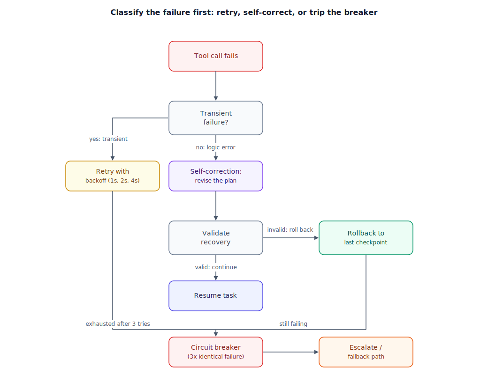

## The 30-second version

Agents fail constantly, and treating every failure the same way is itself a failure mode. The first job of error handling is classification: is this a **transient failure** — a flaky network call, a momentary rate limit, the kind of thing that succeeds if you just try again — or a **logic error** — wrong arguments, a plan built on a wrong premise, the kind of thing that fails identically every time you repeat it? Transient failures get a retry with backoff; logic errors need a self-correction loop that revises the plan, not the API call. The failure mode above both is the one that actually does damage: an agent that "recovers" by taking a confident, unverified action that leaves things worse than doing nothing would have. Good recovery design spends as much effort bounding how bad a bad recovery can be as maximizing how often recovery succeeds.

## The analogy

You're a bike courier partway through a route, packages still to deliver before the cutoff.

You turn onto a street and find it closed for a parade. This is a **transient failure**: nothing about your route was wrong, the world just changed underneath you for an hour. The right move is simple — wait it out, or take the next parallel street and rejoin a block later. Either way the delivery still succeeds, at a cost of a few minutes.

Now compare a wrong address on the label. You bike to the building, and no such unit exists. Riding to the exact same address again changes nothing — repeating the same action produces the same wrong outcome every time. What actually needs to happen is checking the label against the customer's account — revising your understanding of where you're supposed to go, not repeating the ride. That's a **logic error**.

There's a third moment, and it's the one that actually costs you the day. Running late, you spot a narrow alley that looks like a shortcut. You duck in, confident it saves five minutes — and it dead-ends at a construction fence you didn't see from the entrance. Now you're not just as late as you would have been; you're later, because backing a loaded bike out of a dead end costs more time than the longer route would have. That's the failure mode worth fearing most: not the closed street, not the wrong address, but the "recovery" taken with too much confidence and too little verification, that leaves you worse off than doing nothing.

The dispatcher exists for exactly the case where none of your own moves are working: after the same block fails three times in a row, you radio in instead of improvising a fourth variation alone.

| Bike delivery | Error handling and recovery |
|---|---|
| Street closed for a parade | Transient failure — retry after backoff, or reroute |
| Wrong address on the label | Logic error — retrying fails identically; the plan needs revising, not repeating |
| Checking the label against the account before re-riding | Self-correction loop — revise the plan before re-attempting |
| Ducking into a shortcut alley that dead-ends | A recovery taken without verification, leaving the agent worse off than before |
| Backing a loaded bike out of a dead end | The cost of undoing a bad recovery — often higher than the original failure |
| Radioing the dispatcher after three failed attempts | Circuit breaker — stop retrying blindly and escalate |
| Confirming the package matches the door before marking it delivered | Output validation — catching a confident, silent wrong answer |

## How it actually works

Follow the diagram from a failed tool call. The first fork is classification, not retry: **is this transient?** — a timeout or rate limit, with no relationship to whether the plan was correct. If yes, retry with exponential backoff (1s, then 2, then 4) up to a small cap, since the same call has a real chance of succeeding once the condition clears. If it's a **logic error** instead — wrong arguments, or a call that succeeded against the wrong premise — retrying the identical call is pointless; it fails identically every time. What has to happen instead is a **self-correction loop**: the error gets fed back into the model's context as information, and the model revises the plan before the next attempt, not just the parameters.

The step most systems skip sits between "the model produced a recovery" and "the recovery counts as done": **output validation**. A plausible-looking recovery isn't automatically correct, and treating it as correct without checking is how an agent turns one failure into two. A cheap verifier — a smaller model, or a deterministic check — confirms the recovery actually resolves the original problem before the agent moves on. If validation fails, the right move isn't layering a third guess on a second; it's rolling back to the last known-good checkpoint (see [Durable Execution](./durable-execution.mdx)) and trying something materially different, or stopping.

Finally, both paths share a counter. If the exact same `(tool, arguments)` pair fails three times in a session, that pattern is the signal regardless of cause. A **circuit breaker** trips, the agent is blocked from that exact action, and the task routes to a human or fallback path (see [Human-in-the-Loop Patterns](./human-in-the-loop-patterns.mdx)) instead of grinding through a fourth attempt the first three already ruled out.

## A concrete example

**Retry economics.** A pipeline agent makes 500 external API calls a day. 4% (20 calls) hit a transient `429 Too Many Requests`; retried with backoff, essentially all succeed within the first or second attempt, adding ~2.3 seconds each and no meaningful cost. Separately, 1.5% (8 calls a day) fail with a genuine schema violation. Blindly retried like the transient failures, each fails identically up to 3 times before giving up: 24 wasted calls a day, each a full model round-trip (~$0.002, ~800 ms) — under a dollar a month, trivial at this scale. Run the same pipeline at 50,000 calls a day instead of 500, and the same 1.5% logic-error rate blindly retried becomes 2,250 wasted calls a day, roughly $135 a month and 30 minutes of pure wasted latency, for zero additional success — a logic error retried blindly never succeeds no matter how many times you repeat it. Classifying the failure and routing schema violations to self-correction instead recovers most of that cost, and actually fixes some of those 8 calls instead of just re-failing them.

**The cost of a bad recovery.** A nightly job reconciles duplicate customer records across 12,000 accounts. A stale search index causes 40 lookups to come back empty (transient — it catches up within hours). Without a recovery-quality floor, the agent's fallback is to fuzzy-match each against the nearest similar record and merge automatically. Historical incident data shows about 22% of those merges (9 of 40) merge the wrong two customers, corrupting shared order history. Unwinding one bad merge takes a team about 3 hours; 9 merges costs **27 engineer-hours**. Leaving those 40 records unmerged and letting the next run retry once the index is current costs **zero hours**. The "recovery" was strictly worse than doing nothing.

## The tradeoffs that matter

| Strategy | Fixes transient | Fixes logic errors | Compounding-damage risk | Cost |
|---|---|---|---|---|
| Blind retry (no classification) | Yes | No — fails identically | Low, but wastes calls | Wasted latency + tokens at scale |
| Classify + retry / self-correct | Yes | Often | Moderate — a self-correction can still be wrong | One extra call to classify and revise |
| + Output validation | Yes | Yes | Low — bad recovery caught before it's trusted | One verification call per attempt |
| + Checkpoint / rollback on failed validation | Yes | Yes | Lowest — reverts instead of compounding | Requires state snapshots |
| Circuit breaker after N identical failures | N/A | N/A | Prevents indefinite compounding | Human or fallback-path cost |

The load-bearing layer is output validation. Retries and self-correction both increase the *chance* of recovering; only validation catches the case where the "recovery" was confidently wrong — the one scenario that actively makes the system worse rather than merely failing to help.

## Where people go wrong

- **Retrying every failure the same way.** A schema violation retried like a network blip fails identically every time, burning latency and tokens for nothing.
- **Trusting a recovery without checking it.** A plausible-looking fix isn't a verified fix; skip validation and you risk turning one failure into a worse, silent one.
- **No cap on retries or self-correction.** Without a circuit breaker, a logical stall repeats indefinitely — the classic "loop of death."
- **No rollback path when validation fails.** Without a checkpoint, the next move is another guess layered on the last, making cleanup more expensive.
- **Confusing "returned 200 OK" with "succeeded."** A silent failure — the call worked, but the data is wrong — passes right through handling built only to catch exceptions.

## The interview lens

Interviewers use this to see whether you reach past try/catch — whether you know a failure needs diagnosis before treatment, and that a "successful" recovery still needs checking before you trust it.

A strong sound bite: *"I classify a failure before reacting — transient gets a bounded retry, a logic error gets a self-correction loop that revises the plan, and either way the recovery gets validated before I call it done, because an unverified 'fix' that's actually wrong is worse than the original failure."*

Likely follow-ups:

- How do you tell a transient failure from a logic error automatically? (Error type often signals it directly — timeouts and rate limits are transient by nature, schema errors are not — and an identical repeat after one retry is itself evidence it's not transient.)
- What stops a self-correction loop from looping forever? (A counter on identical `(tool, args)` attempts; after a small fixed number, trip a circuit breaker and escalate.)
- How do you catch a recovery that "succeeded" but produced the wrong result? (A verification step confirms the recovery actually resolves the problem before proceeding; on failure, roll back rather than guessing again.)

## Go deeper

- [Reasoning Loops: ReAct and Beyond](./reasoning-loops-react-and-beyond.mdx) — the loop structure a logical stall gets stuck inside.
- [Human-in-the-Loop Patterns](./human-in-the-loop-patterns.mdx) — where a tripped circuit breaker actually routes.
- [Durable Execution](./durable-execution.mdx) — the checkpointing that makes a rollback-on-failed-validation possible.
- Upstream reference: [Error Handling and Recovery — AI System Design Guide](https://github.com/ombharatiya/ai-system-design-guide/blob/main/07-agentic-systems/07-error-handling-and-recovery.md) (MIT; see [CREDITS](../../../CREDITS.md)).
