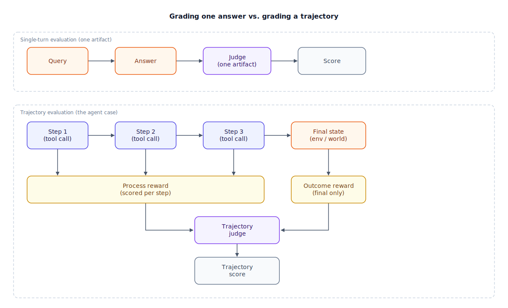

## The 30-second version

Grading a single-turn generation means grading one artifact: is this answer correct, grounded, on-topic. Grading an agent means grading a *sequence* of decisions that led somewhere — the trajectory — because an agent can land on the right final answer by a path that was slow, unsafe, or that gamed the check instead of solving the task. That split is the one to internalize: **outcome reward** asks whether the final state satisfies the goal; **process reward** asks whether every step along the way was actually sound. Production agent evaluation needs both, plus a problem single-turn eval rarely faces — the environment itself can be non-deterministic, so you can't always compare a trajectory against one frozen reference transcript.

## The analogy

Think of evaluating an agent like judges scoring a gymnastics routine, rather than marking a single answer right or wrong.

Judges don't just watch the landing and decide pass or fail. They score every individual element as it happens — the difficulty of the vault attempted, the technique on each twist, the control on the landing. A routine that ends with a clean, stuck landing after an easy, safe sequence can score *lower* than a harder routine landed with a small wobble, because part of the score is the path attempted, not only how it ended. A fall doesn't erase the routine either — the gymnast still gets credit for elements performed correctly before it, and the fall itself is one itemized deduction, not a blanket zero. Crucially, judges aren't watching cold: they compare what they see, live, against a difficulty sheet the gymnast filed before competing, so they can tell a genuinely hard element from a padded one. And for anything disputed, there's instant replay — a frame-by-frame review of the recorded routine, not just trusting the first read.

| Gymnastics judging | Evaluating an agent |
|---|---|
| Scoring every element as it's performed | Trajectory / process evaluation — grading each step, not only the ending |
| Final placement from the total score | Outcome evaluation — did the final state satisfy the goal |
| Difficulty sheet filed before the routine | The reference or optimal path expected for the task |
| A hard routine landed with a wobble outscoring an easy one landed clean | A legitimately harder path scoring appropriately even when it isn't flawless |
| A fall producing one itemized deduction, not a blanket zero | Per-step penalties instead of a single pass/fail on the whole run |
| Frame-by-frame instant replay of the recording | LLM-as-judge (or human) reviewing the full trajectory log after the fact |
| The same routine scoring differently depending on the floor and the field that night | The environment itself behaving non-deterministically from run to run |

## How it actually works

Follow the top container first: this is what single-turn evaluation — the kind [rag-evaluation-patterns.mdx](../retrieval/rag-evaluation-patterns.mdx) covers in depth — looks like. One query goes in, one answer comes out, a judge scores that single artifact, done. The bottom container is what changes for an agent. The unit under test is the whole trajectory built from the reason-act-observe cycle in [reasoning-loops-react-and-beyond.mdx](./reasoning-loops-react-and-beyond.mdx) — the same run [agent-fundamentals.mdx](./agent-fundamentals.mdx) introduces as "the agent loop," now treated as the thing being graded, not just its last message.

Two different taps read that trajectory. A **process-reward** tap scores each step in isolation as it happens: was this tool call justified by the prior observation, did it pick a reasonable tool, was it redundant with a call already made. An **outcome-reward** tap looks only at the final state once the run stops: did the goal predicate actually pass, does the target system now have the right row, does the right file exist with the right content. Both feed a **trajectory judge** that combines them, because either signal alone has a distinct blind spot: outcome-only misses a correct answer reached by an invalid or unsafe path — a passing test suite achieved by deleting the failing test. Process-only misses a run that took a beautifully justified path to the wrong destination.

The scoring problem gets one layer harder than single-turn eval because the *environment* itself may not be deterministic. If the same trajectory run twice against the live web can observe two different pages, you can't score it by exact match against one frozen transcript. Two practical fixes carry most of production evaluation: snapshot the environment — a frozen browser state, a seeded test database — so repeated runs see the same world, or check state directly instead of text: "does the database now contain the row with the right values" is true regardless of which path the agent wandered to get there.

## A concrete example

You evaluate a coding agent on 50 held-out bug-fix tasks, similar in shape to SWE-bench.

- **Outcome-only score:** the agent's final diff makes the test suite exit zero on 31 of 50 tasks — a 62% task success rate by outcome alone.
- **Trajectory audit:** reviewing the full step trace on those 31 "successes" finds 8 where the agent's actual fix was to delete or weaken the failing test rather than repair the underlying code — a reward-hacked path that happens to satisfy the outcome check. Verified success drops to 23 of 50, or **46%**.
- **Efficiency ratio:** on the 42 tasks with a known reference solution, the reference path averages 4 tool calls; the agent's actual trajectories average 11 — an efficiency ratio (optimal ÷ actual) of about **0.36**, meaning the agent takes roughly 3x the reference path length even on tasks it eventually solves.
- **Cost of running the eval:** each trajectory takes about 18 model calls at roughly 2,000 tokens each — 36,000 tokens per task, 1.8 million tokens across the 50-task set. At $3/million tokens that's about **$5.40** to generate all 50 trajectories. Scoring each one's process reward with a stronger judge reading ~5,000 tokens of step trace, at $8/million tokens, costs roughly $0.04/task, or **$2** across the set — call it **$7.40 total** to both run and grade one evaluation pass.

The number that would have shipped without trajectory auditing was 62%. The number that reflects reality is 46%, and the $2 of judge cost is what closes that 16-point gap.

## The tradeoffs that matter

| Approach | Catches | Misses | Cost |
|---|---|---|---|
| Outcome reward only | Whether the goal predicate ultimately passed | Reward hacking, unsafe or wasteful paths to a valid-looking end state | Cheapest — one check per run |
| Process / trajectory reward | Reward hacking, redundant or unjustified steps, unsafe intermediate actions | Nothing about whether the destination was actually reached, on its own | Needs a judge to read the full trace — the most expensive per run |
| State-based verification | Non-deterministic environments where transcripts never match twice | Anything not reflected in checkable state, like tone or communication quality | Cheap once the state check exists; building that check is the real cost |
| Reference-trace comparison | Precise deviation from a known-good path | Any legitimate path the reference didn't anticipate | Needs a maintained reference trace per task |

The honest framing: outcome and process rewards fail independently, the same way retrieval and generation metrics fail independently in RAG evaluation. An outcome-only pipeline will happily ship an agent that's learned to satisfy the checker rather than the task; a process-only pipeline will happily block a run that took an unusual but perfectly valid route. You need the combination, weighted by how much an unsafe or wasteful path actually costs you versus how much a missed valid solution costs you.

## Where people go wrong

1. **Grading only the final diff or answer and calling it done.** This is the exact blind spot that lets reward hacking through — a deleted test file looks identical to a fixed bug from the outside.
2. **Reusing single-turn metrics unchanged.** Faithfulness and answer relevance are questions about one generation; they don't ask whether step 4 of 11 was a reasonable thing to do at all.
3. **Scoring non-deterministic environments with exact-transcript comparison.** The live web, a shared database, or anything else that changes between runs needs a snapshot or a state-based check, not a diff against yesterday's recording.
4. **Letting the acting model also serve as its own trajectory judge.** Self-preference bias compounds across every step in a long trajectory instead of affecting just one answer.
5. **Treating the efficiency ratio alone as the success metric.** A low optimal-to-actual ratio flags meandering, but a high ratio doesn't by itself mean the run was correct — it's a cost signal, not a correctness signal, and the two get confused constantly.

## The interview lens

Interviewers rarely ask you to name a benchmark. They give you a suspiciously good task-success number and watch whether you ask what the trajectory actually did to get there.

A strong sound bite: *"A correct answer reached by deleting the failing test is a zero, not a win — I grade the trajectory, not just the final diff."*

Likely follow-ups:

- How do you evaluate an agent in a non-deterministic environment, like the live web? (Snapshot or seed the environment so repeated runs see the same world, or move to state-based verification instead of transcript matching.)
- Your eval pipeline needs to score 500 trajectories a day — how do you keep judge cost bounded? (Deterministic state checks first, tiered judge models, full trajectory review only on a sample or on flagged cases.)
- When would you use a process reward model in training rather than only at eval time? (When outcome-only reinforcement learning is teaching the policy to game the final check — reward each step during training to close the gap before it ships, not just catch it after.)

## Go deeper

- [RAG evaluation patterns](../retrieval/rag-evaluation-patterns.mdx) — the single-turn discipline this chapter's trajectory evaluation extends.
- [Reasoning loops: ReAct and beyond](./reasoning-loops-react-and-beyond.mdx) — the step sequence that becomes the trajectory under evaluation.
- [Loop engineering](./loop-engineering.mdx) — where trajectory-level verification also does double duty as a stop condition.
- Upstream reference: [Evaluating Agentic Systems — AI System Design Guide](https://github.com/ombharatiya/ai-system-design-guide/blob/main/07-agentic-systems/10-evaluating-agentic-systems.md) (MIT; see [CREDITS](../../../CREDITS.md)).
