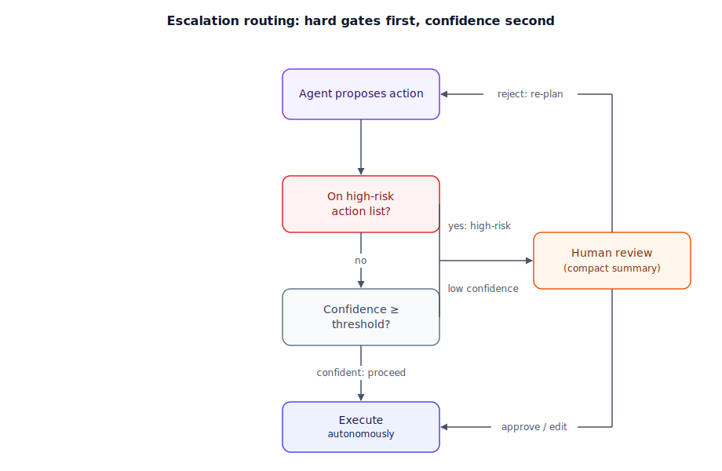

## The 30-second version

No agent is reliable enough to run every action unsupervised, and no team can afford to review every action a reliable agent takes. Human-in-the-loop (HITL) design decides exactly which actions cross that line. Two mechanisms do the deciding: a **hard-coded approval gate** that always stops before specific high-risk actions no matter how confident the agent is, and **confidence-based escalation** that pauses only when the agent's own uncertainty crosses a threshold. Both interrupt the agent loop and hand control to a human, and both cost something real: latency while a human gets up to speed, and the human's attention, a finite resource a badly-tuned system burns through fast. The skill isn't "add more approval steps" — it's calibrating how much autonomy each class of action actually deserves.

## The analogy

Picture an apprentice electrician a few months into the job, working under a licensed master electrician.

Most of the day, the apprentice works alone. Swapping an outlet, running low-voltage wiring, replacing a switch — routine, low-risk work done a hundred times before. Nobody stands over their shoulder for this; that would waste the master's time and insult the apprentice's competence.

But the electrical code doesn't leave every decision to judgment. Anything touching the main panel, or any circuit above a certain amperage, requires the master to physically inspect the work and sign off *before* it gets energized — full stop, every time, regardless of how sure the apprentice is. That's not a judgment call the apprentice gets to skip by feeling confident; it's a gate the job itself is built around.

Between those extremes is the apprentice's own judgment call. Partway through a job with an unusual, older wiring configuration, the code isn't obviously clear. A confident apprentice keeps working; a well-trained one stops and calls the master before making an irreversible cut. That call has a real cost — the master has to put down what they're doing, walk over, and spend a few minutes understanding the problem before they can even answer. If the apprentice called for every minor decision, the master would stop taking the calls seriously. So the apprentice learns to save the calls for genuine uncertainty, not routine reassurance.

The master doesn't just approve or reject, either — sometimes they'll say "hand me the multimeter" and check the wire themselves, or "redo that connection, then keep going" rather than sending the apprentice back to start over. And at the end of every day, regardless of how it went, the master walks the site and reviews the work log — not because anything was flagged, but because quietly signing off on everything without checking is itself the failure the apprenticeship structure exists to prevent.

| Apprenticeship | Human-in-the-loop pattern |
|---|---|
| Routine outlet swap, done solo | Low-risk action, full autonomy |
| Main panel work — always needs sign-off before energizing | Hard-coded approval gate on a specific high-risk action class |
| Calling the master over an ambiguous wiring case | Confidence-based escalation |
| The time cost of walking over and getting up to speed | Latency and UX cost of an interruption |
| "Redo that one connection, then continue" instead of restarting the job | Steering a step directly instead of only approve/reject |
| End-of-day walkthrough of the work log | Human-on-the-loop — periodic audit, not per-action gating |
| A master who starts signing off without checking | Over-reliance — the approval gate exists but has stopped doing its job |

## How it actually works

Follow the diagram from the top. When the agent proposes an action, it first passes through a **hard-coded gate**: is this on the list of things that always require sign-off — deleting a record, moving money past some amount, anything hard to undo? This check doesn't consult confidence at all; it exists because a confident agent is still not the right authority for an irreversible action. If the action isn't on that list, it passes to a **confidence check** instead: the agent (or a smaller judge model) produces an uncertainty estimate, and anything below the threshold routes to a human the same way a gated action would. Only actions clearing both checks execute autonomously.

Once something routes to a human, the problem shifts from "should this stop?" to "how cheaply can a human evaluate it?" The strongest systems hand the reviewer a one-line summary of what's about to happen (the diff, not the log), because review time is the scarce resource. From there, a human has more than two options: approve, reject and force a full re-plan, or — the option that saves the most time — edit the specific step and let the agent resume, the way the master electrician corrects one connection rather than restarting the job. A hard reject throws away everything the agent got right on the way to the one thing it got wrong.

Finally, note what isn't in the fast path: a periodic, no-action-required audit of a sample of *autonomous* decisions — catching the case where the gate works but the human has started rubber-stamping without reading. See [Error Handling and Recovery](./error-handling-and-recovery.mdx) for what happens when an escalated action comes back rejected.

## A concrete example

A claims-processing agent handles 10,000 claims a day. Claims under a confidence threshold of 85% or over a hard-coded value of $10,000 don't execute automatically.

- **70% (7,000 claims/day) clear both checks** and execute autonomously, about 3 seconds each — roughly 5.8 hours of total compute time, no human involved.
- **25% (2,500 claims/day) escalate on low confidence.** A human reviews a one-line summary and approves, edits, or rejects — averaging 6 minutes each including the time to get oriented. That's 2,500 × 6 minutes = 15,000 minutes, or **250 human-hours a day** — roughly 31 full-time reviewers just for this queue.
- **5% (500 claims/day) hit the hard-coded gate** (over $10,000) and go to a compliance queue regardless of confidence, averaging 40 minutes each for a fuller review — 500 × 40 = 20,000 minutes, or **333 human-hours a day**, roughly 42 full-time reviewers.

That 25% escalation rate is the number worth interrogating. If better calibration drops it to 8% without changing the miss rate on genuinely risky claims, the queue shrinks from 2,500 to 800 claims a day — human-hours drop from 250 to about 80, freeing roughly 21 full-time reviewers. The hard-coded gate's 5% and 333 human-hours don't move at all — that number is a policy decision about which claims always need a human, not a confidence problem, and no amount of calibration should touch it.

## The tradeoffs that matter

| Pattern | Autonomy | Latency added | Human load | Best for |
|---|---|---|---|---|
| Human-in-command | Low — human drives every step | High, every action | Very high | Legal, medical, anything with no acceptable error rate |
| Human-as-filter | Medium — human approves/edits final output | Moderate, once per task | Moderate | Content generation, drafts before publishing |
| Human-as-backup (confidence escalation) | High — human only sees flagged cases | Low on average, high on flagged cases | Scales with calibration quality | Most production agent workflows |
| Human-on-the-loop (audit) | Highest — human reviews after the fact | None in the critical path | Low, sampled | High-volume, lower-stakes actions with clear rollback |

The real lever isn't which row you pick — it's how well-calibrated the confidence signal is in row three. A miscalibrated threshold either escalates far more than necessary or lets genuinely risky cases through silently. Hard-coded gates don't have this problem, which is why they exist for actions where "well-calibrated most of the time" isn't good enough.

## Where people go wrong

- **Gating everything "to be safe."** A system that escalates constantly trains its own reviewers to approve without reading — the fatigue you were avoiding shows up anyway, just later.
- **Relying only on a confidence score for irreversible actions.** Confidence is a statistical estimate, not a safety guarantee; anything genuinely hard to undo needs a hard-coded gate.
- **Sending the full trace instead of a summary.** Review time is the bottleneck — a reviewer who has to read ten paragraphs to approve one action will stop reading them.
- **Treating approval as the end of the story.** Without periodic, no-flag-required audits of the autonomous path, you can't tell a calibrated system from a human who quietly stopped checking.
- **Offering only approve or reject.** Forcing a full restart on any objection throws away correct work alongside the one wrong step — letting a human edit and resume is cheaper.

## The interview lens

Interviewers use this topic to see whether you treat human oversight as a UX and cost budget, not just a safety checkbox.

A strong sound bite: *"Irreversible actions get a hard-coded gate that doesn't consult the model's confidence at all; everything else gets confidence-based escalation — and I budget human review time as a real cost, because a system that escalates too often trains its own reviewers to stop reading."*

Likely follow-ups:

- How do you keep a reviewer from rubber-stamping everything? (Compact, specific summaries; periodic audits of the autonomous path, including occasional synthetic errors, to verify engagement.)
- How do you validate a confidence score is trustworthy enough to gate on? (Compare against real outcomes over time — see [Evaluating Agentic Systems](./evaluating-agentic-systems.mdx) — and tune the threshold to the observed miss rate.)
- What happens when an escalated action is rejected? (The agent needs a concrete next step, not just "try again" — see [Error Handling and Recovery](./error-handling-and-recovery.mdx).)

## Go deeper

- [Reasoning Loops: ReAct and Beyond](./reasoning-loops-react-and-beyond.mdx) — the loop these gates actually interrupt.
- [Error Handling and Recovery](./error-handling-and-recovery.mdx) — what the agent does after a human rejects or edits a step.
- [Evaluating Agentic Systems](./evaluating-agentic-systems.mdx) — how to check a confidence score is actually calibrated before gating on it.
- Upstream reference: [Human-in-the-Loop Patterns — AI System Design Guide](https://github.com/ombharatiya/ai-system-design-guide/blob/main/07-agentic-systems/08-human-in-the-loop-patterns.md) (MIT; see [CREDITS](../../../CREDITS.md)).
