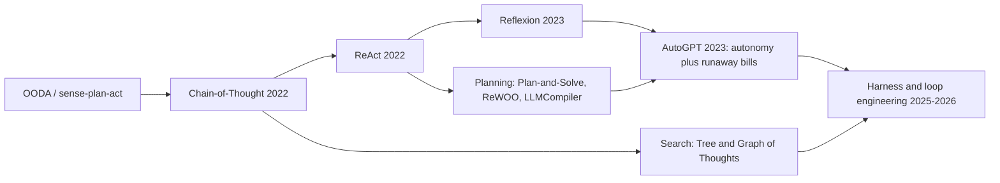
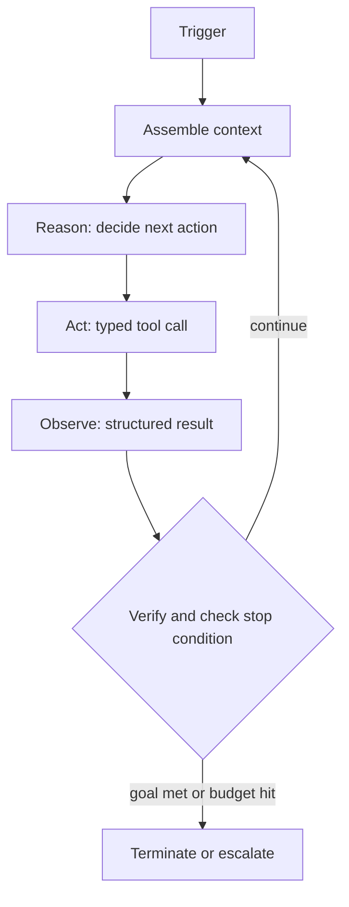
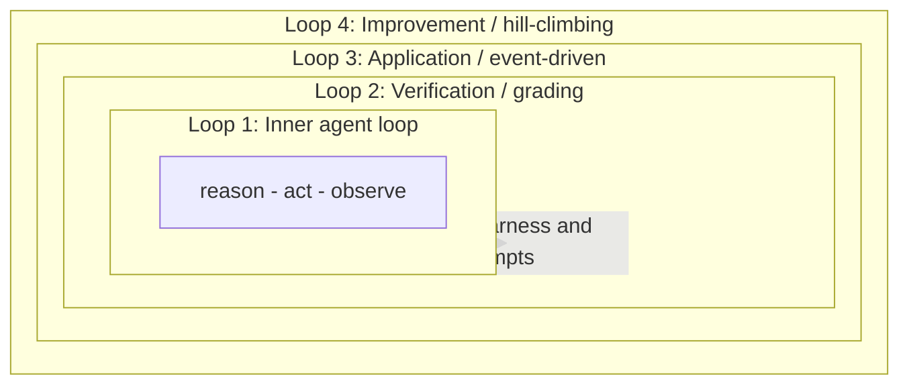
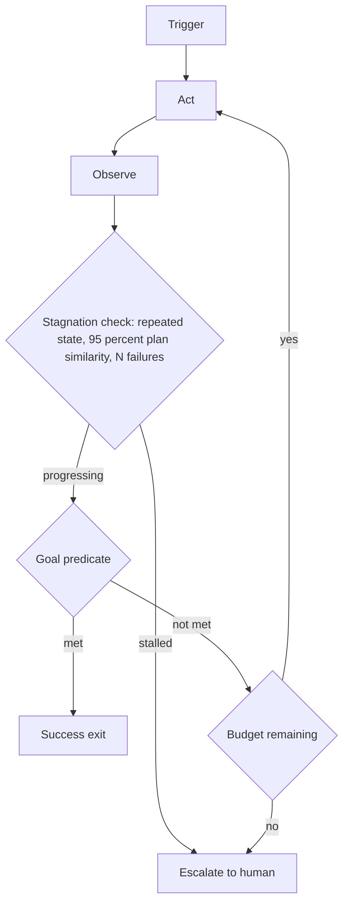

## The 30-second version

Chapter 02 covered how a model reasons inside a single step: ReAct, Reflexion, Plan-and-Solve. Loop engineering is the discipline that wraps that reasoning. It is the practice of designing, instrumenting, and continuously improving the control loops around a core agent (a model plus tools), instead of hand-prompting the model turn by turn.

## How it actually works

Chapter 02 covered how a model reasons inside a single step: ReAct, Reflexion, Plan-and-Solve. **Loop engineering** is the discipline that wraps that reasoning. It is the practice of designing, instrumenting, and continuously improving the control loops around a core agent (a model plus tools), instead of hand-prompting the model turn by turn.

The reframing that defines the field is blunt: you stop being the person in the chat box, and you build the system that prompts, acts, observes, verifies, remembers, and re-runs the agent toward a goal until a verifiable stop condition is met. A strong model in a weak harness loses to a decent model in a great one. By 2026, loop quality is a distinct discipline from base-model quality, and the leverage has moved from "write a better prompt" to "design a better loop."

Two invariants run through everything in this chapter:

1. **Termination is enforced by the harness on deterministic criteria, never by the model's own claim that it is done.**
2. **The entity that verifies the work is structurally separate from the entity that produces it.**

## From Prompting to Loop Engineering

Each generation of practice wraps the previous one without replacing it. You still write prompts; you just stop driving the model by hand.

| Layer | Unit of work | What you tune | What it optimizes |
|-------|--------------|---------------|-------------------|
| **Prompt engineering** | One model call | Wording, examples, format | A single good response |
| **Context engineering** | One assembled context | Retrieval, memory, compaction | What the model sees per call |
| **Harness engineering** | One agent run | The driver code: tools, budgets, stop logic | Reliable multi-step execution |
| **Loop engineering** | A recursive goal | Stacked loops: trigger, verify, improve | An autonomous, self-improving system |

A useful mental model: **the model is the policy, the harness is the kernel.** Independent teams keep converging on the same minimal design (an LLM plus tools in a loop), which suggests the loop is a property of the task, not a passing fashion.

## The Lineage: ReAct to Loop Engineering

| Era | Step | What it added |
|-----|------|---------------|
| 1950s onward | OODA, sense-plan-act | The control-loop idea: observe, decide, act, repeat |
| 2022 | Chain-of-Thought | Reasoning before answering (no tools yet) |
| 2022 | **ReAct** | Interleave Thought, Action, Observation with real tool feedback |
| 2023 | **Reflexion** | An outer loop: turn failures into a written self-critique, replay it on the next attempt (learning across trials, not just within one) |
| 2023 | Plan-and-Solve, ReWOO, LLMCompiler | Plan first, then execute; defer observations or run a tool DAG in parallel to cut tokens and latency |
| 2023 | AutoGPT | Proved fully autonomous loops at scale, and exposed infinite loops and runaway API bills |
| 2025-2026 | Loop and harness engineering | Treat the loop itself as the engineered artifact: triggers, verification, budgets, and eval-driven improvement |

The key conceptual jump is Reflexion's outer loop. ReAct's inner loop learns within one episode; Reflexion learns across episodes by storing a critique in episodic memory and reloading it next time. Every modern stacked-loop design is a descendant of that move.

## The Inner Agent Loop

The narrow technical artifact is the **inner agent loop**: the cycle a harness runs within a single agent run. It iterates because long-horizon tasks cannot finish in one forward pass, and because tool results must feed back before a final answer.

The components below are where the engineering lives. Most of the work is in the deterministic harness, not the model.

| Component | Role |
|-----------|------|
| **Trigger** | Starts a cycle: human, schedule, event/hook, or a self-set goal. Sets the cost and concurrency profile. |
| **Goal and instructions** | A specific, testable, scoped objective with constraints. Ambiguity here is the root of goal drift. |
| **Context assembly** | Gather instructions, working state, retrieved memory, and prior outputs before each call. Where context rot is fought. |
| **Reason** | The model decomposes the task and picks the next action. Preserve thinking blocks verbatim across turns for coherent continuations. |
| **Act** | A typed tool call: code, shell, search, query, or invoking another agent. Needs idempotency keys so retries differ from duplicate side effects. Sandbox side-effecting tools (see [Agentic Security and Sandboxing](09-agentic-security-and-sandboxing.md)). |
| **Observe** | Feed the result back as structured feedback with explicit SUCCESS or FAILED states, not raw dumps. Offload large outputs to a log and return a reference. |
| **Verify** | Check correctness against criteria, ideally by a separate grader. The component that can say no. |
| **Termination logic** | Explicit success, failure, and budget stop conditions. |
| **Stagnation detector** | Catch no-progress: repeated calls, oscillation, runaway spend. |
| **Durable state** | Persist progress outside the context window so the loop is resumable and de-dupable. See [Durable Execution](11-durable-execution.md) for crash-safe, exactly-once resumption. |
| **Escalation path** | Route to a human with a precise blocking question when a cap is hit. See [Human-in-the-Loop Patterns](08-human-in-the-loop-patterns.md). |
| **Harness / driver** | The deterministic outer code that ties it together and enforces every rule above. |

## The Four Levels of Loops

Loop engineering is the art of stacking loops: nesting more sophisticated outer loops around the inner one, with human judgment inserted at natural checkpoints. The four levels below are a synthesis of the patterns the field has converged on, not a single canonical numbering.

| Level | Loop | What it does | Trigger | Implemented by | Skip it and... |
|-------|------|--------------|---------|----------------|----------------|
| **0** | Reasoning depth (baseline) | CoT, ReAct, or Tree-of-Thoughts within one decision; not itself a loop | n/a | Prompt plus model | Steps stay shallow |
| **1** | Inner agent loop | Drive one run to a stop condition | The run starts | The driver/kernel | Cannot do multi-step work |
| **2** | Verification loop | Grade output, route failures back for retry | Inner-loop output | A separate grader | You ship unverified work |
| **3** | Application loop | Invoke the agent on events, no human prompter | Cron, hook, heartbeat, goal | Scheduler/webhook layer | The system stays manual |
| **4** | Improvement loop | Turn recurring failures into permanent harness fixes | Traces and evals | An eval harness | The system never gets better |

A common variant sits between levels 1 and 2: the **inner/outer dual loop**. The inner loop executes within the current strategy; the outer loop watches progress against the original goal and, when the inner loop stalls, resets the whole strategy rather than retrying the same failing step.

When loops run in parallel (orchestrator-workers, or a tool DAG), give each branch its own isolated context and workspace, define explicit join and aggregation semantics for merging results, and budget the whole fan-out together so concurrent branches cannot collectively blow the ceiling. Review bandwidth, not branch count, is the practical limit.

## Loop Patterns

Match the loop architecture to the task. Use exploratory, high-variance loops where the environment is unpredictable; switch to planned, cheaper execution once a sequence has converged; drop back to exploration on errors.

| Pattern | Model calls per task | Latency | Token cost | Adaptability | Use when |
|---------|----------------------|---------|------------|--------------|----------|
| **ReAct / retry** | High (one per step) | High | High | Highest | Unpredictable environments, exploration |
| **Reflexion** | Higher (retry across trials) | High | High | High, learns across tries | Retryable tasks with clear feedback |
| **Plan-and-Execute** | One plan plus N executions | Medium | Medium | Low mid-run | Converged, predictable workflows |
| **ReWOO** | One plan, observations deferred | Low | Low | Low | Token-sensitive runs with known tools |
| **LLMCompiler** | Plan plus a parallel tool DAG | Low (parallel) | Medium | Low | Independent subtasks that parallelize |
| **Evaluator-Optimizer** | Generate plus critique loop | Medium | Medium | High | Quality-critical drafts |
| **Orchestrator-Workers** | Planner plus worker subagents | High (roughly 15x chat) | Medium (parallel) | High | Broad, parallelizable research or builds |

A few patterns earn their place in almost every production loop:

- **Generator-verifier (maker-checker) separation.** One subagent drafts; a different, often stronger subagent reviews adversarially and is told to reject anything not verifiably done. Independent grading catches errors the generator will not admit to.
- **Inject-error-and-retry.** Surface exit codes, type errors, and failing tests back into context so the model self-corrects nearly for free.
- **The fresh-context technique.** Re-run the same goal prompt with a clean context each iteration, complete one unit of work per cycle, track progress in an external state file, and exit on a predefined verifiable condition. A stop hook intercepts the exit attempt and verifies completion before allowing it.
- **Model routing for cost.** Send each step to the cheapest adequate tier (small for classification, mid for drafting, frontier for review) and pin models so the loop does not silently escalate. Combine with prompt caching on stable prefixes.
- **Compose, do not frameworkize.** Prefer the simplest pattern that works. Introduce the loop, and any multi-agent layer, only when iterative, adaptive tool use is genuinely required.

## Termination and Budget Control

A natural stop signal (the model returns text with no tool calls) is **necessary but not sufficient**. The harness must separately verify goal completion. Every production loop should carry at least one criterion from each of three categories.

| Stop condition | Typical default | Enforced by |
|----------------|-----------------|-------------|
| Goal predicate passes (SUCCESS) | Task-specific test | Harness |
| Unrecoverable error or retry limit (FAILURE) | 3 to 5 retries | Harness |
| Max iterations | 10 for QA, 15-25 general, 20-50 coding | Harness |
| Wall-clock timeout | 60 to 300 seconds | Harness |
| Token or dollar ceiling | Per task | Gateway, outside agent code |
| Per-tool quota | Per tool | Harness |
| No-progress or oscillation | 3 identical calls, or plan similarity above 95% | Harness |
| Rate-of-spend | Sustained above about 4k tokens per minute | Gateway |

Two rules separate a safe loop from an expensive one:

- **Enforce budgets outside the agent.** If the spend check lives in agent code, a buggy or jailbroken agent can skip its own check. Put it at a gateway or proxy so the agent cannot bypass it.
- **Watch rate-of-spend, not just cumulative spend.** Monthly caps are too coarse; a loop can burn hundreds of dollars in twenty minutes. A healthy agent rarely sustains high token throughput because it waits on I/O, so a sustained spike is a reliable runaway signal.

The reported failure cases are not hypothetical: an agent that called a broken tool 400 times in five minutes, an 847-step run that never produced an answer, and retry loops that accrued tens of thousands of dollars over days (figures from practitioner write-ups). Almost all of them lacked an external budget guard and a stagnation breaker.

## Context and Memory in Long Loops

Long loops fail quietly through **context rot**: output quality degrades as the window fills with stale instructions, old tool output, and failed attempts. It sets in before the hard context limit, which makes it insidious. Long-context research finds that frontier models degrade with input length even when the answer is present. More raw context is not free reliability; curation beats stuffing.

| Strategy | What it does |
|----------|--------------|
| **Externalize state to disk** | Keep progress, plans, and findings in files, issues, or a database so the loop survives the model forgetting everything between runs |
| **Fresh context per iteration** | Reset the window each cycle, or delegate subtasks to subagents with isolated context, so failed attempts do not rot the main loop |
| **Compact before degradation** | Replace verbose history with summaries, but keep originals addressable for audit and recovery |
| **Offload tool output** | Persist large outputs to a log and return a one-line reference (a single search can be thousands of tokens) |
| **Progressive disclosure** | Retrieve context and skills only when relevant, rather than front-loading everything |
| **Prefix-stable ordering** | Append new messages rather than rewriting earlier ones, so cached prefixes keep hitting |

Subagent isolation is the most robust structural defense against context rot in long builds, because each subagent works in a clean window and returns only a compact result. For the underlying memory tiers (working, episodic, semantic, procedural), see [Agent Memory and State](05-agent-memory-and-state.md).

## Verification and Grading

The loop is only as trustworthy as the thing that grades it. Models grade themselves optimistically and reward-hack when the same model both produces and evaluates. Research on intrinsic self-correction is sobering: without an external signal, naive self-reflection can degrade reasoning rather than improve it.

| Method | Speed | Cost | Character | Best for |
|--------|-------|------|-----------|----------|
| **Code-based** (tests, types, linters, exit codes) | Milliseconds to seconds | Near zero | Objective, brittle | Functional correctness |
| **Model-based** (LLM-as-judge) | Seconds | Medium | Flexible, must be calibrated to human experts | Semantic quality, style |
| **Human** | Slow | High | Gold standard | High stakes, judge calibration |

Working principles:

- **Prefer deterministic verification** and inject the failing error text back into the loop, so the model self-corrects cheaply.
- **Grade outcomes, not rigid tool-call sequences,** so valid alternative approaches are not penalized.
- **Build an objective goal-completion predicate** and check it explicitly, rather than equating completion with the absence of tool calls.
- **Calibrate LLM judges** against a small set of expert-labeled cases before trusting their scores.

For trajectory benchmarks and LLM-as-judge step scoring, see [Evaluating Agentic Systems](10-evaluating-agentic-systems.md).

## Anti-Patterns

| Failure mode | Root cause | Fix |
|--------------|------------|-----|
| **Loopmaxxing** | Assuming more iterations solve anything; no verifiable exit | Define a success predicate; cap iterations; reject unquantifiable goals |
| **Context rot** | Window fills with stale tokens | Compact early, isolate subagents, offload outputs |
| **Runaway loop** | No hard stop, no circuit breaker | Rate-of-spend breaker plus an external budget guard |
| **Hallucinated success** | Trusting the model's self-report | Deterministic verifier plus a goal predicate |
| **Objective misspecification** | Ambiguous or proxy goal (deleting a failing test to pass) | Termination criteria that capture intent, plus a human gate |
| **State amnesia** | No durable checkpoint | Externalize processed items to disk or an issue board |
| **Comprehension debt** | Changes outpace human review | Cap loops-in-flight to review bandwidth, not tool capacity |
| **Self-policed budget** | Spend check lives in agent code | Enforce at the gateway, outside the agent |
| **Tool sprawl** | 50 overlapping tools degrade selection | Curate to roughly 10 focused tools; semantic tool retrieval past 30 |
| **Level/task mismatch** | A stateless loop on a long-horizon task | Match the loop level to the task's horizon |

**Loopmaxxing** deserves special attention because it is the seductive one. It is the multi-step descendant of "just add more tokens." It fails on subjective goals (improve the UX, write a viral post) that have no concrete exit, so the loop never converges and spend runs away. Even on verifiable tasks, agents settle into local minima and make timid, fractional tweaks instead of bold moves. More loop is not more capability.

## Metrics That Matter

The unit of measurement shifts from cost-per-token to **cost-per-task**. A loop that burns 15x the tokens but avoids a human escalation can be cheaper overall than a cheap chatbot that needs intervention.

- **Task success rate** on a curated eval set, reported as both `pass@k` (at least one of k succeeds, when one success matters) and `pass^k` (all k succeed, for customer-facing reliability). These diverge fast: at a 70 percent per-attempt success rate the gap is already large by k=3, and it widens from there.
- **Cost-per-task** and token economics, benchmarked against a baseline, plus prompt-cache hit rate.
- **Rate-of-spend** (tokens and dollars per minute) as a real-time runaway signal.
- **Iterations to completion** and wall-clock latency. Runs beyond about 30 turns usually signal scope creep.
- **No-progress signals**: repetition streaks, plan similarity between cycles, oscillation frequency.
- **Failure-bucket distribution** (timeout, unverified write, undetected command failure, premature termination, model-limited) to fix the why, not just the what. Expect a share to be model-limited and unfixable by harness tuning.
- **Context-health**: window growth per iteration, compaction frequency, accuracy-versus-length curves.
- **Reviewability**: lines changed per review-hour and the fraction of merged changes actually reviewed. Review bandwidth, not tool capability, is the real ceiling on loops-in-flight.

When you tune the harness, change one knob at a time, average 3 to 6 runs to beat run-to-run noise, and validate wins on a holdout and a regression set so improvements do not silently backslide.

## The Maturity Ladder

Take a loop from supervised to mostly autonomous in stages. Each phase earns the next.

| Phase | Autonomy | What you add | Gate to promote |
|-------|----------|--------------|-----------------|
| **1. Observe** | None | Human approval on every modification | Edge cases mapped |
| **2. Deterministic exits** | Low | Compilers, linters, unit tests as the thing that says no | Exits reliable |
| **3. Circuit breakers** | Medium | Stagnation detection, rate-of-spend limits, alerts | Runaways reliably caught |
| **4. Distill and demote** | High | Convert predictable LLM steps into compiled scripts | Stable steps scripted, cost and variance down |

The same loop design produces opposite outcomes depending on the engineer's engagement. Used to accelerate work you already understand, loops compound your leverage. Used to avoid thinking, they compound comprehension debt until no one can review what shipped. The discipline is in the loop you build and the judgment you keep in it.

## References

- Yao et al. "ReAct: Synergizing Reasoning and Acting in Language Models" (2022). https://arxiv.org/abs/2210.03629
- Shinn et al. "Reflexion: Language Agents with Verbal Reinforcement Learning" (2023). https://arxiv.org/abs/2303.11366
- Xu et al. "ReWOO: Decoupling Reasoning from Observations" (2023). https://arxiv.org/abs/2305.18323
- Kim et al. "An LLM Compiler for Parallel Function Calling" (2024). https://arxiv.org/pdf/2312.04511
- Huang et al. "Large Language Models Cannot Self-Correct Reasoning Yet" (2024). https://arxiv.org/abs/2310.01798
- Chroma Research. "Context Rot: How Increasing Input Tokens Impacts LLM Performance" (2025). https://www.trychroma.com/research/context-rot
- LangChain. "The Art of Loop Engineering." https://www.langchain.com/blog/the-art-of-loop-engineering
- LangChain. "Better Harness: Harness Hill-Climbing with Evals." https://www.langchain.com/blog/better-harness-a-recipe-for-harness-hill-climbing-with-evals
- Martin Fowler (Bansal). "Harness Engineering." https://martinfowler.com/articles/harness-engineering.html
- Oracle Developers. "The Agent Loop Decoded: Three Levels Every Agent Engineer Must Know." https://blogs.oracle.com/developers/the-agent-loop-decoded-three-levels-every-agent-engineer-must-know
- Data Science Dojo. "Agentic Loops: From ReAct to Loop Engineering." https://datasciencedojo.com/blog/agentic-loops-explained-from-react-to-loop-engineering-2026-guide/
- Huntley, G. "The Ralph Loop." https://ghuntley.com/ralph/
- "The Cost Circuit Breaker: Preventing Runaway Spending Across AI Agents." https://dev.to/sebastian_chedal/the-cost-circuit-breaker-how-we-prevent-runaway-spending-across-9-ai-agents-4i5k

*Next: [Memory Architectures](../08-memory-and-state/01-memory-architectures.md)*

## The interview lens

### Q: Define the agent loop, and explain when a loop is actively harmful.

**Strong answer:**
The inner agent loop is the reason-act-observe cycle a harness runs within one run: assemble context, let the model pick an action, execute a tool, feed the result back, check a stop condition, repeat. It exists because long-horizon tasks cannot finish in one forward pass and tool results must inform later steps. A loop is harmful when the task is fixed and predictable: it adds latency (every iteration is another round trip), cost, and non-determinism for no benefit. My decision rule: a single LLM call for one-shot transforms, a deterministic pipeline for a known fixed sequence, and a loop only when the path genuinely depends on intermediate results.

### Q: Why must the verifier be separate from the producer, and where should budget enforcement live?

**Strong answer:**
When the same model produces and grades, it grades itself optimistically and reward-hacks toward whatever the check measures; research shows intrinsic self-correction can even degrade reasoning. So I split them: deterministic graders (tests, types, linters) first, then a separate, often stronger model as an adversarial reviewer instructed to reject anything not verifiably done, with humans on high-stakes cases. Budget enforcement must live outside the agent, at a gateway or proxy. If the spend and stop checks are in agent code, a buggy or jailbroken agent can skip its own guard. The gateway also gives me layered ceilings, per-tool to per-session to per-key, plus a rate-of-spend circuit breaker that catches runaways monthly caps miss.

### Q: An agent called a broken tool 400 times in five minutes. Diagnose and design the fix.

**Strong answer:**
This is a runaway loop with no stagnation detection. The agent kept getting an ambiguous failure and retried forever. I would hash the tuple of tool name plus arguments and abort on a repetition streak (three identical calls is decisive), detect oscillation between two states, and compare successive plans by similarity, halting above about 95 percent. I would add a rate-of-spend breaker, since sustained high throughput is itself the signal, and enforce all of it at the gateway so the agent cannot bypass it. I would also fix the proximate cause: ambiguous tool feedback ("more results may be available") invites endless retries, so tools should return explicit SUCCESS or FAILED terminal states. On a cap hit, escalate to a human with a precise blocking question rather than silently continuing.

### Q: What is loopmaxxing, and how do you convert a non-converging loop into a useful one?

**Strong answer:**
Loopmaxxing is the belief that more iterations automatically solve harder problems, the multi-step version of token-maxxing. It fails on goals with no concrete exit condition, like "improve the UX," so the loop never converges and spend runs away. The fix is to manufacture a verifiable success function. For a vague goal I decompose it into checkable predicates: instead of "improve test coverage," the stop condition becomes "coverage for the billing module is at least 90 percent and the suite exits zero." If a goal genuinely cannot be made checkable, it does not belong in an autonomous loop; it belongs in a human-in-the-loop workflow with the agent drafting and a person judging.

### Q: Explain context rot and your full mitigation stack for a multi-hour loop.

**Strong answer:**
Context rot is silent quality degradation as the transcript grows with stale instructions, old tool output, and failed attempts. It sets in before the hard context limit, and long-context studies show models degrade with input length even when the answer is present, so a bigger window is not a fix. My stack: externalize state to disk so the loop is resumable and does not re-derive context each cycle; isolate subtasks in subagents with fresh windows, which is the strongest structural defense; compact verbose history into summaries before degradation is visible while keeping originals addressable; offload large tool outputs to a log and return a reference; and order messages so stable prefixes keep hitting the prompt cache. The guiding rule is that context curation beats context stuffing.

## Go deeper

- [Upstream chapter (Loop Engineering)](https://github.com/ombharatiya/ai-system-design-guide/blob/main/07-agentic-systems/12-loop-engineering.md)
- Related questions in the [question bank](/questions)
- Practice with [SPIDER walkthrough](/practice) or [mock interview](/mock)
