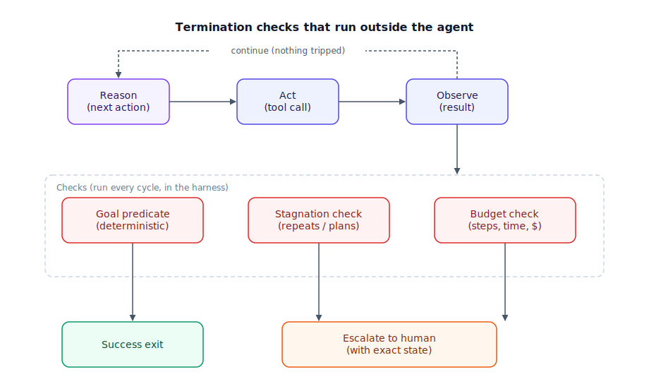

## The 30-second version

An agent loop is only as good as the discipline that surrounds it, and most of that discipline is about knowing when to stop. Give an agent too little room and it can't finish a real multi-step task; give it too much and an ambiguous failure turns into hundreds of retries and a runaway bill. **Loop engineering** is the practice of enforcing termination from outside the model — never trusting the model's own claim that it's done — through explicit success and failure predicates, step and cost budgets, and a stagnation detector that catches an agent going nowhere before a human has to notice. The tension it manages is structural: autonomy and runaway risk are the same knob turned in opposite directions.

## The analogy

Think of a search-and-rescue dog team working a mountainside, not an agent "trying its best" with no boundary at all.

The handler doesn't turn the dog loose on the whole mountain and hope. Dispatch assigns a specific grid to search — a scoped, testable objective, not "find someone somewhere." There's a hard "turn back by dusk" cutoff regardless of progress, and a fixed number of passes through the grid before the team rotates out for a fresh dog, because a tired dog covering the same ground stops finding anything new. If the dog keeps circling the same boulder with no new scent, a good handler doesn't read that as persistence — three passes with nothing new is the signal to move the search, not repeat it. When the dog alerts — sits, barks, stares at one spot — the handler doesn't radio "found them" on the dog's say-so alone; they verify with their own eyes first, because trusting an alert without confirmation is how a search gets closed on a false positive. And dispatch caps how many teams work the mountain at once regardless of how many volunteers show up, because coordination, not enthusiasm, is the actual bottleneck.

| Search-and-rescue dog team | Loop engineering |
|---|---|
| Dispatch assigns one specific grid to search | A scoped, testable goal, not an open-ended instruction |
| A hard "turn back by dusk" cutoff | Wall-clock timeout |
| A fixed number of passes before rotating in a fresh dog | Max-iteration budget |
| The dog circling the same boulder three times with no new scent | Stagnation detection — repeated identical calls or near-identical plans |
| The handler verifying an alert in person before calling off the search | A separate verifier checking the goal predicate, not trusting the model's own "done" |
| Dispatch radioing the exact GPS pin, not just "found something" | Structured observations with explicit success/failure states, not vague summaries |
| Dispatch capping how many teams work the mountain regardless of volunteers | Concurrency and spend limits enforced centrally, not by each team's own judgment |
| Calling in a helicopter with thermal imaging once ground teams stall | Escalating to a human, or a stronger tool, once the budget is exhausted |

## How it actually works

Follow the diagram left to right. The loop itself — reason, act, observe, repeat, the cycle covered in [reasoning-loops-react-and-beyond.mdx](./reasoning-loops-react-and-beyond.mdx) — is the part everyone designs first. What actually determines whether it's safe is the ring of checks around it, run by the harness, not the model. After every act-and-observe cycle, three checks run in parallel, and any one can end the loop. A **goal predicate** asks, deterministically, whether the task is actually done — a test suite passing, a database row present with the right values — never "the model stopped calling tools," which just means the model chose to stop, not that it succeeded. A **stagnation check** looks for no-progress patterns: the same tool called with the same arguments repeatedly, or a new plan — see [planning-and-decomposition.mdx](./planning-and-decomposition.mdx) for how that plan gets built — that's suspiciously similar to the last failed one. A **budget check** tracks iterations, wall-clock time, and dollars spent, and — critically — lives outside the agent's own code, typically at a gateway, the same principle covered for malicious calls in [agentic-security-and-sandboxing.mdx](./agentic-security-and-sandboxing.mdx): if the spend check is agent code, a manipulated agent can skip its own guardrail.

If the goal predicate passes, the loop exits successfully. If stagnation or budget trips first, the loop escalates to a human with the specific state that triggered the stop, the way [human-in-the-loop-patterns.mdx](./human-in-the-loop-patterns.mdx) frames a routed approval. If none trip, the loop continues, and durable state (see [durable-execution.mdx](./durable-execution.mdx)) is what lets it continue safely across a crash instead of restarting blind. Watch **rate of spend**, not only cumulative spend: a monthly cap is too coarse to catch a loop that burns real money in twenty minutes, and a healthy agent rarely sustains high token throughput for long because it's normally waiting on tool results — a sustained spike is a reliable signal on its own.

## A concrete example

A coding agent runs with a max-iteration budget of 25, a wall-clock timeout of 300 seconds, and a $2 hard budget per task.

- **Working as intended:** the agent's tests fail with a flaky error; it retries the identical `pytest tests/test_billing.py` command three times with no change in arguments. The stagnation detector fires on the third identical call and escalates to a human with the exact failing command attached, at iteration 6 of 25, having spent about $0.24.
- **Without a stagnation detector:** the same failure mode, but nothing catches the repeats. At roughly $0.02 per call and one call every 4–5 seconds, the loop can burn through 400 calls in about five minutes — call it **$8 and a rate of roughly $96/hour** — well past the point a human should have been pulled in (a bad harness sometimes only caps total turns, not calls to one specific tool, so 400 identical calls can still pass that check).
- **The gateway-enforced budget:** with the $2 ceiling enforced at the API gateway rather than in the agent's own retry logic, the run is hard-stopped at $2.00 regardless of which internal check did or didn't fire — the outside boundary is what actually bounds the cost.

## The tradeoffs that matter

| Choice | Upside | Cost |
|---|---|---|
| High step/iteration budget | Enough room to solve genuinely hard, long multi-step tasks | Bigger blast radius and cost if the loop is unproductive |
| Low step/iteration budget | Cheap, fast failure, low risk | Cuts off legitimately hard tasks before they converge |
| Harness-verified stop condition | Trustworthy — cannot be talked out of by the model | Requires a real, checkable goal predicate to exist for every task |
| Model's own "I'm done" signal | Free, simple, no extra engineering | Unreliable — a model under-confident or over-confident about its own state is common |
| Strict stagnation threshold (e.g., 3 identical calls) | Catches waste fast, saves real money | Can cut off a legitimately repetitive-but-productive pattern (e.g., pagination) |
| Loose stagnation threshold (e.g., 10+) | Fewer false-positive cutoffs on legitimate repetition | Lets more genuine waste run before anyone notices |
| Budget enforced inside agent code | Fast to build, no extra infrastructure | Bypassable by the exact bug or manipulation it exists to catch |
| Budget enforced at a gateway/proxy | Cannot be skipped by the agent it constrains | Extra infrastructure and latency on every call |

The honest framing: every stop condition trades a false-positive cutoff against a false-negative runaway. There's no threshold that's simultaneously permissive enough for every legitimate long task and tight enough to catch every genuine failure — the real fix is layering multiple different kinds of checks (goal, stagnation, budget) so no single threshold has to do all the work alone.

## Where people go wrong

1. **Treating "no more tool calls" as proof of success.** That's the model choosing to stop, not evidence the goal was met — the two are only correlated when a real goal predicate confirms it.
2. **Setting only a cumulative budget.** A $500/month cap does nothing to stop a loop from spending $50 in the next ten minutes; rate-of-spend needs its own check.
3. **No stagnation detector at all.** A tool that returns an ambiguous failure invites endless identical retries, and without a repetition check, "endless" is not an exaggeration.
4. **Letting the agent's own code hold the spend or step check.** Any check the agent can reason its way around — or a bug can silently skip — isn't a boundary, it's a suggestion.
5. **Applying a loop to a task with no verifiable success condition.** "Improve the UX" has no checkable exit, so an autonomous loop against it either runs forever or stops arbitrarily; that goal belongs in a human-reviewed draft-and-judge workflow, not an unattended loop.

## The interview lens

Interviewers here are testing whether termination lives where it can't be argued with, not whether you can list stop conditions from memory.

A strong sound bite: *"An agent doesn't get to grade its own homework or set its own allowance — termination and budget both live in the harness, never in the loop they're supposed to constrain."*

Likely follow-ups:

- How do you tell a genuinely hard multi-step task from a runaway loop in real time? (Compare against a stagnation signal — repetition or plan similarity — not against elapsed time alone; a hard task still makes progress each round, a runaway doesn't.)
- Where exactly does budget enforcement live in a multi-tenant system? (At the API gateway or proxy layer, keyed per tenant and per session, never inside the per-request agent code path.)
- What does your stagnation detector actually check? (A hash of tool name plus arguments for exact repetition, plus a similarity score between successive plans, with both thresholds tuned against real failure logs, not guessed.)

## Go deeper

- [Reasoning loops: ReAct and beyond](./reasoning-loops-react-and-beyond.mdx) — the inner reason-act-observe cycle this chapter wraps with termination and budget discipline.
- [Durable execution](./durable-execution.mdx) — how a loop survives a crash mid-run instead of restarting from zero once it's allowed to keep going.
- [Evaluating agentic systems](./evaluating-agentic-systems.mdx) — the same goal-predicate and trajectory-scoring discipline this chapter uses to decide when to stop.
- Upstream reference: [Loop Engineering — AI System Design Guide](https://github.com/ombharatiya/ai-system-design-guide/blob/main/07-agentic-systems/12-loop-engineering.md) (MIT; see [CREDITS](../../../CREDITS.md)).
