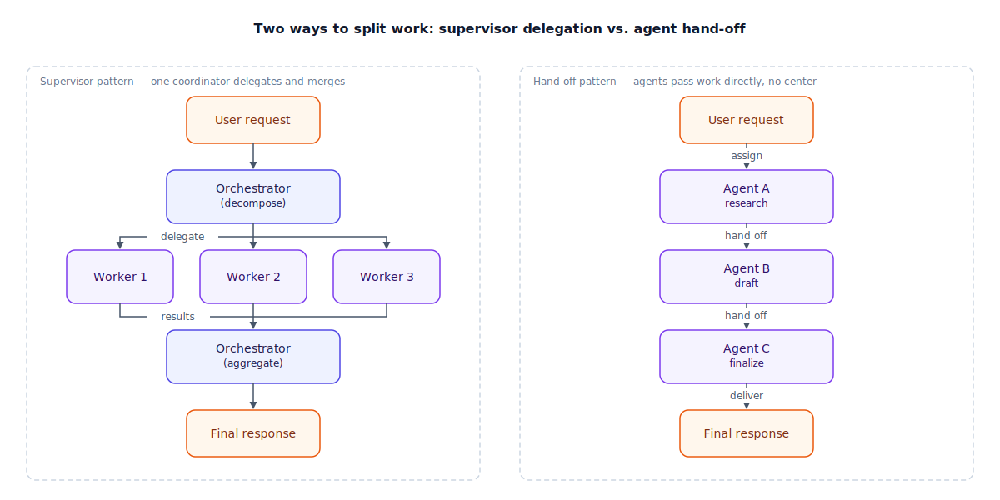

## The 30-second version

A multi-agent system hands one job to several specialized agents instead of one generalist. There are two basic shapes: the **supervisor pattern**, where a coordinator breaks the task into pieces, delegates each to a worker, and merges the results; and the **hand-off pattern**, where agents pass the task directly to one another, like a chain, with no center re-planning at every step. Multi-agent design earns its keep when sub-tasks are genuinely independent and can run in parallel, or need different tools and models. It costs extra round-trips, duplicated context, and new ways to fail — so the real design question is never "how many agents should this have?" It's "does this task actually decompose into pieces that benefit from being separate?"

## The analogy

Picture a small production company shooting a short film in a single week.

If the shoot is simple enough — one person, one location, one static shot — you don't need a crew. One competent person with a camera can direct, shoot, and edit. That's your single agent: fine for small, self-contained jobs.

Once the shoot spans multiple locations, a cast, sound, and a hard delivery date, one person can't do it all *and* keep up quality. So you bring in a crew with a clear structure. The **director** doesn't operate the camera or mix the audio — they read the script, break it into shot lists and daily assignments, and hand each assignment to a specialist: the **cinematographer** frames and lights the shots, the **sound recordist** captures clean audio, the **editor** assembles footage into scenes. Every evening the crew reviews the day's **dailies** together — a checkpoint where the director sees what actually got captured, catches problems early, and adjusts tomorrow's assignments. That's the **supervisor pattern**: one coordinator decomposes the job, dispatches it, and reconciles the output before it moves downstream.

Contrast that with a **hand-off**. On some productions there's no director orchestrating every decision — the script supervisor finishes a pass and hands the marked-up script straight to the editor, who works directly from it without routing back through a center. Each specialist trusts the last one's work and picks up where it left off — faster, less overhead, but no one checks the pieces add up to a coherent film until the very end.

And sometimes a production needs a specialist it doesn't employ — a visual-effects house on a different continent, running its own tools on its own schedule. The production sends a shot list and delivery spec through a standard format and gets finished shots back; it doesn't fold that house into its crew. That's crossing an organizational boundary: you don't merge teams, you agree on an interface.

| Film production | Multi-agent system |
|---|---|
| One-person shoot, one location | Single agent handling a self-contained task |
| The director | The orchestrator / supervisor agent |
| Cinematographer, sound recordist, editor | Specialized worker agents |
| Shot list handed to each department | Sub-task delegated to each worker |
| Evening dailies review | Checkpoint where the orchestrator reconciles worker output |
| Script supervisor handing pages straight to the editor | Hand-off pattern — no central coordinator between steps |
| External VFX house on its own systems | Cross-vendor agent reached over a standard protocol (A2A, Agent-to-Agent) |
| A shot list and delivery spec instead of shared internal tools | Agent Cards / capability discovery instead of a shared framework |

## How it actually works

The diagram lines up five steps on both sides for direct comparison.

On the left, the **supervisor pattern**: a request arrives, and the orchestrator's first job is decomposition — turning "handle this" into concrete, independently answerable sub-tasks. It dispatches each to a worker, often a cheaper model than itself (a high-reasoning model for planning, fast models for execution). When workers finish, its second job is aggregation: reconcile results, check they answer the original request, produce the final response. Two failure modes live here. **Decomposition failure** — if the sub-tasks are logically inconsistent or hide a dependency, workers confidently answer the wrong questions; the fix is having workers confirm a sub-task is well-formed before starting. **Context dilution** — if every worker's full trace gets appended to shared state, the orchestrator's own context fills with noise and loses the original goal; the fix is passing workers only what they need and summarizing before output re-enters shared state.

On the right, the **hand-off pattern**: instead of a hub reporting to a center, each agent finishes its piece and passes the task — and the context so far — directly to the next. No round-trip to a coordinator between hops removes a source of latency and a bottleneck. The cost: no one checks the shape of the whole job until the last agent finishes, so a bad hand-off early in the chain propagates all the way through.

Worth naming even though it isn't pictured: when a step might loop back or branch depending on what it finds, plain chains and supervisor loops both break down. Model the workflow as a graph with typed state and conditional edges instead, so a failed step can route back rather than crashing the run (see [Planning and Decomposition](./planning-and-decomposition.mdx)).

Both patterns assume agents share a framework and runtime. When an orchestrator delegates across a team or company boundary — a compliance check owned by a different group — it can't assume that, and needs an interoperability protocol instead: the remote agent publishes a capability description, the orchestrator sends a structured task over the network, and results come back the same way. It costs real latency (a network hop, not a function call) in exchange for not rebuilding someone else's agent inside your own stack.

## A concrete example

Take "research a competitor's pricing page, summarize it, and draft a one-paragraph comparison email." On a single agent: fetch the page (~3,000 tokens), summarize (~700 tokens out), draft the email (~300 tokens out) — three sequential calls, ~1.5–2 s each, about 5 seconds total and ~$0.01 at mid-tier pricing.

Hand it to a supervisor with three workers instead — researcher, summarizer, writer. The catch: the summarizer needs the researcher's output and the writer needs the summarizer's, so there's no independent work to parallelize; the dependency chain is identical. What you add is a planning call (~300 ms, ~$0.001), an aggregation call (~400 ms, ~$0.001), and three system prompts instead of one. Wall-clock climbs to ~6.5–7 s and cost rises 20–30% — for the exact same email. Coordination overhead with nothing to show for it.

Now: "review the last 12 support tickets and flag which need escalation." Each ticket is independent and genuinely parallelizable. One agent sequentially, at ~1.2 s per ticket, takes ~14.4 s. A supervisor fanning 12 tickets across 6 parallel workers (2 each) finishes in ~2×1.2 s plus ~0.6 s dispatch/aggregate overhead ≈ 3 seconds — a 4–5x wall-clock win, for maybe 25–30% more tokens. Trading 25% more cost for a 4x speedup is an easy call. Same architecture, opposite verdict — this task actually decomposes into independent pieces and the first one didn't.

## The tradeoffs that matter

| Shape | Coordination cost | Best for | Main failure mode |
|---|---|---|---|
| Single agent | None | Small, self-contained tasks | Runs out of context or tools on complex jobs |
| Supervisor (hierarchical) | One planning call + one aggregation call, per request | Tasks with real parallel sub-tasks; mixed model needs (cheap workers, expensive planner) | Decomposition failure; context dilution in shared state |
| Hand-off (chain) | Lower — no round-trip to a center | Sequential pipelines where each stage's job is unambiguous | No one checks the whole job until the last hop; errors compound silently |
| Graph-based (conditional, with loops) | Higher upfront design cost, lower re-run cost | Non-linear tasks needing retries, branches, or backtracking | Harder to reason about statically; needs good observability |
| Cross-vendor (A2A-style) | Network hop + serialization, per call | Crossing team, company, or vendor boundaries | Latency; trusting internals you don't control |

The number that drives the decision is how much of the task is actually parallel or separable by concern. A strict dependency chain means a supervisor buys organization, not speed — coordination cost for free. Independent sub-tasks mean that same cost buys a wall-clock win that scales with how many you run at once.

## Where people go wrong

- **Adding agents to a strict dependency chain.** If step 2 always needs step 1's output, splitting it across agents adds a supervisor round-trip and buys nothing but line items in a diagram.
- **Letting shared state become a dumping ground.** Appending every worker's full trace to global state feels safe, but it's how an orchestrator loses track of the original goal in its own context.
- **Dispatching sub-tasks without checking they're well-formed.** A worker given an inconsistent sub-task still produces a confident, wrong answer — it has no way to know the plan itself was broken.
- **Reaching for a cross-vendor protocol inside a single team.** If one team owns every agent and shares a runtime, a network-based interoperability layer only adds latency you don't need.
- **Treating "multi-agent" as a quality upgrade by default.** More agents means more places for a decomposition to go wrong, not an automatic accuracy boost.

## The interview lens

Interviewers ask about this to see whether you reach for multi-agent because a task's shape demands it, or because it sounds sophisticated.

A strong sound bite: *"I only split a task across agents when the sub-tasks are actually independent or need different tools — otherwise I'm paying for a supervisor's planning and aggregation calls without unlocking any parallelism, and a single agent with a good plan does the same job for less."*

Likely follow-ups:

- How do you stop shared state from ballooning as workers report back? (Summarize before it re-enters shared context; never append raw traces.)
- When would you pick a graph-based orchestrator over a supervisor loop? (When the task needs conditional branches or must backtrack on failure — a static chain can't route around that.)
- When does crossing a vendor or team boundary make sense? (When you don't own the specialist agent and can't fold it into your runtime — accept the network hop for vendor neutrality.)

## Go deeper

- [Agent Fundamentals](./agent-fundamentals.mdx) — what a single agent loop looks like before you add more of them.
- [Planning and Decomposition](./planning-and-decomposition.mdx) — how the orchestrator's decomposition step actually gets done.
- [Agentic Security and Sandboxing](./agentic-security-and-sandboxing.mdx) — the trust-boundary questions that show up once agents cross team or vendor lines.
- Upstream reference: [Multi-Agent Orchestration — AI System Design Guide](https://github.com/ombharatiya/ai-system-design-guide/blob/main/07-agentic-systems/04-multi-agent-orchestration.md) (MIT; see [CREDITS](../../../CREDITS.md)).
