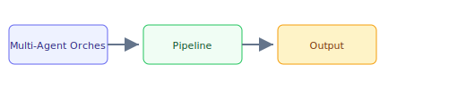

## The 30-second version

Complex systems are rarely one agent. They are teams of specialized agents. Orchestration has matured from "Blind Managers" to Hierarchical Supervisors, Dynamic Swarms, and Cross-Vendor Agent Networks enabled by interoperability protocols like A2A. Gartner projects that 40% of enterprise applications will feature task-specific AI agents by end of 2026, up from under 5% in early 2025.

## The analogy

Think of **Multi-Agent Orchestration** like running a kitchen during rush hour: you cannot memorize every recipe change, so you keep reference cards (retrieval), a head chef who improvises within guardrails (the model), and a quality check before plates leave the pass (evaluation). The technical system mirrors that flow — separate what you **store**, what you **retrieve**, and what you **generate**.

## How it actually works

Complex systems are rarely one agent. They are teams of specialized agents. Orchestration has matured from "Blind Managers" to **Hierarchical Supervisors**, **Dynamic Swarms**, and **Cross-Vendor Agent Networks** enabled by interoperability protocols like A2A. Gartner projects that 40% of enterprise applications will feature task-specific AI agents by end of 2026, up from under 5% in early 2025.

## A concrete example

Complex systems are rarely one agent. They are teams of specialized agents. Orchestration has matured from "Blind Managers" to Hierarchical Supervisors, Dynamic Swarms, and Cross-Vendor Agent Networks enabled by interoperability protocols like A2A. Gartner projects that 40% of enterprise applications will feature task-specific AI agents by end of 2026, up from under 5% in early 2025.

## The tradeoffs that matter

| Choice | Upside | Cost |
|--------|--------|------|
| Simpler design | Faster to ship | Less resilient |
| Heavier retrieval | Better grounding | More latency |
| Bigger model | Higher quality | Higher $/query |

## Where people go wrong

- Skipping evaluation and hoping demos generalize
- Ignoring latency/cost until production traffic arrives
- Treating retrieval quality as a generation problem

## The interview lens

### Q: What are the main failure modes of a "Supervisor" multi-agent architecture?

**Strong answer:**
The primary failure mode is **Decomposition Failure**. If the Supervisor agent breaks a task into sub-tasks that are logically inconsistent or have hidden dependencies, the workers will produce correct answers to the *wrong questions*. The standard fix is **Iterative Planning**: the Supervisor must get "Confirmation of sub-task feasibility" from the workers before they begin execution. Another failure is **Context Dilution**, where the global state becomes so bloated with worker logs that the Supervisor loses the "Big Picture."

### Q: How do you choose between a "Sequence of Chains" and a "Multi-Agent Graph"?

**Strong answer:**
I use a **Sequence of Chains** when the task is linear and deterministic (e.g., Extract -> Translate -> Summarize). I use a **Multi-Agent Graph** (like LangGraph) when the task is **Non-Linear** or requires **Conditional Loops**. For example, if the "Translate" step might fail and need to go back to "Extract" for more context, a static chain breaks, but a graph can self-correct by routing back to an earlier node.

### Q: When would you use A2A for multi-agent orchestration versus keeping all agents in a single framework?

**Strong answer:**
I keep agents in a single framework when the team owns all agents, they share the same runtime, and low latency between agent calls is critical. I introduce A2A when crossing **organizational or vendor boundaries** — for example, when my orchestrator needs to delegate to a compliance agent maintained by a different team, or when integrating a third-party specialized agent (e.g., a legal review service). A2A adds HTTP overhead but provides **vendor neutrality**, **independent scaling**, and **capability discovery** via Agent Cards. The rule of thumb: same team, same framework; different team or vendor, use A2A.

## Go deeper

- [Upstream chapter (Multi-Agent Orchestration)](https://github.com/ombharatiya/ai-system-design-guide/blob/main/07-agentic-systems/04-multi-agent-orchestration.md)
- Related questions in the [question bank](/questions)
- Practice with [SPIDER walkthrough](/practice) or [mock interview](/mock)
