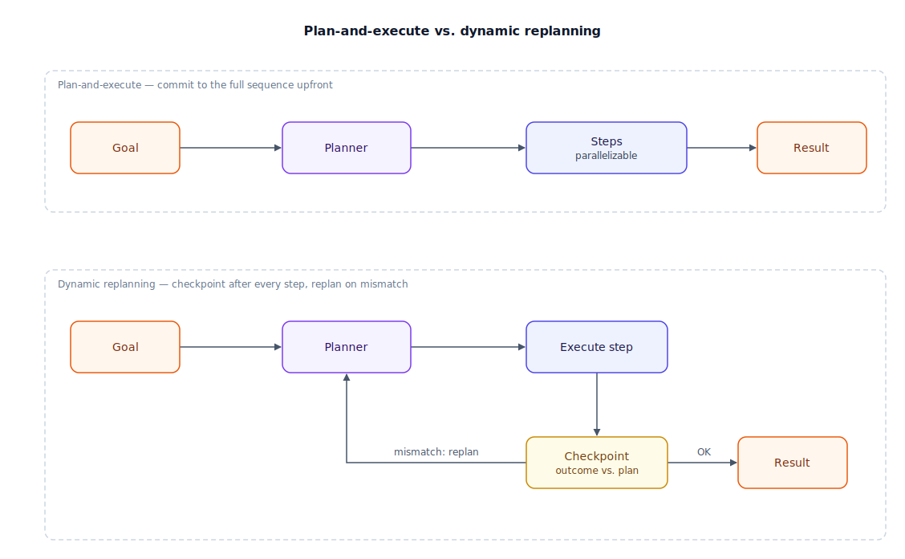

## The 30-second version

Planning is the decision, made before or during a task, about how much of the path to commit to in advance. **Plan-and-execute** writes a full sequence of steps up front and runs it through, checking in only at the end. **Dynamic replanning** writes a plan too, but re-evaluates after every step and is willing to throw the rest away the moment reality contradicts it. Neither is universally right: upfront planning wins when the task is well understood, because a fixed plan can be parallelized and doesn't waste reasoning re-deciding things that were never in doubt. Dynamic replanning wins when the environment can invalidate assumptions mid-task, because a plan that can't bend breaks the moment step three returns something step one didn't anticipate. Decomposition — breaking one large goal into smaller sub-goals — is a separate axis: it determines *what* the steps are, while plan-and-execute vs. replanning determines *how much you commit to them before checking reality.*

## The analogy

Picture a mountaineering expedition summiting a peak over ten days, versus one improvising up in a rolling whiteout.

A well-mapped mountain gets a plan written weeks in advance: base camp day 1, ferry supplies to Camp 2 by day 3, acclimatize two days, push to Camp 3 on day 6, summit attempt day 9, day 10 held as a weather buffer. The leader doesn't renegotiate this every morning — the route and the season's weather patterns are known, and re-litigating the plan daily would just burn energy the team needs for climbing. The leader does break the summit goal into pieces first: reaching each camp is its own sub-goal, and a two-person rope team is sometimes sent ahead to fix lines on a difficult pitch while the rest of the group rests. That's decomposition, and it happens whether or not the overall plan stays fixed.

Now picture a mountain nobody has climbed this season: the route above Camp 2 hasn't been scouted, and the forecast changes hourly. Committing to a ten-day static itinerary here would be reckless — a storm at Camp 2 the day-1 plan never accounted for should scrap the summit-day schedule entirely, not just delay it. The leader instead treats each morning as a fresh decision point: check the forecast, the team's condition, and yesterday's scouting report, then decide. Two failure patterns show up on real expeditions. A team that replans after every gust of wind never actually climbs — they're perpetually re-deciding a plan they had time to just execute. And a team that refuses to abandon the original itinerary even as climbers show frostbite symptoms is following a plan that stopped matching reality days ago.

| Mountaineering | Planning concept |
|---|---|
| The ten-day summit itinerary written in advance | A static plan (plan-and-execute) |
| Breaking "summit the peak" into base camp, Camp 2, Camp 3, summit push | Task decomposition into sub-goals |
| A two-person rope team sent ahead to fix lines while the group rests | A parallelizable sub-task, dispatched independently |
| Not renegotiating the route every morning on a known mountain | Committing to the plan — the payoff of upfront planning in a stable domain |
| Checking the forecast and yesterday's scouting report each morning | The observation step that could trigger a replan |
| A storm at Camp 2 scrapping the summit-day schedule entirely | Dynamic replanning — discarding the rest of the plan, not just patching it |
| Replanning after every gust of wind, never actually climbing | Replan thrashing — over-adapting to noise |
| Sticking to the original itinerary despite frostbite symptoms | A brittle static plan — under-adapting to a real signal |

## How it actually works

The top half of the diagram is **plan-and-execute**. A planner reads the goal once and produces an ordered sequence of steps; an executor carries them out in turn, and the arrows only point forward. If sub-tasks don't depend on each other, they run in parallel — the main efficiency plan-and-execute buys, since nothing waits for a model to reason about a choice already settled at planning time. The design assumes the plan, once made, stays valid.

The bottom half is **dynamic replanning**. The planner produces a first step the same way, but after execution there's a checkpoint: does the outcome match what the plan expected? If yes, the executor moves on. If no, control routes back to the planner — not to patch the single failed step, but to reconsider the plan from the current state onward, since a wrong assumption at step two usually invalidates steps three through ten as well. This loop can run indefinitely, which is why an over-eager version of it replans on noise instead of genuine surprises.

Decomposition is orthogonal to both halves: whether you commit to a full plan or replan constantly, you still decide how a large goal splits into sub-goals. The two common strategies are **hierarchical decomposition** — a top-level goal splits into large sub-goals, each decomposed further if still too big to execute directly — and **recursive sub-task spawning**, where a coordinator hands each sub-goal to its own worker that decomposes its piece independently and reports back a result, not a full trace. Both need a depth limit; without one, a task that looks decomposable at every level will keep splitting instead of ever executing.

## A concrete example

An expedition team plans a 12-day attempt with two known camps and one unscouted section above Camp 2, using a rule: replan only when an observation crosses a defined threshold, not on every data point.

- **Day 1 (plan):** Base camp established. Itinerary drafted: Camp 2 by day 3, acclimatize days 4–5, scout the unscouted section day 6, Camp 3 by day 8, summit day 10, days 11–12 as buffer.
- **Day 3 (execute):** Camp 2 reached on schedule. Outcome matches plan — continue.
- **Day 6 (checkpoint):** The scouting pair reports a technical ice pitch above Camp 2 that nobody budgeted rope-fixing time for. This crosses the replan threshold. **Replan:** insert a rope-fixing day, push Camp 3 to day 9, summit day 11, buffer cut to one day.
- **Day 9 (checkpoint):** Camp 3 reached on the revised schedule. Forecast shows a storm arriving day 11 afternoon — a second threshold crossing. **Replan again:** move the summit push to day 10 morning, trading acclimatization margin for a weather window.
- **Day 10 (execute):** Summit reached before the storm arrives.

Two replans across a 10-day climb, both triggered by a defined threshold — a technical obstacle, then a hard weather deadline — rather than routine daily uncertainty. A team replanning every morning would have spent scouting hours in meetings instead of climbing; a team that never replanned would have hit the ice pitch unprepared and walked into the storm on the original schedule.

## The tradeoffs that matter

| Approach | Best when | Compute / coordination cost | Failure mode |
|---|---|---|---|
| Plan-and-execute (static) | The domain is well understood; steps are largely independent | Low — one planning pass, steps parallelize | Brittle: one wrong early assumption invalidates every step downstream |
| Dynamic replanning | The environment can invalidate assumptions mid-task | Higher — a planning pass after every meaningful checkpoint | Thrashing: replanning on noise instead of on genuine threshold crossings |
| Decomposition depth (however you plan) | Any goal too large for one step or one sub-agent to hold in context | Grows with depth; each level adds coordination overhead | Runaway recursion — decomposing a task that was already small enough to execute |

The real decision isn't "static or dynamic" in the abstract — it's how much you trust your model of the domain. A software migration against a documented API surface is the known-route mountain: plan it, parallelize it, execute it. An agent in a live production incident is the unscouted whiteout: replan constantly, because the next observation beats anything decided an hour ago. Most production systems land in between — a skeleton plan with defined checkpoints where replanning is allowed.

## Where people go wrong

1. **Replanning on every observation instead of on a threshold.** If the plan gets rewritten after each tool call regardless of whether anything material changed, the system spends its budget re-deciding settled questions instead of progressing.
2. **Refusing to replan when a real signal appears.** A static plan that ignores a failed step and keeps executing steps that depended on it produces a result built on a foundation that already collapsed.
3. **Decomposing without a depth limit.** A goal that can always be split into smaller sub-goals will keep splitting forever unless something forces a "small enough to execute directly" check first.
4. **Giving every sub-agent the full context of the parent task.** Sub-tasks that inherit everything the top-level goal knows waste tokens and invite wandering outside the actual assignment; hand down only what's needed.
5. **Treating plan revision as cheap.** Revising a plan requires understanding what was already done and why it failed — a harder reasoning task than generating the original plan from scratch — so budget for that accordingly.

## The interview lens

Interviewers reach for this topic to see whether you match the planning strategy to the actual uncertainty in the domain, rather than defaulting to whichever pattern is fashionable.

A strong sound bite: *"I plan upfront when the domain is well understood enough that a wrong assumption is unlikely — that's where a static plan earns back its cost. The moment steps can invalidate each other's assumptions, I switch to checkpointed replanning, but only on defined thresholds, because replanning on every observation is as wasteful as never replanning."*

Likely follow-ups:

- How do you decide where to put replanning checkpoints in a long-running plan?
- What's the difference between patching a single failed step and discarding the rest of the plan?
- How do you prevent recursive task decomposition from spawning more sub-agents than the task actually needs?

## Go deeper

- [Agent Fundamentals](./agent-fundamentals.mdx) — the observe-think-act loop that a replanning checkpoint plugs into.
- [Reasoning Loops: ReAct and Beyond](./reasoning-loops-react-and-beyond.mdx) — deciding one step at a time, the opposite end of the spectrum from a full upfront plan.
- [Multi-Agent Orchestration](./multi-agent-orchestration.mdx) — how decomposed sub-goals get handed to separate workers in practice.
- Upstream reference: [Planning and Decomposition — AI System Design Guide](https://github.com/ombharatiya/ai-system-design-guide/blob/main/07-agentic-systems/06-planning-and-decomposition.md) (MIT; see [CREDITS](../../../CREDITS.md)).
