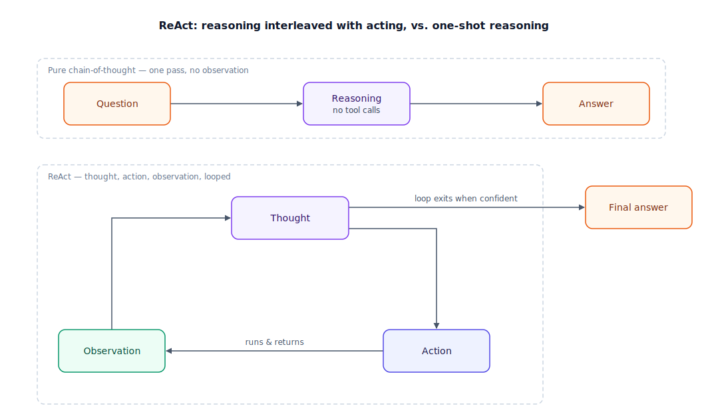

## The 30-second version

ReAct (short for "Reason + Act") interleaves three things in a tight cycle: a **thought** about what to do next, an **action** that actually touches the world (almost always a tool call), and an **observation** — the real result that comes back. The model reasons again over that observation before choosing its next action, and the cycle repeats until it has enough evidence to answer. This beats plain chain-of-thought — reasoning to an answer in one shot, with no tool calls in between — because a one-shot plan is only as good as the model's assumptions at the moment it was written, and assumptions about a search result or a database row are frequently wrong. ReAct catches that mismatch after every step instead of after the whole chain has run. The pattern is almost trivially simple; what separates a robust implementation from a fragile one is how it handles two failure modes — getting stuck repeating an action that already failed, and quitting early because an ambiguous result got treated as a good one.

## The analogy

Picture a locksmith picking a pin-tumbler lock, next to an apprentice told to plan the whole job from an armchair.

The apprentice studies a diagram of how pin-tumbler locks work, reasons carefully about which pins need to move and in what order, writes out a full sequence — push pin 2, then pin 5, then pin 1, apply tension, turn — and only then walks over to the actual lock and executes the plan start to finish, without checking anything along the way. It sounds thorough. It fails constantly, because the diagram describes locks in general, and this lock, with its own wear and its own quirks, doesn't match it closely enough for a blind sequence to work.

The locksmith does something that looks almost lazy by comparison but works far better: pick, then feel. Apply tension, push a pin, and *feel* whether it sets or springs back before deciding which pin to try next. Each decision commits to one small move, checked against the real lock immediately afterward. If pin 3 doesn't set, an experienced locksmith doesn't repeat the identical push — they change the tension or try a different pin. And when the cylinder actually turns, they stop; a novice sometimes declares victory the moment *any* pin clicks, even though the plug hasn't rotated and the lock isn't actually open.

| Locksmithing | ReAct element |
|---|---|
| Studying a general lock diagram | Background knowledge in the model's weights |
| Planning the full pin sequence blind, no lock in hand | Pure chain-of-thought — reasoning to an answer, no tool calls |
| Deciding which pin to try next | Thought |
| Pushing that specific pin | Action (a tool call) |
| Feeling whether it sets, springs back, or nothing happens | Observation |
| Feeling, then deciding, then pushing again | The loop: thought → action → observation → thought |
| Repeating the identical push on a pin that already failed | Looping — retrying a dead action |
| Declaring the lock open the instant one pin clicks | Premature termination — mistaking partial evidence for success |
| The cylinder actually rotating | The genuine exit condition — the goal, actually met |

## How it actually works

Follow the cycle in the diagram. **Thought** is a short piece of reasoning, usually a sentence or two, about what the agent still needs to find out — not a full plan, just the next move. **Action** turns that thought into a concrete tool call: a search query, a function call, a database lookup. **Observation** is the literal result that comes back from executing it — not the model's summary of what it expects to find, the actual bytes. That observation becomes the input to the next thought, and the cycle continues.

The exit branch matters as much as the loop itself. On each pass, the model checks whether the accumulated observations are sufficient to answer, and if so, leaves the loop with a final answer instead of taking another action. A turn budget backstops that check: if the model never judges itself satisfied, an external cap on iterations forces an exit anyway, the same way [agent fundamentals](./agent-fundamentals.mdx) requires a budget on the broader observe-think-act loop that ReAct implements.

Plain chain-of-thought reasons in one continuous pass and only touches the world, if at all, at the very end — every intermediate claim is the model's own guess, because it hasn't actually looked yet. ReAct forces a look after every single claim that depends on the outside world, which is why it holds up better once real tools and real data enter the picture: the plan gets corrected continuously instead of failing all at once, three steps after the mistaken assumption was made.

## A concrete example

An agent is asked: *"Did Widget Corp's Q3 revenue beat the guidance from their Q2 call?"* It has a `search_filings` tool.

- **Turn 1.** Thought: "I need the guidance number first." Action: `search_filings("Widget Corp Q3 revenue guidance")`. Observation: "Q2 call, July 14: guidance for Q3 revenue is $412M–$418M."
- **Turn 2.** Thought: "Now I need the actual Q3 number to compare." Action: `search_filings("Widget Corp Q3 actual revenue")`. Observation: "No Q3 filing found."
- **Turn 3.** Thought: "No filing yet doesn't mean no data exists anywhere — check whether Q3 earnings have even been reported." Action: `search_filings("Widget Corp Q3 earnings release date")`. Observation: "Q3 earnings call scheduled for November 4 — two days from now."
- **Turn 4.** Thought: "Q3 hasn't been reported yet, so this question can't be answered from filings — it can only be answered after November 4." Final answer: reports the guidance range and states plainly that actual results aren't out yet.

Four turns, three tool calls, roughly 2 seconds of model latency per turn plus sub-second tool round trips — call it 8 seconds wall clock and a few cents of tokens at typical reasoning-model pricing. The value is in turns 2 and 3: a pure chain-of-thought pass, reasoning with no tool calls, would have leaned on training data and stated a confident number Widget Corp never actually reported. The empty observation at turn 2 forces the correction — and a weaker implementation that treated "no filing found" as "results were bad, hence hidden" would have hallucinated a plausible negative answer instead of checking why the filing was missing. That's the premature-termination trap: an ambiguous observation isn't evidence of anything until you've checked what it means.

## The tradeoffs that matter

| Approach | Grounded in real state | Latency | Cost | Recovers from a wrong assumption |
|---|---|---|---|---|
| Pure chain-of-thought (reason once, no tool calls) | None — pure recall and inference | Lowest — one pass | Lowest — one generation | No — wrong assumptions ride through to the final answer |
| ReAct (thought → action → observation, looped) | Every step checked against a real result | Moderate — one round trip per turn | Moderate — N reasoning passes + N tool calls | Yes, within the same run — the next thought sees the correction |
| Reflexion-style (adds a critique step after failure) | Same as ReAct, plus an explicit self-evaluation | Higher — an extra pass per iteration | Higher — critique is its own LLM call | Yes, and it can carry the lesson across a retry, not just within one pass |

The cost of grounding is real: every extra observation is a network round trip and a chunk of tokens a one-shot answer never pays. That cost buys correctness on exactly the tasks where it matters — anything where the right next step depends on a fact the model can't already know. Reach past plain ReAct toward a critique step only when failures repeat in a way a single retry doesn't fix; it's a second cost layered on top, not a free upgrade.

## Where people go wrong

1. **Looping on a dead action.** A tool call that errors or returns nothing gets retried identically, because nothing forces the next thought to change strategy rather than repeat it.
2. **Premature termination.** An empty or ambiguous observation gets treated as sufficient evidence to answer, instead of as a signal to ask a different question.
3. **No turn budget.** Without an external cap, an unanswerable query burns tool calls indefinitely instead of surfacing "I couldn't find this" as a valid answer.
4. **Vague thoughts.** A thought like "look into it further" produces an action that doesn't narrow anything down — a good thought names the specific unknown the next action should resolve.
5. **Feeding the model its own summary instead of the raw observation.** If the model paraphrases a tool result before reasoning over it, errors in that paraphrase compound silently across every later turn.

## The interview lens

Interviewers use ReAct to check whether you understand *why* interleaving beats reasoning-then-acting, not just that the acronym exists. Strong answers name a concrete failure mode the interleaving prevents.

A strong sound bite: *"Interleaving beats one-shot reasoning because it forces every assumption about the outside world to get checked immediately, not three steps later. The failure modes I design for are a loop that retries a dead action forever, and one that mistakes an empty result for a real answer — so I always check what the loop does with a null observation before trusting it with anything else."*

Likely follow-ups:

- How would you detect that an agent is stuck in a repeat loop, programmatically, without a human watching every trace?
- When does the extra latency of ReAct's per-step round trips stop being worth it?
- How does a turn budget interact with premature termination — could a tight budget itself cause an agent to quit too early?

## Go deeper

- [Agent Fundamentals](./agent-fundamentals.mdx) — the observe-think-act loop that ReAct is one concrete implementation of.
- [Planning and Decomposition](./planning-and-decomposition.mdx) — the alternative to reacting turn by turn: committing to a fuller plan upfront.
- [Tool Use and MCP](./tool-use-and-mcp.mdx) — the mechanics behind the "action" step: how a call is defined, dispatched, and returned.
- Upstream reference: [Reasoning Loops: ReAct and Beyond — AI System Design Guide](https://github.com/ombharatiya/ai-system-design-guide/blob/main/07-agentic-systems/02-reasoning-loops-react-and-beyond.md) (MIT; see [CREDITS](../../../CREDITS.md)).
