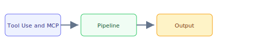

## The 30-second version

Tools are the "hands" of an agent. The industry has standardized on the Model Context Protocol (MCP), which replaces fragmented custom tool definitions with a unified, local-first communication layer. MCP has matured rapidly: Streamable HTTP transport, OAuth 2.1 auth, and native computer-use tools landed in MCP 2.0 (ratified March 2026). In parallel, Agent-to-Agent (A2A) and other interoperability protocols have emerged to complement MCP's tool-access layer with agent coordination capabilities.

## The analogy

Think of **Tool Use and MCP** like running a kitchen during rush hour: you cannot memorize every recipe change, so you keep reference cards (retrieval), a head chef who improvises within guardrails (the model), and a quality check before plates leave the pass (evaluation). The technical system mirrors that flow — separate what you **store**, what you **retrieve**, and what you **generate**.

## How it actually works

Tools are the "hands" of an agent. The industry has standardized on the **Model Context Protocol (MCP)**, which replaces fragmented custom tool definitions with a unified, local-first communication layer. MCP has matured rapidly: Streamable HTTP transport, OAuth 2.1 auth, and native computer-use tools landed in MCP 2.0 (ratified March 2026). In parallel, **Agent-to-Agent (A2A)** and other interoperability protocols have emerged to complement MCP's tool-access layer with agent coordination capabilities.

## A concrete example

Tools are the "hands" of an agent. The industry has standardized on the Model Context Protocol (MCP), which replaces fragmented custom tool definitions with a unified, local-first communication layer. MCP has matured rapidly: Streamable HTTP transport, OAuth 2.1 auth, and native computer-use tools landed in MCP 2.0 (ratified March 2026). In parallel, Agent-to-Agent (A2A) and other interoperability protocols have emerged to complement MCP's tool-access layer with agent coordination capabilities.

## The tradeoffs that matter

| Choice | Upside | Cost |
|--------|--------|------|
| Simpler design | Faster to ship | Less resilient |
| Heavier retrieval | Better grounding | More latency |
| Bigger model | Higher quality | Higher $/query |

## Where people go wrong

- Skipping evaluation and hoping demos generalize
- Ignoring latency/cost until production traffic arrives
- Treating retrieval quality as a generation problem

## The interview lens

### Q: How does MCP solve the "Too Many Tools" problem (Schema Overload)?

**Strong answer:**
In 2023, giving a model 50 tools would degrade performance because the prompt became too long. MCP solves this through **Dynamic Resource Discovery**. Instead of loading 50 tool schemas into the prompt, the agent sends a `list_resources` call to the MCP server. It then only "attaches" the specific tools relevant to the current `Resource` context. This keeps the prompt lean and the context window focused on reasoning rather than parsing unused schemas.

### Q: Why is it important to separate "Tool Logic" from the "Agent App" using MCP servers?

**Strong answer:**
Separation of concerns. If the tool logic (e.g., a Python scraper) lives in a separate MCP server, I can scale the scraping infrastructure independently of the LLM orchestrator. More importantly, it provides a **Security Sandbox**. If a model tries to perform an injection through a tool argument, it only affects the MCP server process, which can be containerized with zero network access to the core Agent state.

### Q: How do MCP and A2A work together in a production multi-agent system?

**Strong answer:**
They address **different communication layers**. MCP is the agent-to-tool protocol - it gives any agent standardized access to databases, APIs, and files through MCP servers. A2A is the agent-to-agent protocol - it enables an orchestrator agent (from Vendor X) to delegate a task to a specialist agent (from Vendor Y) without sharing memory or context. In production, I use MCP for every tool connection and A2A when I need cross-vendor agent coordination. For example, a procurement orchestrator built on LangGraph uses MCP to query an inventory database, then uses A2A to delegate compliance checking to a specialized agent hosted by a different team. The key design principle is: MCP within an agent's own tool stack, A2A across organizational or vendor boundaries.

## Go deeper

- [Upstream chapter (Tool Use and MCP)](https://github.com/ombharatiya/ai-system-design-guide/blob/main/07-agentic-systems/03-tool-use-and-mcp.md)
- Related questions in the [question bank](/questions)
- Practice with [SPIDER walkthrough](/practice) or [mock interview](/mock)
