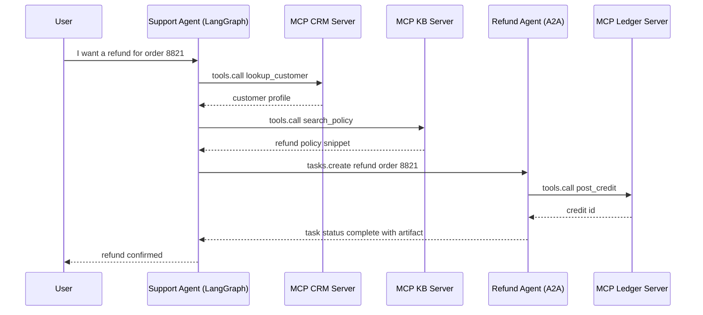
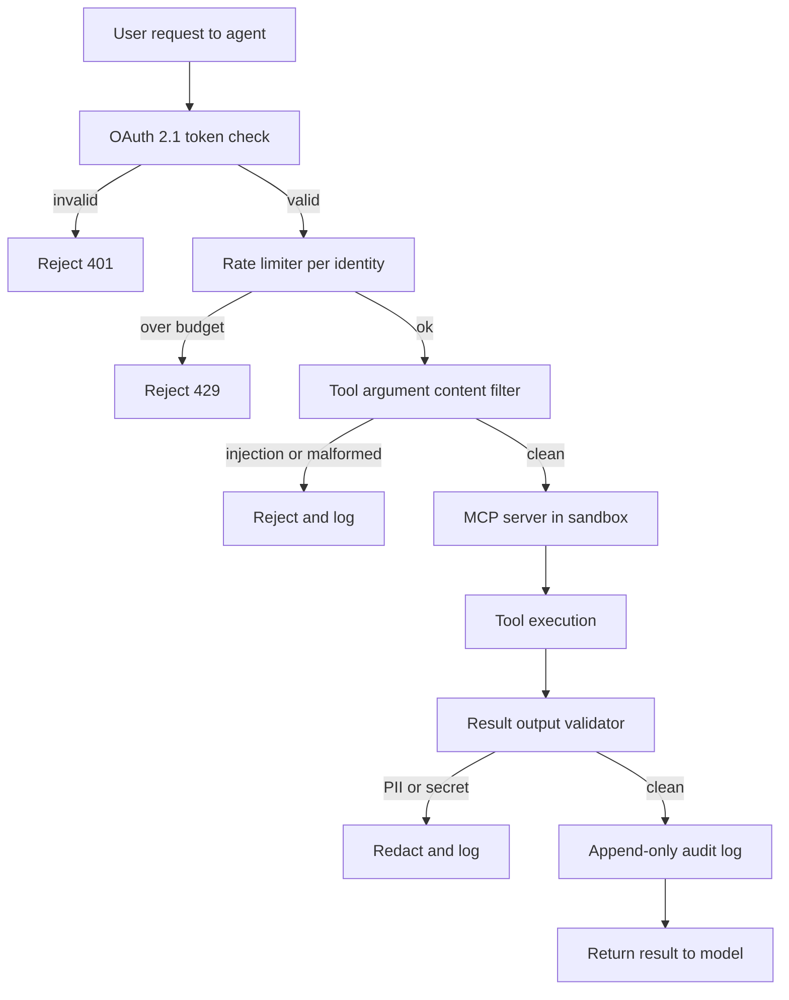

## The 30-second version

Tools are the "hands" of an agent. The industry has standardized on the Model Context Protocol (MCP), which replaces fragmented custom tool definitions with a unified, local-first communication layer. MCP has matured rapidly: Streamable HTTP transport, OAuth 2.1 auth, and native computer-use tools landed in MCP 2.0 (ratified March 2026). In parallel, Agent-to-Agent (A2A) and other interoperability protocols have emerged to complement MCP's tool-access layer with agent coordination capabilities.

## How it actually works

Tools are the "hands" of an agent. The industry has standardized on the **Model Context Protocol (MCP)**, which replaces fragmented custom tool definitions with a unified, local-first communication layer. MCP has matured rapidly: Streamable HTTP transport, OAuth 2.1 auth, and native computer-use tools landed in MCP 2.0 (ratified March 2026). In parallel, **Agent-to-Agent (A2A)** and other interoperability protocols have emerged to complement MCP's tool-access layer with agent coordination capabilities.


## The Tool-Use Mechanism

Tool use occurs in a 3-step cycle:
1. **Schema Presentation**: The model is given a JSON schema of the tools.
2. **Intent & Extraction**: The model outputs a "Call" (e.g., `\{"tool": "get_weather", "args": \{"city": "Tokyo"\}\}`).
3. **Execution & Contextualization**: The system runs the function and feeds the result back into the prompt.

**Nuance**: Production stacks no longer "hardcode" tool definitions into the system prompt. They use **Dynamic Manifests** that fetch only necessary tools based on the user's intent.

## Model Context Protocol (MCP)

Developed by Anthropic (released November 2024) and now the universal tool-integration standard across Anthropic, OpenAI, Google, Microsoft, and AWS, MCP allows models to interact with data and tools regardless of where they live. Governance moved to the Linux Foundation's Agentic AI Foundation in December 2025.

- **MCP Client**: The AI application (e.g., your agent code).
- **MCP Server**: A standalone process that exposes Tools (Functions), Resources (Data), and Prompts (Templates).
- **Communication**: Uses JSON-RPC over stdio or HTTP.

### Why MCP?
- **Security**: Tools run in their own process, not in the model logic.
- **Portability**: Write a "Postgres Tool" once, use it in Claude, GPT, or Llama.
- **Discoverability**: Standardized `list_tools` and `get_resource` commands.

## Defining High-Precision Tools

A production-quality tool must include:

1. **Strict Type Validation**: Use Pydantic or Zod to enforce schemas before the model even sees the call.
2. **Detailed Docstrings**: Describe *when NOT* to use the tool.
3. **Confidence Thresholds**: Require the model to output a `confidence` score for the tool call.

```python
# MCP Server Example (Conceptual)
@server.tool()
class ExecuteSQL(PydanticModel):
    """Executes a Read-Only SQL query. DO NOT use for DROP/DELETE."""
    query: str = Field(..., description="The SELECT query to run.")

    async def run(self):
        # Implementation here...
        pass
```

## MCP vs. OpenAI Function Calling

| Feature | OpenAI Native | MCP |
|---------|---------------|-----|
| **Coupling** | High (OpenAI specific) | Low (Agnostic) |
| **Transport** | JSON in API body | JSON-RPC (Local/Remote) |
| **Data Access**| No native data "Resource" | Native `Resources` support |
| **Best For** | Prototyping | Enterprise Orchestration |

## Streaming Tool Calls

Frontier models support **Partial Tool Speculation**.
Instead of waiting for the full JSON to generate, the system starts "prefetching" tool results as soon as the tool name and critical IDs are visible in the stream. This reduces perceived latency by **400-800ms**.

## MCP 2.0: Streamable HTTP & Auth

The MCP 2.0 specification (ratified March 2026) introduced two major changes:

### 1. Streamable HTTP Transport
Previous MCP used `stdio` or basic HTTP with SSE. MCP 2.0 adds **Streamable HTTP** - a single long-lived HTTP connection that handles bidirectional streaming:

```
[MCP Client] ←── Streamable HTTP POST /mcp ──→ [MCP Server]
                  (with SSE response stream)
```

- Enables MCP servers deployed as cloud microservices (not just local processes)
- Allows multiple simultaneous tool calls over one connection
- Backwards compatible with stdio transport

### 2. OAuth 2.1 Authorization
Remote MCP servers can now require proper auth:

```json
{
  "type": "oauth2",
  "grant_type": "client_credentials",
  "scopes": ["tools:read", "resources:documents"]
}
```

This enables enterprise MCP servers with fine-grained access control per tenant.

## MCP Roadmap & Ecosystem

As of May 2026, over 2,300 public MCP servers exist and major AI tools (Claude, Cursor, Windsurf) support it natively. MCP has crossed from developer tooling into consumer hardware (e.g., Elgato Stream Deck 7.4 shipped with MCP support in March 2026). Microsoft adopted MCP as a primary integration standard for Windows AI Foundry and Microsoft 365 Copilot.

The MCP roadmap focuses on these pillars:

1. **Transport Scalability**: Evolving Streamable HTTP toward a **stateless core** that scales horizontally on ordinary HTTP infrastructure, with correct behavior behind load balancers and proxies. **MCP Server Cards** provide a `.well-known` URL for structured server metadata discovery.
2. **MCP Apps (server-rendered UIs)**: An extension that lets an MCP server ship an interactive UI alongside its tools, so a tool result can render as a component inside the client instead of plain text. This is the spec-level standardization of the pattern OpenAI shipped as the [Apps SDK](../09-frameworks-and-tools/07-autogen-crewai.md). It turns MCP servers from headless tool endpoints into interactive surfaces.
3. **Tasks extension (long-running work)**: A standard way to model work that does not finish within a single request/response, so a client can kick off a long job, poll or subscribe for progress, and collect the result later. This is what makes MCP viable for agentic workloads that take minutes or hours rather than seconds.
4. **Agent Communication**: Enabling agent-to-agent patterns on top of MCP's existing tool layer.
5. **Enterprise Authentication (Q2 2026)**: OAuth 2.1 with PKCE for browser-based agents plus SAML/OIDC integration for enterprise identity providers, unlocking regulated-industry deployments.
6. **MCP Registry (Q4 2026)**: A curated, verified server directory with security audits, usage statistics, and SLA commitments.

**Governance**: The MCP Governance Working Group introduced a Contributor Ladder and a delegation model allowing domain-specific working groups to accept SEPs (Specification Enhancement Proposals) without full core-maintainer review.

> *Verified May 2026. Source: modelcontextprotocol.io/development/roadmap*

## Agent-to-Agent Protocol (A2A)

Google introduced the **Agent2Agent (A2A)** protocol in April 2025 to solve a problem MCP does not address: how do **agents from different vendors** communicate with each other (not just with tools)?

### What A2A Solves

MCP defines how an agent connects to **tools and data**. A2A defines how an **orchestrator agent delegates tasks to a specialist agent** from a different vendor or framework, even when they do not share memory, tools, or context.

### Technical Foundation

- Built on **HTTP, SSE, and JSON-RPC** (same foundation as MCP, for easy integration)
- Supports enterprise-grade authentication with parity to OpenAPI auth schemes
- **Agent Cards**: JSON metadata documents that describe an agent's capabilities, skills, and endpoint - analogous to MCP Server Cards but for agents

### A2A Task Lifecycle

```
[Client Agent] ── POST /tasks ──→ [Remote Agent]
                                     │
                  ← SSE stream ──────┘  (status updates, artifacts)
                                     │
                  ← Task Complete ───┘  (final result)
```

A2A tasks support long-running operations with streaming status updates, making it suitable for enterprise workflows spanning minutes or hours.

### Industry Adoption

- Backed by 50+ technology partners including Atlassian, Salesforce, SAP, LangChain, and PayPal
- Donated to the **Linux Foundation** in June 2025 as an open governance project
- **Version 0.3** (latest as of May 2026) added gRPC support, signed security cards, and extended Python SDK support
- NIST launched an "AI Agent Standards Initiative" in February 2026 partly in response to A2A/MCP momentum

> *Verified May 2026. Source: developers.googleblog.com, a2a-protocol.org*

## The Protocol Landscape: MCP + A2A + ACP

In production enterprise systems, multiple protocols operate at different layers simultaneously:

| Protocol | Layer | Purpose | Governed By |
|----------|-------|---------|-------------|
| **MCP** | Agent-to-Tool | Universal tool and data access | Anthropic (open spec) |
| **A2A** | Agent-to-Agent | Cross-vendor agent delegation | Linux Foundation |
| **ACP** | Agent Communication | Lightweight async agent messaging (REST) | IBM / Linux Foundation |

### How They Complement Each Other

```
┌──────────────────────────────────────────┐
│            Enterprise System             │
│                                          │
│  ┌─────────┐  A2A   ┌─────────┐         │
│  │ Agent A  │◄──────►│ Agent B │         │
│  │(Vendor X)│        │(Vendor Y)│        │
│  └────┬─────┘        └────┬─────┘        │
│       │ MCP                │ MCP          │
│  ┌────▼─────┐        ┌────▼─────┐        │
│  │ DB Tool  │        │ API Tool │        │
│  │ Server   │        │ Server   │        │
│  └──────────┘        └──────────┘        │
└──────────────────────────────────────────┘
```

**Key insight**: MCP and A2A are complementary, not competing. MCP handles agent-to-tool connections; A2A handles agent-to-agent coordination. Production systems use both.

**ACP note**: The IBM-originated Agent Communication Protocol (ACP) team merged efforts with the Google A2A team in September 2025 to develop a unified agent communication standard. New projects should target A2A as the primary agent-to-agent protocol.

## A2A v1.0 GA and the May 2026 MCP Production Story

A2A v1.0 reached general availability at Google Cloud Next 2026 (April) with public commitments from 150+ organizations including AWS, Microsoft, Salesforce, SAP, ServiceNow, Workday, and IBM. The project moved under the Linux Foundation's Agentic AI Foundation, which now governs A2A alongside the merged ACP work. A point release (v1.2) added cryptographically signed Agent Cards: cards are signed JWS documents tied to the agent operator's public key, so a client agent can verify that a remote agent at `https://refunds.acme.com/.well-known/agent.json` actually belongs to ACME before issuing a task. Native A2A client/server support shipped in Google ADK 1.0, LangGraph, CrewAI, LlamaIndex, Semantic Kernel, and AutoGen.

### Composition Pattern: Support Agent Delegating Refunds

A LangGraph customer-support agent owns conversation state and a set of MCP tools (CRM, ticket search, knowledge base). When the user asks for a refund, that work belongs to a different team's Finance refund agent, which lives behind an A2A endpoint and enforces its own policy, audit log, and SOX controls. The support agent does not call the refund database directly; it issues an A2A task and lets the Finance agent decide.



The Support agent never sees the ledger. The Refund agent owns ledger access through its own MCP server and enforces a different policy. The A2A task is asynchronous: the Support agent can yield to the user with a hold message while the refund processes and reattach when the artifact arrives.

### MCP 2026 Roadmap Highlights

The MCP roadmap for the remainder of 2026 concentrates on two areas. **Transport scalability** targets multi-instance and load-balanced deployments: Streamable HTTP gains session resumption and sticky-session hints so an MCP server can run as a horizontally scaled Kubernetes Deployment without breaking long-lived tool sessions. **Enterprise-managed auth** formalizes the OAuth Resource Server posture: MCP servers are now classified as Resource Servers under RFC 8707, which means tokens are audience-bound to a specific server URI and cannot be replayed across servers.

### MCP Production Hardening (post-May-2026)

May 2026 surfaced a class of vulnerability in the MCP STDIO transport: STDIO MCP servers had implicitly assumed that the process boundary was the trust boundary, but a crafted tool argument from an upstream model could trick a poorly written STDIO server into invoking host commands with the host user's privileges. The architectural fix is two-step:

1. **Migrate STDIO MCP servers to HTTP transport with TLS** wherever possible. HTTP transport forces an explicit trust boundary (the network) and enables OAuth 2.1 Resource Server enforcement, which STDIO cannot provide.
2. **For STDIO servers that cannot migrate**, run each server in a dedicated container with no host filesystem mounts, no network egress, a strict CPU and memory budget, and a read-only image. Treat the container as the trust boundary; the blast radius of compromise is the container.

**Defense-in-Depth Checklist for Production MCP:**

- All remote MCP servers run behind OAuth 2.1 with PKCE and audience-bound tokens (RFC 8707).
- STDIO servers run inside a container with `network: none`, read-only root filesystem, no host volume mounts, and a `nproc` and `memory` cap.
- Every tool invocation is logged with user identity, bound token audience, tool name, argument hash, and result hash. Logs ship to an append-only store.
- A rate limiter sits in front of every MCP server, scoped by user identity. Burst budgets are tight for write-capable tools.
- Tool arguments pass through a content filter before reaching the server: pattern-based prompt-injection detection on string fields, schema validation on structured fields, hard rejection for shell metacharacters in tools that do not need them.
- Tool results pass through an output validator before being fed back to the model: PII detection, secret detection, size cap, content filter for known exfiltration markers.
- Dangerous tools (file write, shell execution, outbound HTTP) require a human approval step or a signed capability token rather than relying on the model to call them safely.

Request flow with all defensive layers:



The pipeline is deliberately conservative. Every layer can reject; only the result that survives all five gates reaches the model.

**Sources for this section:**
- [Google Cloud A2A v1.0 GA at Cloud Next 2026](https://cloud.google.com/blog/products/ai-machine-learning/agent2agent-protocol-is-getting-an-upgrade)
- [MCP 2026 Roadmap (The New Stack)](https://thenewstack.io/model-context-protocol-roadmap-2026/)
- [RFC 8707: Resource Indicators for OAuth 2.0](https://www.rfc-editor.org/rfc/rfc8707)
- [Adversa AI: Top MCP Security Resources May 2026](https://adversa.ai/blog/top-mcp-security-resources-may-2026/)
- [Anthropic Constitutional Classifiers](https://www.anthropic.com/research/constitutional-classifiers)

## Computer-Use Tools (Anthropic)

Claude 3.5+ introduced native **computer-use** tools - the model can directly control a desktop or web browser. These are available via the Anthropic API:

| Tool | Capability | Notes |
|------|------------|-------|
| `bash` | Run shell commands | Persistent session across turns |
| `text_editor` | Read/write/edit files | Supports view, create, str_replace commands |
| `computer` | Mouse, keyboard, screenshot | Full desktop GUI control |

```python
import anthropic

client = anthropic.Anthropic()

response = client.beta.messages.create(
    model="claude-3-7-sonnet-20250219",
    max_tokens=4096,
    tools=[
        {"type": "bash_20250124", "name": "bash"},
        {"type": "text_editor_20250124", "name": "str_replace_based_edit_tool"},
        {"type": "computer_20251022", "name": "computer",
         "display_width_px": 1280, "display_height_px": 800}
    ],
    messages=[{"role": "user", "content": "Open Firefox, go to GitHub, and clone my repo."}],
    betas=["computer-use-2024-10-22", "interleaved-thinking-2025-05-14"]
)
```

**Production safety rules for computer-use:**
1. Always run in a sandboxed VM (Docker + VNC, or E2B cloud)
2. Screenshot-validate critical state before destructive actions
3. Use HITL (Human-in-the-Loop) for irreversible actions (file deletion, form submission)
4. Set `ANTHROPIC_MAX_COMPUTER_TOKENS` to cap runaway loops

## Context7: Live Documentation MCP

One of the most practical MCP servers in 2026 is **Context7** - it resolves the "stale training data" problem for coding agents:

```
# Without Context7:
Agent: "I'll use langchain's `create_openai_tools_agent` function..."
(This function was deprecated 6 months ago)

# With Context7 MCP:
Agent → MCP: list_resources("langchain")
MCP → Agent: Returns current v0.3.x docs
Agent: "I'll use the new `create_react_agent` interface..."
```

**Setup in Claude Desktop / Claude Code:**
```json
{
  "mcpServers": {
    "context7": {
      "command": "npx",
      "args": ["-y", "@upstash/context7-mcp"]
    }
  }
}
```

Claude automatically calls `resolve-library-id` and `get-library-docs` before writing code that uses the library.


## References
- Anthropic. "The Model Context Protocol Specification" (2025)
- Google. "Agent2Agent Protocol Specification v0.3" (2026)
- Linux Foundation. "Agent2Agent Protocol Project" (2025)
- NIST. "AI Agent Standards Initiative" (Feb 2026)
- JSON-RPC 2.0 Specification.
- Pydantic v3.0 Documentation.

*Next: [Multi-Agent Orchestration](04-multi-agent-orchestration.md)*

## The interview lens

### Q: How does MCP solve the "Too Many Tools" problem (Schema Overload)?

**Strong answer:**
In 2023, giving a model 50 tools would degrade performance because the prompt became too long. MCP solves this through **Dynamic Resource Discovery**. Instead of loading 50 tool schemas into the prompt, the agent sends a `list_resources` call to the MCP server. It then only "attaches" the specific tools relevant to the current `Resource` context. This keeps the prompt lean and the context window focused on reasoning rather than parsing unused schemas.

### Q: Why is it important to separate "Tool Logic" from the "Agent App" using MCP servers?

**Strong answer:**
Separation of concerns. If the tool logic (e.g., a Python scraper) lives in a separate MCP server, I can scale the scraping infrastructure independently of the LLM orchestrator. More importantly, it provides a **Security Sandbox**. If a model tries to perform an injection through a tool argument, it only affects the MCP server process, which can be containerized with zero network access to the core Agent state.

### Q: How do MCP and A2A work together in a production multi-agent system?

**Strong answer:**
They address **different communication layers**. MCP is the agent-to-tool protocol - it gives any agent standardized access to databases, APIs, and files through MCP servers. A2A is the agent-to-agent protocol - it enables an orchestrator agent (from Vendor X) to delegate a task to a specialist agent (from Vendor Y) without sharing memory or context. In production, I use MCP for every tool connection and A2A when I need cross-vendor agent coordination. For example, a procurement orchestrator built on LangGraph uses MCP to query an inventory database, then uses A2A to delegate compliance checking to a specialized agent hosted by a different team. The key design principle is: MCP within an agent's own tool stack, A2A across organizational or vendor boundaries.

## Go deeper

- [Upstream chapter (Tool Use and MCP)](https://github.com/ombharatiya/ai-system-design-guide/blob/main/07-agentic-systems/03-tool-use-and-mcp.md)
- Related questions in the [question bank](/questions)
- Practice with [SPIDER walkthrough](/practice) or [mock interview](/mock)
