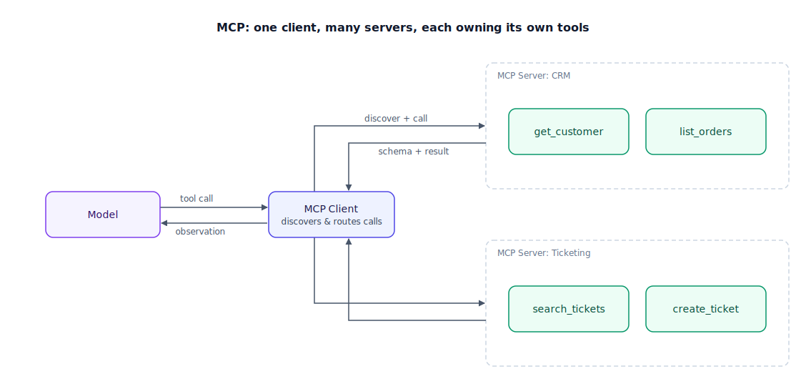

## The 30-second version

Tool use is the mechanism that lets a model act instead of only talk. The model is shown a schema describing each available tool, it emits a structured call naming one tool and its arguments, the system actually executes that call, and the result comes back as an observation the model reasons over next. The Model Context Protocol (MCP) — released by Anthropic in November 2024 and adopted widely since — standardizes the wiring underneath that mechanism: instead of every application writing a bespoke integration for every tool provider, an MCP client (the agent's runtime) talks to any MCP server (a separate process exposing tools, data, and prompt templates over a shared JSON-RPC-based protocol) the same way, regardless of which model or framework is on the other end. What the protocol does *not* solve is judgment: whether an agent picks the right tool and fills in the right arguments depends almost entirely on how well each tool is described. A vague description is the single most common reason a capable model calls the wrong tool, or the right tool with the wrong arguments.

## The analogy

Picture a hotel concierge desk, and the laminated card of services sitting on it.

A guest doesn't know how to book a car to the airport or arrange dry cleaning — no phone numbers, no standing relationships with local vendors. So they describe what they want to the concierge, who consults a card listing every service the hotel offers: what it does, how to request it, and — critically — what it doesn't cover. "Car service: local trips under 5 miles, 7 a.m. to 11 p.m., does not go to the airport; use Airport Shuttle for that." The guest picks the matching entry, states the request in the shape the card expects, the concierge places the actual call, and relays back exactly what came back — "car confirmed for 6:15, blue sedan" — which the guest then acts on.

For years, every hotel did this differently: one had a phone list, another trained bellhops to relay requests by hand signal, a third had guests wander the lobby hoping someone knew the right extension. A guest who'd stayed at one hotel had to relearn the system at the next. What changed the picture was a shared standard: one card format, adopted chain-wide, so any concierge at any property could work with it immediately. That's the shift MCP represents for tool integration: not a smarter concierge, just an agreed shape for the card and the phone call, so the same tool plugs into any agent without a bespoke integration each time.

The card's wording is where things actually go wrong or right. An entry that just says "Car service" tells the guest nothing about its range — request an airport run, the driver arrives, discovers it's outside the service area, the trip is wasted. An entry that spells out the boundary and points to the right alternative prevents that failure before it happens. The concierge system was never the weak link; an underspecified card always was.

| Hotel concierge | Tool-use / MCP element |
|---|---|
| The guest, who can't place calls to vendors directly | The model, which can't touch the outside world unassisted |
| The laminated card listing each service, its scope, its limits | The tool's schema and description, advertised to the model |
| The guest stating a request in the card's required format | The model's structured tool call (name + arguments) |
| The concierge actually placing the call | Tool execution — the runtime invoking the real function |
| "Car confirmed for 6:15, blue sedan" relayed back | The observation returned to the model |
| Every hotel having its own ad hoc phone list, hand signals, or wandering | The pre-MCP landscape of bespoke, incompatible tool integrations |
| One card format adopted chain-wide, usable at any property | MCP — one client-server protocol any tool provider can implement |
| A card entry that just says "Car service," no scope | An underspecified tool description |
| Requesting an airport run from a service that only covers 5 miles | A bad tool call caused by a bad tool description — the main failure surface |
| A card entry naming the service's limits and pointing to the right alternative | A well-written tool description that heads off misuse |

## How it actually works

Tool use itself is a three-step cycle, regardless of protocol. **Schema presentation**: the model is shown a description of each tool it could call — a name, typed arguments, a description of what it does. **Intent and extraction**: the model emits a structured call instead of prose. **Execution and contextualization**: something outside the model actually runs the call, and the real result is fed back as the next observation, not the model's guess about what the result probably was.

MCP standardizes the layer that feeds step one and carries out step three. Follow the diagram: the agent's **MCP client** — code inside the agent's runtime — talks to one or more **MCP servers**, each a standalone process owning a set of tools (and optionally data and prompt templates) over JSON-RPC, either local `stdio` or HTTP for a remote server. Communication happens in two phases. First, discovery: the client calls `list_tools` and gets back the schemas that server currently exposes — only the tools relevant to the current sub-goal get attached, keeping the prompt lean as connected servers grow. Second, invocation: the client routes the model's call to the correct server, that server executes the real logic, and the result comes back as an observation.

The architectural payoff is the separation itself. Because each MCP server is its own process, a CRM integration, a ticketing integration, and a wiki-search integration can be built, scaled, and secured independently of the orchestrator and of each other — a compromised or malformed call against one server doesn't automatically reach the others. That's the concierge analogy's biggest structural change: not a smarter guest, just a common card format any hotel can plug into the same way.

## A concrete example

A support agent is wired to three MCP servers: CRM (6 tools), ticketing (4 tools), wiki-search (2 tools) — 12 tools, roughly 150 tokens per schema, about 1,800 tokens of schema text total.

**Without discovery-based filtering:** every request hardcodes all 12 schemas regardless of relevance. At 50,000 requests a day, that's 90 million tokens a day spent on schemas the model never calls, since most requests only need two or three tools.

**With MCP-style discovery:** the client attaches only the 2–3 tools relevant to the current sub-goal, cutting schema overhead to roughly 300–450 tokens per request — an 80% reduction, with no change to what's actually available when needed.

Separately, the team tested how much the *wording* of one description mattered. `search_tickets` originally read: "Searches tickets." Run against 50 queries that should have used `search_archive` instead (tickets resolved over 90 days ago), the agent misused `search_tickets` — calling it, getting an empty result, then guessing — on 12 of 50, a 24% misuse rate. The team rewrote it: "Searches active tickets by email or ID; returns at most 20 results; does not include tickets resolved over 90 days ago — use search_archive for those." Re-run, misuse dropped to 2 of 50 — 4%. The protocol never changed. The sentence describing the boundary did.

## The tradeoffs that matter

| Approach | Portability | Effort to integrate | Security boundary | Best for |
|---|---|---|---|---|
| Bespoke per-model function calling | Low — tied to one model's API shape | Low for one integration, repeats for every provider | Whatever the app code happens to enforce | A single quick prototype, one model, no reuse |
| MCP (client-server, standard schema) | High — any MCP-aware client can use any server | Moderate — write or point to a server once | Clean — tool logic runs in its own process, containerizable | Tools reused across multiple agents, or owned by a different team |
| Hardcoding every tool's full schema into every prompt | N/A — orthogonal to protocol choice | Simplest for a handful of tools | Unaffected | Small, stable toolsets that will never grow past a few tools |

The dimension that matters more than protocol choice: description quality. A terse description is fast to write and reliably ambiguous — it says what a tool does but not its limits, not when to reach for something else instead. A precise one costs more upfront but is what actually determines whether the model routes correctly. MCP standardizes *how* a schema reaches the model; it says nothing about whether that schema is good enough to act on.

## Where people go wrong

1. **Treating MCP as a reliability upgrade.** It standardizes transport and discovery, not judgment. A badly described tool behind an MCP server fails exactly the way a badly described bespoke function does.
2. **Writing descriptions that say what a tool does but not its boundaries.** Omitting scope, rate limits, and data recency is the single biggest cause of a model calling the wrong tool or the right tool with the wrong assumptions — as the `search_tickets` example shows, this alone can be the difference between a 24% and a 4% misuse rate.
3. **Hardcoding every schema into every prompt regardless of relevance.** Beyond a handful of tools, this bloats the prompt and gives the model more chances to pick wrong; dynamic discovery scoped to the current sub-goal is what keeps routing accurate as a toolset grows.
4. **Running tool execution in the same trust boundary as the model orchestrator.** If a malformed or adversarial argument can reach more than the one tool it targeted, the blast radius of a bad call is the whole system instead of one sandboxed process.
5. **Trusting a model's structured tool call as already-safe input.** A syntactically valid call can still carry an unsafe argument; validate before executing, the same way you'd validate any external input.

## The interview lens

Interviewers use this topic to see whether you understand that a protocol is plumbing, not judgment — and whether you'd think to fix a tool's description before reaching for a bigger model.

A strong sound bite: *"MCP standardizes how a tool gets discovered and called, so I don't rebuild the same integration for every model or framework — but it doesn't make an agent choose the right tool. That comes down to the description: does it say what the tool doesn't cover and where to go instead? I've seen a one-sentence fix to a tool's boundary cut misrouted calls by 6x, with zero change to the model or the protocol."*

Likely follow-ups:

- How would you debug an agent that keeps calling the wrong tool out of a set of ten?
- What's the security argument for running tool logic in a separate process instead of inline with the model orchestrator?
- How do you decide which tools to attach to a given request when an agent has access to dozens across multiple servers?

## Go deeper

- [Agent Fundamentals](./agent-fundamentals.mdx) — where "act" sits in the larger observe-think-act loop this mechanism implements.
- [Reasoning Loops: ReAct and Beyond](./reasoning-loops-react-and-beyond.mdx) — how a tool call fits into the thought-action-observation cycle.
- [Agentic Security and Sandboxing](./agentic-security-and-sandboxing.mdx) — the trust-boundary argument for running tools in their own process.
- [Agentic RAG](../retrieval/agentic-rag.mdx) — a model deciding when and what to retrieve is the same tool-selection problem applied specifically to search.
- Upstream reference: [Tool Use and MCP — AI System Design Guide](https://github.com/ombharatiya/ai-system-design-guide/blob/main/07-agentic-systems/03-tool-use-and-mcp.md) (MIT; see [CREDITS](../../../CREDITS.md)).
