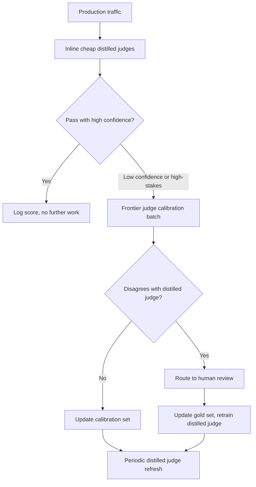

## The 30-second version

Evaluating LLM systems is fundamentally different from traditional ML. This chapter covers metrics, methodologies, and practical approaches for measuring quality in production. It is about evaluating *your* system; for how to read public model benchmarks like MMLU, SWE-bench, and Arena Elo, see [Benchmarks and Leaderboards](03-benchmarks-and-leaderboards.md).

## How it actually works

Evaluating LLM systems is fundamentally different from traditional ML. This chapter covers metrics, methodologies, and practical approaches for measuring quality in production. It is about evaluating *your* system; for how to read public model benchmarks like MMLU, SWE-bench, and Arena Elo, see [Benchmarks and Leaderboards](03-benchmarks-and-leaderboards.md).


## Why LLM Evaluation Is Hard

### The Fundamental Challenge

Traditional ML has clear metrics (accuracy, F1, AUC). LLM outputs are open-ended text where "correct" is subjective.

| Traditional ML | LLM Systems |
|----------------|-------------|
| Single correct answer | Many valid responses |
| Objective metrics | Subjective quality |
| Easy to automate | Requires judgment |
| Static test sets | Need diverse scenarios |

### Multiple Dimensions of Quality

A response can be:
- Correct but poorly written
- Well-written but incomplete
- Complete but not relevant
- Relevant but unsafe

You need to measure multiple dimensions independently.

## Evaluation Dimensions

### Core Dimensions

| Dimension | What It Measures | How to Evaluate |
|-----------|------------------|-----------------|
| **Correctness** | Factually accurate? | Ground truth, LLM judge |
| **Relevance** | Answers the question? | LLM judge, human |
| **Completeness** | All aspects covered? | Checklist, LLM judge |
| **Coherence** | Well-structured, logical? | LLM judge, human |
| **Conciseness** | Appropriately brief? | Token count, LLM judge |
| **Safety** | No harmful content? | Classifiers, LLM judge |
| **Helpfulness** | Actually useful? | Human feedback |

### Task-Specific Dimensions

**For RAG:**
- Faithfulness: Grounded in retrieved context?
- Attribution: Proper citations?
- No hallucination: Nothing made up?

**For Code Generation:**
- Executability: Does it run?
- Correctness: Passes tests?
- Style: Follows conventions?

**For Summarization:**
- Coverage: Key points included?
- Factual consistency: No introduced errors?
- Compression: Appropriate length reduction?

## Automated Evaluation Methods

### Exact Match

Simplest approach, rarely sufficient alone:

```python
def exact_match(prediction: str, reference: str) -> float:
    return float(prediction.strip().lower() == reference.strip().lower())
```

**Use for:** Multiple choice, classification, entity extraction

### Contains Keywords

```python
def keyword_match(prediction: str, required_keywords: list[str]) -> float:
    prediction_lower = prediction.lower()
    matches = sum(1 for kw in required_keywords if kw.lower() in prediction_lower)
    return matches / len(required_keywords)
```

**Use for:** Checking specific facts are mentioned

### Semantic Similarity

```python
def semantic_similarity(prediction: str, reference: str) -> float:
    pred_embedding = embed(prediction)
    ref_embedding = embed(reference)
    return cosine_similarity(pred_embedding, ref_embedding)
```

**Use for:** Paraphrase detection, general similarity
**Limitation:** High similarity does not mean correct

### ROUGE (Summarization)

Measures n-gram overlap:

```python
from rouge_score import rouge_scorer

scorer = rouge_scorer.RougeScorer(['rouge1', 'rouge2', 'rougeL'])

def evaluate_summary(prediction: str, reference: str) -> dict:
    scores = scorer.score(reference, prediction)
    return {
        "rouge1": scores["rouge1"].fmeasure,
        "rouge2": scores["rouge2"].fmeasure,
        "rougeL": scores["rougeL"].fmeasure
    }
```

**Limitation:** Measures overlap, not quality

### Code Execution

For code generation, execution is ground truth:

```python
def evaluate_code(prediction: str, test_cases: list[dict]) -> dict:
    try:
        exec(prediction, globals())
    except SyntaxError as e:
        return {"syntax_valid": False, "error": str(e)}
    
    passed = 0
    for test in test_cases:
        try:
            result = eval(test["call"])
            if result == test["expected"]:
                passed += 1
        except Exception:
            pass
    
    return {
        "syntax_valid": True,
        "tests_passed": passed,
        "tests_total": len(test_cases),
        "pass_rate": passed / len(test_cases)
    }
```

## LLM-as-Judge

Use an LLM to evaluate another LLM's outputs.

### Basic Judge Prompt

```python
JUDGE_PROMPT = """
Evaluate the following response to the user's question.

Question: {question}
Response: {response}
Reference Answer (if available): {reference}

Rate the response on these criteria (1-5 scale):

1. Correctness: Is the information accurate?
2. Relevance: Does it address the question?
3. Completeness: Are all aspects covered?
4. Clarity: Is it well-written and clear?

For each criterion, provide:
- Score (1-5)
- Brief justification

Output as JSON:
{
    "correctness": {"score": X, "reason": "..."},
    "relevance": {"score": X, "reason": "..."},
    "completeness": {"score": X, "reason": "..."},
    "clarity": {"score": X, "reason": "..."},
    "overall": X
}
"""

def llm_judge(question: str, response: str, reference: str = None) -> dict:
    prompt = JUDGE_PROMPT.format(
        question=question,
        response=response,
        reference=reference or "Not provided"
    )
    
    result = judge_model.generate(prompt)
    return json.loads(result)
```

### Pairwise Comparison

Compare two responses directly:

```python
PAIRWISE_PROMPT = """
Compare these two responses to the question and determine which is better.

Question: {question}

Response A:
{response_a}

Response B:
{response_b}

Which response is better? Consider:
- Correctness
- Helpfulness
- Clarity
- Completeness

Output your choice (A or B) and explain why.

Choice:
"""

def pairwise_judge(question: str, response_a: str, response_b: str) -> dict:
    prompt = PAIRWISE_PROMPT.format(
        question=question,
        response_a=response_a,
        response_b=response_b
    )
    
    result = judge_model.generate(prompt)
    choice = "A" if "A" in result[:10] else "B"
    
    return {"winner": choice, "explanation": result}
```

### Judge Calibration

LLM judges have biases:

| Bias | Description | Mitigation |
|------|-------------|------------|
| Position bias | Prefers first or last option | Randomize order |
| Length bias | Prefers longer responses | Instruct to ignore length |
| Self-preference | Prefers own model's outputs | Use different judge model |
| Format bias | Prefers certain formats | Diverse training examples |

```python
def calibrated_pairwise_judge(question: str, response_a: str, response_b: str) -> dict:
    # Run twice with swapped positions
    result1 = pairwise_judge(question, response_a, response_b)
    result2 = pairwise_judge(question, response_b, response_a)
    
    # Check consistency
    result2_adjusted = "A" if result2["winner"] == "B" else "B"
    
    if result1["winner"] == result2_adjusted:
        return {"winner": result1["winner"], "confidence": "high"}
    else:
        return {"winner": "tie", "confidence": "low"}
```

## Human Evaluation

### When to Use Human Evaluation

| Use Case | Automate? | Human? |
|----------|-----------|--------|
| Rapid iteration | Yes | Spot check |
| Final quality assessment | Support | Yes |
| Subjective quality | No | Yes |
| Safety evaluation | Classifier | Review |
| Edge cases | No | Yes |

### Annotation Guidelines

```markdown
# Response Quality Annotation Guide

## Task
Rate the AI response quality on a 1-5 scale.

## Scale
5 - Excellent: Fully correct, helpful, well-written
4 - Good: Mostly correct, helpful, minor issues
3 - Acceptable: Correct but could be better
2 - Poor: Significant issues, partially helpful
1 - Unacceptable: Wrong, unhelpful, or harmful

## Instructions
1. Read the user question carefully
2. Read the AI response
3. Check for factual accuracy (if verifiable)
4. Assess helpfulness for the user's goal
5. Note any issues (inaccuracies, missing info, unclear)
6. Assign a score

## Examples
[Include 3-5 annotated examples at each score level]
```

### Inter-Annotator Agreement

```python
from sklearn.metrics import cohen_kappa_score

def calculate_agreement(annotator1: list, annotator2: list) -> dict:
    kappa = cohen_kappa_score(annotator1, annotator2)
    
    exact_agreement = sum(a == b for a, b in zip(annotator1, annotator2))
    exact_pct = exact_agreement / len(annotator1)
    
    return {
        "cohens_kappa": kappa,
        "exact_agreement": exact_pct,
        "interpretation": interpret_kappa(kappa)
    }

def interpret_kappa(kappa: float) -> str:
    if kappa < 0.2: return "Poor"
    if kappa < 0.4: return "Fair"
    if kappa < 0.6: return "Moderate"
    if kappa < 0.8: return "Substantial"
    return "Almost perfect"
```

## RAG-Specific Evaluation

### RAGAS Metrics

RAGAS provides standard RAG evaluation metrics:

```python
from ragas import evaluate
from ragas.metrics import (
    faithfulness,
    answer_relevancy,
    context_precision,
    context_recall
)

def evaluate_rag(
    questions: list[str],
    contexts: list[list[str]],
    answers: list[str],
    ground_truths: list[str]
) -> dict:
    dataset = Dataset.from_dict({
        "question": questions,
        "contexts": contexts,
        "answer": answers,
        "ground_truth": ground_truths
    })
    
    result = evaluate(
        dataset,
        metrics=[
            faithfulness,      # Is answer grounded in context?
            answer_relevancy,  # Does answer address question?
            context_precision, # Are retrieved contexts relevant?
            context_recall     # Did we retrieve all needed context?
        ]
    )
    
    return result
```

### Faithfulness Evaluation

Check if response is grounded in context:

```python
FAITHFULNESS_PROMPT = """
Given the context and the response, determine if every claim in the 
response is supported by the context.

Context:
{context}

Response:
{response}

For each sentence in the response:
1. Extract the factual claims
2. Check if each claim is supported by the context
3. Mark as SUPPORTED or UNSUPPORTED

Output:
- Total claims: X
- Supported claims: Y
- Faithfulness score: Y/X
- Unsupported claims: [list]
"""

def evaluate_faithfulness(context: str, response: str) -> dict:
    prompt = FAITHFULNESS_PROMPT.format(context=context, response=response)
    result = judge_model.generate(prompt)
    return parse_faithfulness_result(result)
```

### Context Relevance

Evaluate retrieved context quality:

```python
def evaluate_context_relevance(query: str, contexts: list[str]) -> dict:
    scores = []
    
    for context in contexts:
        prompt = f"""
        Query: {query}
        Context: {context}
        
        Is this context relevant to answering the query?
        Rate from 1-5 and explain.
        """
        
        result = judge_model.generate(prompt)
        score = extract_score(result)
        scores.append(score)
    
    return {
        "individual_scores": scores,
        "mean_relevance": sum(scores) / len(scores),
        "contexts_above_threshold": sum(1 for s in scores if s >= 3)
    }
```

## Building Evaluation Pipelines

### Evaluation Dataset Structure

```python
@dataclass
class EvalSample:
    id: str
    input: str
    expected_output: str  # Optional ground truth
    context: list[str]    # For RAG
    metadata: dict        # Category, difficulty, etc.

eval_dataset = [
    EvalSample(
        id="q001",
        input="What is the capital of France?",
        expected_output="Paris",
        context=[],
        metadata={"category": "factual", "difficulty": "easy"}
    ),
    # ... more samples
]
```

### Automated Evaluation Pipeline

```python
class EvaluationPipeline:
    def __init__(
        self,
        system_under_test,
        evaluators: list[Evaluator],
        dataset: list[EvalSample]
    ):
        self.sut = system_under_test
        self.evaluators = evaluators
        self.dataset = dataset
    
    def run(self) -> EvalReport:
        results = []
        
        for sample in self.dataset:
            # Get prediction
            prediction = self.sut.generate(sample.input)
            
            # Run all evaluators
            scores = {}
            for evaluator in self.evaluators:
                score = evaluator.evaluate(
                    input=sample.input,
                    prediction=prediction,
                    reference=sample.expected_output,
                    context=sample.context
                )
                scores[evaluator.name] = score
            
            results.append({
                "id": sample.id,
                "input": sample.input,
                "prediction": prediction,
                "scores": scores,
                "metadata": sample.metadata
            })
        
        return self.compile_report(results)
    
    def compile_report(self, results: list) -> EvalReport:
        # Aggregate by category, compute statistics
        report = EvalReport()
        
        for metric in self.evaluators:
            scores = [r["scores"][metric.name] for r in results]
            report.add_metric(metric.name, {
                "mean": statistics.mean(scores),
                "std": statistics.stdev(scores),
                "min": min(scores),
                "max": max(scores)
            })
        
        # Breakdown by category
        for category in set(r["metadata"]["category"] for r in results):
            category_results = [r for r in results if r["metadata"]["category"] == category]
            report.add_breakdown(category, self.aggregate(category_results))
        
        return report
```

## Production Monitoring

### Key Metrics to Track

```python
PRODUCTION_METRICS = {
    # Quality metrics (sample-based)
    "llm_judge_score": "Mean LLM judge score on sampled responses",
    "faithfulness": "RAG faithfulness on sampled responses",
    
    # User signals
    "thumbs_up_rate": "Positive feedback / total feedback",
    "regeneration_rate": "How often users regenerate",
    "copy_rate": "How often users copy responses",
    
    # Operational
    "error_rate": "Failed generations / total",
    "latency_p50": "Median response time",
    "latency_p99": "99th percentile response time",
    "tokens_per_response": "Average output length",
    
    # Cost
    "cost_per_request": "Average cost per request",
    "daily_cost": "Total daily API spend"
}
```

### Online Evaluation

```python
class OnlineEvaluator:
    def __init__(self, sample_rate: float = 0.1):
        self.sample_rate = sample_rate
    
    def maybe_evaluate(self, request: dict, response: str) -> None:
        if random.random() > self.sample_rate:
            return
        
        # Async evaluation
        asyncio.create_task(self.evaluate_async(request, response))
    
    async def evaluate_async(self, request: dict, response: str):
        scores = await self.llm_judge(request["query"], response)
        
        # Log to monitoring system
        self.log_metrics({
            "correctness": scores["correctness"],
            "relevance": scores["relevance"],
            "timestamp": datetime.now()
        })
        
        # Alert on low scores
        if scores["overall"] < 3:
            self.alert_low_quality(request, response, scores)
```

### Drift Detection

```python
def detect_quality_drift(
    current_scores: list[float],
    baseline_scores: list[float],
    threshold: float = 0.1
) -> dict:
    current_mean = statistics.mean(current_scores)
    baseline_mean = statistics.mean(baseline_scores)
    
    drift = abs(current_mean - baseline_mean)
    is_significant = drift > threshold
    
    # Statistical test
    stat, p_value = stats.ttest_ind(current_scores, baseline_scores)
    
    return {
        "current_mean": current_mean,
        "baseline_mean": baseline_mean,
        "drift": drift,
        "is_significant": is_significant,
        "p_value": p_value
    }
```

## 2026 Eval Evolution: Beyond LLM-as-Judge

The 2023-2024 playbook ("use GPT-4 as a judge") was good enough for v1 systems but cracked under three pressures: cost at scale, agent trajectories that string-graders cannot inspect, and benchmarks that conflate retrieval, memory, and reasoning. By May 2026 the production eval stack has split into four layers that work together.

### The Layered Judge Architecture



The cost math forces this shape: serving frontier judges (Claude Opus 4.7, GPT-5, Gemini Ultra 3) on every production trace is unaffordable above ~100K req/day. Distilled judges run hot, frontier judges calibrate, humans set ground truth.

### Galileo Luna-2: Distilled Judges at Scale

[Galileo's Luna-2 family](https://www.galileo.ai/luna-2) (released February 2026) is a set of small, task-specific judge models trained on millions of frontier-judge labels plus human annotations. Galileo's published numbers:

| Metric | Luna-2 vs Frontier Judge |
|--------|--------------------------|
| Cost per evaluation | ~97% lower |
| Latency P50 | ~10x lower (sub-100ms for short responses) |
| Agreement with frontier judge | 88-92% across published benchmarks |
| Agreement with human gold labels | Within 2-3 points of the frontier judge |

The catch is the **shape** of the disagreement. Luna-2 is trained on a fixed taxonomy of failure modes (groundedness, instruction-following, toxicity, PII, off-topic, refusal). Anything outside that taxonomy regresses to a default score. So the pattern that holds up in production is:

- **Use Luna-2 (or a Luna-equivalent) inline** on every trace for the taxonomy it covers.
- **Use the frontier judge** on a sampled 1-5% of traces to detect drift between the distilled judge and the larger model.
- **Fall back to frontier** automatically when the distilled judge returns low confidence (Luna-2 emits a confidence score, not just a label).
- **Never trust the distilled judge alone for novel failure modes** that were not in its training distribution: a freshly-released attack vector, a new category of user intent, or a domain-specific factuality check.

Galileo's [public technical report](https://www.galileo.ai/research/luna-2) walks through the distillation recipe and where Luna-2 still under-performs frontier judges (long-horizon multi-step reasoning, low-resource languages).

Other shipped distilled judges to compare against:

- [Patronus AI Lynx](https://www.patronus.ai/lynx) for groundedness, similar cost profile.
- [Vectara HHEM-2](https://www.vectara.com/blog/hhem) for hallucination detection.
- [Arize Phoenix Evals](https://arize.com/docs/phoenix/) which ships open distilled judges plus calibration harness.

### Sierra tau2-bench and Variants

[Sierra's tau-bench](https://github.com/sierra-research/tau-bench) (2024) was the first realistic agent benchmark that measured tool-use success in a simulated business environment. The 2026 successors generalize that idea.

[tau2-bench](https://github.com/sierra-research/tau-bench) (released Q1 2026) is a major update:

- **More domains**: retail, airline, financial, healthcare, telecom.
- **Pass^k metric**: measures the probability that the agent succeeds on **all** k repeated trials of the same task. Pass^1 is the traditional success rate. Pass^4 is what tells you whether the agent is reliable.
- **Verifier-based grading**: deterministic post-conditions (the order is canceled, the refund exists, the seat is changed) rather than LLM-graded transcript scoring.

Sister benchmarks:

- **[tau-Voice](https://sierra.ai/blog/tau-voice)**: speech-to-speech variant where the agent operates over voice channels. Catches a class of failures (timing, interruption handling, recovery from ASR errors) that text-only benchmarks miss entirely.
- **[tau-Knowledge](https://sierra.ai/blog/tau-knowledge)**: extends the simulation with an internal knowledge base the agent must retrieve from. Decouples "does the agent retrieve" from "does the agent act."

In practice, the pass^k metric is the most actionable. A Pass^1 of 70% and a Pass^4 of 12% says "the agent works on the easy path but cannot recover from any small perturbation." That is exactly the signal production teams need before rolling out an agent at scale.

### Agent-as-Judge: Trajectory Grading

LLM-as-judge scored the final answer. Agent-as-judge scores the **trajectory**: the sequence of tool calls, intermediate states, retries, and reasoning steps the agent went through.

This is necessary because long-horizon agents fail in ways the final answer cannot reveal:

- **Right answer, wrong reasoning**: the agent guessed the right number after a botched calculation.
- **Right answer, dangerous path**: the agent tried four destructive tool calls before a fifth (safe) one happened to succeed.
- **Right answer, runaway cost**: the agent made 47 retrieval calls when 2 would have sufficed.

The pattern in production:

- **Process Reward Models (PRMs)** score each step in the trajectory independently. PRMs were originally trained for math (OpenAI's [Let's Verify Step by Step](https://arxiv.org/abs/2305.20050)) and have generalized: by 2026 there are PRMs for code, tool-use trajectories, and multi-turn dialogue.
- **An auxiliary "auditor" agent** (often a different model from the one being graded) replays the trajectory, asks "was this step justified?" at each node, and emits a graded transcript. This is what the [DeepMind agent-as-judge paper](https://arxiv.org/abs/2410.10934) (Oct 2024, refined through 2026) formalized.
- **Trajectory failure modes** that show up in this kind of grading:
  - **Reasoning-action mismatch**: the agent's chain-of-thought says one thing, the tool call does another.
  - **Over-retrieval**: more retrieval calls than needed.
  - **Tool flailing**: trying the same tool with slight variations until something works.
  - **Premature commitment**: writing the answer before all evidence is in.
  - **Self-jailbreaking**: the agent's own intermediate reasoning bypasses its own safety policy.

The [Anthropic Constitutional Classifiers paper](https://www.anthropic.com/research/constitutional-classifiers) (Jan 2025) and follow-up work shows that judging trajectories with a constitutional classifier catches a meaningful fraction of safety failures that final-answer grading misses entirely.

### HaluMem: Operation-Level Hallucination Benchmark

[HaluMem](https://arxiv.org/abs/2511.03506) (November 2025) is the first benchmark to break hallucination evaluation into the **operations** that produce or use memory, not just the final answer:

| Stage | What Is Measured | Typical Failure |
|-------|------------------|-----------------|
| Extraction | The fact written to memory matches the source | The agent stored "user is allergic to peanuts" when the source said "user dislikes peanuts" |
| Update | A memory update is correct relative to prior state | A new memory contradicts an older memory without resolution |
| QA | The answer is grounded in stored memories | The agent answers from parametric knowledge while pretending to cite memory |

The big insight from the HaluMem paper: a system can hit very high QA accuracy on standard hallucination benchmarks while making catastrophic extraction errors. Aggregate metrics hide the stage where the error originates, which is the only stage you can actually fix.

The practical recipe:

- Instrument the memory layer with **per-operation evals**: every write, update, and read has a separate eval.
- Use a distilled judge (Luna-2 or similar) per operation type.
- Track each stage's error rate over time; a 5% extraction error compounds over thousands of operations into a wholly unreliable agent.

### A Production Eval Stack in May 2026

A defensible stack for a customer-facing agent product looks roughly like:

```mermaid
flowchart LR
    A[User turn] --> B[Agent runs]
    B --> C[Trajectory logged]
    C --> D[Distilled judges run inline on each tool call and the final answer]
    D --> E[Per-step PRM trajectory score]
    E --> F[Auditor agent on 1-5 percent sample]
    F --> G[Frontier judge on flagged or high-stakes traces]
    G --> H[Human review on disagreements]
    H --> I[Gold set update]
    I --> J[Distilled judge retraining quarterly]
```



This is not free, but it is dramatically cheaper than running a frontier judge on every trace, and it catches failure classes (process errors, memory errors, trajectory errors) that pure final-answer grading cannot see.

### Take-Aways for Interviews

- "LLM-as-judge" is now the worst-case fallback, not the default.
- The serious teams stack **distilled judges inline + frontier judges for calibration + human review for ground truth**.
- For agents, **judge the trajectory, not just the answer**. Pass^k, PRMs, and agent-auditors are how.
- For memory-equipped systems, **measure extraction, update, and QA separately**; aggregate accuracy hides the failure site.


## References

- Es et al. "RAGAS: Automated Evaluation of Retrieval Augmented Generation" (2023)
- Zheng et al. "Judging LLM-as-a-Judge with MT-Bench and Chatbot Arena" (2023)
- RAGAS: https://docs.ragas.io/
- OpenAI Evals: https://github.com/openai/evals

*Next: [Observability](02-observability.md)*

## The interview lens

### Q: How would you evaluate a RAG system?

**Strong answer:**
I would evaluate at multiple levels:

**1. Retrieval quality:**
- Precision@K: Are retrieved docs relevant?
- Recall@K: Did we find all relevant docs?
- MRR: Is the best doc ranked highly?

**2. Generation quality:**
- Faithfulness: Is response grounded in context?
- Relevance: Does it answer the question?
- Completeness: All aspects addressed?

**3. End-to-end:**
- Answer correctness vs ground truth
- User satisfaction (thumbs up/down)

**Tools:**
- RAGAS for automated metrics
- LLM-as-judge for subjective quality
- Human evaluation for gold standard

**Process:**
1. Create evaluation dataset (100+ examples)
2. Run automated metrics on every change
3. LLM judge for deeper analysis
4. Human review for final validation
5. Monitor in production continuously

### Q: What are the limitations of LLM-as-judge?

**Strong answer:**
Several known biases and limitations:

**Biases:**
- Position bias: Prefers first option in comparisons
- Length bias: Prefers longer responses
- Self-preference: May prefer own model's style
- Format bias: Influenced by formatting

**Mitigations:**
- Swap positions and check consistency
- Use different model as judge
- Calibrate with human annotations
- Multiple judge prompts

**When unreliable:**
- Highly domain-specific content
- Subtle factual errors
- Cultural/contextual nuances
- Safety edge cases

**Best practice:**
- Use for rapid iteration
- Calibrate against human judgments
- Do not rely solely on LLM judges
- Human review for high-stakes decisions

## Go deeper

- [Upstream chapter (LLM Evaluation)](https://github.com/ombharatiya/ai-system-design-guide/blob/main/14-evaluation-and-observability/01-llm-evaluation.md)
- Related questions in the [question bank](/questions)
- Practice with [SPIDER walkthrough](/practice) or [mock interview](/mock)
