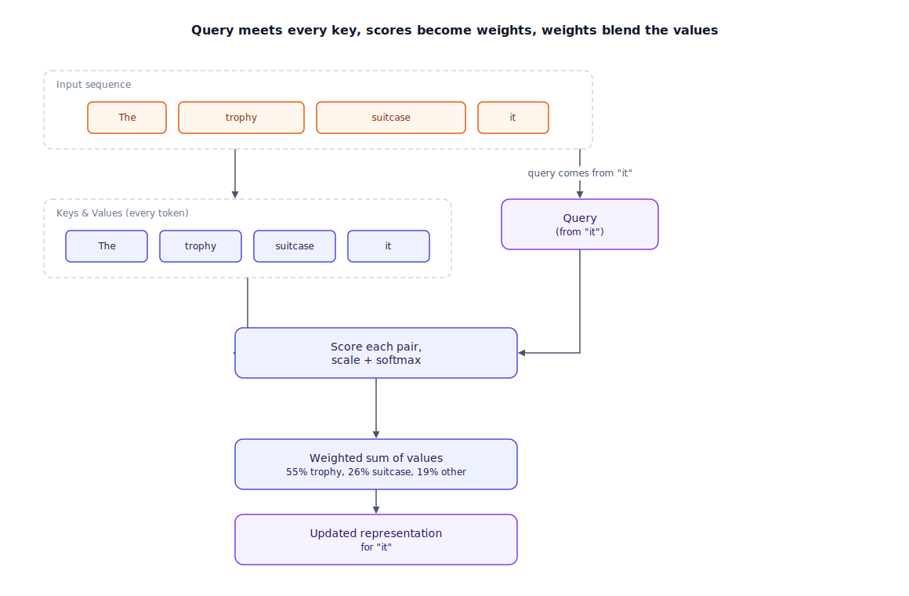

## The 30-second version

Attention lets every token look directly at every other token in the sequence and decide, on the spot, how much each one matters right now — regardless of how far apart they sit. Mechanically, each token produces a **query** (what it's trying to find), and every token, including itself, offers a **key** (what it advertises having) and a **value** (the actual content it hands over if picked). The query gets compared against every key to produce relevance scores, those scores are normalized so they sum to one, and the token's updated representation becomes a weighted blend of every value in the sequence, weighted by that relevance. Nothing about this computation cares whether the relevant token was one position back or four thousand positions back — a recurrent network has to relay information step by step and loses fidelity the further it travels; attention reaches any position in a single hop. That's the entire reason attention displaced recurrence: it gives a model direct, undiminished access to the whole sequence at once, at the cost of a computation that grows quadratically with sequence length.

## The analogy

Picture a live auction where every item up for bid is, simultaneously, a bidder for every other item in the room.

Each item steps up and announces what it's trying to acquire — "I need something that clarifies who 'it' refers to earlier in this sentence." That announcement is the query. Every item in the room, including itself, is holding up a card describing what it has on offer — "I'm 'the animal'; I offer information about a physical subject something later could refer back to." That's the key. The auctioneer doesn't just hand the item to one winning bidder. Instead, the query gets scored against every key in the room — how well does this offer match what's being sought — those scores get converted into bid shares that add up to exactly 100%, and the item receives a blend: a little content from every bidder, in proportion to how strong its match was. The actual content each bidder hands over, once its share is set, is the value — not the announcement of what it offers, but the substance behind it.

Crucially, there's no seating chart. An item at the back of the hall and an item one seat away get evaluated identically — physical distance doesn't discount a bid. Compare that to a bucket-brigade auction, where an offer has to be relayed person to person down a long line before it reaches the front, getting a little more garbled at each handoff — that's what a recurrent network does with distant context, passing it through a chain of hidden states that degrade over distance. This auction's open floor means every item hears every other item's offer with equal clarity, whether it's one seat away or across the entire hall.

| Auction floor | Attention element |
|---|---|
| An item announcing what it's trying to find | Query (Q) |
| Every item's card describing what it offers | Key (K) |
| The actual content handed over once selected | Value (V) |
| Scoring every key against the query | The similarity score between Q and each K |
| Converting scores into bid shares that sum to 100% | Softmax normalization over the scores |
| Handing over a blend from every bidder, weighted by bid share | The weighted sum of all values |
| No seating chart — every bid heard with equal clarity regardless of distance | Attention's constant-cost access to any position, near or far |
| A bucket-brigade auction relaying an offer person to person, losing fidelity each hop | A recurrent network passing context step by step through a decaying hidden state |

## How it actually works

Follow the diagram left to right. Every token in the sequence is projected into three separate vectors — a query, a key, and a value — using three separate learned weight matrices. For one token's query, the diagram shows it compared against every token's key via a similarity score (a dot product); scores get divided by the square root of the key dimension before going any further, a scaling step that exists purely for numerical stability — without it, scores can grow large enough that the next step saturates and gradients stop flowing usefully. Those scaled scores pass through softmax, which turns them into weights that are all positive and sum to exactly one — this is the "bid shares" step. The token's new representation is then the weighted sum of every token's value vector, using those weights. Every other token in the sequence runs this same process in parallel, each with its own query, so the whole layer produces an updated representation for every position at once, not one at a time.

Real transformers don't run this once — they run it several times in parallel, called **multi-head attention**. Each head has its own learned Q, K, and V projections, so different heads can specialize: one might end up tracking nearby word order, another coreference (matching "it" back to what it refers to), another something more syntactic. The heads' outputs get concatenated and passed through one more learned projection to produce the layer's final output. During generation, a **causal mask** blocks each position from attending to anything after it — a token being generated can only see itself and what came before, which is what makes autoregressive generation valid: the model can't peek at the answer while producing it.

**Self-attention** is what's described above: queries, keys, and values all come from the same sequence, which is what every layer in a decoder-only model (GPT-style, Claude, Llama) uses throughout. **Cross-attention** is the variant used in encoder-decoder architectures like translation models: the queries come from the sequence being generated, but the keys and values come from a separate sequence — the encoder's representation of the source text — so the output being produced can look back at the original input at every step, not just at what it's generated so far.

## A concrete example

Take the sentence "The trophy didn't fit in the suitcase because it was too big," and focus on how the token "it" gets its updated representation. Say the model uses a key dimension of 64 per head. "It"'s query gets scored against the keys for every other token in the sentence — including "trophy" and "suitcase," the two candidates "it" could plausibly refer to. Suppose the raw dot products come out as 9.2 for "trophy," 3.1 for "suitcase," and mostly small values elsewhere; dividing by the square root of 64 (which is 8) brings those down to about 1.15 and 0.39. Softmax over the full set of scaled scores turns that gap into a decisive weighting — roughly 71% of the output blend pulled from "trophy"'s value vector, about 9% from "suitcase," and the remaining 20% spread thinly across the rest of the sentence. "It"'s new representation is that weighted blend — mostly "trophy," a little "suitcase," a trace of everything else — which is exactly the disambiguation the sentence requires.

Now scale to sequence length. A 2,000-token input means one query gets scored against 2,000 keys, so a single attention layer computes roughly 2,000 × 2,000 = 4,000,000 pairwise scores per head. With 32 heads, that's about 128 million scores in that one layer; across 32 stacked layers, roughly 4.1 billion pairwise score computations for one forward pass over that input. Double the sequence length to 4,000 tokens and that number doesn't double — it quadruples, to roughly 16.4 billion — which is precisely why context length is one of the most expensive dials to turn in a transformer.

## The tradeoffs that matter

| Design choice | What you gain | What it costs |
|---|---|---|
| More attention heads | Different heads specialize in different relationships (position, coreference, syntax) | More compute and memory per layer; benefit flattens well before head count keeps climbing |
| Full (dense) attention over the whole sequence | Every token can relate to every other token directly, no matter the distance | Quadratic compute and memory in sequence length — the cost driving most long-context engineering |
| Causal masking (decoder-only) | Enables valid autoregressive generation — no peeking at future tokens | Each position only sees the past; it can't use information that appears later in the same pass |
| Cross-attention to a separate encoder sequence | The output can directly reference the full source at every generation step | An extra set of K/V projections and a second sequence to keep synchronized — architecture only decoder-only models skip |

Sequence length is the tradeoff to lead with in an interview: because scoring is pairwise, doubling context roughly quadruples the raw attention compute, which is why serving long-context requests is a fundamentally different engineering problem than serving short ones, not just "the same thing with a bigger number."

## Where people go wrong

1. **Treating attention weights as a reliable explanation of model behavior.** A high weight from "it" to "trophy" is suggestive, not proof of the causal reasoning path the model actually used — attention weights are one signal among many, not a transparent readout of "why."
2. **Assuming attention has any built-in sense of order.** The Q/K/V computation itself is position-blind — every token looks at every other token the same way regardless of order. Position has to be injected separately (see [Transformer Architecture](./transformer-architecture.mdx)); without it, attention alone can't tell "dog bites man" from "man bites dog."
3. **Confusing self-attention with cross-attention.** A decoder-only model processing a long prompt is still doing self-attention throughout — there's no separate encoder sequence involved unless the architecture explicitly has one.
4. **Believing more heads is strictly better.** Head count is a tuned hyperparameter with diminishing and sometimes redundant returns past a certain point, not a dial that only helps as you turn it up.
5. **Forgetting the causal mask exists.** Assuming a token being generated can "see" tokens generated after it leads to badly wrong mental models of how generation actually unfolds one token at a time.

## The interview lens

Interviewers use this topic to check whether you can explain the actual computation — not just say "attention lets the model focus on relevant words" — and whether you understand why it scales the way it does.

A strong sound bite: *"Attention's real advantage isn't that it 'pays attention' — it's that every token reaches every other token in one hop, at a fixed cost regardless of distance, instead of relaying context through a chain that degrades. The price for that is a compute cost that's quadratic in sequence length, which is the actual reason long-context serving is a different engineering problem, not a bigger version of the same one."*

Likely follow-ups:

- Walk me through what changes in the computation when you switch from self-attention to cross-attention.
- Why does the causal mask matter for training, not just for generation?
- If doubling context quadruples attention compute, what architectural choices reduce that cost without abandoning attention entirely?

## Go deeper

- [Transformer Architecture](./transformer-architecture.mdx) — how attention layers stack with feedforward layers and residual connections into the full model.
- [LLM Internals](./llm-internals.mdx) — where the forward pass this chapter describes fits into training versus inference.
- [Tokenization Deep Dive](./tokenization-deep-dive.mdx) — what actually arrives as "tokens" before any of this attention computation runs.
- Upstream reference: [Attention Mechanisms — AI System Design Guide](https://github.com/ombharatiya/ai-system-design-guide/blob/main/01-foundations/03-attention-mechanisms.md) (MIT; see [CREDITS](../../../CREDITS.md)).
