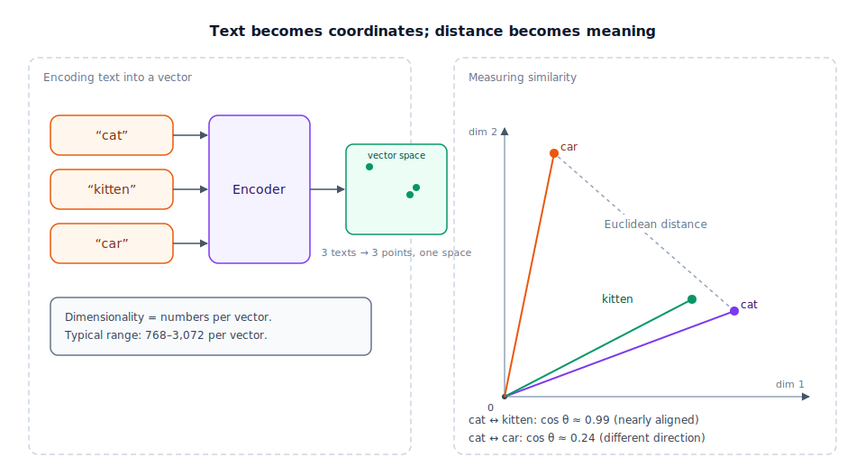

## The 30-second version

An embedding is a list of numbers — a point in space — that a model assigns to a piece of text so that meaning becomes geometry: texts with similar meaning land at points close together, and texts with different meaning land far apart. The list's length is the space's **dimensionality** (typically a few hundred to a few thousand numbers); each individual number is a coordinate along one axis, and no single axis has a human-readable label. What makes the space useful isn't any one dimension — it's the relationships between points: distance and angle. Semantic search, clustering, recommendation, and RAG (Retrieval-Augmented Generation) retrieval are, underneath, all asking the same geometric question: "which points are near this one?"

## The analogy

Picture a paint-matching machine at a hardware store. Every color it can mix is described not by a name but by three numbers: how much red, how much green, how much blue to combine. "Fire-engine red" might be (230, 20, 20); "brick red" (178, 34, 34) — different numbers, but close together, because the colors themselves are close. "Sky blue" is (135, 206, 235): none of its three numbers resemble fire-engine red's, and if you plot both colors as points in a 3D box — one axis per channel — they land on opposite sides of it.

That 3D box is the color's vector space. Each color is a single point defined by three coordinates. Distance between two points in that box says something real: physically close points look almost identical to the eye; far-apart points look like different colors entirely. You can also ask about direction, not just distance — pure red and a slightly darker red point in nearly the same direction from black, differing mostly in magnitude (brightness), while red and blue point in genuinely different directions.

Swap "paint" for "text" and "red/green/blue" for hundreds or thousands of learned axes, and you have an embedding space. A model reads "the invoice is overdue" and "the payment is late" and places them at nearby points, the same way it would place fire-engine red and brick red close together — not because a human labeled an axis "urgency" or "billing," but because the model learned, from enormous amounts of text, which passages tend to mean the same thing, and nudged their coordinates together during training. Nobody can point at dimension 47 and say what it means, exactly as nobody designed the RGB box around "warmth" — but the geometry still works, and it's learned, not designed.

| Paint-matching machine | Vector space |
|---|---|
| Red / green / blue amount | One coordinate (dimension) |
| The 3D box every color lives in | The embedding space (typically 768–3,072 dimensions) |
| A specific color, e.g. (230, 20, 20) | A specific text's embedding vector |
| Two paint chips sitting close together in the box | Two texts with similar meaning |
| Physical distance between two chips | Cosine or Euclidean distance between vectors |
| The direction a color points from black | The direction (angle) of a vector from the origin |
| No axis is labeled "warmth" — it's a learned mix | No dimension is labeled "sentiment" — it's a learned mix |

## How it actually works



Follow the diagram left to right. In the left panel, an encoder — a neural network trained specifically for this job, usually a transformer (see [Transformer Architecture](./transformer-architecture.mdx)) — reads a piece of text and outputs a fixed-length list of numbers: the vector. Feed it three different sentences and you get three points in the same space, all comparable to each other because they came from the same encoder.

The right panel is where the geometry pays off. To compare two vectors, you need a distance metric:

- **Cosine similarity** measures the angle between two vectors, ignoring their length: `cos θ = (a · b) / (|a| |b|)`. It's the default for text because two vectors pointing the same direction represent the same meaning regardless of magnitude — a short, confident sentence and a long, hedgy paraphrase of the same idea shouldn't be judged "less similar" just because one vector is longer.
- **Dot product** (`a · b`, no normalization) is cosine similarity's unscaled cousin — identical to cosine once both vectors are unit-length, which is why systems often normalize every vector once at write time and use the cheaper dot product at query time.
- **Euclidean distance** (`|a − b|`, straight-line distance between the points) cares about magnitude as well as direction. For normalized vectors it relates to cosine directly: `Euclidean² = 2 − 2·cos θ`, so a smaller angle always means a smaller straight-line distance too.

A property worth internalizing: the axes of this space encode *relationships*, not just positions. The often-cited example is vector arithmetic — the direction from "man" to "king" is roughly the same as the direction from "woman" to "queen," so `king − man + woman ≈ queen` in a well-trained space. That only works because training pushed semantically-related pairs to sit at consistent offsets from each other, not because anyone hand-designed a "royalty" axis.

This chapter stops at the geometry. What you do with that geometry at production scale — approximate nearest-neighbor indexes, Matryoshka (nested-resolution) embeddings, late-interaction models like ColBERT, re-embedding cost when you swap models — is its own chapter: [Embedding Models](../retrieval/embedding-models.mdx).

## A concrete example

Here's the geometry computed by hand, at a toy scale small enough to check yourself. Real embeddings have hundreds or thousands of dimensions; this uses three, so you can see exactly what "distance" means.

Say a (deliberately simplified) encoder produces these vectors:

- `cat`    = (0.80, 0.10, 0.20)
- `kitten` = (0.75, 0.15, 0.25)
- `car`    = (0.10, 0.90, 0.05)

Cosine similarity of `cat` and `kitten`:

```
dot = (0.80×0.75) + (0.10×0.15) + (0.20×0.25) = 0.665
|cat| = √(0.80² + 0.10² + 0.20²) = √0.69 ≈ 0.831
|kitten| = √(0.75² + 0.15² + 0.25²) = √0.6475 ≈ 0.805
cos θ = 0.665 / (0.831 × 0.805) ≈ 0.995
```

Cosine similarity of `cat` and `car`:

```
dot = (0.80×0.10) + (0.10×0.90) + (0.20×0.05) = 0.18
|car| = √(0.10² + 0.90² + 0.05²) = √0.8225 ≈ 0.907
cos θ = 0.18 / (0.831 × 0.907) ≈ 0.239
```

`cat` and `kitten` come out at **0.995** — almost pointing the same direction. `cat` and `car` come out at **0.239** — closer to perpendicular than aligned. That gap, computed from nothing but the coordinates, is the entire mechanism behind semantic search: rank every candidate by cosine similarity to the query, and the highest-scoring ones are the most related in meaning. Real production embeddings run this same arithmetic at 768–3,072 dimensions per vector and across millions of candidates, using an approximate index instead of checking every pair by hand — that indexing layer is covered in [Embedding Models](../retrieval/embedding-models.mdx).

## The tradeoffs that matter

| Choice | What it buys | What it costs |
|---|---|---|
| Higher dimensionality | More room to represent distinct shades of meaning | More storage and compute; gains diminish sharply past roughly 1,000–1,500 dims |
| Cosine similarity | Robust default; ignores magnitude noise | Loses information if magnitude is ever meaningful for your task |
| Pre-normalizing vectors | Dot product becomes equivalent to cosine — cheaper per comparison | You permanently discard raw magnitude; can't recover it later |
| Static (non-contextual) word vectors | Cheap, simple, no encoder pass at query time | One vector per word regardless of context — "bank" the river and "bank" the institution collide |
| Contextual sentence/document embeddings | Same word gets different vectors depending on context | Requires a full encoder forward pass for every new piece of text |

## Where people go wrong

1. **Treating cosine similarity and Euclidean distance as interchangeable.** They rank neighbors identically only when every vector is normalized to the same length — mix normalized and unnormalized vectors and the two metrics disagree on which point is "closest."
2. **Trying to interpret a single dimension.** Asking "what does dimension 812 mean?" is the wrong question — meaning lives in the relationship between many dimensions at once, learned jointly, not assigned one at a time.
3. **Comparing vectors from two different models directly.** Two embedding models — or two versions of one model — build geometrically unrelated spaces. A vector from one isn't comparable to a vector from another, even for the same sentence.
4. **Assuming more dimensions is always better.** Past a certain point, extra dimensions mostly add noise and cost without adding discriminating power, and can make nearest-neighbor search less reliable as points spread out.
5. **Forgetting the space reflects its training data.** A general-purpose model's notion of "similar" comes from what it was trained on — it can miss your domain's jargon entirely, or encode biases baked into that training data.

## The interview lens

Interviewers use this topic to check whether you understand embeddings as geometry with real mathematical properties, rather than as a black-box `embed()` call that magically knows what things mean.

A strong sound bite: *"An embedding model doesn't store meaning — it builds a space where distance approximates meaning, and every downstream trick, from cosine ranking to clustering to RAG retrieval, is really just 'what's geometrically nearby,' so I always ask what metric a system uses and whether the vectors it's comparing came from the same model."*

Likely follow-ups:

- Why is cosine similarity preferred over Euclidean distance for text embeddings? (Direction, not magnitude, carries the meaning; magnitude can vary for reasons unrelated to semantics.)
- What actually goes wrong if you compare embeddings from two different model versions? (Geometrically unrelated spaces — the numbers "line up" by coincidence at best, and results are meaningless.)
- Why don't higher dimensions keep improving quality indefinitely? (Diminishing returns plus a real cost in storage, compute, and nearest-neighbor search reliability at very high dimensionality.)

## Go deeper

- [Embedding Models](../retrieval/embedding-models.mdx) — what this geometry becomes at production scale: bi-encoders, Matryoshka embeddings, ColBERT, and re-embedding cost.
- [Transformer Architecture](./transformer-architecture.mdx) — how the encoder that produces these vectors is actually built.
- [Inference Pipeline](./inference-pipeline.mdx) — the analogous forward-pass mechanics for generation instead of encoding.
- Upstream reference: [Embeddings and Vector Spaces — AI System Design Guide](https://github.com/ombharatiya/ai-system-design-guide/blob/main/01-foundations/05-embeddings-and-vector-spaces.md) (MIT; see [CREDITS](../../../CREDITS.md)).
