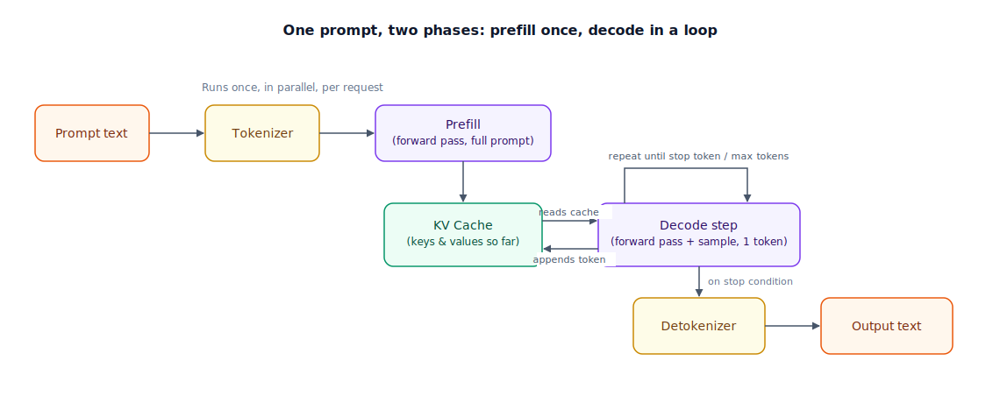

## The 30-second version

Generating text with a large language model is a loop, not a single step: tokenize the prompt into subword pieces, run a forward pass to get a probability distribution over the next token, sample one token from that distribution, append it, and repeat until a stop condition fires — then detokenize the accumulated token IDs back into text. That loop splits into two phases with very different performance profiles. **Prefill** processes your entire prompt in one parallel pass and is compute-bound. **Decode** produces output one token at a time, sequentially, and is memory-bound. Almost every production latency number you'll ever quote — time-to-first-token, tokens-per-second — traces back to which of these two phases it's actually measuring.

## The analogy

Picture someone assigned to turn a two-hour meeting recording into a clean set of typed minutes.

Before typing a single word, they listen through (or read a transcript of) the entire recording once, start to finish. This first pass happens in one sweep — they aren't writing yet, just building a complete picture of what was said, who committed to what, and how the pieces connect. That single, complete pass over everything that already exists is the **prefill** phase: the model reads your whole prompt at once, computing how every token relates to every other token in parallel, and comes out the other side with a cached understanding of the entire input so it never has to redo that work.

Then the actual writing starts, and the rhythm changes completely. The minute-taker writes one word of the summary, and before writing the next, they glance back — not just at the recording, but at every word of the minutes written so far — to keep the next word consistent with the sentence, the paragraph, and the meeting itself. Word two depends on word one; word fifty depends on words one through forty-nine. There's no skipping ahead: each word must finish before the next starts, and each costs a re-scan of the growing draft. That's **decode**: one token at a time, sequentially, each step paying the cost of consulting everything before it — held in the model's KV (key-value) cache, the running notebook of everything relevant so far.

Two pieces complete the picture. When several words fit equally well — "resolved" vs. "concluded" vs. "agreed" — which one lands on the page is a small judgment call, weighted toward the more natural choices but not always the single most obvious one. That's **sampling**. And before any of this starts, the raw recording had to be broken into discrete, taggable units — not full sentences, but shorthand chunks; once the draft is finished, those chunks get expanded back into normal, readable words for circulation. Those are **tokenization** and **detokenization**, the on-ramp and off-ramp around the actual thinking.

| Minute-taker's workflow | Inference pipeline |
|---|---|
| Breaking the raw recording into shorthand notation | Tokenization — text into token IDs |
| One full pass over the entire recording, before writing | Prefill — one parallel forward pass over the whole prompt |
| The notebook of everything read and written so far | KV cache — cached attention keys/values for every prior token |
| Writing one word, checking the whole draft, writing the next | Decode — one token per step, each attending to the full cache |
| Picking "resolved" over "concluded" when either fits | Sampling — choosing a token from a probability distribution |
| Expanding shorthand back into normal words for circulation | Detokenization — token IDs back into text |
| First full pass is fast in aggregate; each word is slow to commit | Prefill is compute-bound; decode is memory-bound |

## How it actually works

Follow the diagram left to right, then around the loop. The prompt is tokenized, then **prefill** runs one forward pass across every prompt token simultaneously — attention computes how each token relates to every other token in parallel, which is why it's compute-bound: the bottleneck is raw GPU throughput, and time scales with prompt length. Prefill's output populates the **KV cache**: the attention keys and values for every prompt position, saved so later steps don't recompute them.

**Decode** then runs in a loop. Each iteration does one forward pass for a single new token, attending over the entire cache built so far, samples a token, appends its key/value to the cache, and checks a stop condition (an end-of-sequence token, a max-token limit, or a configured stop string). Each step computes one new token's worth of work but must read the *entire* growing cache from GPU memory to do it, so decode is memory-bound — the bottleneck is memory bandwidth, not compute, and GPU cores sit relatively idle waiting on data. That's why batching many requests' decode steps together helps throughput so much: it keeps those idle compute cycles busy while the memory read happens anyway.

Sampling has two common knobs. **Temperature** rescales the logits before the softmax that turns them into probabilities: low temperature sharpens the distribution toward the top candidates (0 is greedy — always the highest-probability token); high temperature flattens it, giving lower-probability tokens a real chance. **Top-p (nucleus) sampling** truncates the candidate pool to the smallest set of tokens whose cumulative probability exceeds `p`, so a confident distribution considers few tokens and an uncertain one considers many. The two compose: temperature adjusts how sharply the model prefers its top guesses, and top-p then draws the line for how far down that adjusted ranking sampling is allowed to reach.

One production optimization worth knowing: **speculative decoding**. A small, fast "draft" model proposes several tokens ahead; the large "target" model verifies all of them in a single forward pass instead of one-at-a-time. When the draft guesses right — often, on predictable text — you get several tokens for close to the cost of one target-model step: a real 2–3x decode speedup without changing the output distribution.

## A concrete example

Take a 1,500-token prompt served by a 70B-parameter model on H100-class hardware, generating a 350-token response.

**Time to first token (TTFT).** TTFT = network latency + queue wait + prefill time. Say network and queueing add roughly 30 ms, and prefill over 1,500 tokens — compute-bound, highly parallel — takes on the order of 120 ms. TTFT ≈ 150 ms, comfortably under the 200 ms bar typical for a responsive interactive product.

**Decode throughput and total latency.** A 70B model on an H100 typically decodes in the 30–50 tokens/second range per request; take 40 as the mid-point. Generating 350 output tokens then takes 350 / 40 = 8.75 s. Total latency ≈ TTFT + decode time ≈ 150 ms + 8.75 s ≈ **8.9 seconds** — notice how little of that total the prefill phase contributed, even at 4x a typical prompt length. That asymmetry is normal: prefill usually dominates TTFT, decode usually dominates total latency.

**KV cache size.** The formula is `2 × layers × kv_heads × head_dim × bytes_per_value`, per token — `kv_heads` here meaning however many key/value heads the architecture actually keeps, which can be far fewer than the query-head count (see the [attention chapter](./attention-mechanisms.mdx) on grouped-query attention). Using the full 64 query heads as a worst-case, MHA-equivalent stand-in for a Llama-70B-shaped model (80 layers, 64 heads, 128-dim heads, FP16 = 2 bytes): `2 × 80 × 64 × 128 × 2 = 2.62 MB` per token. At a 4,096-token context, that's `2.62 MB × 4,096 ≈ 10.5 GB` for a *single* request — so 8 concurrent requests at that context length need roughly 84 GB just for cache, on top of the model's own weights. A real GQA deployment with 8 KV heads instead of 64 cuts that by 8x; KV cache, not weights, is still often the binding constraint on concurrency either way.

## The tradeoffs that matter

| Choice | What it buys | What it costs |
|---|---|---|
| Batching requests together | Much higher decode throughput (GPU stays busy during the memory-bound phase) | Individual requests may wait for a batch to fill, raising latency variance |
| Longer prompts | More context for the model to ground its answer in | Larger KV cache, higher prefill compute, higher TTFT and cost |
| Grouped-query attention (fewer KV heads) | Smaller KV cache, more concurrent requests fit in memory | A small quality tax versus full multi-head attention |
| Speculative decoding | 2–3x faster decode when the draft model guesses well | Extra draft-model calls wasted whenever a guess is rejected; more moving parts to operate |
| Streaming the response | Low perceived latency — user sees tokens as they're produced | More complex client and connection handling; can't post-process before showing output |

## Where people go wrong

1. **Quoting a single "latency" number without saying which one.** TTFT, tokens-per-second, and total latency move independently — a fix that helps one can be neutral or harmful to another.
2. **Assuming batching is free.** It raises throughput, but any individual request can now wait for a batch to fill before its decode step even starts.
3. **Sizing GPU memory for model weights alone.** KV cache scales with context length × batch size and routinely dwarfs the weights at long context or high concurrency — the budget has to include it explicitly.
4. **Treating temperature 0 as always the safe choice.** Greedy decoding is deterministic, but it can get stuck in repetitive loops on prompts that sampling would have escaped.
5. **Ignoring prefill cost on long prompts.** A large retrieved context (see [Embeddings and Vector Spaces](./embeddings-and-vector-spaces.mdx)) can make TTFT the dominant cost of a request even when the generated answer itself is short.

## The interview lens

Interviewers use this topic to check whether you can reason about latency as two physically different bottlenecks, rather than treating "the model is slow" as one undifferentiated problem.

A strong sound bite: *"Prefill is a parallel, compute-bound read of the whole prompt; decode is a sequential, memory-bound write of the answer — so if someone tells me latency is bad, my first question is whether it's TTFT or tokens-per-second, because the fix for one is often irrelevant to the other."*

Likely follow-ups:

- Why does batching help decode throughput more than prefill? (Decode is memory-bound with idle compute; batching fills that idle compute while the memory read happens anyway. A single long prompt already saturates compute during prefill.)
- How would you estimate GPU memory for serving a model at a given concurrency? (Weights, plus KV cache = per-token size × context length × batch size, plus roughly 5–10% for activations.)
- What does speculative decoding save, and when does it stop helping? (Target-model forward passes when the draft's guesses are accepted; it stops helping once the draft is frequently wrong, since rejected tokens are wasted work.)

## Go deeper

- [Transformer Architecture](./transformer-architecture.mdx) — the forward-pass mechanics that prefill and decode are both running.
- [Attention Mechanisms](./attention-mechanisms.mdx) — what the KV cache is actually caching, and why attention is what makes decode memory-bound.
- [Model Taxonomy](../models/model-taxonomy.mdx) — how model size and architecture (dense vs. mixture-of-experts) change this latency math.
- Upstream reference: [Inference Pipeline — AI System Design Guide](https://github.com/ombharatiya/ai-system-design-guide/blob/main/01-foundations/06-inference-pipeline.md) (MIT; see [CREDITS](../../../CREDITS.md)).
