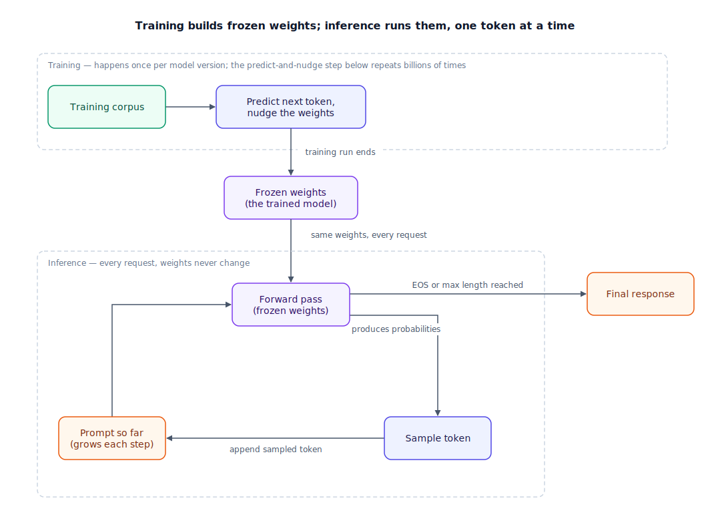

## The 30-second version

A large language model is a fixed set of numbers — its weights — arranged into a function that takes in a sequence of tokens and outputs a probability distribution over what token comes next. Training is where those numbers get set: the model reads huge amounts of text, keeps guessing the next token, and gets nudged, guess by guess, toward better predictions. Inference is everything that happens afterward: the weights are frozen, and every request — yours included — is just one forward pass through that fixed function, producing a distribution over the next token, sampling from it, and doing it again. The mechanism is simple to state and easy to underestimate: getting good at "what token comes next" across a big enough slice of human writing forces the model to build internal machinery for grammar, facts, arithmetic, and multi-step reasoning, because none of those are optional if you actually want to predict well. The interesting part isn't the objective — it's what a model has to become internally to get that objective right at scale.

## The analogy

Picture a career meteorologist forecasting tomorrow's weather.

Her actual output, every single morning, is narrow: a temperature, a precipitation chance, a wind direction — one forecast, for one day, given today's conditions. Described only by that output, you'd call the job "guessing tomorrow from today," which sounds almost trivial. It isn't. To produce that one number reliably, she has spent decades absorbing how pressure systems form, how fronts move, how ocean temperature shifts patterns months later, how a ridge over the Pacific changes what happens over the plains a week on. None of that structure was handed to her as an explicit rulebook — it built up gradually, from an enormous number of "here's today, here's what actually happened next" examples, each one adjusting her intuition slightly. That accumulated structure is settled once she's lived through enough winters and summers to be reliable; she doesn't relearn meteorology from scratch every morning. What she does every morning is apply that already-settled intuition fresh, to today's actual conditions, and produce one forecast — then, the next day, she does it again, using yesterday's actual outcome as part of today's input.

A language model works the same way, with tokens instead of weather. Predicting one next token, given everything so far, looks narrow the same way "tomorrow's forecast" looks narrow. But hitting that target reliably, across billions of different contexts during training, is what forces a model to build internal structure for syntax, for factual association, for arithmetic, for the shape of an argument — the same way accurate forecasting forces a meteorologist to build internal structure for atmospheric physics, whether or not "physics" was ever the stated goal. And exactly like the forecaster, a language model's accumulated structure — its weights — is fixed after training. Every request afterward is one fresh application of that fixed structure to new input, not a chance to relearn anything.

| Meteorologist | LLM element |
|---|---|
| Years of "today's conditions → tomorrow's actual weather" examples | Training data: text with the actual next token attached |
| Gradually adjusted intuition after each forecast miss | Gradient updates to the weights during training |
| Settled forecasting skill, not relearned each morning | Frozen weights after training completes |
| One forecast for one day, given today's conditions | One forward pass producing a probability distribution over the next token |
| Applying fixed skill to fresh conditions, tomorrow and the next day | Inference: the same frozen weights applied to every new request |
| Yesterday's actual outcome feeding into today's forecast | The previously generated token feeding back in as input for the next one |
| "Just predicting tomorrow" undersells decades of atmospheric intuition | "Just predicting the next token" undersells the structure next-token accuracy forces the model to build |

## How it actually works

Follow the diagram top to bottom. The top box is training, and it only happens once — or rather, once per model version, since a new model means a new training run. A training corpus, text gathered and filtered at enormous scale, feeds an iterative loop: the model looks at a chunk of text, predicts the next token, compares that prediction to what the token actually was, and nudges every weight slightly in the direction that would have made the correct token more likely. Repeat that step billions of times across a corpus of trillions of tokens, and the nudges accumulate into weights that encode a genuinely useful model of language — not because anyone programmed grammar or facts in directly, but because predicting well at that scale requires building something that behaves as if it knows them.

When training ends, the weights are frozen. That's the artifact that actually ships: not a program with explicit rules, but a fixed set of numbers — for a mid-size model, tens of billions of them, organized into the matrices that make up each layer of a transformer (see [Transformer Architecture](./transformer-architecture.mdx) for how those layers stack). Nothing about those numbers changes again unless someone deliberately runs a new training or fine-tuning job.

Inference is the loop at the bottom, and it's what runs every time anyone sends a prompt. The prompt gets broken into the same kind of units the model trained on (see [Tokenization Deep Dive](./tokenization-deep-dive.mdx)), and the frozen weights process that token sequence in a single forward pass — the same weights, unmodified, for every request from every user. That forward pass ends in a probability distribution over the entire vocabulary: given everything so far, how likely is each possible next token? The model samples one token from that distribution, appends it to the sequence, and runs the whole forward pass again with the now slightly longer input — one new token per pass, until it samples an end-of-sequence marker or hits a length limit. That's autoregressive generation: each output token is produced by running the entire model again on everything generated so far, including its own previous output.

## A concrete example

Take a 7-billion-parameter model and the prompt "The capital of France is". A widely used rule of thumb for inference cost is roughly 2 floating-point operations (FLOPs) per parameter per token processed, so one forward pass over this five-token prompt costs approximately 2 × 7,000,000,000 × 5 ≈ 70 billion FLOPs, producing a probability distribution over a roughly 128,000-token vocabulary. Say "Paris" comes out on top at 91% probability, "the" at 3%, and the rest spread thinly across everything else — the model samples "Paris," appends it, and reruns the now six-token forward pass to decide what comes next, maybe a period at 74% probability. Each token costs its own full forward pass; generating a 50-token answer means roughly 50 forward passes, not one.

Now compare that to what it took to get those weights in the first place. Training a 7B model on 1 trillion tokens, using the common approximation of about 6 FLOPs per parameter per training token (covering both the forward pass and the backward pass that computes the weight updates), costs roughly 6 × 7,000,000,000 × 1,000,000,000,000 ≈ 4.2 × 10²² FLOPs — on the order of 600 billion times more compute than that single five-token forward pass above. That gap is the entire point of the training/inference split: training is a massive, one-time cost spread across weeks on thousands of GPUs; inference is a comparatively tiny, repeatable cost that gets paid over and over, every time anyone sends a prompt, for as long as that model stays in production.

## The tradeoffs that matter

| Design choice | What you gain | What it costs |
|---|---|---|
| More parameters (bigger model) | Better predictions, more capacity to encode nuance | Higher $/token, more GPU memory just to hold the weights, higher latency per token |
| Frozen weights at inference | Cheap, reproducible, safe to serve to millions of users on identical hardware | No in-conversation learning — anything the model needs to "remember" must come from the context window or an external memory system, not new weights |
| Committing to one token before seeing the next | Trivial to parallelize during training; simple, well-understood objective | No lookahead — the model can start a sentence, or a line of reasoning, that a smarter plan would have avoided, and only "notice" after committing |
| Sampling from the distribution instead of always taking the top token | Variety, less repetitive output, useful for open-ended tasks | Non-determinism — the same prompt can produce different answers, which complicates testing and reproducibility |

The training/inference split shapes system design more than any other property here: because inference reuses frozen weights, the same model serves arbitrarily many users in parallel without any of them affecting each other's results — a property that would disappear entirely if the model updated its own weights mid-conversation.

## Where people go wrong

1. **Treating "next-token prediction" as proof the model isn't really reasoning.** The objective is simple to state; what it takes to hit that objective across a diverse enough corpus is not. Dismissing the mechanism because the training signal is simple confuses the target with the machinery built to hit it.
2. **Assuming the model looks facts up somewhere.** There's no database inside a language model, only weights encoding statistical association. That's exactly why a model can state a wrong fact with the same fluent confidence as a right one — the mechanism producing both is identical.
3. **Believing the model learns from your conversation.** Weights don't change during inference. Anything that looks like "the model remembered what I said five messages ago" is the context window carrying that text forward into every subsequent forward pass, not new learning.
4. **Equating parameter count with capability.** A larger model trained on worse or less data can lose to a smaller, better-trained one. Parameter count is one input to quality, not a synonym for it.
5. **Forgetting that every generated token re-runs the whole forward pass.** A 500-token response isn't one cheap operation; it's roughly 500 forward passes, which is exactly why output tokens are typically priced higher than input tokens on most APIs.

## The interview lens

Interviewers use this topic to check whether you can separate the training-time and inference-time costs of a system, and whether you understand generation as a genuine loop, not a single lookup.

A strong sound bite: *"Predicting the next token is the training objective, not a description of what the model becomes to satisfy it — I care about that distinction because it explains why the model can hallucinate fluently and reason well using the same underlying mechanism, and why every generated token, not just the first one, costs a full forward pass through frozen weights."*

Likely follow-ups:

- Why is output-token pricing usually higher than input-token pricing given both go through the same model?
- What actually changes between one model version and the next, mechanically?
- If weights are frozen at inference, how does a model appear to "learn" within a single long conversation?

## Go deeper

- [Transformer Architecture](./transformer-architecture.mdx) — the actual layer stack that turns tokens into the next-token distribution described here.
- [Tokenization Deep Dive](./tokenization-deep-dive.mdx) — how the prompt in the worked example above becomes tokens before any of this runs.
- [Attention Mechanisms](./attention-mechanisms.mdx) — the specific computation inside each forward pass that lets a token weigh relevant context.
- Upstream reference: [LLM Internals — AI System Design Guide](https://github.com/ombharatiya/ai-system-design-guide/blob/main/01-foundations/01-llm-internals.md) (MIT; see [CREDITS](../../../CREDITS.md)).
