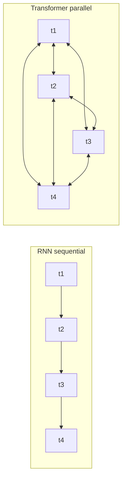
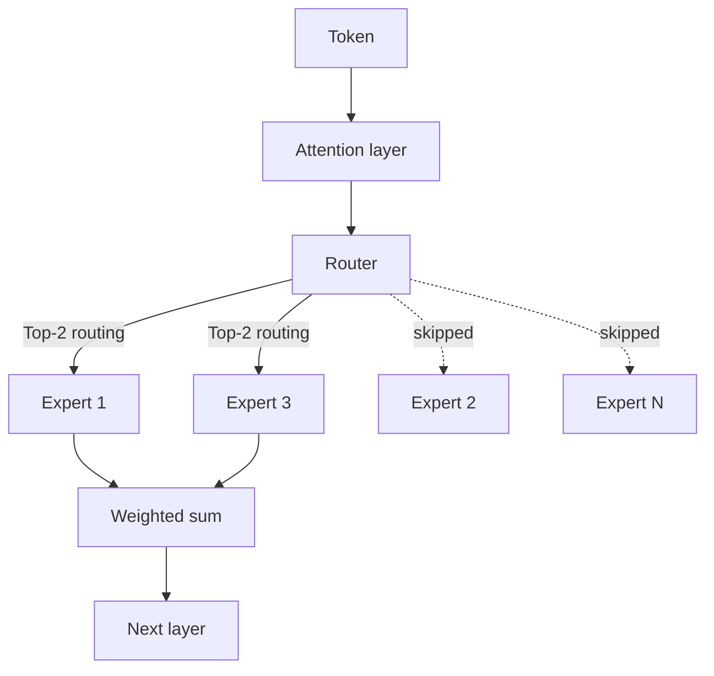

## The 30-second version

The architectural core of modern LLMs: transformers, MoE, attention math, RoPE, GQA, KV cache, and the inference-optimal scaling shift driving 2026 model design.

## How it actually works

The architectural core of modern LLMs: transformers, MoE, attention math, RoPE, GQA, KV cache, and the inference-optimal scaling shift driving 2026 model design.

This chapter covers the core concepts behind large language models. Understanding these internals is essential for making informed architectural decisions about AI systems. For practical implications of these architectural choices, see [Inference Optimization](../04-inference-optimization/) (KV cache, PagedAttention), [Model Taxonomy](../02-model-landscape/01-model-taxonomy.md) (MoE models in production), and [Glossary](../GLOSSARY.md) for definitions of MoE, RoPE, ALiBi, GQA, MLA.


## The Transformer Revolution

Before 2017, sequence modeling relied on recurrent architectures (RNNs, LSTMs) that processed tokens sequentially. This created two problems:

1. **Training was slow**: Sequential processing prevented parallelization
2. **Long-range dependencies were hard**: Information had to flow through many hidden states

The Transformer architecture, introduced in "Attention Is All You Need" (Vaswani et al., 2017), solved both problems by replacing recurrence with self-attention.

**Mental model for distributed systems engineers:**
Think of recurrence like a single-threaded request pipeline where each step depends on the previous. Self-attention is like a fully connected graph where every node can query every other node in parallel.



## Architecture Variants

Three main variants emerged based on which parts of the original Transformer are used:

| Architecture | Attention Type | Examples | Best For |
|--------------|---------------|----------|----------|
| Encoder-only | Bidirectional | BERT, RoBERTa | Classification, NER, embeddings |
| Decoder-only | Causal (left-to-right) | GPT-4, Claude, Llama | Text generation, chat |
| Encoder-Decoder | Cross-attention | T5, BART | Translation, summarization |

### Decoder-Only (Most LLMs Today)

```
┌─────────────────────────────────────────────────────┐
│                 Decoder Block (×N)                  │
│  ┌───────────────────────────────────────────────┐  │
│  │           Masked Self-Attention               │  │
│  │   (Each token attends only to previous)       │  │
│  └───────────────────────────────────────────────┘  │
│                         │                           │
│                    Add & Norm                       │
│                         │                           │
│  ┌───────────────────────────────────────────────┐  │
│  │              Feed-Forward Network             │  │
│  └───────────────────────────────────────────────┘  │
│                         │                           │
│                    Add & Norm                       │
└─────────────────────────────────────────────────────┘
                          │
                          ▼
                   Output Probabilities
```

**Why decoder-only dominates:**
- Simplest architecture
- Pre-training objective (next token prediction) aligns with generation
- Scales well with compute

### Encoder-Only (BERT-style)

Uses bidirectional attention. Each token sees all other tokens. Cannot generate text autoregressively but excels at understanding tasks.

**Practical relevance:**
- Fine-tuned for classification (intent detection, sentiment)
- Backbone for embedding models
- Smaller, faster for specific tasks

### Encoder-Decoder (The Return of the Encoder)

While decoder-only dominated for years, there has been a partial return to encoder-decoder architectures for specialized **reasoning** and **verification** tasks (e.g., internal verifiers inside the o-series and Claude reasoning models).

## Mixture of Experts (MoE)

**The most significant architectural shift in frontier models (GPT-5.5, Claude Opus 4.7, Gemini 3.1 Pro, DeepSeek V4, Llama 4 Maverick, Mixtral).**

MoE replaces the dense Feed-Forward Network (FFN) with multiple "experts" and a "router" that selects which experts process a given token.

```
┌─────────────────────────────────────────────────────┐
│                 MoE Layer (Decoder)                 │
│  ┌───────────────────────────────────────────────┐  │
│  │               Attention Layer                 │  │
│  └───────────────────────────────────────────────┘  │
│                         │                           │
│                 ┌───────▼───────┐                   │
│                 │     Router    │                   │
│                 └─┬───┬───┬───┬─┘                   │
│          ┌────────┘   │   │   └────────┐            │
│          ▼            ▼   ▼            ▼            │
│   ┌──────────┐ ┌──────────┐ ┌──────────┐ ┌──────────┐│
│   │ Expert 1 │ │ Expert 2 │ │ Expert 3 │ │ Expert N ││
│   └────┬─────┘ └────┬─────┘ └────┬─────┘ └────┬─────┘│
│        └────────────┴───┬───┴────────────┘        │
└─────────────────────────▼───────────────────────────┘
```

### Key MoE Nuances for System Design:
1. **Total vs. Active Parameters**: A 1.6T parameter MoE model (like DeepSeek V4 Pro) might only use 49B parameters per token. Llama 4 Maverick is 17B active across 128 experts. Kimi K2.6 is 1T total / 32B active.
    - **Memory constraint**: You must store all 1.2T parameters (high VRAM).
    - **Compute constraint**: You only pay for 100B params of FLOPs (faster latency).
2. **Routing Collapse**: If the router only picks one expert, the others don't learn. Modern models use **load balancing loss** and **auxiliary losses** to ensure all experts are utilized.
3. **DeepSeek-V3 Refinements**: Introduced **Multi-head Latent Attention (MLA)** and **Auxiliary-loss-free load balancing**, which became the de-facto standard for MoE efficiency. DeepSeek V4 (April 2026) extends both techniques to a 1M-token context window.

The routing decision per token, as a flowchart:



## Scaling Laws: Training vs. Inference Optimal

The original Chinchilla laws (2022) focused on being **Training-Optimal**: finding the best model size for a given training budget.

The industry has now shifted to **Inference-Optimal** scaling:
- **Over-training**: Training smaller models (e.g., Llama 3 8B) on massive data (15T+ tokens) far beyond the Chinchilla point.
- **Why?**: The cost of inference over millions of users dwarfs the one-time training cost. A 7B model trained for 10x longer is cheaper to serve than a 70B model trained at the Chinchilla point.

## Native Multimodality

Older models used **Vision Adapters** (connecting a frozen CLIP-style vision encoder to an LLM). Frontier models (GPT-5.2, Gemini 3) are **Native Multimodal**.

- **Shared Vocabulary**: Visual tokens and text tokens exist in the same latent space.
- **Uniform Transformer**: The same blocks process both pixels and text.
- **Benefit**: Much better spatial reasoning and "world model" understanding compared to adapter-based approaches.

## Self-Attention Mechanism

Self-attention is the core innovation. It allows each token to "attend to" (gather information from) all other tokens in a sequence.

### The Intuition

Consider the sentence: "The animal didn't cross the street because it was too tired."

What does "it" refer to? Understanding requires connecting "it" to "animal". Self-attention learns these connections by computing relevance scores between all token pairs.

### The Math

For input sequence X of n tokens with dimension d:

```
Q = XW_Q   (Query: What am I looking for?)
K = XW_K   (Key: What do I contain?)
V = XW_V   (Value: What do I contribute?)

Attention(Q, K, V) = softmax(QK^T / √d_k) × V
```

**Step by step:**
1. **QK^T**: Dot product measures similarity between queries and keys (n × n matrix)
2. **/ √d_k**: Scale to prevent softmax saturation with large dimensions
3. **softmax**: Convert to probabilities (each row sums to 1)
4. **× V**: Weighted sum of values based on attention weights

### Why Scale by √d_k?

**Interview favorite**: This is frequently asked because it reveals understanding of numerical stability.

Without scaling, as dimension d grows, dot products grow proportionally. Large dot products push softmax into saturated regions where gradients vanish.

```python
# Without scaling (problematic for large d)
d = 512
q = np.random.randn(d)
k = np.random.randn(d)
dot = np.dot(q, k)  # Expected magnitude: ~√d ≈ 22.6

# With scaling
scaled_dot = dot / np.sqrt(d)  # Expected magnitude: ~1
```

### Attention Complexity

| Operation | Time Complexity | Space Complexity |
|-----------|-----------------|------------------|
| QK^T computation | O(n²d) | O(n²) |
| Softmax | O(n²) | O(n²) |
| Weighted sum with V | O(n²d) | O(nd) |

The O(n²) complexity limits context length. A 100K context window means 10 billion attention computations per layer.

## Multi-Head Attention

Instead of single attention, modern transformers use multiple "heads" that attend to different aspects in parallel.

```
┌─────────────────────────────────────────────────────────────┐
│                    Multi-Head Attention                      │
│                                                              │
│   ┌─────────┐  ┌─────────┐  ┌─────────┐       ┌─────────┐   │
│   │ Head 1  │  │ Head 2  │  │ Head 3  │  ...  │ Head h  │   │
│   │ d_k=64  │  │ d_k=64  │  │ d_k=64  │       │ d_k=64  │   │
│   └────┬────┘  └────┬────┘  └────┬────┘       └────┬────┘   │
│        │            │            │                  │        │
│        └────────────┴────────────┴──────────────────┘        │
│                              │                               │
│                         Concatenate                          │
│                              │                               │
│                         W_O (project)                        │
└─────────────────────────────────────────────────────────────┘
```

**Why multiple heads?**
- Different heads learn different patterns (syntax, semantics, coreference)
- Similar to ensemble methods: multiple perspectives improve robustness
- Enables parallel processing across heads

**Typical configuration:**
- GPT-3 175B: 96 heads × 128 dimensions = 12,288 total dimension
- Llama 2 70B: 64 heads × 128 dimensions = 8,192 total dimension

### Grouped Query Attention (GQA)

**Critical for production systems**: Standard multi-head attention requires storing separate K and V for each head in the KV cache. GQA shares K and V across groups of heads.

| Attention Type | K,V per Query | KV Cache Reduction | Examples |
|----------------|---------------|-------------------|----------|
| Multi-Head (MHA) | 1:1 | Baseline | GPT-3 |
| Grouped-Query (GQA) | 8:1 typical | ~8x | Llama 2, Mistral |
| Multi-Query (MQA) | All:1 | ~n_heads × | PaLM, Falcon |

**Practical impact:**
For Llama 2 70B at 8K context:
- MHA KV cache: ~10 GB per request
- GQA KV cache: ~1.3 GB per request

This directly affects batch size and therefore throughput.

## Position Encodings

Self-attention is permutation-invariant. Without position information, "dog bites man" and "man bites dog" would be identical. Position encodings inject sequence order.

### Sinusoidal (Original Transformer)

Uses sine and cosine functions of different frequencies:

```
PE(pos, 2i) = sin(pos / 10000^(2i/d))
PE(pos, 2i+1) = cos(pos / 10000^(2i/d))
```

**Properties:**
- Deterministic, no learned parameters
- Can theoretically extrapolate to longer sequences
- In practice, extrapolation does not work well

### Learned Absolute

Learn a separate embedding for each position:

```python
position_embeddings = nn.Embedding(max_length, d_model)
```

**Properties:**
- Simple and effective
- Cannot extrapolate beyond training length
- Most early models (GPT-2, BERT)

### Rotary Position Embedding (RoPE)

Encode position by rotating the query and key vectors:

```
RoPE(x, pos) = x × cos(pos × θ) + rotate(x) × sin(pos × θ)
```

**Properties:**
- Relative: Attention depends on (pos_q - pos_k)
- Extrapolates better than absolute
- Used in: Llama, Mistral, PaLM

### ALiBi (Attention with Linear Biases)

Add position-dependent bias directly to attention scores:

```
Attention = softmax(QK^T / √d_k - m × distance)
```

Where m is a head-specific slope and distance is |pos_q - pos_k|.

**Properties:**
- No modification to embeddings
- Excellent extrapolation
- Used in: BLOOM, MPT

### Position Encoding Comparison

| Method | Extrapolation | Compute Overhead | Modern Usage |
|--------|---------------|------------------|--------------|
| Sinusoidal | Poor | None | Rarely |
| Learned | None | Minimal | Legacy |
| RoPE | Good | ~5% | Most LLMs |
| ALiBi | Excellent | ~2% | Some LLMs |

## Feed-Forward Networks

Each transformer layer has a feed-forward network (FFN) that processes each position independently:

```python
def feed_forward(x):
    hidden = activation(x @ W1 + b1)  # Expand: d → 4d
    output = hidden @ W2 + b2         # Contract: 4d → d
    return output
```

**Key properties:**
- Position-wise: Same weights applied to each position
- Expansion ratio: Typically 4x (e.g., 4096 → 16384 → 4096)
- Where parameters live: FFN has ~2/3 of layer parameters

### Activation Functions

| Activation | Formula | Properties | Usage |
|------------|---------|------------|-------|
| ReLU | max(0, x) | Simple, sparse | Original |
| GELU | x × Φ(x) | Smooth, used in BERT | GPT-2, BERT |
| SwiGLU | Swish(xW) × xV | State of the art | Llama, PaLM |

SwiGLU adds a gating mechanism that improves performance at the cost of ~50% more parameters in the FFN.

### GLU Variants

```python
# Standard FFN
hidden = gelu(x @ W1)
output = hidden @ W2

# SwiGLU FFN
gate = silu(x @ W_gate)
hidden = x @ W_up
output = (gate * hidden) @ W_down
```

## Layer Normalization

Layer normalization stabilizes training by normalizing activations:

```python
def layer_norm(x, gamma, beta):
    mean = x.mean(dim=-1, keepdim=True)
    var = x.var(dim=-1, keepdim=True)
    normalized = (x - mean) / sqrt(var + eps)
    return gamma * normalized + beta
```

### Pre-LN vs Post-LN

**Post-LN (Original Transformer):**
```
x = x + Attention(LayerNorm(x))  # Wrong - this is Pre-LN
x = LayerNorm(x + Attention(x))  # Post-LN: normalize after residual
```

**Pre-LN (Modern LLMs):**
```
x = x + Attention(LayerNorm(x))  # Pre-LN: normalize before sublayer
```

| Variant | Training Stability | Final Performance | Usage |
|---------|-------------------|-------------------|-------|
| Post-LN | Harder | Slightly better | Original papers |
| Pre-LN | Much easier | Good | Most modern LLMs |

Pre-LN is standard because it enables training deep models without careful learning rate tuning.

### RMSNorm

Simplification that skips mean centering:

```python
def rms_norm(x, gamma):
    rms = sqrt(mean(x^2) + eps)
    return gamma * (x / rms)
```

~10-15% faster than LayerNorm with similar performance. Used in Llama, Mistral.

## Putting It All Together

A complete transformer layer:

```python
class TransformerLayer:
    def __init__(self, d_model, n_heads, d_ff):
        self.attn_norm = RMSNorm(d_model)
        self.attn = MultiHeadAttention(d_model, n_heads)
        self.ff_norm = RMSNorm(d_model)
        self.ff = SwiGLU_FFN(d_model, d_ff)
    
    def forward(self, x, mask=None):
        # Pre-norm attention with residual
        h = x + self.attn(self.attn_norm(x), mask)
        # Pre-norm FFN with residual
        out = h + self.ff(self.ff_norm(h))
        return out
```

**Full model:**
```
Token IDs → Embedding → [Transformer Layer × N] → Output Norm → LM Head → Logits
```

## Key Numbers to Know

### Model Sizes

| Model | Parameters | Layers | Heads | Dimension | FFN Dim |
|-------|------------|--------|-------|-----------|---------|
| GPT-3 | 175B | 96 | 96 | 12,288 | 49,152 |
| Llama 2 70B | 70B | 80 | 64 | 8,192 | 28,672 |
| Llama 2 7B | 7B | 32 | 32 | 4,096 | 11,008 |
| Mistral 7B | 7B | 32 | 32 | 4,096 | 14,336 |

### Memory Requirements

```
Model weights (FP16) ≈ 2 bytes × parameters
- 70B model: ~140 GB
- 7B model: ~14 GB

KV Cache per token (FP16):
= 2 × layers × heads × head_dim × 2 bytes
- Llama 70B: 2 × 80 × 64 × 128 × 2 = 2.6 MB per token
- At 8K context: 21 GB per request
```

### Compute Requirements

```
FLOPs per token forward pass ≈ 2 × parameters
- 70B model: ~140 TFLOPs per token
- Generate 100 tokens: 14 PFLOPs

H100 at 990 TFLOPS (FP16):
- Single token: 140ms theoretical (actual: ~20-50ms with batching)
```

## Key Takeaways

- The shift from RNN to Transformer was about parallelization, not just quality; this is why GPU scaling laws followed.
- MoE separates total parameters (memory cost) from active parameters (compute cost): a 1.2T MoE model can serve at the latency of a 100B dense model.
- Inference-optimal scaling beats Chinchilla in production: over-train small models because inference cost dominates training cost over a model's lifetime.
- GQA is the single highest-impact KV-cache optimization in current models; understand the N:G ratio before discussing serving cost.
- Pre-LN with RMSNorm is the modern default; if you see Post-LN in an interview answer, the candidate is referencing 2018 papers.


## References

- Vaswani et al. "Attention Is All You Need" (2017)
- Su et al. "RoFormer: Enhanced Transformer with Rotary Position Embedding" (2021)
- Press et al. "Train Short, Test Long: Attention with Linear Biases" (ALiBi, 2022)
- Shazeer "GLU Variants Improve Transformer" (2020)
- Ainslie et al. "GQA: Training Generalized Multi-Query Transformer Models" (2023)
- [Illustrated Transformer](https://jalammar.github.io/illustrated-transformer/)
- [The Annotated Transformer](https://nlp.seas.harvard.edu/2018/04/03/attention.html)

*Next: [Tokenization Deep Dive](02-tokenization-deep-dive.md)*

## The interview lens

### Q: Explain why transformer attention is O(n²) and what alternatives exist.

**Strong answer:**
Attention computes pairwise similarities between all tokens. For sequence length n:
- QK^T is [n, d] × [d, n] = n² multiplications per head
- Storage for attention weights: n² floats

Alternatives:
- Sparse attention (Longformer): O(n) with local + global patterns
- Linear attention (Performer): O(n) using random feature approximation
- Flash Attention: Still O(n²) compute but O(n) memory via kernel fusion
- State-space models (Mamba): O(n) fully linear

The tradeoff: n² is necessary for full long-range dependencies, but most tasks do not need all pairwise interactions.

### Q: What is the KV cache and why does it matter for serving?

**Strong answer:**
During autoregressive generation, we generate one token at a time. Without caching, we would recompute K and V for all previous tokens on each step.

The KV cache stores K and V from previous positions. On each new token:
1. Compute Q, K, V only for the new position
2. Concatenate new K, V to cached K, V
3. Compute attention with full K, V

This reduces per-token complexity from O(n) to O(1) for K and V computation.

**The cost:** Memory scales linearly with sequence length. For Llama 70B at 8K context, KV cache is ~21 GB per request. This limits batch size and requires techniques like PagedAttention.

### Q: Why do modern LLMs use Pre-LN instead of Post-LN?

**Strong answer:**
Pre-LN places normalization before each sublayer rather than after. This creates a more direct path for gradients through residual connections.

With Post-LN, gradients must pass through the normalization, which can cause instability at the start of training. Post-LN requires learning rate warmup and careful initialization.

Pre-LN enables training very deep models (100+ layers) without special initialization. The tradeoff is slightly lower final performance, but in practice, the training stability is worth it.

### Q: What is the difference between MHA, MQA, and GQA?

**Strong answer:**
All three are multi-head attention variants that differ in how K and V heads are shared:

- **MHA (Multi-Head Attention)**: Each query head has its own K and V heads. N:N ratio.
- **MQA (Multi-Query Attention)**: All query heads share a single K and V head. N:1 ratio.
- **GQA (Grouped-Query Attention)**: Groups of query heads share K and V heads. N:G ratio (typical G=8).

Memory impact for KV cache:
- MHA: Full size
- MQA: 1/N size (but quality degrades)
- GQA: 1/G size (best tradeoff)

Llama 2 70B uses GQA with 8 KV heads for 64 query heads, reducing KV cache by 8x with minimal quality loss.

## Go deeper

- [Upstream chapter (LLM Internals)](https://github.com/ombharatiya/ai-system-design-guide/blob/main/01-foundations/01-llm-internals.md)
- Related questions in the [question bank](/questions)
- Practice with [SPIDER walkthrough](/practice) or [mock interview](/mock)
