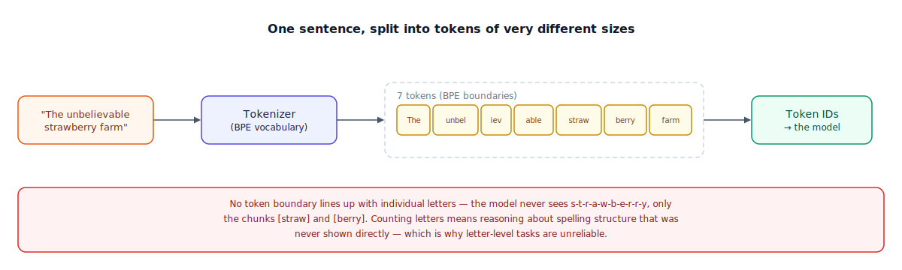

## The 30-second version

A model never reads letters. Before any text reaches the model, a tokenizer chops it into a fixed vocabulary of chunks — sometimes a whole word, sometimes a few letters, sometimes a single character — and hands the model a sequence of integers, one per chunk. That vocabulary isn't hand-designed; it's learned from a huge text corpus by repeatedly merging whichever pair of adjacent symbols shows up most often, a process called byte-pair encoding (BPE), until the vocabulary hits a target size, typically 100,000 to 200,000 entries in current models. Common English words earn their own single chunk because they show up constantly during that merge process; rare words, invented words, and most non-English text don't, so they get cut into several smaller chunks instead. This one fact explains a long list of odd model behavior — why it fumbles counting letters in a word, why the same sentence in Hindi costs more than the English equivalent, and why "roughly a token per word" is a planning shortcut that quietly breaks the moment your text stops looking like average English prose.

## The analogy

Picture a cashier working a till stocked with a fixed set of bill denominations, chosen in advance by studying a huge log of past transaction totals.

The till-designer didn't guess at which denominations to stock. They looked at millions of past totals and picked denominations that let the *most common* totals get paid in as few bills as possible — if $20 comes up constantly, stock a $20 bill, even though nothing stops you from making $20 out of twenty $1 bills instead. Given a new total, the cashier reaches for the largest denomination that fits, then repeats with whatever's left, until the total is covered. A round, common total like $20 comes out of the till as a single bill. An odd total like $23.47 comes out as several bills and coins, because no single denomination in the till happens to match it.

That's most of what a tokenizer does to text. Its "denominations" are chunks of characters, and they were chosen the same way — by scanning an enormous corpus and repeatedly merging whichever adjacent pair of symbols occurs most often, until the vocabulary reaches its target size. A common word that appeared constantly during that process earns its own single chunk, the way a common total earns its own bill. A rare word, an invented word, or a typo didn't come up often enough to earn a dedicated chunk, so it gets paid for in several smaller pieces instead — exactly like the odd total needing a fistful of change.

Now stretch the analogy one step further: that till was stocked from a log of transactions in one currency. Hand the same cashier a pile of yen-denominated totals, and the same $20-and-$1 till is a poor fit — round yen amounts don't line up with dollar-shaped bills, so almost everything requires a fistful of small change. A tokenizer trained mostly on English text has the same problem with Hindi, Japanese, or Korean: the "denominations" it learned were shaped by English, so text in a very different script gets cut into far more, far smaller pieces to cover the same meaning.

| Cashier's till | Tokenizer element |
|---|---|
| Denominations chosen by scanning millions of past totals | BPE vocabulary trained by merging frequent symbol pairs across a huge text corpus |
| A common, round total paid with one bill | A common word or word-piece encoded as a single token |
| An odd total needing several bills and coins | A rare word, name, or typo split into several subword tokens |
| A till stocked from dollar-shaped totals, fed yen amounts instead | An English-trained vocabulary applied to a language it wasn't shaped around |
| Needing a fistful of small change for the same purchase | Needing far more tokens to express the same meaning in an underrepresented language |
| The cashier can't tell you how many nickels are "inside" a $20 bill without breaking it | The model can't easily tell you how many of a given letter are "inside" a token without reasoning about its internal spelling |
| No total is ever refused — worst case, pay it entirely in $1 bills | Byte-level fallback: any input can be tokenized, worst case one byte at a time |

## How it actually works

Follow the diagram left to right. Raw text enters the tokenizer, which holds a vocabulary built once, offline, by the merge process described above — it doesn't change per request. The output is a sequence of tokens of visibly different sizes: a short, frequent word like "The" or "farm" comes out as one chunk, while a longer or less common word gets carved into several smaller chunks that, read together, still spell out the original word. Those chunks are immediately mapped to integers — the token IDs — because that's the only thing a model's embedding layer actually accepts as input; the text itself never enters the model directly. Detokenization runs the same map in reverse when the model's output IDs get turned back into readable text.

The callout below the diagram is the detail that trips people up most: token boundaries don't respect letters. A token like `straw` isn't a labeled sequence of five letters as far as the model's forward pass is concerned — it's one opaque integer, no more decomposable at that layer than any other. If a task requires reasoning about what's *inside* a token — counting letters, reversing a word, checking whether two spellings differ by one character — the model has to reconstruct that structure indirectly, from whatever it absorbed about how that token's ID relates to spelling during training. That's a much less reliable path than actually seeing the letters, which is exactly why these tasks are the ones models get wrong in ways that surprise people who assume the model reads character by character.

## A concrete example

Take the sentence "The unbelievable strawberry farm was enormous." — 8 words, 47 characters including spaces. A typical BPE tokenizer doesn't produce 8 tokens; it produces something closer to 11: `The`, ` unbel`, `iev`, `able`, ` straw`, `berry`, ` farm`, ` was`, ` enorm`, `ous`, `.` — short common words like "The," "farm," and "was" survive as single tokens, while "unbelievable" costs 3 tokens and "enormous" costs 2. That's a token-to-word ratio of about 1.4 for this sentence, close to the commonly cited English rule of thumb of roughly 1.3 tokens per word, or about 4 characters per token.

Now translate the same sentence's meaning into Hindi and run it through the same English-trained tokenizer. Where the English version cost 11 tokens, the Hindi equivalent commonly costs 2–4x more tokens for the same meaning, because the vocabulary's merge rules were shaped by English character sequences that don't occur in Devanagari script. Scale that up: a 1,000-word English support document costs roughly 1,300 tokens to embed or send to a model. The same document's meaning translated into Hindi, tokenized by an English-centric vocabulary, can cost 3,000–4,000 tokens — which matters twice over, because it eats more of a fixed context window and it costs more dollars, since API pricing is per token, not per word or per unit of meaning.

## The tradeoffs that matter

| Design choice | What you gain | What it costs |
|---|---|---|
| Larger vocabulary (e.g., 100K+ entries) | Better compression — common sequences, including in more languages, get their own token | A bigger embedding table and output layer, since every token needs a learned vector |
| Byte-level fallback (no true out-of-vocabulary case) | Any input, in any script, can always be tokenized — nothing is ever rejected | Genuinely novel or rare text still costs many small tokens; the fallback doesn't make it cheap, only possible |
| Estimating cost with "words × 1.3" | Fast, good enough for rough English-only budgeting | Silently wrong for code, structured data (JSON), and non-English text, sometimes by 3x or more |
| Chunking documents at character boundaries instead of token boundaries | Simpler code, no tokenizer dependency | Risk of splitting a token in half, which can corrupt text when the pieces are decoded back separately |

The vocabulary-size tradeoff is the one worth remembering in an interview: it isn't free to just make the vocabulary bigger. Every additional vocabulary entry adds a row to the embedding table and the output projection, so vocabulary size is itself a parameter-count decision, not just a tokenization detail.

## Where people go wrong

1. **Assuming "tokens" means "words."** Budgeting a context window or an API cost by counting words instead of running the actual tokenizer produces estimates that are wrong by a widening margin the moment the text includes code, rare names, or a non-English language.
2. **Blaming "dumb model" for letter-counting failures.** A model failing to count the r's in a word isn't evidence it can't count — it's evidence the letters it would need to count were never presented to it as separate symbols in the first place.
3. **Treating every language as equally expensive.** The same sentence's meaning can cost 2–4x more tokens in some languages than in English, purely as an artifact of what the tokenizer's vocabulary was trained on — a real, ongoing cost and fairness issue, not a rounding error.
4. **Truncating text at a character count instead of a token boundary.** Cutting a string at character 500 can slice a token in half; decoding the result can produce garbled text or an outright error, depending on the tokenizer.
5. **Forgetting that chat formatting consumes tokens too.** System prompts, role markers, and special structural tokens all count against the context window and the bill — a budget that only accounts for the visible conversation text undercounts every time.

## The interview lens

Interviewers use this topic to see whether you understand tokens as the model's actual unit of computation, not a cosmetic detail sitting in front of "real" text processing.

A strong sound bite: *"I never budget context or cost in words — I run the actual tokenizer, because the gap between words and tokens isn't constant. It's close to 1.3x for plain English and can be 3x or more for code, rare identifiers, or non-English text, and that gap is exactly why the model struggles with letter-level tasks: it's reasoning over chunks it was never shown the internal spelling of."*

Likely follow-ups:

- Why does the same document cost more tokens in some languages than others, mechanically?
- How would you chunk a long document for retrieval without accidentally splitting a token?
- If you needed a model to reliably count letters in a word, how would you prompt around the tokenization limitation?

## Go deeper

- [LLM Internals](./llm-internals.mdx) — what happens to those token IDs once they leave the tokenizer and enter the model.
- [Attention Mechanisms](./attention-mechanisms.mdx) — how the model relates one token to every other token once tokenization is done.
- [Pricing and Costs](../models/pricing-and-costs.mdx) — turning a token count into an actual dollar figure per request.
- Upstream reference: [Tokenization Deep Dive — AI System Design Guide](https://github.com/ombharatiya/ai-system-design-guide/blob/main/01-foundations/02-tokenization-deep-dive.md) (MIT; see [CREDITS](../../../CREDITS.md)).
