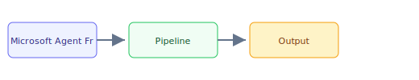

## The 30-second version

The multi-agent framework landscape consolidated significantly over the past year. Microsoft retired AutoGen and merged it with Semantic Kernel into the unified Microsoft Agent Framework (RC 1.0, February 2026; GA targeted Q2 2026). CrewAI matured to v1.13 with enterprise-grade features and reported use by 60%+ of Fortune 500 companies. Meanwhile, every major AI lab shipped its own agent SDK: Anthropic's Claude Agent SDK, OpenAI's Agents SDK, and Google's ADK.

## The analogy

Think of **Microsoft Agent Framework, CrewAI, and the Agent SDK Landscape** like running a kitchen during rush hour: you cannot memorize every recipe change, so you keep reference cards (retrieval), a head chef who improvises within guardrails (the model), and a quality check before plates leave the pass (evaluation). The technical system mirrors that flow — separate what you **store**, what you **retrieve**, and what you **generate**.

## How it actually works

The multi-agent framework landscape consolidated significantly over the past year. Microsoft **retired AutoGen** and merged it with Semantic Kernel into the unified **Microsoft Agent Framework** (RC 1.0, February 2026; GA targeted Q2 2026). CrewAI matured to v1.13 with enterprise-grade features and reported use by 60%+ of Fortune 500 companies. Meanwhile, every major AI lab shipped its own agent SDK: Anthropic's Claude Agent SDK, OpenAI's Agents SDK, and Google's ADK.

## A concrete example

The multi-agent framework landscape consolidated significantly over the past year. Microsoft retired AutoGen and merged it with Semantic Kernel into the unified Microsoft Agent Framework (RC 1.0, February 2026; GA targeted Q2 2026). CrewAI matured to v1.13 with enterprise-grade features and reported use by 60%+ of Fortune 500 companies. Meanwhile, every major AI lab shipped its own agent SDK: Anthropic's Claude Agent SDK, OpenAI's Agents SDK, and Google's ADK.

## The tradeoffs that matter

| Choice | Upside | Cost |
|--------|--------|------|
| Simpler design | Faster to ship | Less resilient |
| Heavier retrieval | Better grounding | More latency |
| Bigger model | Higher quality | Higher $/query |

## Where people go wrong

- Skipping evaluation and hoping demos generalize
- Ignoring latency/cost until production traffic arrives
- Treating retrieval quality as a generation problem

## The interview lens

### Q: When would you use CrewAI instead of LangGraph?

**Strong answer:**
**Speed vs. Precision**. I use **CrewAI** when I need to stand up a team of agents for a standard process (like content generation or data analysis) very quickly. It provides high-level abstractions for "Planning" and "Cooperation" out of the box. I switch to **LangGraph** when I need **Granular Control** over every state transition, multi-turn human-in-the-loop triggers, or complex error-recovery logic that doesn't fit into the "Role-playing team" metaphor.

### Q: Microsoft retired AutoGen in favor of the Agent Framework. How does this affect existing AutoGen deployments?

**Strong answer:**
AutoGen continues to receive bug fixes and security patches, so existing deployments are not immediately broken. However, **all new feature development** is in the Agent Framework. The migration path is well-documented: AutoGen's `AssistantAgent` maps to the Agent Framework's `Agent` class, `GroupChat` maps to the new `Workflow` patterns, and Semantic Kernel's enterprise features (session management, telemetry, filters) are now available natively. The key benefit of migrating is **unified .NET and Python support** and **graph-based workflows** that give explicit control over multi-agent execution paths. For new projects, start with the Agent Framework directly.

### Q: How do you prevent "Infinite Loops" where agents keep talking to each other without solving the task?

**Strong answer:**
We use **Termination Conditions** and **Max Conversational Turns**. We also implement a "Critic Agent" whose only job is to detect if the conversation is stagnant. If the Critic detects circularity, it triggers a user proxy to interrupt or force-switches the group chat manager to a different reasoning path. We also monitor **Token Velocity**: if an agent pair uses 100K tokens in 2 minutes without progress, we kill the session automatically. In 2026, frameworks like the Microsoft Agent Framework and LangGraph provide built-in workflow timeouts and state checkpointing that make loop detection more systematic.

## Go deeper

- [Upstream chapter (Microsoft Agent Framework, CrewAI, and the Agent SDK Landscape)](https://github.com/ombharatiya/ai-system-design-guide/blob/main/09-frameworks-and-tools/07-autogen-crewai.md)
- Related questions in the [question bank](/questions)
- Practice with [SPIDER walkthrough](/practice) or [mock interview](/mock)
