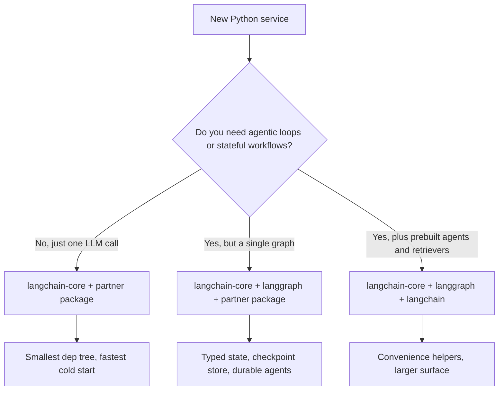

## The 30-second version

LangChain is no longer just a "prompting library." It has matured into a Modular Ecosystem for building production-grade LLM applications. LangGraph (which graduated to v1.0 in late 2025 and is the default runtime for all LangChain agents) handles the stateful orchestration. LCEL (LangChain Expression Language) remains the fastest way to build composable chains.

## How it actually works

LangChain is no longer just a "prompting library." It has matured into a **Modular Ecosystem** for building production-grade LLM applications. LangGraph (which graduated to v1.0 in late 2025 and is the default runtime for all LangChain agents) handles the stateful orchestration. **LCEL (LangChain Expression Language)** remains the fastest way to build composable chains.


## The LangChain Stack

The ecosystem is now split into three distinct layers:
1. **LangChain Core**: Minimal abstractions for Prompts, Output Parsers, and Runnables. (Low dependency footprint).
2. **LangChain Community/Partner**: Integrations for 500+ databases, models, and tools.
3. **LangGraph**: The stateful orchestration layer (covered in the next chapter).

## LCEL: Programming with Pipes

LangChain Expression Language (LCEL) uses the `|` operator to create a **Directed Acyclic Graph (DAG)** of execution.

```python
# Standard RAG chain
chain = (
    {"context": retriever, "question": RunnablePassthrough()}
    | prompt
    | model.with_structured_output(Schema) 
)
```

**Why LCEL?**
- **Async by Default**: Every chain supports `.ainvoke()` and `.astream()`.
- **Parallelism**: Multiple branches run in parallel automatically.
- **Observability**: Automatically integrates with **LangSmith** for full-trace visualization.

## Standard Abstractions

### 1. Runnables
The "Base Class" for everything in LangChain. Runnables provide a unified interface for `.invoke`, `.batch`, and `.stream`.

### 2. Tools & Tool-Calling
LangChain has first-class support for **MCP (Model Context Protocol)**.
- You can turn any MCP server into a LangChain `BaseTool`.

### 3. Output Parsers
While early systems used regex, modern code uses `.with_structured_output()` which utilizes the model's native JSON capability (OpenAI `.json_mode` or Anthropic `tools`).

## Managing Complexity

> [!TIP]
> **Production Best Practice**: Avoid `langchain-community` in critical paths. Use **Partner Packages** (e.g., `langchain-openai`, `langchain-pinecone`) to reduce dependency hell and improve stability.

## LangChain Modularity Push

By May 2026 the ecosystem has finished its long migration from the monolithic `langchain` import to a tiered structure with clean dependency boundaries. The split exists so teams can pick exactly the surface area they need without dragging in 500+ integrations.

### Package Tiering as Shipped

| Package | Purpose | Direct Dependencies |
|---------|---------|---------------------|
| `langchain-core` | Runnables, prompts, output parsers, tool abstractions | Pydantic, `tenacity`, almost nothing else |
| `langchain` | Reference chains, retrievers, agents that are pure-Python | `langchain-core` |
| `langgraph` | Stateful graph orchestration, checkpointing, time-travel | `langchain-core` |
| `langchain-openai`, `langchain-anthropic`, `langchain-google-vertexai`, etc. | Provider partner packages | `langchain-core` + the provider SDK |
| `langchain-community` | Long tail of integrations (kept available, no longer recommended in production paths) | Lots |
| `langchain-classic` | Legacy v0 chains, retained for migration | `langchain-core` |

`langchain-core` is the only package that ships with a stable surface and a backwards-compatibility guarantee, per the v1 release messaging ([LangChain blog, Building with LangChain 1.0](https://blog.langchain.com/langchain-1-0/)).

### Standard JSON Schema Across Validation Libraries

The single biggest change for application code: `with_structured_output()`, `bind_tools()`, and `@tool` now accept any [JSON Schema](https://json-schema.org/) compatible object. That includes:

- **Pydantic v2** (the historical default)
- **[Zod 4](https://zod.dev/v4)** via `zod-to-json-schema`, used by JavaScript / TypeScript LangChain
- **[Valibot](https://valibot.dev/)** (functional, tree-shakeable TS validation)
- **[ArkType](https://arktype.io/)** (TypeScript types as runtime schemas)
- Plain dict / TypedDict in Python
- Hand-rolled JSON Schema documents

This is documented in the [LangChain v1 structured-output guide](https://docs.langchain.com/oss/python/langchain/structured-output) and the [JS structured-output guide](https://js.langchain.com/docs/how_to/structured_output). The practical effect: framework choice no longer drives validator choice, and teams that already standardized on Valibot or ArkType for their HTTP layer can reuse those schemas as LangChain tool definitions.

```python
# Python: TypedDict tool schema, no Pydantic in the path
from typing import TypedDict, Annotated
from langchain_anthropic import ChatAnthropic

class CreateInvoice(TypedDict):
    """Create an invoice for a customer."""
    customer_id: Annotated[str, ..., "Stripe customer id"]
    amount_cents: Annotated[int, ..., "Amount in cents, > 0"]

llm = ChatAnthropic(model="claude-opus-4-7")
structured = llm.with_structured_output(CreateInvoice)
```

```typescript
// TypeScript: Valibot schema reused for both HTTP and tool calling
import * as v from "valibot";
import { ChatAnthropic } from "@langchain/anthropic";
import { toJsonSchema } from "@valibot/to-json-schema";

const CreateInvoice = v.object({
  customer_id: v.pipe(v.string(), v.description("Stripe customer id")),
  amount_cents: v.pipe(v.number(), v.minValue(1)),
});

const llm = new ChatAnthropic({ model: "claude-opus-4-7" });
const structured = llm.withStructuredOutput(toJsonSchema(CreateInvoice));
```

### When to Use Just `langchain-core` vs Full LangChain



Recommended posture in May 2026:

- **Library / SDK code**: depend only on `langchain-core`. Producers of reusable building blocks (vector stores, chunkers, custom tools) should never pull in `langchain` or partner packages as direct dependencies. The [LangChain integrations guide](https://docs.langchain.com/oss/python/integrations/providers) describes this as a hard rule for `langchain-community` contributors.
- **Application services**: `langchain-core` + the partner packages you actually call + `langgraph` if you have a multi-step workflow. Skip `langchain` (the package, not the brand) unless you are explicitly using a built-in retriever or legacy chain.
- **Notebooks and prototypes**: `langchain` is fine for the convenience.

The version pin matters. `langchain-core >= 1.0` is the supported floor for new code; the 0.3.x line still receives critical patches but will be EOL by Q3 2026 per the [LangChain v1 release announcement](https://blog.langchain.com/langchain-1-0/).

### Migration Notes for Existing Code

- `LLMChain`, `RetrievalQA`, `ConversationalRetrievalChain`, and `AgentExecutor` live in `langchain-classic` and are frozen. The replacement is an LCEL pipe or, more often, a `langgraph` graph ([LangChain migration guide](https://python.langchain.com/docs/versions/v0_3/)).
- Tool decorators import from `langchain_core.tools`, not `langchain.tools`.
- Output parsers that depend on Pydantic v1 must be ported. `langchain-core` v1.0 dropped the v1 shim ([release notes](https://github.com/langchain-ai/langchain/releases/tag/langchain-core%3D%3D1.0.0)).


## References
- LangChain. "The LangChain Expression Language Specification" (2025)
- Anthropic. "Partner Integration Guide for LangChain" (2025)
- Harrison Chase. "The Future of AI Orchestration" (2024 podcast/post)

*Next: [LangGraph Orchestration](02-langgraph-orchestration.md)*

## The interview lens

### Q: What is the main benefit of LCEL over traditional Python "Chains" (sequences of function calls)?

**Strong answer:**
LCEL provides **Automatic Streaming and Parallelization**. In a traditional Python chain, I have to manually handle `asyncio.gather` for parallel steps and custom generators for streaming. LCEL's `Runnable` architecture handles this under the hood. If I define a `RunnableParallel` block, LangChain executes them simultaneously. More importantly, LCEL provides **Dynamic Routing** via `RunnableBranch`, making it easy to create complex logic without deeply nested if/else statements.

### Q: LangChain is often criticized for being "too bloated." How do you architect a lean production system with it?

**Strong answer:**
The key is to **Import only Core**. I use `langchain-core` for the abstractions and specific **Partner Packages** (like `langchain-anthropic`) for the model. I avoid `langchain-community` and the legacy `Chain` classes (like `LLMChain` or `RetrievalQA`) which are effectively deprecated. I build my logic using the **Runnable** primitives, which keeps the dependency tree small and the execution path transparent.

## Go deeper

- [Upstream chapter (LangChain Deep Dive)](https://github.com/ombharatiya/ai-system-design-guide/blob/main/09-frameworks-and-tools/01-langchain-deep-dive.md)
- Related questions in the [question bank](/questions)
- Practice with [SPIDER walkthrough](/practice) or [mock interview](/mock)
