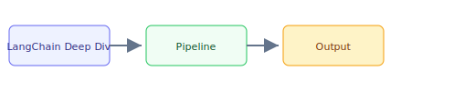

## The 30-second version

LangChain is no longer just a "prompting library." It has matured into a Modular Ecosystem for building production-grade LLM applications. LangGraph (which graduated to v1.0 in late 2025 and is the default runtime for all LangChain agents) handles the stateful orchestration. LCEL (LangChain Expression Language) remains the fastest way to build composable chains.

## The analogy

Think of **LangChain Deep Dive** like running a kitchen during rush hour: you cannot memorize every recipe change, so you keep reference cards (retrieval), a head chef who improvises within guardrails (the model), and a quality check before plates leave the pass (evaluation). The technical system mirrors that flow — separate what you **store**, what you **retrieve**, and what you **generate**.

## How it actually works

LangChain is no longer just a "prompting library." It has matured into a **Modular Ecosystem** for building production-grade LLM applications. LangGraph (which graduated to v1.0 in late 2025 and is the default runtime for all LangChain agents) handles the stateful orchestration. **LCEL (LangChain Expression Language)** remains the fastest way to build composable chains.

## A concrete example

LangChain is no longer just a "prompting library." It has matured into a Modular Ecosystem for building production-grade LLM applications. LangGraph (which graduated to v1.0 in late 2025 and is the default runtime for all LangChain agents) handles the stateful orchestration. LCEL (LangChain Expression Language) remains the fastest way to build composable chains.

## The tradeoffs that matter

| Choice | Upside | Cost |
|--------|--------|------|
| Simpler design | Faster to ship | Less resilient |
| Heavier retrieval | Better grounding | More latency |
| Bigger model | Higher quality | Higher $/query |

## Where people go wrong

- Skipping evaluation and hoping demos generalize
- Ignoring latency/cost until production traffic arrives
- Treating retrieval quality as a generation problem

## The interview lens

### Q: What is the main benefit of LCEL over traditional Python "Chains" (sequences of function calls)?

**Strong answer:**
LCEL provides **Automatic Streaming and Parallelization**. In a traditional Python chain, I have to manually handle `asyncio.gather` for parallel steps and custom generators for streaming. LCEL's `Runnable` architecture handles this under the hood. If I define a `RunnableParallel` block, LangChain executes them simultaneously. More importantly, LCEL provides **Dynamic Routing** via `RunnableBranch`, making it easy to create complex logic without deeply nested if/else statements.

### Q: LangChain is often criticized for being "too bloated." How do you architect a lean production system with it?

**Strong answer:**
The key is to **Import only Core**. I use `langchain-core` for the abstractions and specific **Partner Packages** (like `langchain-anthropic`) for the model. I avoid `langchain-community` and the legacy `Chain` classes (like `LLMChain` or `RetrievalQA`) which are effectively deprecated. I build my logic using the **Runnable** primitives, which keeps the dependency tree small and the execution path transparent.

## Go deeper

- [Upstream chapter (LangChain Deep Dive)](https://github.com/ombharatiya/ai-system-design-guide/blob/main/09-frameworks-and-tools/01-langchain-deep-dive.md)
- Related questions in the [question bank](/questions)
- Practice with [SPIDER walkthrough](/practice) or [mock interview](/mock)
