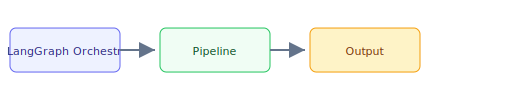

## The 30-second version

LangGraph is the de facto standard for building stateful, multi-agent systems. It reached v1.0 in late 2025 and surpassed CrewAI in GitHub stars in early 2026 thanks to enterprise adoption of its graph-based runtime. Unlike simple chains, LangGraph allows for Cycles, State Persistence, and Human-in-the-Loop interventions.

## The analogy

Think of **LangGraph Orchestration** like running a kitchen during rush hour: you cannot memorize every recipe change, so you keep reference cards (retrieval), a head chef who improvises within guardrails (the model), and a quality check before plates leave the pass (evaluation). The technical system mirrors that flow — separate what you **store**, what you **retrieve**, and what you **generate**.

## How it actually works

LangGraph is the **de facto standard** for building stateful, multi-agent systems. It reached v1.0 in late 2025 and surpassed CrewAI in GitHub stars in early 2026 thanks to enterprise adoption of its graph-based runtime. Unlike simple chains, LangGraph allows for **Cycles**, **State Persistence**, and **Human-in-the-Loop** interventions.

## A concrete example

LangGraph is the de facto standard for building stateful, multi-agent systems. It reached v1.0 in late 2025 and surpassed CrewAI in GitHub stars in early 2026 thanks to enterprise adoption of its graph-based runtime. Unlike simple chains, LangGraph allows for Cycles, State Persistence, and Human-in-the-Loop interventions.

## The tradeoffs that matter

| Choice | Upside | Cost |
|--------|--------|------|
| Simpler design | Faster to ship | Less resilient |
| Heavier retrieval | Better grounding | More latency |
| Bigger model | Higher quality | Higher $/query |

## Where people go wrong

- Skipping evaluation and hoping demos generalize
- Ignoring latency/cost until production traffic arrives
- Treating retrieval quality as a generation problem

## The interview lens

### Q: Why use LangGraph instead of OpenAI's "Assistant API"?

**Strong answer:**
**Control and Portability**. The Assistant API is a black box: you cannot see the exact prompts or control the logic gates. LangGraph is a **White Box framework**. I can use any model (OpenAI, Claude, Llama 3.3), control exactly when a tool is called, and inject my own custom validation logic between steps. More importantly, LangGraph is **Open Source** and can run locally/on-prem, which is critical for many enterprise security requirements.

### Q: How do you handle "State Overload" in a graph with 20+ nodes?

**Strong answer:**
We use **State Narrowing**. Instead of passing the entire global state to every node, we define specialized sub-states for sub-graphs. We also use **Trim Runnables** to prune the message history before it hits the LLM, ensuring we don't waste tokens while keeping the "Truth" preserved in the persistence layer.

## Go deeper

- [Upstream chapter (LangGraph Orchestration)](https://github.com/ombharatiya/ai-system-design-guide/blob/main/09-frameworks-and-tools/02-langgraph-orchestration.md)
- Related questions in the [question bank](/questions)
- Practice with [SPIDER walkthrough](/practice) or [mock interview](/mock)
