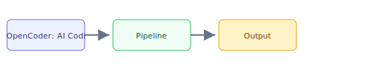

## The 30-second version

The AI coding agent landscape has exploded. This guide covers open-weight coding models, agentic IDEs, open-source agents, and how to choose the right tool for your engineering workflow.

## The analogy

Think of **OpenCoder: AI Coding Agents Landscape** like running a kitchen during rush hour: you cannot memorize every recipe change, so you keep reference cards (retrieval), a head chef who improvises within guardrails (the model), and a quality check before plates leave the pass (evaluation). The technical system mirrors that flow — separate what you **store**, what you **retrieve**, and what you **generate**.

## How it actually works




The AI coding agent landscape has exploded. This guide covers open-weight coding models, agentic IDEs, open-source agents, and how to choose the right tool for your engineering workflow.

## A concrete example

The AI coding agent landscape has exploded. This guide covers open-weight coding models, agentic IDEs, open-source agents, and how to choose the right tool for your engineering workflow.

## The tradeoffs that matter

| Choice | Upside | Cost |
|--------|--------|------|
| Simpler design | Faster to ship | Less resilient |
| Heavier retrieval | Better grounding | More latency |
| Bigger model | Higher quality | Higher $/query |

## Where people go wrong

- Skipping evaluation and hoping demos generalize
- Ignoring latency/cost until production traffic arrives
- Treating retrieval quality as a generation problem

## The interview lens

### Q: How do you choose between Claude Code, Cursor, and OpenHands?

**Strong answer:**
It depends on three axes:

1. **Interface need**: If developers want GUI (see changes in context), use Cursor or Windsurf. If the task is scripted/headless (bug fixing, test generation in CI), use Claude Code SDK or OpenHands.

2. **Model control**: If you need to use any model (or your own fine-tuned model), use OpenHands or Aider. If you're okay with Anthropic only and want best-in-class results, use Claude Code.

3. **Open-source requirement**: Enterprise security teams often require open-source tools they can audit. OpenHands (MIT) and Aider (Apache 2.0) are the answer.

For a typical startup, I'd recommend: Cursor for daily development, Claude Code for batch tasks (PRs from GitHub issues), and OpenHands for self-hosted CI pipelines.

### Q: Why are open-weight coding models like Qwen2.5-Coder important for enterprise?

**Strong answer:**
Three reasons:

1. **Data privacy**: Code sent to closed APIs is potentially used for training or exposed to third parties. For healthcare (HIPAA), finance (SOX), and government teams, no proprietary code can leave the network. Qwen2.5-Coder-32B running on-prem solves this.

2. **Cost at scale**: At 1M+ code generation requests/month, self-hosting becomes 40-60% cheaper than API pricing, especially for completions (vs agentic tasks).

3. **Fine-tuning**: Open weights can be domain-specialized. A legal tech company can fine-tune on their internal DSL (domain-specific language). APIs don't allow this.

The quality gap between Qwen2.5-Coder-32B and Claude 3.7 Sonnet is real but shrinking. For completions and simpler tasks, the open model is often "good enough."

### Q: How would you design the testing strategy for an AI coding agent in CI?

**Strong answer:**
I'd use a three-tier evaluation:

**1. Functional tests** (automated, every run):
```
Agent output → Run pytest → Pass rate metric
```

**2. Ground truth comparison** (weekly):
```
Known bug → Agent fix → Compare to expert fix
Metric: Semantic similarity of diff (not byte-exact)
```

**3. Human evaluation** (sample 5% of agent PRs):
```
Senior engineer rates: Correctness, Style, Safety, 1-5 scale
```

I also track **regression rate** — if an agent fix introduces a new failing test, that's a hard failure. The agent should run the full test suite and only succeed if it improves or maintains the passing rate.

## Go deeper

- [Upstream chapter (OpenCoder: AI Coding Agents Landscape)](https://github.com/ombharatiya/ai-system-design-guide/blob/main/09-frameworks-and-tools/10-opencoderguide.md)
- Related questions in the [question bank](/questions)
- Practice with [SPIDER walkthrough](/practice) or [mock interview](/mock)
