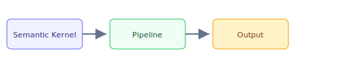

## The 30-second version

Semantic Kernel (SK) is Microsoft's engine for enterprise-grade AI orchestration. It remains the primary bridge for organizations committed to the Azure/Microsoft ecosystem and C#/.NET architectures, though much of its forward momentum now ships inside the Microsoft Agent Framework (the consolidated successor to AutoGen + SK, RC 1.0 February 2026, GA Q2 2026).

## The analogy

Think of **Semantic Kernel** like running a kitchen during rush hour: you cannot memorize every recipe change, so you keep reference cards (retrieval), a head chef who improvises within guardrails (the model), and a quality check before plates leave the pass (evaluation). The technical system mirrors that flow — separate what you **store**, what you **retrieve**, and what you **generate**.

## How it actually works

**Semantic Kernel (SK)** is Microsoft's engine for enterprise-grade AI orchestration. It remains the primary bridge for organizations committed to the **Azure/Microsoft ecosystem** and **C#/.NET** architectures, though much of its forward momentum now ships inside the **Microsoft Agent Framework** (the consolidated successor to AutoGen + SK, RC 1.0 February 2026, GA Q2 2026).

## A concrete example

Semantic Kernel (SK) is Microsoft's engine for enterprise-grade AI orchestration. It remains the primary bridge for organizations committed to the Azure/Microsoft ecosystem and C#/.NET architectures, though much of its forward momentum now ships inside the Microsoft Agent Framework (the consolidated successor to AutoGen + SK, RC 1.0 February 2026, GA Q2 2026).

## The tradeoffs that matter

| Choice | Upside | Cost |
|--------|--------|------|
| Simpler design | Faster to ship | Less resilient |
| Heavier retrieval | Better grounding | More latency |
| Bigger model | Higher quality | Higher $/query |

## Where people go wrong

- Skipping evaluation and hoping demos generalize
- Ignoring latency/cost until production traffic arrives
- Treating retrieval quality as a generation problem

## The interview lens

### Q: Why would a Staff Engineer choose Semantic Kernel over LangChain?

**Strong answer:**
**Architectural Alignment**. If an organization is already built on the .NET/Azure stack, Semantic Kernel fits into their existing CI/CD, monitoring (App Insights), and security (Entra ID) pipelines. LangChain often feels like an "external" piece of tech. Furthermore, SK's **Strong Typing** and **Dependency Injection** patterns prevent the "spaghetti code" that often plagues large LangChain projects. For an enterprise handling sensitive financial data, the **Native Azure integration** for security and auditing is the deciding factor.

### Q: What is the "Function Calling" abstraction in Semantic Kernel?

**Strong answer:**
SK uses a **Plugin-based model**. Every function (native C# or LLM-based) is registered with the Kernel. When the LLM decides it needs a tool, the Kernel looks up the function in the Plugin registry, validates the parameters, and executes it. SK now supports **Automatic Intent Detection**: the Kernel can proactively suggest which Plugin a user might need before they even ask, based on the current context window.

## Go deeper

- [Upstream chapter (Semantic Kernel)](https://github.com/ombharatiya/ai-system-design-guide/blob/main/09-frameworks-and-tools/06-semantic-kernel.md)
- Related questions in the [question bank](/questions)
- Practice with [SPIDER walkthrough](/practice) or [mock interview](/mock)
