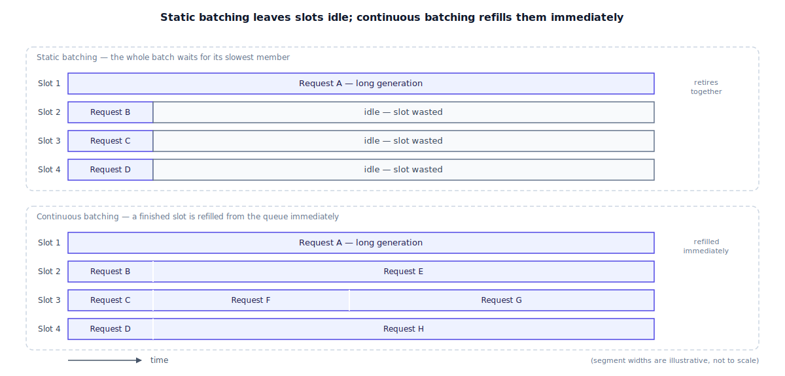

## The 30-second version

A GPU running one request's decode loop at a time is mostly wasted, because decode is memory-bound: the bottleneck is reading weights from GPU memory, not the arithmetic, so there's spare compute sitting idle on every step (see [the inference pipeline](../foundations/inference-pipeline.mdx)). **Batching** is the fix — running several requests' decode steps together so that idle compute gets used. The naive version, **static batching**, groups requests up front and won't let any of them leave until the slowest one finishes, which wastes exactly the capacity it was trying to save. **Continuous batching** fixes that by treating every single decode step as a fresh scheduling decision: the moment a request finishes, its slot is handed to the next one waiting, with no group-wide pause required. A second, related problem — a single huge prompt stalling everyone else's decode step while it prefills — gets its own fix, **chunked prefill**, which breaks that giant prefill into small pieces interleaved with ongoing decode work. Neither trick changes what any individual request receives; both change how much of the GPU's paid-for capacity is actually doing something at any given moment.

## The analogy

Picture a commuter vanpool that shuttles people from a suburban office park to the train station every morning, one van, eight seats.

Run it the naive way — **static batching** — and the van waits at the curb until every one of its eight seats has a confirmed rider, or until a fixed departure timer goes off. Once it pulls away, that's the roster for the whole trip: no one else can get on until the van returns empty and starts boarding again. Say seven of the eight riders are headed to the station two stops up the road, a five-minute hop, and the eighth is going all the way across town, a forty-minute haul. The van doesn't drop the first seven off early and immediately go pick up seven new riders — it can't, because the whole vanload is one unit that started together and, in this scheme, finishes together. Those seven sit in their seats for the next thirty-five minutes, seats "occupied" but doing nothing useful, because the ride is defined by its slowest passenger.

Now run it as a **continuous** operation instead. The driver doesn't wait for a full roster or treat the van as one indivisible unit. At every stop, if a seat has opened up because its rider reached their destination, the next person waiting at that stop gets on immediately — no waiting for the other seven to also be done, no returning to base first. The forty-minute rider is still on board the whole time, undisturbed, while the seats around them turn over three, four, five times during that same stretch. Same van, same eight seats, same fixed operating cost per hour — dramatically more people moved.

There's a second wrinkle worth a separate fix. Suppose a wedding party of six shows up wanting to board together with a mountain of matching luggage — loading it all at once would plant the van at the curb for several minutes, and every rider already aboard, mid-route, sits stalled while that happens. The better move is loading the wedding party's luggage in small batches across several stops, interleaved with the ordinary pickups and drop-offs already in progress, instead of one long stall that holds the whole route hostage. That's **chunked prefill**: a single oversized new arrival gets broken into pieces small enough that it doesn't block everyone else's turn.

| Vanpool | Batching strategy |
|---|---|
| A rider needing a lift to the station | An inference request |
| Reaching your stop and getting off | A request finishing — its stop token is generated |
| The van waiting at the curb until every seat is booked before it leaves | Static batching — the whole batch starts, and finishes, together |
| Seven riders sitting in their seats long after their own stop, because the ride isn't over until the eighth rider's is | Short requests in a static batch, done early but stuck reserving GPU capacity until the batch's longest request finishes |
| A newly-empty seat filled by the next waiting rider at the very next stop, no full-roster wait required | Continuous (iteration-level) batching — a finished slot is refilled from the queue on the next decode step |
| A wedding party's luggage loaded in small batches across several stops instead of one long stall | Chunked prefill — a huge prompt's compute-heavy prefill broken into pieces interleaved with ongoing decode steps |
| Handling the wedding party's boarding without ever fully stopping service to the riders already aboard | In-flight batching — mixing one request's prefill phase with other requests' decode phase in the same scheduling round |

## How it actually works

Follow the diagram's two containers. In the top one, four slots start together — Requests A through D — and Request A runs long. Slots 2 through 4 finish early and then just sit there, labeled "idle — slot wasted," because static batching's contract is that the whole group retires together. The GPU is still being billed for those slots the entire time; it's simply not producing anything with them.

The bottom container runs the identical workload through a **continuous, iteration-level scheduler**. The scheduler re-evaluates every slot at every single decode step, not just at batch boundaries. The instant Slot 2 finishes Request B, the very next step assigns it Request E, pulled straight from the waiting queue — no pause, no waiting for Slots 3 or 4 to catch up. Slot 3, whose original request happened to be shorter still, cycles through three separate requests (C, then F, then G) in the same span of time Slot 1's single long request is still running. This is the technique that turned LLM serving throughput around: the same paper and the same open-source engines that popularized it reported throughput gains measured in multiples, not percentage points, over naive request-level batching — because the fix isn't making any individual request faster, it's making sure GPU cycles are never reserved for work that isn't actually happening.

**Chunked prefill** solves an adjacent problem that continuous batching alone doesn't touch. Prefill is compute-bound and scales with prompt length (see [the inference pipeline](../foundations/inference-pipeline.mdx)) — a prompt in the tens of thousands of tokens can take multiple seconds to prefill. If the scheduler runs that prefill as one uninterrupted block, every other request's decode step waits behind it, and their time-per-output-token spikes for however long the prefill takes — a "stall," visible to every other concurrent user as a sudden stutter. Chunked prefill slices that big prefill into small pieces — a few thousand tokens at a time — and interleaves each piece with a normal round of decode steps for everyone else, so no other request ever waits behind more than one small chunk. **In-flight batching** takes the idea one step further: a chunk of one request's prefill and a full round of other requests' decode steps can be issued in the very same forward pass, since prefill is compute-heavy while decode is memory-heavy — the two workloads lean on different parts of the GPU, so combining them uses more of the hardware at once instead of making one wait for the other.

None of these techniques changes a single output token. They change how many GPU cycles are spent producing tokens versus sitting idle waiting for the slowest or largest thing sharing the hardware.

## A concrete example

A GPU holds 8 concurrent decode slots, and each decode step — one token advanced per active slot, in a single batched forward pass — costs a fixed 20 ms, regardless of how many of the 8 slots are actually active. (This flat per-step cost is exactly why batching pays off: decode is memory-bound, so the pass reads weights from memory once and applies them to however many active sequences are riding along, at close to the same cost as one.) A queue of 40 requests is waiting, in a realistic mixed pattern: for every 8 requests, 7 are short replies at 50 tokens each and 1 is a long completion at 300 tokens — so across all 40 requests, that's 5 repetitions of the same mix.

**Total useful tokens across all 40 requests:** 5 × (7 × 50 + 300) = 5 × 650 = **3,250 tokens**. This number is fixed — it's how much output the workload needs, independent of which scheduling strategy produces it.

**Static batching.** Requests are grouped into 5 batches of 8, and each batch doesn't retire until its slowest member — always the 300-token request — finishes. Each batch therefore takes 300 steps × 20 ms = 6,000 ms, and the 5 batches run one after another (only 8 slots exist): 5 × 6,000 ms = **30,000 ms (30 seconds)** wall-clock for all 40 requests. Throughput = 3,250 tokens / 30 s ≈ **108.3 tokens/sec**.

**Continuous batching.** A first instinct: if a waiting request refills any slot the moment it frees, the step count should approach the total token count divided by the slot count — 3,250 / 8 = 406.25, about 407 steps, or ≈8.1 seconds. Treat that as an *unattainable floor*, not a forecast: a 300-token request is indivisible — it occupies one slot for 300 consecutive steps — so the scheduler can never pack slots perfectly around the long requests. Simulating the actual schedule: in plain FIFO arrival order (seven shorts, then a long, repeating), the last long request doesn't get a slot until around step 300, and the workload takes **600 steps = 12.0 s** (throughput ≈ 271 tokens/sec); with the luckiest possible admission order — all five long requests seated at step 0 — it takes **450 steps = 9.0 s** (≈ 361 tokens/sec).

**The comparison:** 30 s versus 9–12 s to clear the identical 40-request workload — continuous batching finishes **≈2.5–3.3x faster** depending on admission order, on the same GPU, same 8 slots, same fixed per-step cost. The gap gets wider, not narrower, the more the output-length distribution varies — a workload where every request happened to be exactly the same length would show static and continuous batching converging, which is exactly why real, mixed-length traffic is what makes this technique matter in production.

## The tradeoffs that matter

| Choice | Upside | Cost |
|---|---|---|
| Static batching | Simple to implement and reason about; predictable, batch-level scheduling | Every slot is held hostage by the batch's slowest member; GPU cycles burn on requests that already finished |
| Continuous (iteration-level) batching | Refills a slot the instant it frees up; throughput gains measured in multiples on mixed-length traffic | Needs a scheduler that tracks and re-decides per-request state on every single step, not just at batch boundaries |
| Chunked prefill | Stops one huge prompt from stalling every other concurrent request's decode step | Slightly increases the huge prompt's own total prefill time, since it's now spread across more scheduling rounds |
| In-flight (prefill + decode) batching | Uses the GPU's otherwise-idle compute during a prefill step to also advance ongoing decodes | More complex kernel and scheduler engineering to mix two workload types in one forward pass |
| Larger max batch size (more concurrent slots) | Higher throughput ceiling, same hardware | Bounded by KV-cache memory, not compute — more on that in [Paged Attention](./paged-attention.mdx) |

## Where people go wrong

1. **Judging batching health from average latency alone.** A batch's tail — its one longest request — is what actually destroys utilization under static batching, and an average can look perfectly fine while that tail is quietly wasting most of the batch's capacity.
2. **Treating batch size as a free throughput dial.** Cranking it up helps only until KV-cache memory, not compute, runs out; past that point you get evictions or out-of-memory errors, not the steadily rising throughput the trend line up to that point suggested.
3. **Assuming a freed slot is instantly reusable.** The compute slot and the memory backing that request's KV cache are two different resources — if the memory isn't released and made available in a form the next request can actually use, continuous batching's throughput promise doesn't show up. That coordination problem is exactly what [Paged Attention](./paged-attention.mdx) exists to solve.
4. **Letting one oversized prompt run its prefill uninterrupted.** Without chunking, a single large request can spike every other concurrent user's per-token latency for the entire duration of that prefill — a stall that looks like a random, unexplained slowdown from the outside.
5. **Benchmarking batching gains on uniform-length synthetic traffic.** If every request in the test is the same length, static and continuous batching look nearly identical — the entire advantage comes from real traffic's length variance, so a benchmark that removes that variance hides the whole point.

## The interview lens

Interviewers use this topic to see whether you understand batching as a *scheduling* fix, not a hardware fix — and whether you can explain why the gain compounds instead of being a flat percentage.

A strong sound bite: *"Batching isn't about cramming more requests into one call — it's about never leaving a GPU slot reserved for work that already finished. Static batching pays for its slowest member on every single slot; continuous batching turns every decode step into its own scheduling decision, which is why the gap between them is a multiple, not a percentage, on real traffic."*

Likely follow-ups:

- Why does continuous batching help throughput so much more on mixed-length traffic specifically? (Static batching's waste scales with how much shorter the average request is than the batch's longest one; uniform-length traffic has little of that gap to close, so the two strategies converge.)
- What's a "stall," and how does chunked prefill fix it? (An uninterrupted prefill for a large prompt monopolizes a scheduling round, spiking every other concurrent request's per-token latency; chunking spreads that prefill across several rounds interleaved with normal decode steps, so no one waits behind more than one small chunk.)
- What actually limits how large you can grow the batch or slot count? (KV-cache memory almost always hits its ceiling before compute does — see Paged Attention for why memory *management*, not raw slot count, ends up being the real constraint.)

## Go deeper

- [The Inference Pipeline](../foundations/inference-pipeline.mdx) — why decode is memory-bound with idle compute sitting there for batching to fill.
- [Paged Attention](./paged-attention.mdx) — the memory-management layer that makes continuous batching's throughput promise actually deliverable.
- [Serving Infrastructure](./serving-infrastructure.mdx) — the scheduler that decides, every step, which requests join or leave a batch.
- Upstream reference: [Batching Strategies — AI System Design Guide](https://github.com/ombharatiya/ai-system-design-guide/blob/main/04-inference-optimization/04-batching-strategies.md) (MIT; see [CREDITS](../../../CREDITS.md)).
