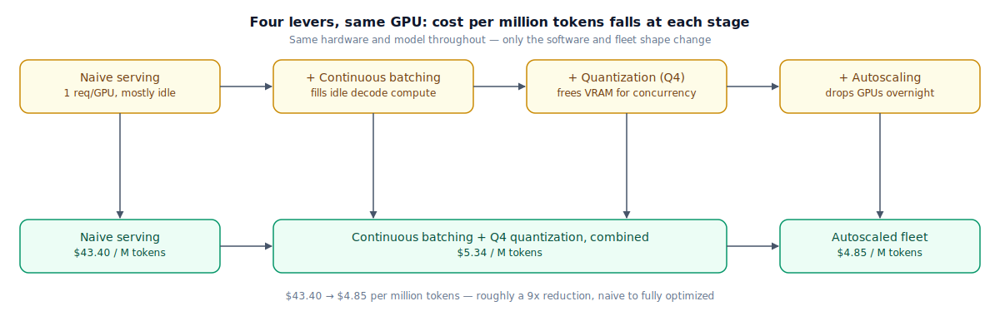

## The 30-second version

[Pricing and Costs](../models/pricing-and-costs.mdx) covers what you pay per token when someone else runs the GPU. This chapter is about what happens once *you're* the one who bought it. A self-hosted GPU is a fixed cost the moment it's reserved — it costs the same at 10% utilization as at 90% — so the entire game is squeezing more useful output through the same expensive, memory-bound hardware. Four levers do almost all of the work: **batching** requests together so the GPU's otherwise-idle compute gets used during the memory-bound decode phase, **quantization** freeing enough memory for more of that batching to happen at once, **autoscaling** so you stop paying for capacity nobody's using overnight, and **spot or reserved pricing** for the GPU-hours you do need. Pulled together, they can cut the effective cost per token by an order of magnitude on the same hardware — and, in a market where API prices keep falling, that's often what it takes for self-hosting to even stay competitive, let alone win outright.

## The analogy

A regional creamery buys its own pasteurizer and bottling line rather than paying a co-op processing plant per batch of milk. That equipment is a fixed cost the day it's installed — the loan payment and the electricity bill are the same whether the tanks run full or half-empty.

The naive way to run it: process each farm's pickup the moment the truck arrives, even if that's a half-full tank. The pasteurizer doesn't care how full the tank is — it takes about the same time and power to run a half load as a full one — so a half-empty run wastes exactly as much fixed cost as a full one earns back. The obvious fix is to hold pickups until several small deliveries combine into one full tank, then run it once. Same equipment, same energy bill, dramatically more milk processed per run.

A second lever sits right next to that one: concentrating the milk before it goes in, evaporating off some water so the same fixed tank volume carries more product per run — the flavor changes slightly, a real cost, but a full tank now carries noticeably more usable product than unconcentrated. A third: deliveries spike during the spring calving flush and drop off in slow months, so the creamery brings in extra trucks and a second shift only during the flush, releasing that capacity the rest of the year. Finally, when the plant down the road has an unbooked opening, it'll run a batch at a steep day-rate discount — genuinely cheap, but the creamery could get bumped with short notice if a locked-in customer needs that slot instead.

None of this changes what's in the bottle. It changes how much fixed cost gets spread across how much product — and a creamery that skips all four moves is paying full price for the same milk a smarter operation is processing for a fraction of the cost, on the identical equipment.

| Creamery | Self-hosted GPU cost |
|---|---|
| The owned pasteurizer and bottling line — a fixed cost regardless of use | The reserved GPU — billed by the hour whether it's busy or idle |
| Running a half-empty tank because pickups trickle in all day | Serving one request at a time — low GPU utilization, most of the fixed cost wasted |
| Holding pickups until a tank runs full before starting a batch | Continuous batching — filling the GPU's idle compute cycles during the memory-bound decode phase |
| Concentrating the milk so the same tank volume carries more product | Quantization — smaller weights free VRAM for more concurrent requests, raising effective throughput per GPU |
| Extra trucks and a second shift only during the spring flush | Autoscaling — adding capacity for real demand spikes, releasing it right after |
| A discounted, interruptible day-rate slot at the processing plant | Spot/preemptible GPU pricing — cheaper, reclaimable on short notice |
| Paying a co-op per batch instead of owning equipment at all | The API — no fixed cost, no utilization risk, and (see [Pricing and Costs](../models/pricing-and-costs.mdx)) increasingly cheap on its own |

## How it actually works

Follow the diagram left to right — it's the same underlying hardware and the same model at every stage; only the software and the fleet shape change.

**Lever 1: batching, which is really a utilization fix.** A GPU serving one request's decode loop at a time is mostly idle, because decode is memory-bound: the bottleneck is reading weights from GPU memory, not the arithmetic, so there's spare compute sitting unused on every single-request decode step (see [the inference pipeline](../foundations/inference-pipeline.mdx)). Continuous batching interleaves many requests' decode steps together, using that idle compute to advance several sequences per step instead of one. The GPU-hour costs exactly the same; the useful output per GPU-hour goes up sharply.

**Lever 2: quantization, which turns into more room for lever 1.** Shrinking weight precision (see the [Quantization Deep Dive](../training/quantization-deep-dive.mdx) for the numerical mechanics) doesn't just make a model fit on smaller hardware — on hardware it already fit on, it frees VRAM that was previously locked up in full-precision weights, and that freed memory becomes room for more concurrent sequences' KV caches. More concurrent sequences means continuous batching has more to work with, which raises achieved throughput further on the exact same GPU.

**Lever 3: autoscaling the parts of the day that don't need full capacity.** Traffic isn't flat — a fleet sized for peak load is oversized most of the time. Scaling replica count down during predictable lulls, and back up before the next peak, means the fixed cost only gets paid for the capacity actually in use. This only works if the scaling signal reflects real pressure — see [Serving Infrastructure](./serving-infrastructure.mdx) for why KV-cache occupancy is a better trigger than raw request count.

**Lever 4: buying GPU-hours smartly.** Spot or preemptible instances cost meaningfully less than on-demand, in exchange for the risk of being reclaimed with little warning — a real risk for a long-running inference request, mitigated by checkpointing or migrating in-flight KV cache to another node the instant a reclamation signal arrives. Reserved or committed-use pricing trades flexibility for a lower guaranteed rate on capacity you know you'll need regardless.

None of these four levers changes what the model outputs, except quantization's small and independently measurable quality tax — which is exactly why they're worth pulling before touching the model or the prompt at all.

## A concrete example

Take a self-hosted 8B-class model on a small autoscaling fleet of on-demand H100s at $2.50/GPU-hour, with spot capacity available at $0.90/GPU-hour. A 720-hour month (30 × 24h) at 3 GPUs running flat out costs 3 × 720 × $2.50 = **$5,400/month** regardless of how busy those GPUs actually are.

**Naive serving (no batching, FP16, 3 GPUs, 24/7).** One request handled at a time per GPU, mostly idle between requests: average sustained throughput ≈ 16 tokens/sec per GPU. Fleet output: 3 × 16 × 86,400 × 30 ≈ **124.4M tokens/month**. Cost: $5,400 / 124.4M ≈ **$43.40 per million tokens**.

**+ Continuous batching + Q4 quantization (same 3 GPUs, 24/7).** Batching keeps the GPU's idle compute busy; quantization frees VRAM for more concurrent sequences on top of that. Combined, average throughput rises to ≈130 tokens/sec per GPU (roughly 8x the naive figure). Fleet output: 3 × 130 × 86,400 × 30 ≈ **1,010.9M tokens/month**, same $5,400 cost. Cost: $5,400 / 1,010.9M ≈ **$5.34 per million tokens**.

**+ Autoscaling the overnight trough (8 of 24 hours at 1 GPU instead of 3, that lone GPU on spot).** Peak hours (16/day) stay at 3 GPUs on-demand; trough hours (8/day) drop to 1 GPU on spot. Cost/day = (3 × 16 × $2.50) + (1 × 8 × $0.90) = $120 + $7.20 = $127.20 → **$3,816/month**. Tokens/day = (3 GPUs × 130 tok/s × 16h × 3,600s) + (1 GPU × 130 tok/s × 8h × 3,600s) = 22.46M + 3.74M = 26.2M/day → **786.2M tokens/month** (the trough genuinely needed less capacity, so this isn't lost output — it's capacity that wasn't required). Cost: $3,816 / 786.2M ≈ **$4.85 per million tokens**.

Total movement: **$43.40 → $4.85 per million tokens, roughly a 9x reduction**, with no change to the model and no change to output beyond quantization's small, separately measured quality tax. Whether $4.85/M still beats a comparable hosted API depends entirely on that API's current rate for a model of this size — see [Pricing and Costs](../models/pricing-and-costs.mdx) for that side of the comparison, since API pricing for commodity-sized models has fallen enough in the last two years that the crossover is no longer automatic.

## The tradeoffs that matter

| Lever | Upside | Cost | Breaks down when |
|---|---|---|---|
| Continuous batching | Large throughput gain on the same GPU-hours | Individual requests may wait for a batch to fill, adding latency variance | Traffic is so low that there's rarely more than one request to batch |
| Quantization | Frees VRAM for more concurrency, on top of a smaller footprint | Small, measurable quality tax; needs re-validation against your eval suite | The task is precision-sensitive (exact math, long-chain reasoning) and can't absorb even a small tax |
| Autoscaling | Stops paying for capacity nobody's using | Scaling on the wrong signal causes thrashing or misses real pressure | Traffic is unpredictable enough that scale-up lags the spike |
| Spot instances | Meaningfully cheaper GPU-hours | Reclaimed with short notice; needs a migration or checkpoint plan | The workload can't tolerate any interruption and there's no fallback capacity |

## Where people go wrong

1. **Measuring utilization as GPU-busy percentage instead of memory occupancy.** A GPU can look "busy" on compute while its real constraint — KV-cache memory — is nowhere near full, or vice versa; the wrong metric hides the actual bottleneck.
2. **Quantizing without re-running the eval suite.** The quality tax is usually small, but "usually small" isn't a substitute for measuring it on your own task before it ships.
3. **Autoscaling on CPU or request count.** Neither tracks KV-cache pressure well; a fleet can be one large-context conversation away from trouble while its scaling metric looks calm.
4. **Treating spot capacity as free money with no reclamation plan.** A GPU pulled mid-request with nowhere to migrate the in-flight KV cache means dropped requests, not just a cost saving.
5. **Comparing the self-hosted number to a stale or mismatched API price.** The API side of this comparison moves fast — a self-hosted win against last year's frontier pricing can be a loss against this year's commodity tier for a similarly sized model.

## The interview lens

Interviewers use this to check whether you reach for utilization and memory before reaching for "buy more GPUs."

A strong sound bite: *"Self-hosted cost optimization is almost entirely about keeping expensive, memory-bound GPUs busy — batching and quantization attack that same idle-cycle problem from two different angles, and autoscaling just stops you paying for cycles you can't fill at all. None of it touches the model until you've pulled all three."*

Likely follow-ups:

- How do you decide how much capacity to run on spot versus on-demand? (Match spot to workloads that tolerate interruption or have a fast migration path; keep latency-critical or stateful long-running work on-demand or reserved.)
- What's the risk of running production inference entirely on spot? (A wave of simultaneous reclamations across a region can drop capacity all at once; without checkpointed or migratable state, that's a real outage, not just a cost event.)
- How would you catch a quantization-caused quality regression before it reaches users? (A held-out eval suite run before rollout, plus a shadow or canary comparison against the full-precision model on live traffic.)

## Go deeper

- [Pricing and Costs](../models/pricing-and-costs.mdx) — the API side of this same question: rate cards, caching, and the batch API.
- [Serving Infrastructure](./serving-infrastructure.mdx) — the scheduler and autoscaler mechanics these levers run on top of.
- [Quantization Deep Dive](../training/quantization-deep-dive.mdx) — the numerical methods behind lever two, and how to measure the quality tax.
- Upstream reference: [Cost Optimization Playbook — AI System Design Guide](https://github.com/ombharatiya/ai-system-design-guide/blob/main/04-inference-optimization/07-cost-optimization-playbook.md) (MIT; see [CREDITS](../../../CREDITS.md)).
