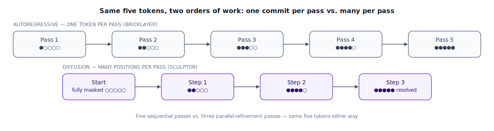

## The 30-second version

Every model you've probably used generates text **autoregressively**: it produces a single token, folds that token into its own context, and repeats — always moving forward, never looking ahead. A **diffusion language model** does something structurally different — it starts from a sequence that's entirely masked out and repeatedly reworks every position together, across a small number of passes, using attention that looks both backward and forward. The payoff is throughput: committing many tokens per step instead of one lets some diffusion systems report sustained speeds several times faster than a speed-tuned autoregressive setup. The cost is a real quality gap on knowledge-heavy and long-chain reasoning tasks, and a serving ecosystem that's years behind autoregressive models on caching and long-context handling. The honest 2026 read: a genuinely useful option for compact, well-structured generation such as code, not a stand-in for a frontier model — and the most production-relevant work is hybrids that borrow from both approaches rather than picking one.

## The analogy

A bricklayer builds a wall one course at a time. Course three can't go up until course two has set, and course two can't go up until course one has — the order is not optional, and at any moment there's exactly one active edge of the wall where new work is happening. The bricklayer also never has to reconsider a course that's already been laid; once it's mortared in, it's a fixed fact the rest of the wall gets built on top of.

A sculptor working a block of stone into a figure does something different. The first pass isn't "finish the head, then start an arm" — it's a rough blocking-out of the *entire* figure at once: an approximate head, approximate arms, approximate torso, none of it finished, all of it present. The second pass goes back over the *whole* piece again, refining every part a little further. The sculptor can be looking at the face and still decide the left arm needs adjusting, because the whole work in progress is visible at once — nothing about stone forces a left-to-right order the way gravity forces a bricklayer's courses.

That has a real consequence: if a client asks the sculptor to fix one flawed passage, they rework just that passage, leaving the rest untouched — no need to knock the whole piece down. Ask the bricklayer to fix a flaw in course two after course five is up, and that's a much bigger problem, since everything above the flaw was built assuming it was correct.

There's a speed dial hidden in the sculptor's approach that the bricklayer doesn't have: removing a lot of stone in each aggressive pass finishes fast but risks an uneven result needing more correction later; removing a little at a time across many careful passes is cleaner but far slower. The bricklayer has no equivalent dial — one course per step, always.

There's also a cost to the sculptor's freedom: the bricklayer can state exactly how many bricks remain and precisely what the finished wall will look like, since the blueprint is fixed and followed in strict order. The sculptor works from an approximate sense of "roughly how much stone is left," refined pass by pass — never quite a blueprint. And because the bricklayer never revisits a finished course, they keep a running, append-only tally of what's laid and never re-check it; the sculptor, revising the whole piece every pass, has no equivalent settled record.

| Bricklaying vs. sculpting | Diffusion language models |
|---|---|
| One course at a time, strict order, gravity-enforced | Autoregressive generation — one token per forward pass, strictly left to right |
| First pass roughs out the entire figure at once, nothing finished yet | The fully masked starting sequence — every position corrupted, none committed |
| Later passes refine the whole piece again, a little more each time | Iterative denoising steps — every position reworked together, across a small number of passes |
| The sculptor can rework the arm while focused on the face | Bidirectional attention — each position conditions on context in every direction |
| Reworking one flawed passage without rebuilding the whole piece | Infilling and multi-region editing — mask specific spans, regenerate just those |
| Removing more stone per pass for speed, at the cost of a rougher result | The unmasking schedule — commit more tokens per step for speed, fewer for quality |
| The bricklayer's exact blueprint and precise bricks-remaining count | An autoregressive model's exact likelihood |
| The sculptor's approximate, pass-by-pass sense of "how much is left" | Masked diffusion optimizing a likelihood *bound*, not an exact likelihood |
| The bricklayer's running, never-revisited tally of completed courses | An autoregressive model's append-only KV cache |
| The sculptor's lack of any equivalent settled record, since the whole piece keeps changing | Diffusion's difficulty maintaining a reusable cache across denoising steps |

## How it actually works

Follow the diagram's top row first: the autoregressive path commits exactly one new token per pass through the network, appending it to a growing, never-revisited record — five tokens cost five sequential passes, no way around it.

The bottom row is the diffusion path over the *same* five positions. It starts fully masked — nothing committed anywhere — and a single shared network (a "mask predictor") makes a prediction for *every* masked position in one forward pass. An **unmasking schedule** then picks a cutoff: predictions the network is most sure of get locked in, and the rest get thrown back into the masked pool for the next round. The process repeats, each step refining whatever's still uncertain, until every position is resolved. Three steps committing roughly two tokens per step, on average, produces the same five tokens the bricklayer produced one at a time across five passes — but in three passes instead of five, and the gap widens sharply as the unmasking schedule gets more aggressive.

The **bidirectional attention** that makes this possible — each position can condition on tokens in every direction, not just the ones already committed — is also what makes infilling native to the approach: masking a handful of scattered positions (say, updating a function's parameter name everywhere it appears — the signature, the docstring, every call site) and regenerating precisely those spots in a single pass, rather than stitching together several separate autoregressive edits.

The tradeoff lives entirely in the unmasking schedule. Commit many tokens per step and you get speed with a real risk of locally incoherent output, since positions were resolved with less certainty about their neighbors; commit few tokens per step and quality climbs back toward autoregressive levels while most of the speed advantage evaporates. There's no setting that gets both for free — every reported throughput number implicitly assumes a specific point on that dial, which is why the same model can look "several times faster" in one benchmark and much more modest in another.

The two approaches don't have to be mutually exclusive. **Block, or semi-autoregressive, designs** split a sequence into blocks and go autoregressive *across* blocks while diffusing *within* each one — a hybrid bricklayer-sculptor, laying blocks in strict order while sculpting the detail inside each block in parallel. That recovers a reusable, append-only cache at the block boundary and sensible variable-length output, since the sequence doesn't need a fixed total length up front. A second hybrid pairs the two the same way [speculative decoding](./speculative-decoding.mdx) pairs a small and large model: the diffusion side generates a whole candidate stretch at once, and an autoregressive model reviews it, keeping that reviewer's exact output distribution while still capturing most of diffusion's speed.

## A concrete example

Generate a 240-token structured code completion, comparing a speed-tuned autoregressive baseline against a diffusion model at two different points on its unmasking dial.

**Autoregressive baseline:** 220 tokens/sec sustained → 240 / 220 ≈ **1.09 seconds**.

**Diffusion, aggressive unmasking (commit ≈8 tokens per denoising step, each step costing about 7 ms — a parallel pass over the sequence, shaped like the compute-bound prefill pass rather than a memory-bound decode step):** 240 / 8 = 30 steps × 7 ms = **210 ms**. Speedup versus the baseline: 1,090 / 210 ≈ **5.2x faster**.

**Diffusion, conservative unmasking (commit ≈2 tokens per step, same 7 ms/step):** 240 / 2 = 120 steps × 7 ms = **840 ms**. Speedup versus the baseline: 1,090 / 840 ≈ **1.3x faster** — still an edge, but a small one, because the quality-preserving setting gives back most of the speed advantage the aggressive setting bought.

Same model, same task, same hardware — a 4x range in how much speedup you actually get, entirely from where the unmasking schedule is set. Any vendor benchmark quoting a single throughput number is quoting one point on this dial, almost always the aggressive end.

## The tradeoffs that matter

| Choice | Upside | Cost |
|---|---|---|
| Aggressive unmasking (many tokens/step) | Large throughput win — the headline number vendors report | Real risk of locally incoherent output; the number that needs your own eval, not theirs |
| Conservative unmasking (few tokens/step) | Quality closer to autoregressive levels | Gives back most of the speed advantage — sometimes down to a modest edge |
| Pure diffusion | Maximum parallelism, native infilling | Weak KV-caching, poor variable-length output, no frontier-quality option yet |
| Block / semi-autoregressive hybrid | Recovers caching and variable-length handling | Gives up some of pure diffusion's raw throughput ceiling |
| Diffusion-as-drafter + autoregressive verifier | Keeps the verifier's exact output distribution while gaining speed | Adds a second model and a verification step to operate |

## Where people go wrong

1. **Quoting a vendor's tokens-per-second number as quality-invariant.** It's a function of the unmasking schedule chosen for that specific benchmark, almost always the aggressive end of the dial.
2. **Treating diffusion as a frontier-quality replacement.** The gap on knowledge-heavy and long-chain reasoning tasks is real and, as of 2026, no diffusion model is frontier-class on those axes.
3. **Forgetting the caching gap.** Autoregressive serving has years of KV-cache and long-context optimization behind it that pure diffusion's ecosystem hasn't matched, which matters a lot for long conversational context.
4. **Assuming "faster" always means "cheaper."** The steps-per-token cost model only nets out favorably at some sequence lengths and unmasking settings — it needs checking on your actual workload, not assumed from a headline figure.
5. **Not distinguishing pure diffusion from block/hybrid systems when reading a benchmark claim.** The two have meaningfully different caching and long-context behavior, and a claim about one doesn't transfer cleanly to the other.

## The interview lens

Interviewers use this topic to see whether you understand the throughput gain as a *structural* tradeoff with a dial attached, not a free upgrade.

A strong sound bite: *"Diffusion doesn't reduce the amount of work a model does — it parallelizes how many tokens get committed per pass. The real lever is the unmasking schedule: commit more per step for speed, fewer for quality, and that single dial is most of the story."*

Likely follow-ups:

- Why does diffusion struggle with KV caching compared to an autoregressive model? (Bidirectional attention means every step can revise positions in light of the whole sequence, so there's no clean, append-only record the way an autoregressive model's cache provides — block/hybrid designs patch this by making the cache boundary align with block boundaries.)
- When would you pick diffusion over speculative decoding for a latency-sensitive workload? (Short-to-medium, structured output like code or bulk transforms where diffusion's own throughput is enough on its own — or a hybrid where diffusion drafts and an autoregressive model verifies, keeping that model's exact output distribution.)
- Why is code the current sweet spot rather than open-ended reasoning? (It's short-to-medium, structured, and tolerant of iterative refinement in a way long-chain, order-dependent reasoning isn't — and it's less exposed to the knowledge and hard-reasoning gap that's still real for diffusion in 2026.)

## Go deeper

- [Speculative Decoding](./speculative-decoding.mdx) — another route to committing several tokens per forward pass, and the diffusion-as-drafter hybrid that combines the two.
- [Transformer Architecture](../foundations/transformer-architecture.mdx) — the causal versus bidirectional attention mask that separates these two generation paradigms.
- [KV Cache and Context Caching](./kv-cache-and-context-caching.mdx) — the append-only cache mechanism pure diffusion can't cleanly reuse.
- Upstream reference: [Diffusion Language Models — AI System Design Guide](https://github.com/ombharatiya/ai-system-design-guide/blob/main/04-inference-optimization/08-diffusion-llms.md) (MIT; see [CREDITS](../../../CREDITS.md)).
