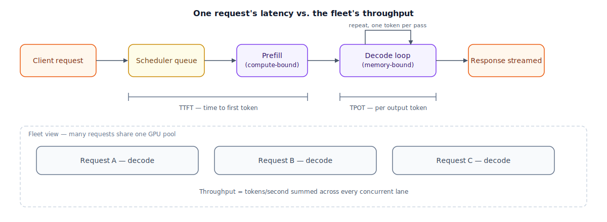

## The 30-second version

Production inference isn't graded on whether the model is smart — it's graded on a dashboard of operational numbers a platform team actually watches: how long before the first word shows up, how quickly words keep arriving after that, and how many total requests the fleet can churn through per second. Three numbers matter most: **TTFT** (time to first token), **TPOT** (time per output token), and **throughput** (aggregate tokens per second across every request sharing the hardware). They move independently — a fix that helps one can leave another untouched, or make it worse. "Inference fundamentals," as an operational skill, means knowing which of these three numbers a complaint is actually about, and reaching for the lever that moves that number specifically, instead of reflexively asking for a bigger GPU.

## The analogy

Picture a call center graded by a wallboard on the wall, not by transcripts of what agents actually said.

Three numbers scroll across that wallboard all day. **Time to answer** is how long a caller sits in hold music before a human voice picks up — nobody cares how good the eventual answer is if that number creeps past 30 seconds, because callers just hang up before they find out. **Pace per sentence** is how quickly, once an agent is talking, the next sentence of help arrives — an agent who nails the opening line and then goes silent for ten seconds mid-explanation feels broken, even though the call started instantly. **Calls handled per hour, across the whole floor** is the number the finance team watches — it isn't about any single caller, it's about whether the total staff and phone lines can absorb today's call volume without the queue growing without bound.

These three numbers move independently, and that independence is the entire management problem. Hiring one brilliant super-agent who answers instantly and talks fast doesn't fix a floor with only three phone lines during a 200-call afternoon — the queue backs up long before any individual agent's skill matters. Adding twenty phone lines doesn't help if the agents on them talk unbearably slowly. And giving every agent instant access to the caller's account history the moment the call connects fixes how fast the call *starts*, but does nothing for how fast the agent talks once they're actually explaining something.

| Call-center wallboard | Inference serving metric |
|---|---|
| Time to answer (hold-music duration) | TTFT — time to first token |
| Pace per sentence once an agent is talking | TPOT — time per output token |
| Calls handled per hour, across the floor | Throughput — aggregate tokens/second across concurrent requests |
| Total time on a call, start to hang-up | Total request latency |
| Pulling up the caller's full account file the instant the call connects | Prefill — one parallel pass over the whole prompt |
| Talking through the explanation, one sentence building on the last | Decode — one token at a time, sequentially |
| Number of open phone lines | Concurrent requests a GPU can hold in memory at once |
| Hiring a faster-talking agent vs. opening more phone lines | Optimizing per-request speed vs. scaling out capacity |

## How it actually works

Follow the diagram left to right, then look at the fleet view underneath. A request lands in a **scheduler queue** in front of the GPU fleet — even an idle GPU has some scheduling overhead, and a busy one can queue for a real stretch of time before a slot opens. From the moment the request arrives to the moment the first output token reaches the client, you've spent **TTFT**: queueing time, network overhead, and **prefill** — a compute-bound, fully parallel pass over the whole prompt (see [The Inference Pipeline](../foundations/inference-pipeline.mdx) for the forward-pass mechanics that prefill and decode both run on). Once that first token is out, the request drops into the **decode loop**: one token per iteration, each one paying **TPOT** — a cost dominated by how much data has to move through GPU memory to produce that single token, not by how much arithmetic is involved. TPOT is paid once per output token, so a longer answer costs proportionally more decode time, while TTFT is paid exactly once regardless of how long the eventual answer turns out to be.

Neither TTFT nor TPOT says anything about how many *other* requests the GPU is serving at the same moment — that's **throughput**, and it's a fleet-level number, not a per-request one. That's what the dashed box in the diagram represents: a single GPU running one request at a time wastes most of its capacity, because decode is memory-bound — while it waits on a memory read to produce token N, its compute units mostly sit idle. Running many requests' decode steps together (see [Batching Strategies](./batching-strategies.mdx)) fills that idle compute with other requests' work, so throughput scales with concurrency far faster than any single request's own TTFT or TPOT improves. That's the reason these three numbers need three different fixes, not one:

- **TTFT is high →** look at queueing (are requests waiting for a GPU slot before prefill even starts?) and prefill compute (long prompts, missing tensor parallelism, an attention kernel that isn't using a fused implementation). Adding GPU replicas or shortening prompts helps here; a faster memory bus mostly doesn't, because prefill is compute-bound, not memory-bound.
- **TPOT is high →** look at memory bandwidth per decode step: model size, numeric precision (FP16 vs. FP8), and how many key/value heads the model actually keeps per layer (see [grouped-query attention](../foundations/attention-mechanisms.mdx)). Quantizing weights or shrinking the KV cache helps here; adding more GPU replicas doesn't, because this is a per-request cost, not a fleet-capacity one.
- **Throughput is low even though any single request feels fast →** look at concurrency limits: how many requests fit in GPU memory at once, and how aggressively the scheduler batches them together. This is a capacity problem, solved by adding replicas or raising the safe concurrency ceiling — not by making any one request's own decode loop faster.

One hardware-level lever moves more than one of these at once. Newer GPU generations — Hopper's H100, Blackwell's B200 — support **FP8**, an 8-bit floating-point format, as a native tensor-core precision. Running weights and activations in FP8 instead of FP16 roughly halves the bytes moved per decode step and roughly doubles the achievable matrix-multiply rate during prefill, for a typically small accuracy cost. It improves TTFT, TPOT, and the concurrency ceiling behind throughput all at once — one of the few changes on this list that isn't a straight tradeoff between the three numbers.

## A concrete example

You're running a chat product on a single H100 GPU, serving a 13B-parameter model quantized to FP8. Load testing on this hardware gives you three baseline numbers: **TTFT ≈ 150 ms** (network and queueing ≈ 30 ms, prefill over a typical 800-token prompt ≈ 120 ms), **TPOT ≈ 20 ms/token**, and a measured ceiling of **40 concurrent decode streams** per GPU before TPOT starts drifting past that 20 ms target — past that point, requests compete hard enough for memory bandwidth that per-token latency degrades for everyone, not just the newest arrival.

A typical response runs 300 output tokens, so one full request costs:

Total latency = TTFT + (output tokens × TPOT) = 150 ms + (300 × 20 ms) = 150 ms + 6,000 ms ≈ **6.15 seconds**.

Traffic today arrives at a steady **5 requests/second**. By Little's Law — the number of requests in the system, on average, equals the arrival rate times the average time each spends in the system — you need:

Concurrency needed = 5 req/s × 6.15 s ≈ **30.75**, so roughly 31 requests are in flight (prefill or decode) at any given moment, on average.

That's comfortably under the 40-stream ceiling — one GPU covers today's load with about 9 streams of headroom before TPOT would start slipping.

Now say traffic grows to **8 requests/second**. Concurrency needed becomes 8 × 6.15 ≈ **49.2**, call it 50 — past the 40-stream ceiling of a single GPU. You have two levers here, and they are not interchangeable:

- **Scale out.** Add a second H100 behind a load balancer. Splitting 50 concurrent requests across two GPUs puts roughly 25 on each, comfortably under the 40-stream ceiling per GPU. This fixes throughput without changing TTFT or TPOT for any individual request at all.
- **Raise the ceiling itself.** The 40-stream number is set by how much KV-cache memory each decode stream needs, which is a function of model size and precision. This model is already running FP8; without that quantization, the same GPU might sustain something closer to 20 concurrent streams at the same TPOT target — FP8 is most of the reason 40 was reachable on one GPU in the first place.

Notice what a third option — buying a single faster GPU instead — would and wouldn't do. It might shave TPOT to 15 ms/token, which lowers latency for any one request, but it doesn't by itself change how many concurrent streams fit in memory. If the actual problem at 8 req/s is the throughput ceiling, faster silicon without more memory headroom or more replicas doesn't solve it — you'd ship the change and still watch the queue grow.

## The tradeoffs that matter

| Lever | Fixes | Doesn't fix | Cost |
|---|---|---|---|
| Add GPU replicas (scale out) | Throughput ceiling at higher traffic | Per-request TTFT or TPOT | Linear hardware cost; needs a load balancer/scheduler in front |
| Quantize to lower precision (e.g., FP8) | TPOT and prefill compute together, plus raises the concurrency ceiling | The network/queueing slice of TTFT | Small, usually modest, quality tax; needs hardware and kernel support |
| Raise the per-GPU concurrency limit | Throughput, on existing hardware | Latency for individual requests, which can rise near the ceiling | Requires KV-cache memory headroom; risks TPOT drift if pushed too far |
| Shorten prompts / cap context | TTFT (less prefill compute) | TPOT, throughput | Less context for the model to reason over; can hurt answer quality |
| Route simple requests to a smaller model | All three, for the routed slice of traffic | Nothing, for requests that genuinely need the larger model | Needs a reliable complexity classifier; a misroute is a silent quality bug |

A GPU replica bought to fix a throughput problem does nothing for a customer complaining that individual replies feel slow to *start* — that's TTFT, a queueing-and-prefill problem, not a fleet-capacity one, so buying capacity doesn't touch it. The reverse mistake is just as common: quantizing to fix TPOT, then wondering why the wallboard-level "requests per hour" number barely moved, when the real gap was that only 20 concurrent streams fit in memory before the quantization. Match the lever to the number you're actually missing, not the number that's easiest to change.

## Where people go wrong

1. **Saying "inference is slow" without saying which number.** TTFT, TPOT, and throughput move independently; a diagnosis that doesn't name one of the three isn't a diagnosis yet.
2. **Buying more GPUs to fix one slow request.** More replicas raise the ceiling on how many requests you can serve *at once*; they do nothing for how long any single one of them takes.
3. **Ignoring queueing time and blaming the model.** A request that waited two seconds for a free GPU slot before prefill even started looks, from the client's chair, identical to a model that's "just slow" — check the scheduler before you touch the model weights.
4. **Sizing capacity off average latency instead of the concurrency Little's Law implies.** Average TTFT and TPOT can look perfectly healthy right up until arrival rate crosses the point where required concurrency exceeds what the fleet can hold — then p99 latency falls off a cliff with no warning in the averages.
5. **Assuming a hardware upgrade is a free win across the board.** FP8 is unusually broad in what it improves — but most single levers here (bigger batch limits, more replicas, shorter prompts) trade one of the three numbers for another. There's rarely a change that improves all three for nothing.

## The interview lens

Interviewers use this topic to see whether you reach for a specific number before a specific fix — treating "the model is slow" as one undifferentiated complaint is the signal that you haven't separated the failure modes yet.

A strong sound bite: *"Before I touch anything, I ask whether we're missing TTFT, TPOT, or throughput, because the fix for a queueing problem, a memory-bandwidth problem, and a capacity problem look nothing alike — and the wrong one just wastes a deploy cycle."*

Likely follow-ups:

- Traffic doubles overnight and p99 latency spikes — where do you look first? (Compute concurrency needed via Little's Law and compare it to the fleet's actual concurrency ceiling; a capacity gap shows up as queueing delay, which inflates TTFT even though the model itself hasn't gotten any slower.)
- Why doesn't adding GPUs fix a single user's complaint that responses feel slow to start? (That's a per-request TTFT problem — queueing plus prefill — not a fleet-throughput problem; more replicas only help once concurrency, not per-request speed, is the actual bottleneck.)
- When would you quantize instead of scaling out? (When the concurrency ceiling itself is the constraint and you want to raise it without buying more hardware; quantization moves that ceiling directly, where an extra replica just adds more of the same ceiling.)

## Go deeper

- [The Inference Pipeline](../foundations/inference-pipeline.mdx) — the prefill/decode forward-pass mechanics that TTFT and TPOT are actually measuring.
- [Attention Mechanisms](../foundations/attention-mechanisms.mdx) — why the KV cache and grouped-query attention set the per-GPU concurrency ceiling.
- [Batching Strategies](./batching-strategies.mdx) — how a scheduler actually fills a GPU's idle compute during decode.
- Upstream reference: [Inference Fundamentals — AI System Design Guide](https://github.com/ombharatiya/ai-system-design-guide/blob/main/04-inference-optimization/01-inference-fundamentals.md) (MIT; see [CREDITS](../../../CREDITS.md)).
