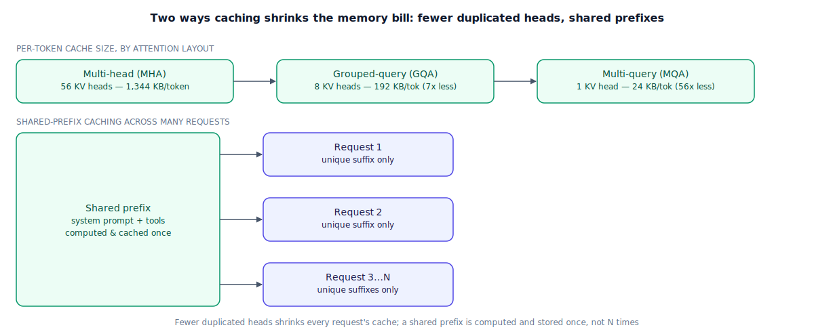

## The 30-second version

The KV (key-value) cache is what lets decode avoid re-reading the entire conversation on every single token (see [the inference pipeline](../foundations/inference-pipeline.mdx) for the basic mechanism). This chapter goes past that basic picture into the two questions that actually decide whether a serving fleet scales or falls over: how big does the cache get, and how much of it can be reused instead of rebuilt. Size is a design choice — **multi-head attention** keeps a full, separate cache entry per attention head, while **grouped-query** and **multi-query attention** collapse many heads onto a shared cache, trading a small quality tax for a large memory win. Reuse is an infrastructure choice — when many requests share an identical opening (a system prompt, a tool schema, a long shared document), a well-built serving stack computes that shared portion's cache exactly once and lets every request attach its own unique continuation to it, and API providers now price that same idea directly, discounting tokens that were already cached. Get either one wrong and the KV cache — not the model's weights — becomes the thing that runs out of room first.

## The analogy

A neighborhood coffee shop has a regular crowd, and the way the barista handles them says everything about how caching actually works.

Start with one regular, mid-visit. The first time they ordered today, the barista asked the full set of questions — drink, milk, size, extra shot, temperature, name for the cup. Once that's settled, the barista doesn't re-ask any of it for the rest of that visit; if the regular orders a second drink twenty minutes later, the barista just says "the usual, plus a scone?" That's the ordinary, single-conversation KV cache you'd already expect — nothing new there.

Here's where it gets interesting. Every regular who walks in during the morning rush hears the exact same specials announcement, word for word, because the shop reads it off the same board. If the barista mentally re-processed and re-memorized that announcement fresh for each of the day's two hundred customers, that would be two hundred redundant passes over identical information. A better-run shop writes the specials on the board once and every customer's order just references "the usual, plus whatever's on the board" — the shared part gets handled once, not once per person. That's **context caching across requests**: many different conversations that share an identical opening — a system prompt, a tool schema, a long shared reference document — get that shared opening cached exactly once, with each request's own, unique portion built on top of it.

Now, how much does the barista actually have to remember per regular? A shop with one barista per register, and every register independently keeping its own full notes on every regular, is carrying a lot of duplicated paperwork — the same information, copied at every station. A leaner shop groups registers into teams that share one notes card per team, or, leanest of all, keeps exactly one shared card for the whole counter. Fewer independent copies means less paper to carry around, and a small risk: if too many different registers are relying on one shared card, it can't capture every regular's idiosyncrasies quite as precisely as a fully private one would have.

And not every regular gets the same shelf life. Today's customers' notes sit on a sticky pad right by the register — instant to check. A regular who's been in three times this month lives in a binder under the counter — a beat slower to pull, still close by. Someone who hasn't shown up in six months has their old preferences archived in a filing cabinet in the back room, recoverable if they ever return, but not worth keeping within arm's reach in the meantime.

| Coffee shop | KV cache / context caching |
|---|---|
| The barista's running notes on one regular's current visit | The ordinary KV cache — keys and values for every token generated so far, this conversation |
| Every regular hearing the identical specials announcement | A shared prefix — a system prompt, tool schema, or document repeated verbatim across many requests |
| Writing the specials on a board once instead of repeating it to each of 200 customers | Prefix/context caching — the shared portion's KV cache computed and stored once, reused by every request that shares it |
| One register keeping a fully private notes card per regular | Multi-head attention — a separate, full-size KV cache entry per attention head |
| Several registers sharing one notes card per team | Grouped-query attention — several query heads share one KV head's cache, cutting memory at a small precision cost |
| The whole counter sharing exactly one notes card | Multi-query attention — every query head shares a single KV head's cache, the most aggressive memory cut |
| Today's regulars on the sticky pad by the register; older ones in a binder; rare visitors archived in back | Tiered cache storage — hot entries in GPU memory (VRAM), warmer ones in host RAM, cold ones on disk/SSD |

## How it actually works

Follow the diagram's top row first. The KV cache's per-token footprint is set by how many distinct key/value head "copies" the model keeps: `2 (K and V) × layers × kv_heads × head_dim × bytes_per_value`, per token. **Multi-head attention (MHA)** keeps one full KV head per query head — maximum fidelity, maximum memory. **Grouped-query attention (GQA)** puts several query heads on one shared KV head, so the `kv_heads` term in that formula shrinks directly, at a small, well-measured cost to output quality. **Multi-query attention (MQA)** takes that to its limit: every query head in every layer shares exactly one KV head, the smallest cache footprint available, with the largest quality tax of the three — noticeable enough on demanding tasks that GQA, the middle ground, is what most current production models actually ship with.

The bottom row is the other lever, and it doesn't touch attention math at all — it's about *reuse*. When many requests share an identical opening — a system prompt, a set of tool definitions, a long onboarding document every user's first message is anchored to — a serving engine that recognizes the shared prefix computes and caches its KV entries exactly once, then lets each request's unique continuation attach to that shared cache instead of recomputing it from scratch. Production engines implement this with a prefix-matching structure that can spot a shared opening across many different in-flight requests automatically, and a **copy-on-write** rule: everyone reads the same shared physical cache entries until a request's tokens actually diverge from the shared prefix, at which point — and only then — a private copy branches off for that request alone. Because VRAM is finite and not every cached prefix is being actively reused this second, engines tier storage: the hottest entries stay in GPU memory, warmer ones move to host RAM, and cold ones can be pushed to disk or SSD and pulled back if a matching request shows up later.

**API-level prompt caching** is the same idea, exposed as pricing. A provider that recognizes a repeated prefix across your calls charges a steep discount to *read* that cached segment on a repeat call, versus paying full input price to send it fresh every time — in exchange for a modest premium the first time that prefix is *written* into the cache. That write premium means caching isn't automatically a win on the very first call; it only pays for itself once a prefix gets reused enough times, which the concrete example below works out precisely.

## A concrete example

**Cache size, MHA versus GQA.** Take a 34B-class model: 48 layers, 128-dim heads, FP16 (2 bytes/value). Full multi-head attention with 56 heads: per-token cache = 2 × 48 × 56 × 128 × 2 bytes = 1,376,256 bytes ≈ **1,344 KB/token**. At a 32,768-token context, that's 1,344 KB × 32,768 ≈ **42 GB for a single request** — already a large fraction of a high-end GPU's total memory, before counting the model's own weights. Now switch to GQA with an 8:1 grouping (8 KV heads instead of 56): per-token cache = 2 × 48 × 8 × 128 × 2 bytes = 196,608 bytes = **192 KB/token**. Same 32,768-token context: 192 KB × 32,768 = **6 GB per request** — a **7x reduction** (56 ÷ 8 = 7, and 1,344 ÷ 192 = 7, consistent), meaning roughly 7 times as many long-context conversations fit in the same GPU memory footprint.

**Shared-prefix caching across requests.** A deployment's system prompt plus tool schema runs 4,000 tokens, identical across every call. In one hour, 500 requests share that exact prefix. Without prefix caching: 500 × 4,000 = **2,000,000 redundant prefill tokens** recomputed, and 500 separate full copies of that prefix's KV cache stored in memory. With prefix caching: that 4,000-token segment is computed and stored once, and each of the 500 requests attaches only its own unique continuation — cutting both the compute and the memory tied up in that shared segment by very close to 500x.

**API pricing break-even.** Say standard input tokens cost $3.00 per million, cached reads cost $0.30 per million (a 90% discount), and writing a segment into the cache carries a 25% premium over the standard rate — $3.75 per million. For that same 4,000-token prefix: writing it into the cache costs 4,000 × $3.75 / 1,000,000 = **$0.015**. Each subsequent cached read costs 4,000 × $0.30 / 1,000,000 = **$0.0012**, versus 4,000 × $3.00 / 1,000,000 = $0.012 paid at full price with no caching at all. Comparing like with like over N total calls — $0.015 + $0.0012 × (N − 1) with caching, versus $0.012 × N without — the two sides cross at N ≈ 1.28. Put differently: the write premium's *extra* cost over a normal call is just $0.003, and every reuse saves $0.0108, so caching has already paid for itself on the **first reuse** of that prefix. A prefix never reused at all is a net loss once the write premium is counted — caching is a bet on reuse, not a free discount.

## The tradeoffs that matter

| Choice | Upside | Cost |
|---|---|---|
| Multi-head attention (MHA) | Maximum representational fidelity — no shared-head approximation | Largest possible KV cache; often the first thing to exhaust GPU memory at long context |
| Grouped-query attention (GQA) | Large memory reduction (commonly 4–8x) for a small, well-measured quality cost | A real, if small, precision tax versus full MHA |
| Multi-query attention (MQA) | The smallest cache footprint of the three | The largest quality tax of the three — often skipped in favor of GQA for demanding tasks |
| Cross-request prefix caching | Saves both compute and memory on every request that shares a cached prefix | Needs infrastructure to detect shared prefixes and manage copy-on-write correctly |
| API-level prompt caching | Meaningfully cheaper on reused prefixes | A write premium on the first use; a net loss if the prefix is rarely reused |

## Where people go wrong

1. **Sizing GPU memory off model weights alone.** At long context or high concurrency, the KV cache routinely dwarfs the weights — the budget has to include it explicitly, not as an afterthought.
2. **Treating GQA's quality tax as negligible without checking the actual task.** It's usually small on average, but "usually small" isn't the same as measured on your own eval suite for your own workload.
3. **Assuming prefix caching happens automatically regardless of prompt structure.** A shared prefix only gets reused if it's byte-identical and positioned first in every request — put the variable, per-user part of the prompt before the shared system prompt, and there's nothing left to share.
4. **Turning on prompt caching without checking reuse volume.** The write premium means a prefix reused once or twice, especially a short one, can cost more than never caching it at all — it's an amortization bet, not an unconditional discount.
5. **Forgetting that a freed cache entry isn't automatically reusable memory.** Handing a slot back to the scheduler and actually reclaiming the physical memory behind it are two different problems — see [Paged Attention](./paged-attention.mdx) for how that gap gets closed.

## The interview lens

Interviewers use this topic to see whether you treat the KV cache as a first-class capacity constraint, not an implementation detail that lives below the level you need to reason about.

A strong sound bite: *"At long context or high concurrency, the KV cache is usually the actual memory ceiling, not the model's weights — so I'd size for it explicitly, reach for GQA to shrink the per-token cost, and check whether the traffic pattern has enough repeated structure to make prefix caching worth the write premium, instead of assuming either one is free."*

Likely follow-ups:

- Why does grouped-query attention save memory without a proportional quality loss? (Many query heads turn out to attend to similar patterns in practice, so sharing one KV representation across a group loses less than naively splitting the savings evenly across heads would suggest.)
- When does prompt caching *not* pay off? (Low-reuse prefixes, especially short ones, where the write premium exceeds what the discounted reads save — reuse volume, not prefix length alone, decides the break-even.)
- How would you decide between GQA and MQA for a given deployment? (Check the quality delta against your own eval suite at each grouping ratio; GQA is the common default because it captures most of the memory win with a smaller quality cost than MQA's more aggressive sharing.)

## Go deeper

- [The Inference Pipeline](../foundations/inference-pipeline.mdx) — the prefill/decode loop the KV cache exists to speed up in the first place.
- [Attention Mechanisms](../foundations/attention-mechanisms.mdx) — the query/key/value mechanics that multi-head, grouped-query, and multi-query attention are all variations on.
- [Paged Attention](./paged-attention.mdx) — how a serving engine actually manages this cache's physical memory once it's no longer one tidy contiguous block.
- Upstream reference: [KV Cache and Context Caching — AI System Design Guide](https://github.com/ombharatiya/ai-system-design-guide/blob/main/04-inference-optimization/02-kv-cache-and-context-caching.md) (MIT; see [CREDITS](../../../CREDITS.md)).
