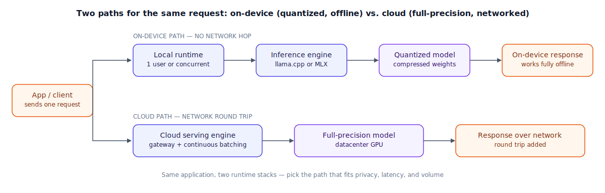

## The 30-second version

Plenty of production traffic never has to leave the building it originates in. A phone, a laptop, a workstation card, or a small box bolted into a piece of equipment can all host a language model directly, and teams reach for that option for reasons that have nothing to do with cost: data that legally can't leave a device, a system that has to keep working with no connection at all, or a latency budget too tight to survive a round trip to someone else's datacenter. Where most teams stumble is assuming the software that makes a local model trivial to spin up for one person is the same software that can stand behind a shared, concurrent endpoint — it isn't, and that gap is architectural rather than a configuration tweak. This chapter walks through the layered stack underneath a local deployment, the hardware ceiling that compression is built to push against, and a genuine cost comparison for when owning the hardware actually wins.

## The analogy

A food truck and a stadium's central commissary kitchen both feed people, and neither is a smaller or larger version of the other — they're built for different jobs entirely.

The truck is compact by necessity: one griddle, a mini-fridge, a menu short enough to keep every ingredient within arm's reach. To fit a full flavor profile into that tiny galley, it relies on concentrated, pre-portioned ingredients — a bouillon concentrate instead of a simmering stockpot. It loses a little depth doing that, but it's the only way the whole menu fits in a drawer instead of a walk-in. And the truck parks right outside your building — no drive across town, no dependence on anyone else's kitchen being open, works in a lot with no signal at all.

The stadium's central commissary is the opposite bet: a full brigade, a dozen stations firing in parallel, turning out thousands of orders across a hundred concession stands in one night. But that kitchen only makes financial sense because tens of thousands of fans are buying food *that specific night* — run it for a half-empty stadium and you're paying full staff for a fraction of the output. And if you're not in the stadium, you're not eating from that kitchen; there's a real trip involved.

Here's the trap a lot of people fall into: a food truck with one line cook takes orders strictly one at a time, boxing each before starting the next — fine for a slow afternoon, miserable the moment a real lunch rush shows up, since the fifth person in line waits for four orders to fully finish before their own even starts. A truck properly retrofitted with a real expo line — several small stations, an organized ticket rail — fires multiple orders at once without becoming the stadium's kitchen. It's still a food truck: compact, local, parked right outside. It's just been engineered for concurrency instead of assuming there's only ever one customer.

| Food truck vs. commissary | On-device / edge deployment |
|---|---|
| The truck's tiny galley — one griddle, a mini-fridge, a short menu | A quantized model sized to fit constrained VRAM or phone RAM |
| Concentrated, pre-portioned ingredients instead of a full stockpot | Quantization — compressed weight precision, a small quality tax for a much smaller footprint |
| Parked right outside, no drive across town, works with no signal | On-device inference — no network round trip, works fully offline |
| One line cook taking orders strictly one at a time | A single-user local runtime (Ollama, LM Studio) — serializes requests |
| The truck retrofitted with a real multi-station expo line | A production-grade local serving engine (vLLM) — continuous batching, many requests at once |
| The commissary's huge brigade, built for volume | A cloud serving engine on a datacenter GPU — full-precision model, high concurrency |
| The commissary only pencils out with a packed stadium | Cloud serving's cost math — favors steady, high, predictable volume |

## How it actually works

Follow the diagram's two rows: the same application request can take a local path or a cloud path, and the runtime stack looks different depending on which one it takes.

On the local side, there's a **layered stack**, and the layers are not substitutes for each other. An experience layer — Ollama, LM Studio — makes pulling and running a model a one-command affair, aimed squarely at a single developer trying something out. Underneath it sits an actual inference engine, usually llama.cpp (portable, CPU-and-GPU, the format most local tools build on) or Apple's MLX on Apple Silicon. That's the stack for prototyping, and it's a good one for that job.

The moment more than one person needs to hit that model at once, the experience layer stops being the right choice, for a structural reason rather than a tuning one: both tools hand out a strictly limited number of parallel slots and queue whatever doesn't fit, one request finishing fully before the next even begins. A real serving engine solves this the same way [Serving Infrastructure](./serving-infrastructure.mdx) solves it at datacenter scale — folding many requests' decode steps into one interleaved batch instead of a queue, and storing each request's KV cache in movable chunks instead of one locked-down block, so memory isn't wasted reserving space nobody's using yet. Retiring the single-user tool in favor of that architecture, while leaving the request format untouched so calling code doesn't need to change, is typically the whole fix once real concurrency shows up.

**Compressing the weights** is what makes the local side viable on constrained hardware in the first place. A workable rule of thumb: gigabytes of memory needed ≈ (parameters, in billions, times bits per weight) ÷ 8, then add the KV cache — which grows with both context length and how many requests run at once, see [KV Cache and Context Caching](./kv-cache-and-context-caching.mdx) — and pad by a sixth or so for the runtime itself. Moving from 16 bits per weight down to 4 shrinks that first term fourfold, which is routinely the gap between "won't fit on this box" and "fits with headroom left over."

**Mobile and embedded targets** push this further still: phones are memory- and bandwidth-constrained in a way laptops and workstations aren't, so realistic on-device phone models top out in the low single-digit billions of parameters, almost always at 4-bit precision, running through a mobile-native runtime rather than a server-oriented engine like vLLM.

Deciding between local and cloud comes down to a short list of factors: data that can't leave the device for privacy or residency reasons, a need to work fully offline, a hard latency floor that the network round trip alone would blow, or steady, predictable, high volume that justifies owning the hardware. Cloud wins when you need frontier-tier quality, when demand is spiky enough that idle reserved GPUs would waste money, when volume is too low to earn back the fixed cost of owning hardware, or when the team doesn't have the operational capacity to run and monitor a serving stack. Most shipped products end up splitting the difference by feature: whichever part of the app touches sensitive, offline, or latency-critical work stays on-device, and everything else is routed out to a hosted model.

## A concrete example

**Sizing hardware with quantization.** A 14B model's weights: at FP16, 14 × 16 / 8 = **28 GB** — too large for most single consumer GPUs even before KV cache. At Q4, 14 × 4 / 8 = **7 GB**; adding ~15% runtime overhead (≈1.05 GB) plus a modest KV cache for one user at an 8K context (≈1.5 GB) lands around **9.55 GB total** — comfortable on a 12 GB or 16 GB card, where the FP16 version wouldn't have fit at all.

**The concurrency gap, worked through.** Ten users each send a 300-token request to an 8B model on one GPU. A single-user local runtime serves them strictly in order at 45 tokens/sec: the 3,000 total tokens take 3,000 / 45 ≈ **66.7 seconds** to clear, and the tenth user waits the full stretch — 60 seconds for the nine ahead of them, plus their own 6.7-second turn. A production engine's continuous batching interleaves all ten streams at a combined ~380 tokens/sec: the same 3,000 tokens clear in 3,000 / 380 ≈ **7.9 seconds**, with every user finishing close to that mark instead of queuing. That's roughly an **8.4x** improvement for the user at the back of the line — from a different scheduling architecture, not better hardware.

**The break-even math, both ways.** A workstation GPU costs $2,000, amortized over 24 months (**$83.33/month**) plus **≈$25/month** in power — **$108.33/month fixed**, regardless of volume, up to its ceiling. At a sustained 90 tokens/sec, its maximum output is 90 × 86,400 × 30 ≈ **233.3M tokens/month**; below that ceiling, cost per million tokens falls as volume rises (at 20M tokens/month: $108.33 / 20M ≈ $5.42/M; at the 233.3M ceiling: $108.33 / 233.3M ≈ $0.46/M).

Compared against a frontier-priced API around **$5/M** blended, break-even lands at $108.33 / $5 ≈ **21.6M tokens/month** — comfortably inside the GPU's own ceiling, so any real volume above that clears it easily. Compared against a commodity-tier API around **$0.25/M** — realistic for a small open model in a competitive 2026 market — break-even needs $108.33 / $0.25 ≈ **433M tokens/month**, which *exceeds the GPU's own maximum output*. Against that price tier, this single small GPU can't win on raw cost no matter how hard you run it. The honest takeaway: local hardware clears break-even quickly against expensive APIs and may never clear it against the cheapest ones — the answer depends entirely on which price you're actually comparing against.

## The tradeoffs that matter

| Choice | Upside | Cost |
|---|---|---|
| Single-user local runtime (Ollama, LM Studio) | Trivial to start, zero setup, great for prototyping | Serializes under concurrency; not a safe shared backend |
| Production local serving engine (vLLM on-device) | Handles real concurrency, same architecture as datacenter serving | More setup and operational overhead than the experience-layer tools |
| Aggressive quantization (Q2/Q3) | Maximum memory savings | Measurable quality loss on math and reasoning-heavy tasks |
| Local / on-device deployment | No network hop, works offline, privacy-preserving | Fixed cost regardless of volume; capped by the hardware's own ceiling |
| Cloud API | No fixed cost, frontier-quality options, elastic to spiky demand | Costs scale with volume forever; a network hop on every call |

## Where people go wrong

1. **Shipping a prototype's runtime as the production backend.** Ollama or LM Studio serializing under concurrency is an architectural fact, not a tuning problem — it shows up the first time real traffic arrives.
2. **Sizing hardware off model weights alone.** The KV cache and runtime overhead are not rounding errors, especially at longer context or with more than one concurrent user.
3. **Assuming a chip's headline TOPS rating predicts LLM speed.** What actually gates a neural accelerator's real-world speed is which operations its compiler supports and how fast it can move data in and out, neither of which shows up in that marketing number.
4. **Treating "local" as automatically cheaper.** The break-even point depends entirely on which API price you'd otherwise pay — it's a real calculation, not a default assumption in either direction.
5. **Over-quantizing a reasoning-heavy workload to hit a memory target.** Q2/Q3 saves the most space and does the most damage to math and multi-step reasoning; that tradeoff needs to be deliberate, not incidental.

## The interview lens

Interviewers use this to check whether you understand *why* a prototyping tool and a production engine aren't the same thing, and whether you can actually run the break-even math instead of asserting a default.

A strong sound bite: *"Whatever got a local model running for you, alone, on your laptop this afternoon is almost never what should be answering a dozen people's requests at once — one hands out a single queue, the other turns concurrent demand into batched throughput, and that's a difference in architecture, not a flag you flip."*

Likely follow-ups:

- Your team built a demo on a single-user local tool and now needs to open it up to a whole department — what actually has to change? (Replace the single-user runtime with a concurrency-aware serving engine while keeping the request format stable so the app doesn't need rewriting, and re-check hardware sizing against the new number of simultaneous users.)
- When would you choose on-device over a cloud API? (Data that can't leave the device, offline or air-gapped requirements, a hard latency floor, or steady volume high enough to clear the break-even math against your actual API alternative.)
- How do you size hardware for a target model and quantization level? (Weight footprint from the params-times-bits rule, plus KV cache scaled to context length and concurrency, plus headroom for the runtime itself — sized against the specific card or device's memory ceiling.)

## Go deeper

- [Serving Infrastructure](./serving-infrastructure.mdx) — the continuous-batching and cache-management architecture a production local engine borrows from datacenter serving.
- [Quantization Deep Dive](../training/quantization-deep-dive.mdx) — the numerical methods behind the memory savings this chapter leans on.
- [Cost Optimization Playbook](./cost-optimization-playbook.mdx) — the same utilization and batching levers, applied to a fleet instead of one device.
- Upstream reference: [On-Device and Edge Deployment — AI System Design Guide](https://github.com/ombharatiya/ai-system-design-guide/blob/main/04-inference-optimization/09-on-device-and-edge-deployment.md) (MIT; see [CREDITS](../../../CREDITS.md)).
