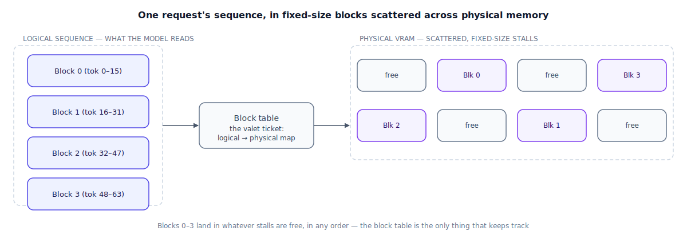

## The 30-second version

Knowing the KV cache is big (see [KV Cache and Context Caching](./kv-cache-and-context-caching.mdx)) doesn't tell you how to actually lay it out in GPU memory. The obvious approach — reserve one contiguous block per request, sized for the longest sequence it might ever reach — wastes enormous amounts of memory on requests that finish early, and leaves the rest scattered into gaps too small to reuse. **Paged Attention** fixes this the way an operating system's virtual memory fixes the same problem for RAM: split each request's cache into small, fixed-size blocks, let those blocks live anywhere in physical memory, and keep a lightweight table that maps each request's logical sequence position to wherever its block actually landed. Memory waste that used to run as high as 60–80% typically drops under 4%, which is the direct reason serving engines built on this idea can hold dramatically more concurrent requests in the same GPU. It's also the piece of infrastructure that makes [continuous batching](./batching-strategies.mdx)'s throughput promise real rather than theoretical.

## The analogy

A valet garage and an ordinary self-park lot solve the same problem — store a lot of cars — in very different ways, and the difference is the whole story here.

An ordinary lot reserves one contiguous stretch of curb per car for the length of its expected stay: pull in, and the spot is yours, blocked off, for however long you might conceivably be there. If your stay turns out to be ten minutes instead of the eight hours the spot was sized for, that curb space sits empty and reserved the rest of the day — wasted by over-provisioning. And once enough cars have come and gone at irregular lengths, the remaining open curb is broken into scattered, oddly-sized gaps: plenty of total free space, but not one stretch long enough for the next big vehicle that needs to park as a single contiguous unit.

A valet garage solves both problems by not reserving space in advance at all. Cars are parked in a large field of small, identical, fixed-size stalls, wherever a stall happens to be open right now — level two, back corner, wherever. Your car doesn't need a single contiguous run of stalls; it just needs enough stalls, anywhere in the structure, and the valet hands you a ticket that records exactly which stalls are yours, in what order, so your car — or, if you'd brought several vehicles as one party, all of them — can be retrieved correctly regardless of how spread out they physically are. Nothing is reserved on the promise of a future stay; a stall is claimed only once a car actually needs it, and released the instant that car leaves.

This setup pays off doubly when several parties share something in common. If two tour groups arrive in nearly identical convoys — say, the first four cars of each group are functionally interchangeable rental vans from the same reservation — the garage can point both groups' tickets at the very same physical stalls for that shared portion, only peeling off separate stalls once a group's cars actually diverge from the shared plan. And when the garage itself fills up, the valet can move some parked cars belonging to guests who aren't picking up soon to an overflow lot down the street, bringing them back on request — slower to retrieve, but nothing is lost.

| Valet garage | Paged Attention |
|---|---|
| One reserved, contiguous curb spot sized for a car's longest possible stay | Naive KV-cache allocation — one contiguous memory block reserved per request at its maximum possible length |
| Curb space sitting empty because the actual stay was much shorter than reserved | Internal fragmentation — memory reserved but never used, because the sequence finished early |
| Free curb space broken into scattered gaps too small for the next long car | External fragmentation — free memory that exists but isn't contiguous enough for the next request |
| Small, identical, fixed-size stalls scattered across the structure | Fixed-size KV-cache blocks (commonly 16 tokens each) |
| The valet ticket recording exactly which stalls hold your car, in order | The block table — the logical-to-physical mapping for each request's sequence |
| Two groups' shared convoy pointed at the same physical stalls until their cars diverge | Copy-on-write prefix sharing — identical KV blocks shared across requests until their tokens actually differ |
| Moving inactive guests' cars to an overflow lot, retrievable later | Swapping cold KV blocks out to host RAM or disk when GPU memory is full |

## How it actually works

Follow the diagram left to right. On the left, the model's logical view of a sequence is exactly what you'd expect: a clean, ordered run of positions, here shown as four consecutive blocks of 16 tokens each. That's the abstraction the attention computation reasons about — a contiguous run of keys and values to attend over. The block table in the middle is what makes that abstraction possible without it being physically true: for every logical block, it stores which physical block actually holds that data. On the right, physical VRAM is carved into that same fixed block size, but nothing about a request's blocks has to sit next to each other — the diagram's four blocks land in four scattered stalls, none adjacent, and the attention kernel simply follows the block table to gather them correctly at computation time.

This single change fixes both flavors of waste a naive allocator runs into. There's no more **internal fragmentation**, because memory is claimed one small block at a time, as a sequence actually grows, instead of reserved up front for a worst-case length that mostly never arrives. And there's no more **external fragmentation**, because every block is the same fixed size — any free block can satisfy any request's next allocation, so free memory scattered across the structure is never "too small" for what's being asked of it. A **block manager**, running underneath the scheduler, is what actually hands out and reclaims these blocks: when a new request starts, it's assigned blocks as it needs them rather than all at once, and when GPU memory runs tight, the manager can swap a currently-inactive request's blocks out to host RAM and pull them back if that request resumes.

The same mechanism that makes non-contiguous storage possible also makes an unrelated win nearly free: **prefix sharing**. If many concurrent requests share an identical opening — the same system prompt, the same long onboarding document — their block tables can simply point at the very same physical blocks for that shared span, rather than each request getting its own separate copy. Only once a request's tokens actually diverge from the shared prefix does the manager allocate it a private block, a **copy-on-write** rule borrowed directly from operating-system memory management. (See [KV Cache and Context Caching](./kv-cache-and-context-caching.mdx) for the caching-strategy side of this same idea.)

The payoff shows up directly in [batching](./batching-strategies.mdx): continuous batching depends on being able to hand a newly freed slot to a fresh request immediately, but that promise is empty if the memory backing the old request's cache can't be cleanly reclaimed and reassigned. Paged Attention is what makes that reclamation cheap and immediate — a handful of blocks change ownership in the block table, rather than a large, oddly-shaped chunk of memory being hunted for a new home.

## A concrete example

**Waste, before and after.** A naive allocator reserves a contiguous block sized for an 8,192-token maximum sequence length for every request, regardless of how long the response turns out to be. A request that generates only 400 tokens before hitting a stop condition still holds its full 8,192-token reservation — 7,792 tokens' worth of memory, or **95.1%** of that request's reserved space, sitting unused for the entire time it's alive. Averaged across a realistic mix of request lengths, naive contiguous allocation typically wastes somewhere in the 60–80% range; Paged Attention's fixed 16-token blocks mean a request only ever wastes, at most, a fraction of one final partially-filled block — pushing overall waste under roughly 4%.

**Concurrency, worked through.** Take a GPU with 80 GB of memory available for KV cache after weights, and requests that need up to 8,192 tokens of context. At 192 KB/token (a GQA-sized model — see [KV Cache and Context Caching](./kv-cache-and-context-caching.mdx) for that figure's derivation), a full 8,192-token reservation costs 192 KB × 8,192 ≈ **1.5 GB per request**, reserved whether or not the request ever gets close to using it. A naive allocator sizing for the worst case fits 80 GB / 1.5 GB ≈ **53 requests**, purely by reservation, regardless of their real lengths. Now say the realistic average completed length is only 1,200 tokens: real usage per request is 192 KB × 1,200 ≈ 225 MB, and a block-based allocator claiming memory as needed — with negligible per-block waste — fits roughly 80 GB / 225 MB ≈ **355 requests** in the same 80 GB. That's better than a **6.6x** increase in concurrent requests, from the identical hardware, purely from not reserving memory a request was never going to use.

**Prefix sharing, worked through.** 100 concurrent requests share an identical 2,000-token system prompt. Stored separately, that's 100 × 2,000 × 192 KB ≈ 37.5 GB just for 100 copies of the same information. Shared via copy-on-write, it's stored once — 2,000 × 192 KB ≈ 375 MB — freeing roughly **37 GB** for other requests' unique content on the same GPU.

## The tradeoffs that matter

| Choice | Upside | Cost |
|---|---|---|
| Naive contiguous allocation | Simple to implement; no block-table indirection at lookup time | 60–80% typical memory waste; hard ceiling on concurrent requests |
| Paged, block-based allocation | Waste under ~4%; dramatically higher concurrency on the same hardware | A block table and gather step add a small amount of lookup overhead per attention computation |
| Small block size (e.g., 16 tokens) | Less wasted space in a request's final, partially-filled block | More block-table entries to manage per request; slightly more bookkeeping overhead |
| Large block size | Less bookkeeping overhead per request | More wasted space in the last, partially-filled block of a short request |
| Copy-on-write prefix sharing | Large memory savings when many requests share a prefix | Extra logic to detect shared prefixes and correctly fork private blocks at the divergence point |

## Where people go wrong

1. **Assuming batch size alone determines throughput.** Without paged, block-based allocation, a naive allocator hits its concurrency ceiling from *reservation waste* long before compute becomes the actual bottleneck — the real limiter is usually memory management, not raw batch size.
2. **Treating the block table as free.** It's a small, real overhead per attention computation — negligible compared to the memory it saves, but not literally zero, and worth knowing when someone claims paging is "free."
3. **Missing that continuous batching depends on this.** A scheduler that wants to hand a freed slot to a new request immediately needs that request's old memory reclaimed just as immediately — without block-based allocation, "freeing a slot" and "freeing the memory behind it" aren't the same event.
4. **Assuming any two requests with similar prompts will share cache automatically.** Prefix sharing requires the shared portion to be token-for-token identical and positioned first — a prompt template with the variable content up front, and the shared instructions after it, shares nothing.
5. **Picking a block size without measuring the actual workload.** Very small blocks add bookkeeping overhead across the fleet; very large blocks waste more on short requests' final block — the right size depends on your traffic's real length distribution, not a default.

## The interview lens

Interviewers use this topic to check whether you connect a memory-management technique to the throughput number it actually enables, rather than describing it as an isolated trick.

A strong sound bite: *"Paged Attention borrows virtual memory's answer to fragmentation: stop reserving contiguous space up front, hand out small fixed-size blocks as they're actually needed, and track the mapping in a table. That's not just a memory optimization — it's the reason continuous batching's promise of an immediately reusable slot is actually true in practice, not just in theory."*

Likely follow-ups:

- Why does a naive allocator waste so much memory even before any request finishes? (It reserves a contiguous block sized for the worst-case sequence length at request start, so any request that finishes shorter than that ceiling — nearly all of them — leaves the unused remainder locked up for its entire lifetime.)
- How does prefix sharing interact with the block table? (Multiple requests' block tables point at the same physical blocks for a shared prefix; a private block is only allocated, copy-on-write, at the first token where that request's sequence actually diverges from the shared one.)
- What's the actual overhead this technique introduces? (A block table lookup and a gather step per attention computation — small relative to the memory savings, but real, and part of why block size is a genuine tuning decision rather than an arbitrary one.)

## Go deeper

- [Attention Mechanisms](../foundations/attention-mechanisms.mdx) — the query/key/value computation that has to gather scattered physical blocks correctly at every step.
- [KV Cache and Context Caching](./kv-cache-and-context-caching.mdx) — why the cache is big enough for this problem to matter in the first place, and the caching-strategy half of prefix sharing.
- [Serving Infrastructure](./serving-infrastructure.mdx) — the block manager and scheduler that sit on top of this allocation scheme in a production engine.
- Upstream reference: [Paged Attention — AI System Design Guide](https://github.com/ombharatiya/ai-system-design-guide/blob/main/04-inference-optimization/05-paged-attention.md) (MIT; see [CREDITS](../../../CREDITS.md)).
