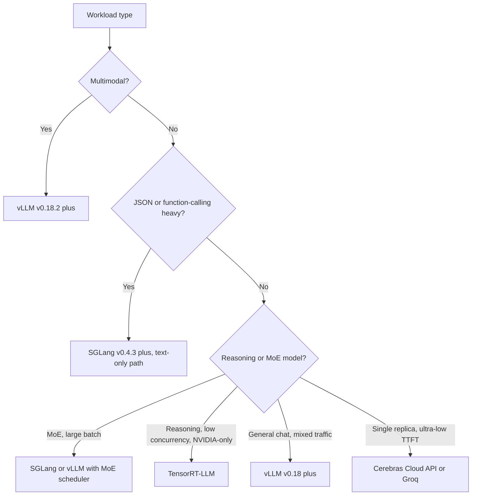

## The 30-second version

Deploying LLMs at scale requires a robust infrastructure layer that handles load balancing, model parallelism, and multi-tenant isolation. The focus has shifted from "serving a model" to "orchestrating an inference fleet."

## How it actually works

Deploying LLMs at scale requires a robust infrastructure layer that handles load balancing, model parallelism, and multi-tenant isolation. The focus has shifted from "serving a model" to "orchestrating an inference fleet."

## The Inference Gateway

The gateway is the "Traffic Controller" for your AI workload.

| Component | Responsibility |
|-----------|---------------------------|
| **Auth & Rate Limiting** | Token-based quotas and tenant isolation. |
| **Model Router** | Directing requests to specific model versions (Canary/A-B). |
| **Context Tracker** | Ensuring a user's prompt cache is sent to the same GPU node (Sticky sessions). |
| **Output Filter** | Real-time safety and PII scrubbing on streaming responses. |

## Model Parallelism

For models that don't fit on a single GPU (e.g., Llama 4 405B requires ~800GB VRAM), we must split them.

### 1. Tensor Parallelism (TP)
Splits individual layers/tensors across multiple GPUs.
- **Latency**: Low (Fastest).
- **Communication**: High (Requires NVLink).
- **Standard**: Used for 90% of production serving within a single node (8x GPUs).

### 2. Pipeline Parallelism (PP)
Splits different layers (e.g., layers 1-40 on GPU 1, 41-80 on GPU 2).
- **Latency**: High (Micro-batching overhead).
- **Efficiency**: Lower util (Bubble time).
- **Standard**: Used only for massive models spanning multiple nodes.

## Multi-GPU Orchestration

Kubernetes operators (like **Kube-Ray** or **Gloo**) manage "GPU Pools" in production.

- **Heterogeneous Clusters**: Mixing H100s for frontier models and L4s for small models in the same cluster.
- **Autoscaling**: Scaling based on **KV Cache utilization** rather than CPU or standard memory usage.
- **Cold Booting**: Using **Un-quantized Base Images** and loading weights from a high-speed Lustre/mount to reduce startup time from minutes to 15-20 seconds.

## Streaming and Long-Lived Connections

LLMs are almost always served via **Server-Sent Events (SSE)** or **WebSockets**.

**Infrastructure challenge**: Standard load balancers (Layer 4) struggle with long-lived AI connections.
- **The Fix**: Use **Layer 7 Load Balancers** (Envoy/Istio) that understand the "End of Sequence" token and can re-balance traffic *between* user turns rather than just at the connection level.

## May 2026 Inference Engine Landscape

By May 2026 the engine choice is no longer a question of "which one is fastest." Each leading engine has won a specific workload category, and the right answer is engine-per-workload rather than a single house engine. The map below is the practical one teams actually use.

### vLLM v0.18+: The Default Open Engine

[vLLM](https://docs.vllm.ai/) reached **v0.18** in Q1 2026, with point releases through May. What landed:

- **Blackwell Ultra (B300) support** in tree, including FP4 and dynamic sparsity ([vLLM v0.18 release notes](https://github.com/vllm-project/vllm/releases)).
- **PagedAttention v3** with NUMA-aware allocation; meaningful tail-latency wins on multi-socket hosts.
- **Disaggregated prefill / decode** behind a config flag, primarily for very long context workloads.
- **MoE schedulers** for Llama 4 Maverick, DeepSeek V4 Pro, Mixtral 8x22B with expert-residency-aware batching.

**Important security note**: vLLM patched a high-severity **multimodal RCE** ([GHSA published in February 2026](https://github.com/vllm-project/vllm/security/advisories)) that affected the multimodal preprocessor on versions before v0.18.2. **All multimodal vLLM deployments must run v0.18.2 or later.** The fix is a one-line patch but the CVE is real and exploitable through crafted image inputs. Upgrade.

vLLM remains the default open engine when the workload is "Llama / Mistral / Qwen / DeepSeek under continuous batching." It is not always the fastest, but it is the easiest to operate, the best-tested, and the most likely to receive a same-week patch for new vulnerabilities.

### SGLang v0.4.3+: Throughput Leader with Important Caveats

[SGLang](https://github.com/sgl-project/sglang) v0.4.3 (April 2026) is the throughput leader on several workloads:

- **~29% throughput advantage over vLLM** on structured-output / function-calling workloads in published benchmarks ([SGLang blog, April 2026](https://lmsys.org/blog/2024-12-04-sglang-v0-4/)). The win comes from **async constrained decoding** where the constraint compilation runs in parallel with the LLM forward pass.
- Best-in-class **RadixAttention** prefix-cache reuse for chat workloads.
- First-class **MoE serving** with expert-routing-aware batching.

**Critical security caveat as of May 2026**: SGLang has **unpatched RCEs in the multimodal and disaggregated-prefill code paths** ([SGLang security advisory, March 2026](https://github.com/sgl-project/sglang/security/advisories)). The text-only path is safe and is what every public benchmark uses. The multimodal path should be considered **not production-ready** until the patches land. Several large deployments have moved their multimodal traffic off SGLang back to vLLM v0.18.2 and kept SGLang for text-only function-calling workloads.

The right posture in May 2026: use SGLang for **text-only function-calling and structured-output workloads** where the throughput advantage matters; do not use SGLang for **multimodal or disaggregated-prefill production traffic** until the CVEs are patched.

### TensorRT-LLM: Peak NVIDIA Throughput, Operational Cost

[TensorRT-LLM](https://github.com/NVIDIA/TensorRT-LLM) remains the throughput leader on pure NVIDIA hardware:

- **Highest peak tokens/sec/$** on H200, B200, and B300 for hand-tuned models.
- Tight integration with **NVIDIA Triton** for serving and **NVIDIA NIM** for managed deployment.
- Custom kernels for **FP4 / FP8 on Blackwell Ultra**, often months ahead of open engines.

The cost is operational:

- Every new model needs an **engine build** (a multi-hour compilation step, model-and-GPU-specific).
- Pin to specific TensorRT and CUDA versions; upgrades are usually painful.
- **NVIDIA-only**. No path off CUDA without a full re-platform.

The decision is binary: if you are committed to NVIDIA for the next two years and have one or two flagship models that need every last token/sec, TensorRT-LLM pays. If you need engine flexibility, vendor-independence, or rapid model iteration, vLLM or SGLang is the better fit.

### MoE-Aware Serving (Llama 4 Maverick, DeepSeek V4 Pro)

MoE models broke the assumption that serving cost scales smoothly with batch size. The properties that matter for an MoE serving engine in May 2026:

- **Expert weight residency**: a 400B-parameter MoE with 17B active per token wastes most of its VRAM keeping unused experts hot. The engine has to be aware of expert-to-token routing and either pin hot experts or stream cold ones.
- **Expert routing latency**: the router decision happens **per token** and adds a measurable cost. Engines now batch routing decisions across the batch dimension.
- **Non-monotonic batching profile**: adding requests to the batch can *decrease* throughput if it forces a colder set of experts to be active. Optimal batch size depends on the **distribution of routing patterns** in the batch, not just batch count.
- **Pipeline-aware scheduling**: best engines schedule new requests into batches that share expert activations with the in-flight batch.

| Engine | Llama 4 Maverick (May 2026) | DeepSeek V4 Pro (May 2026) |
|--------|-----------------------------|-----------------------------|
| vLLM v0.18+ | Stable, MoE scheduler in tree | Stable |
| SGLang v0.4.3+ | Stable, throughput leader for batch >32 | Stable |
| TensorRT-LLM | Stable, throughput leader at low concurrency | Stable |

The interview-ready insight: **MoE serving is no longer "vLLM with bigger weights."** It is a different scheduling problem and the engines have all developed dedicated MoE paths in the last 12 months.

### Decision Framework: Engine per Workload

A more explicit mapping for the workloads teams actually deploy:

| Workload | Engine Choice (May 2026) | Why |
|----------|---------------------------|-----|
| Public chatbot (mixed traffic, must be patched fast) | **vLLM v0.18.2+** | Easiest to operate, best security cadence |
| JSON function-calling backend | **SGLang v0.4.3+** (text-only path) | ~29% throughput win on structured output |
| Single-model latency-critical (one model, one team) | **TensorRT-LLM** on B300 | Peak NVIDIA throughput, worth the operational cost at one model |
| Multimodal (image, audio, video in) | **vLLM v0.18.2+** | SGLang multimodal not yet patched |
| Reasoning model (long CoT, low concurrency) | **TensorRT-LLM** or **vLLM** with disaggregated prefill | Decode-bound, benefits from custom kernels |
| MoE model (Llama 4 Maverick, DeepSeek V4 Pro) | **vLLM v0.18+** or **SGLang v0.4.3+** with MoE scheduler | Both have first-class MoE paths now |
| Single-replica, sub-50ms TTFT | **Cerebras Cloud API** or **Groq LPU** | GPUs cannot hit this on a 70B+ model |

### Operational Posture in May 2026

- **Always be on a patched version.** Inference engines now have a CVE cadence comparable to web servers. Multimodal RCEs are not theoretical.
- **Run a canary on a second engine.** Production traffic on vLLM, 1-5% canary on SGLang or TensorRT-LLM, alert on quality or latency divergence. This catches engine-specific bugs and gives you a faster migration path.
- **Treat the engine as part of the deployment manifest.** A model is not "Llama 4 Maverick"; it is "Llama 4 Maverick on vLLM v0.18.3 with this batch config on this hardware." Pin all four.
- **Watch the security advisory feeds**, not just the release notes: [vLLM advisories](https://github.com/vllm-project/vllm/security/advisories), [SGLang advisories](https://github.com/sgl-project/sglang/security/advisories), [TensorRT-LLM CVE list](https://nvd.nist.gov/vuln/search/results?form_type=Basic&search_type=all&query=tensorrt-llm).

## References
- Narayanan et al. "Efficient Large-Scale Language Model Training on GPU Clusters Using Pipedream" (2019/2021)
- NVIDIA. "Megatron-LM: Training Multi-Billion Parameter Models on GPU Clusters" (2021)

*Next: [Cost Optimization Playbook](07-cost-optimization-playbook.md)*

## The interview lens

### Q: Why is Tensor Parallelism preferred over Pipeline Parallelism for low-latency serving?

**Strong answer:**
Tensor Parallelism (TP) performs the matrix multiplications of a single layer across multiple GPUs simultaneously. This means the latency of that layer is reduced by the number of GPUs. Pipeline Parallelism (PP), conversely, processes different layers sequentially. While GPU 2 is working on layers 40-80, GPU 1 is idle unless you have a deep pipeline of multiple requests (batching). For a single user's request, PP adds the latency of all GPUs, whereas TP divides the latency across all GPUs.

### Q: How do you handle "Noisy Neighbors" in a multi-tenant LLM cluster?

**Strong answer:**
We handle noisy neighbors through **Tiered Iteration-Level Scheduling**. Each tenant is assigned a "share" of the total GPU cycles. In the continuous batching loop, the scheduler ensures that a single tenant doesn't occupy 100% of the KV cache slots. If Tenant A is overwhelming the system, the scheduler will prioritize "Prefill" steps for Tenant B and C, or only process a subset of Tenant A's decode iterations per cycle. This is enforced at the Gateway via token-bucket rate limiting and at the serving engine via specific scheduling policies.

## Go deeper

- [Upstream chapter (Serving Infrastructure)](https://github.com/ombharatiya/ai-system-design-guide/blob/main/04-inference-optimization/06-serving-infrastructure.md)
- Related questions in the [question bank](/questions)
- Practice with [SPIDER walkthrough](/practice) or [mock interview](/mock)
