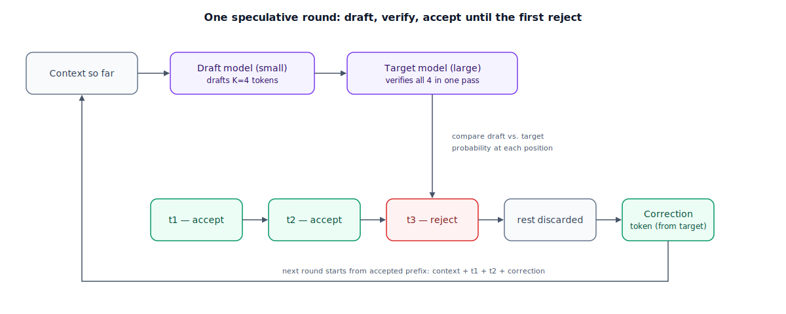

## The 30-second version

Decode is sequential and memory-bound: a large model pays the cost of reading its entire set of weights from GPU memory to produce a single token, then pays that same cost again for the next one (see [the inference pipeline](../foundations/inference-pipeline.mdx) for why). Speculative decoding attacks that tax directly. A small, fast "draft" model guesses several tokens ahead, and the large "target" model checks all of those guesses in one forward pass — the same pass it would have needed anyway just to produce a single token. When the draft's guesses hold up, you walk away with several tokens for close to the price of one target-model step. When they don't, you've paid for a wasted draft pass and gained nothing. The entire technique lives or dies on one number — how often the draft correctly predicts what the target would have produced, the **acceptance rate** — and, done correctly, the output is mathematically identical to running the target model alone, token by token. Nothing about the final text changes; only how fast you get there does.

## The analogy

A senior partner at a law firm drafts every clause of every contract personally. That's the safest way to guarantee the work is exactly what the partner would sign off on — but the partner bills at a rate that makes typing out routine boilerplate, clause by clause, an expensive way to spend an afternoon.

So the firm pairs the partner with a fast junior associate, who has read enough of the partner's past contracts to guess what the partner would write next, and drafts several clauses in a row without waiting for approval on each one. The partner then reads through that drafted block in a single pass, not clause by clause with a pause between each — reading is far faster than writing, so review takes a fraction of the time drafting the same clauses personally would have.

The partner approves clauses in order: clause one, does that match what I'd have written? Yes. Clause two? Also yes. Clause three? No — wrong boilerplate for this deal. The moment a clause is rejected, everything drafted *after* it is thrown out too, unread — it was written assuming clause three would stand, and it didn't, so anything built on it is worthless. The partner writes the correct version of clause three personally before the batch goes back to the associate.

The standard matters here: the partner isn't skimming for "good enough." An approved clause has to be provably what the partner would have written, not a close approximation rubber-stamped through — which is what keeps the final contract identical in quality to one the partner drafted entirely alone. The associate only ever changes how fast it gets produced, never what it says.

Where this pays off depends on the deal. On a routine lease the associate has drafted a hundred times, they nail clause after clause, and the partner spends the afternoon approving instead of writing. On a first-of-its-kind deal, the associate's guesses miss constantly, the partner ends up writing almost everything personally anyway, and the firm has also paid for the associate's wasted drafting time on top.

| Law firm | Speculative decoding |
|---|---|
| Junior associate drafting several clauses in a row, quickly | Draft model — small, fast, proposes K tokens sequentially |
| Senior partner reading the drafted block in one sitting, not clause by clause | Target model — verifies all K draft tokens in a single forward pass |
| Approving clauses from the first through the last one that matches the partner's judgment | Accepting draft tokens up to the first rejection |
| The first clause the partner wouldn't have written, and everything drafted after it | The first rejected token; every later draft token is discarded, since it was guessed on a rejected premise |
| The partner personally writing the corrected version of that one clause | The target model sampling one corrected token at the rejection point — a guaranteed new token every round |
| The standard: an approved clause is provably what the partner would have written, not "close enough" | Rejection sampling — the accepted output matches the target model's own probability distribution exactly |
| A routine contract the associate has drafted a hundred times | High-acceptance-rate text — predictable, templated generation |
| A first-of-its-kind, never-seen deal structure | Low-acceptance-rate text — novel, high-entropy, or high-temperature generation |

## How it actually works

Follow the diagram left to right, then down into the token-by-token outcome. Starting from whatever context has already been accepted, the draft model runs K sequential forward passes of its own — cheap, because it's small — proposing candidate tokens one after another. That part is still autoregressive and still memory-bound, but the model doing it is small enough that each step is fast.

Then the target model does something it wasn't built to do one token at a time: it scores all K candidate positions in a single forward pass, the same way it scores a prompt during prefill. This is the trick that makes the whole thing worth doing. Decode is normally memory-bound — the bottleneck is reading weights from GPU memory, not the arithmetic — so a single forward pass has spare compute sitting idle. Scoring four positions instead of one barely increases that pass's cost, because the memory read dominates either way: verifying K guesses costs close to what generating one token costs.

Verification itself uses **rejection sampling**, not a plausibility check. For each draft token, the target model compares its own probability for that token against the draft model's, and accepts it with probability capped by `min(1, p_target / p_draft)` — the target's own agreement decides how often a guess survives. The moment a token is rejected, everything the draft generated after it assumed a false premise and is discarded, regardless of how confident it looked. The target then samples one corrected token from its own leftover distribution at that position — the "leftover" mass after removing what the draft over- or under-weighted — which guarantees every round produces at least one new token, even if every draft guess is wrong. If all K draft tokens *are* accepted, the target throws in one additional free token at position K+1, since that forward pass already computed it.

Two details worth knowing, though neither changes the math above. **Draft length is often tuned dynamically**: a batch with spare GPU capacity can afford a larger K, since a wasted verification pass costs little, while a saturated batch wants a smaller K. And **not every implementation uses a separate model** — self-speculation approaches like Medusa bolt extra prediction heads onto the target's own final layer, one per lookahead offset, computed in the same forward pass as the ordinary next-token prediction. That avoids hosting a second model, at the cost of retraining the target to grow those heads, which get less accurate the further ahead they predict.

## A concrete example

The expected number of tokens produced per speculative round, drafting K tokens with a per-token acceptance rate of α (assumed roughly constant across positions), is:

`E[tokens per round] = (1 − α^(K+1)) / (1 − α)`

Take a 70B target model with a 45 ms sequential decode step, paired with a much smaller draft model at ~4 ms/step, drafting K = 4 tokens per round. Verifying those 4 tokens in one target-model pass costs about 46 ms — barely more than a single-token decode step.

**High acceptance (α = 0.7, routine text):** α⁵ = 0.168, so E[tokens] = (1 − 0.168) / 0.3 ≈ **2.77 tokens per round**. Round latency = 4 × 4 ms + 46 ms = 62 ms. Effective latency = 62 / 2.77 ≈ 22.4 ms/token, against a 45 ms/token baseline — a **2.0x speedup**.

**Marginal acceptance (α = 0.3, mixed text):** α⁵ = 0.00243, E[tokens] = 0.998 / 0.7 ≈ **1.43 tokens per round**. Same 62 ms round latency ÷ 1.43 ≈ 43.5 ms/token — only about **3% faster** than plain decoding, barely worth the added complexity.

**Low acceptance (α = 0.15, open-ended creative writing at high temperature):** α⁵ ≈ 0.00008, E[tokens] ≈ 1 / 0.85 ≈ **1.18 tokens per round**. 62 / 1.18 ≈ 52.7 ms/token — **17% slower** than just running the target model alone, because the draft model's wasted work is now costing more than the occasional accepted guess saves.

The lesson in those three numbers: speculative decoding isn't a fixed win, it's a bet sized by the acceptance rate, and the same K and the same two models can help, barely matter, or actively hurt depending entirely on what's being generated.

## The tradeoffs that matter

| Choice | Upside | Cost |
|---|---|---|
| Separate draft model (classic speculative decoding) | Works with any target model; no retraining required | Extra VRAM and KV-cache management for a second model; draft and target must share a tokenizer |
| Self-speculation (Medusa-style extra heads) | No second model to host, deploy, or keep in sync | Requires fine-tuning the target model to add heads; accuracy drops off further ahead each head predicts |
| Larger K (more draft tokens per round) | More upside on rounds where acceptance stays high | More wasted draft compute on an early rejection; higher latency variance |
| Smaller K | Less wasted work when a rejection comes early | Caps the best-case speedup even on easy, high-acceptance text |
| Dynamic K, tuned per batch | Captures upside when the GPU has spare capacity, avoids waste when it doesn't | Extra scheduling logic in the serving engine |

## Where people go wrong

1. **Assuming it's free throughput.** It costs draft-model compute and memory whether or not the guesses land — on adversarial or highly creative text, that cost can exceed the benefit, as the 17%-slower case above shows.
2. **Treating acceptance rate as fixed.** It moves with temperature, task type, and even which prompt you're on; a pipeline tuned against one workload can quietly regress on another without a line of code changing.
3. **Picking one K and leaving it forever.** The right draft length depends on the current acceptance rate and how saturated the GPU already is — a static K either leaves speedup on the table or wastes draft compute, depending on the hour.
4. **Forgetting the tokenizer constraint.** Draft and target must share a vocabulary; you can't swap in "whatever small model is fast" without checking compatibility first.
5. **Assuming any accept/reject scheme preserves quality.** Proper rejection sampling is provably lossless; a naive "keep the draft's guess if it looks plausible" shortcut isn't, and will quietly drift the output.

## The interview lens

Interviewers use this topic to see whether you can reason about a *conditional* speedup rather than reciting "2-3x" as a fixed fact.

A strong sound bite: *"Speculative decoding doesn't make the target model faster — it makes each of its forward passes worth more, by checking several guesses instead of producing one. The whole payoff rides on the acceptance rate, so I'd ask what the workload's entropy looks like before I promise any specific speedup."*

Likely follow-ups:

- Why is verifying K draft tokens roughly the same cost as generating one token? (It's a parallel, compute-bound pass over K positions — shaped like prefill, not decode — and decode's bottleneck is memory bandwidth, not arithmetic, so extra positions barely move the cost.)
- Why does the output distribution stay exactly correct instead of drifting toward the draft model's biases? (Rejection sampling accepts a token in proportion to how much the target agrees with it, and resamples from the leftover distribution on rejection — the accepted stream is indistinguishable from sampling the target alone.)
- When would you turn it off? (Low-acceptance workloads like high-temperature creative writing, target models too small to justify a second model, or GPU-saturated batches where the "free" verification compute isn't free anymore.)

## Go deeper

- [The Inference Pipeline](../foundations/inference-pipeline.mdx) — prefill versus decode, the cost asymmetry this technique exploits.
- [Batching Strategies](./batching-strategies.mdx) — why draft length gets tuned against how saturated the current batch already is.
- [Diffusion Language Models](./diffusion-llms.mdx) — a different route to committing several tokens per forward pass, including a hybrid where diffusion drafts for an autoregressive verifier.
- Upstream reference: [Speculative Decoding — AI System Design Guide](https://github.com/ombharatiya/ai-system-design-guide/blob/main/04-inference-optimization/03-speculative-decoding.md) (MIT; see [CREDITS](../../../CREDITS.md)).
