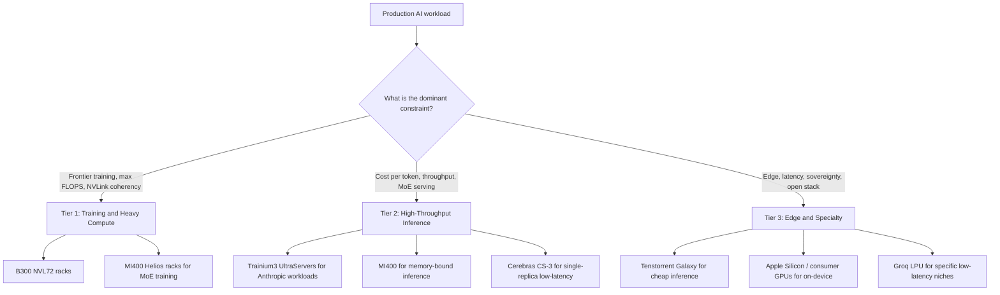

## The 30-second version

Building production LLM systems requires understanding deployment options, scaling patterns, and operational concerns. This chapter covers the infrastructure layer.

## How it actually works

Building production LLM systems requires understanding deployment options, scaling patterns, and operational concerns. This chapter covers the infrastructure layer.


## Deployment Options

### API vs Self-Hosted

| Factor | API Providers | Self-Hosted |
|--------|---------------|-------------|
| Setup time | Minutes | Days to weeks |
| Operational burden | None | Significant |
| Cost at low volume | Lower | Higher (fixed costs) |
| Cost at high volume | Higher | Lower (scale economics) |
| Latency control | Limited | Full control |
| Data privacy | Data leaves your infra | Data stays local |
| Model selection | Provider's models | Any open model |
| Customization | Fine-tuning via API | Full control |

### When to Use API Providers

```python
# Decision framework
def should_use_api(requirements: dict) -> bool:
    # Strong signals for API
    if requirements["time_to_market"] == "urgent":
        return True
    if requirements["query_volume"] < 100_000_per_month:
        return True
    if requirements["team_ml_expertise"] == "low":
        return True
    
    # Strong signals for self-hosted
    if requirements["data_residency"] == "strict":
        return False
    if requirements["latency_p99_ms"] < 100:
        return False
    if requirements["query_volume"] > 10_000_000_per_month:
        return False
    
    # Default to API for simplicity
    return True
```

### Self-Hosting Options

| Option | Complexity | Performance | Use Case |
|--------|------------|-------------|----------|
| vLLM | Medium | Excellent | Production serving |
| TGI (HuggingFace) | Medium | Very good | HuggingFace ecosystem |
| TensorRT-LLM | High | Best (NVIDIA) | Maximum performance |
| Ollama | Low | Good | Development, small scale |
| llama.cpp | Low | Good | CPU inference, edge |

## Serving Architecture

### Single Model Serving

```
┌─────────────┐     ┌─────────────┐     ┌─────────────┐
│   Client    │────▶│   Gateway   │────▶│  LLM Server │
└─────────────┘     └─────────────┘     └─────────────┘
                           │
                           ▼
                    ┌─────────────┐
                    │    Cache    │
                    └─────────────┘
```

### Multi-Model Serving

```
                    ┌─────────────────────────────── │
                    │         Load Balancer          │
                    └───────────────┬────────────────┘
                                    │
            ┌───────────────────────┼───────────────────────┐
            │                       │                       │
            ▼                       ▼                       ▼
    ┌───────────────┐       ┌───────────────┐       ┌───────────────┐
    │  GPT-4 Pool   │       │  Claude Pool  │       │ Llama 70B Pool│
    │  (API calls)  │       │  (API calls)  │       │ (self-hosted) │
    └───────────────┘       └───────────────┘       └───────────────┘
```

### Model Router Pattern

```python
class ModelRouter:
    def __init__(self):
        self.models = {
            "simple": GPT4oMini(),
            "complex": Claude35Sonnet(),
            "code": Claude35Sonnet(),
            "long_context": Gemini15Pro(),
            "vision": GPT4o()
        }
        self.classifier = QueryClassifier()
    
    async def route(self, request: Request) -> Response:
        # Classify request type
        request_type = self.classifier.classify(request)
        
        # Route to appropriate model
        model = self.models[request_type]
        
        # Execute with fallback
        try:
            return await model.generate(request)
        except RateLimitError:
            return await self.fallback(request, request_type)
    
    async def fallback(self, request: Request, original_type: str) -> Response:
        # Define fallback order
        fallbacks = {
            "simple": ["complex", "long_context"],
            "complex": ["simple"],
            "code": ["complex"]
        }
        
        for fallback_type in fallbacks.get(original_type, []):
            try:
                return await self.models[fallback_type].generate(request)
            except Exception:
                continue
        
        raise ServiceUnavailableError("All models unavailable")
```

## Scaling Patterns

### Horizontal Scaling

```python
# Kubernetes HPA config for LLM service
hpa_config = """
apiVersion: autoscaling/v2
kind: HorizontalPodAutoscaler
metadata:
  name: llm-service-hpa
spec:
  scaleTargetRef:
    apiVersion: apps/v1
    kind: Deployment
    name: llm-service
  minReplicas: 2
  maxReplicas: 20
  metrics:
  - type: Resource
    resource:
      name: cpu
      target:
        type: Utilization
        averageUtilization: 70
  - type: Pods
    pods:
      metric:
        name: requests_per_second
      target:
        type: AverageValue
        averageValue: 100
"""
```

### GPU Scaling for Self-Hosted

| Scale | GPUs | Suggested Setup |
|-------|------|-----------------|
| Dev/Test | 1 | Single A10G or L4 |
| Small prod | 2-4 | 2x A100 with tensor parallel |
| Medium prod | 4-8 | 4x H100 with tensor parallel |
| Large prod | 8+ | Multi-node with pipeline parallel |

### Queue-Based Architecture

For high-throughput async workloads:

```
┌─────────────┐     ┌─────────────┐     ┌─────────────┐
│  Producers  │────▶│    Queue    │────▶│  Consumers  │
└─────────────┘     │  (Redis/    │     │  (LLM       │
                    │   SQS)      │     │   Workers)  │
                    └─────────────┘     └─────────────┘
                                               │
                                               ▼
                                        ┌─────────────┐
                                        │  Results    │
                                        │  Store      │
                                        └─────────────┘
```

```python
class AsyncLLMProcessor:
    def __init__(self):
        self.queue = RedisQueue("llm_requests")
        self.results = RedisResults("llm_results")
    
    async def submit(self, request: Request) -> str:
        request_id = generate_id()
        await self.queue.enqueue({
            "id": request_id,
            "request": request.to_dict()
        })
        return request_id
    
    async def get_result(self, request_id: str, timeout: int = 300) -> Response:
        return await self.results.wait_for(request_id, timeout)
    
    # Worker process
    async def worker_loop(self):
        while True:
            job = await self.queue.dequeue()
            try:
                result = await self.llm.generate(job["request"])
                await self.results.store(job["id"], result)
            except Exception as e:
                await self.results.store_error(job["id"], str(e))
```

## Cost Management

### Cost Tracking

```python
class CostTracker:
    # Pricing as of December 2025 (verify current rates)
    PRICING = {
        "gpt-4o": {"input": 2.50, "output": 10.00},  # per 1M tokens
        "gpt-4o-mini": {"input": 0.15, "output": 0.60},
        "claude-3.5-sonnet": {"input": 3.00, "output": 15.00},
        "claude-3.5-haiku": {"input": 0.25, "output": 1.25},
    }
    
    def calculate_cost(
        self,
        model: str,
        input_tokens: int,
        output_tokens: int
    ) -> float:
        pricing = self.PRICING[model]
        input_cost = (input_tokens / 1_000_000) * pricing["input"]
        output_cost = (output_tokens / 1_000_000) * pricing["output"]
        return input_cost + output_cost
    
    def track(self, request_id: str, model: str, tokens: dict):
        cost = self.calculate_cost(
            model,
            tokens["input"],
            tokens["output"]
        )
        
        self.metrics.record(
            "llm_cost",
            cost,
            tags={"model": model, "request_id": request_id}
        )
        
        return cost
```

### Cost Optimization Strategies

| Strategy | Savings | Implementation |
|----------|---------|----------------|
| Model routing | 50-80% | Route simple queries to cheap models |
| Caching | 30-70% | Cache frequent queries |
| Prompt optimization | 10-30% | Shorter prompts, structured output |
| Batch API | 50% | Use batch endpoints for async work |
| Self-hosting | Variable | At scale, can be cheaper |

### Budget Alerts

```python
class BudgetManager:
    def __init__(self, daily_budget: float, alert_threshold: float = 0.8):
        self.daily_budget = daily_budget
        self.alert_threshold = alert_threshold
    
    async def check_and_alert(self):
        today_cost = await self.get_today_cost()
        utilization = today_cost / self.daily_budget
        
        if utilization >= 1.0:
            await self.alert("CRITICAL: Daily budget exceeded", today_cost)
            # Consider enabling cost controls
            await self.enable_rate_limiting()
        elif utilization >= self.alert_threshold:
            await self.alert("WARNING: Approaching daily budget", today_cost)
    
    async def enable_rate_limiting(self):
        # Reduce throughput to stay within budget
        self.rate_limiter.set_rate(
            requests_per_minute=self.calculate_safe_rate()
        )
```

## Monitoring and Alerting

### Key Metrics

```python
LLM_METRICS = {
    # Latency
    "ttft_seconds": "Time to first token",
    "total_latency_seconds": "Total request time",
    
    # Throughput
    "requests_per_second": "Request rate",
    "tokens_per_second": "Token generation rate",
    
    # Resources
    "gpu_utilization": "GPU compute usage",
    "gpu_memory_utilization": "GPU memory usage",
    "kv_cache_utilization": "KV cache usage",
    
    # Quality (sampled)
    "quality_score": "LLM-as-judge score",
    "faithfulness_score": "RAG faithfulness",
    
    # Errors
    "error_rate": "Failed requests percentage",
    "rate_limit_hits": "Rate limit rejections",
    
    # Cost
    "cost_per_request": "Average cost per request",
    "daily_cost": "Total daily spend"
}
```

### Alert Configuration

```yaml
alerts:
  - name: high_error_rate
    condition: error_rate > 0.05
    for: 5m
    severity: critical
    
  - name: high_latency
    condition: p99_latency > 10s
    for: 5m
    severity: warning
    
  - name: cost_spike
    condition: hourly_cost > 2 * avg_hourly_cost
    for: 1h
    severity: warning
    
  - name: quality_degradation
    condition: avg_quality_score < 3.5
    for: 30m
    severity: warning
    
  - name: gpu_memory_pressure
    condition: gpu_memory_utilization > 0.95
    for: 5m
    severity: warning
```

## Disaster Recovery

### Multi-Provider Failover

```python
class MultiProviderClient:
    def __init__(self):
        self.providers = [
            OpenAIClient(),
            AnthropicClient(),
            GoogleClient()
        ]
        self.primary = 0
    
    async def generate(self, request: Request) -> Response:
        # Try primary provider first
        try:
            return await self.providers[self.primary].generate(request)
        except (RateLimitError, ServiceError) as e:
            return await self.failover(request, e)
    
    async def failover(self, request: Request, original_error: Exception) -> Response:
        for i, provider in enumerate(self.providers):
            if i == self.primary:
                continue
            try:
                response = await provider.generate(request)
                # Log failover for monitoring
                self.log_failover(self.primary, i, original_error)
                return response
            except Exception:
                continue
        
        raise AllProvidersUnavailable("All LLM providers failed")
```

### Graceful Degradation

```python
class GracefulDegradation:
    def __init__(self):
        self.cache = ResponseCache()
        self.fallback_responses = FallbackResponses()
    
    async def handle_outage(self, request: Request) -> Response:
        # Level 1: Try cache
        cached = await self.cache.get_similar(request.query)
        if cached and cached.similarity > 0.9:
            return Response(
                content=cached.response,
                metadata={"source": "cache", "degraded": True}
            )
        
        # Level 2: Try fallback responses
        fallback = self.fallback_responses.get(request.intent)
        if fallback:
            return Response(
                content=fallback,
                metadata={"source": "fallback", "degraded": True}
            )
        
        # Level 3: Graceful error
        return Response(
            content="I am currently experiencing issues. Please try again later or contact support.",
            metadata={"source": "error", "degraded": True}
        )
```

## May 2026 AI Accelerator Landscape

The hardware picture has shifted faster between January and May 2026 than at any previous moment in the AI build-out. The capacity announcements add up to **over a trillion dollars in committed cloud spend** and the supply chain is no longer single-vendor. This section is the snapshot a senior architect should be carrying into capacity-planning conversations in May 2026.

### NVIDIA Blackwell Ultra (B300 / GB300 NVL72)

The flagship is the **B300** ("Blackwell Ultra"), shipping in volume since January 2026 ([NVIDIA newsroom announcement](https://nvidianews.nvidia.com/news/nvidia-blackwell-ultra-ai-factory-platform-paves-way-for-age-of-ai-reasoning)).

| Spec | B300 / GB300 NVL72 |
|------|---------------------|
| HBM3e per GPU | 288 GB |
| Peak FP4 (sparse) | ~15 PFLOPS |
| Form factor | NVL72 rack: 72 Blackwell Ultra GPUs + 36 Grace CPUs |
| Aggregate NVLink bandwidth in NVL72 | ~130 TB/s |
| Total HBM per NVL72 | ~20 TB |
| Projected racks shipping in 2026 | ~60,000 (Jensen Huang, GTC 2026 keynote) |

The strategic pitch is "AI factories": the NVL72 is sold as the smallest unit of a coherent, NVLink-domain inference / training cell rather than as individual cards. For frontier model training (Anthropic, OpenAI, Google's external work) and the largest reasoning-model inference workloads, this is still the default in May 2026.

The trade-off has stayed the same: highest absolute performance, highest absolute price, deepest software lock-in. CUDA, NCCL, and TensorRT-LLM all assume NVIDIA. If you architect around them, you have committed.

### AMD MI400 and Helios Rack

[AMD's MI400](https://ir.amd.com/news-events/press-releases/detail/1252/amd-introduces-fifth-generation-instinct-mi400-series) (announced Q4 2025, sampling Q1 2026, GA mid-2026) is the credible second source.

| Spec | MI400 |
|------|-------|
| Memory | HBM4, **432 GB** per GPU |
| Memory bandwidth | ~20 TB/s |
| Peak FP4 | ~13 PFLOPS |
| Rack solution | **Helios**: EPYC Venice CPUs, MI400 GPUs, Pensando Vulcano 800Gb NICs |
| Software | ROCm 7.x with PyTorch / vLLM / SGLang first-class support |

The 432 GB per GPU is the headline: it sits more than 50% above the B300's 288 GB. For MoE serving (where the limiting factor is keeping expert weights resident) and for KV-cache-heavy long-context workloads, the per-GPU memory advantage is real. AMD has also closed most of the software gap; ROCm 7.x is no longer the disqualifier it was in 2023. Open-source serving frameworks routinely test on both.

The catch: **production deployment maturity**. NVIDIA has shipped at scale to every hyperscaler for two generations; AMD is still ramping the volume side of the supply chain. Hyperscalers (Meta, Microsoft, Oracle Cloud, and notably the AWS Trainium fleet for non-Trainium workloads) are running mixed fleets.

### AWS Trainium3 and the Anthropic $100B+ Deal

In November 2025, Anthropic and AWS announced an expansion to **up to 5 gigawatts** of compute capacity through 2026, anchored on Trainium chips and described as a **"$100B+" deal** ([AWS news release](https://press.aboutamazon.com/2025/11/anthropic-and-aws-announce-100-billion-strategic-partnership-investment-to-expand-trainium-compute-and-collaborate-on-ai-frontier-research)).

Key numbers:

| Spec | Trainium3 |
|------|-----------|
| Process node | 3nm |
| Configuration | **Trn3 UltraServer** with **144 chips** per system |
| Peak perf vs T2 | **~4.4x** in target workloads |
| Memory | HBM3e |
| Networking | NeuronLink across the UltraServer; EFA across the cluster |

The strategic implication: AWS now has a credible vertically-integrated AI fabric (Trainium silicon + Annapurna networking + EC2 + Bedrock). For inference-heavy workloads on Anthropic models, the price/performance is competitive with NVIDIA on H200-class hardware and improving toward B300 parity by end of 2026.

The constraint: Trainium runs the **AWS Neuron SDK**, not CUDA. Porting a stack means rebuilding kernels, retesting numerics, and re-tuning batching. Worth it at scale, painful at small scale.

### Cerebras IPO (May 2026)

Cerebras priced its IPO on **May 14, 2026** at **$185/share** and raised roughly **$5.55B**, opening above $190 and closing the first day near a **~$100B** valuation ([CNBC coverage](https://www.cnbc.com/2026/05/14/cerebras-ipo-priced.html); [The Register](https://www.theregister.com/2026/05/15/cerebras_ipo/)).

What changed in the market because of it:

- **AWS partnered with Cerebras** for high-throughput inference ([AWS / Cerebras blog post](https://aws.amazon.com/blogs/machine-learning/cerebras-on-aws/)). The pitch is Trainium3 for serving Anthropic and other in-house workloads, Cerebras for ultra-low-latency Llama / OSS workloads.
- The CS-3 wafer-scale engine remains the only credible option for **single-chip, single-replica inference of a 70B+ model** at &lt;50ms TTFT.
- The Cerebras Cloud API has been used as a quick second source for teams whose primary stack is GPU-based and want a latency edge without porting.

The IPO is structurally important because it changes the financing thesis: there is now a public-market path for a non-NVIDIA inference vendor, which makes it cheaper for the next entrants to raise.

### Tenstorrent Galaxy Blackhole

[Tenstorrent's Galaxy](https://tenstorrent.com/hardware/galaxy) reached general availability on **April 28, 2026** ([The Register](https://www.theregister.com/2026/04/28/tenstorrent_galaxy_ga/); [EE Times](https://www.eetimes.com/tenstorrent-launches-blackhole-galaxy/)).

| Spec | Galaxy Blackhole |
|------|------------------|
| Per-server | **32 Blackhole chips** |
| Per-chip | RISC-V cores, Tensix tiles, no external memory hierarchy |
| Peak BlockFP8 | **~23 PFLOPS** per server |
| Memory | LPDDR4X (chip-attached) + on-chip SRAM |
| List price | **~$110,000** per 32-chip server |
| Architecture | Fully open RISC-V control plane, open firmware, open compiler |

The open-source RISC-V story matters for two audiences:

- **Hyperscalers and sovereign clouds** that want a non-CUDA stack with full visibility into firmware and toolchain.
- **Research labs** building custom kernels who hit walls with CUDA's closed bits.

At $110K per server, Galaxy is roughly an order of magnitude cheaper than a comparable NVIDIA inference rack for some workloads. It is not a frontier-training competitor. It is an inference and small-fine-tuning competitor where the per-dollar argument is overwhelming.

### Stargate and the Scale of Cloud Commitments

The capacity story is no longer just about chips; it is about the buildings around them.

- **Stargate** (OpenAI / Oracle / SoftBank joint venture) has committed roughly **$1.4 trillion in total cloud spend** across the program ([OpenAI announcement page](https://openai.com/index/stargate-update/)).
- The **Abilene, Texas** flagship site is online at **1.2 GW** as of Q1 2026, with multi-gigawatt expansions under construction across **seven announced sites** totaling roughly **7 GW** of planned capacity.
- Over **$400B** has already been invested or contracted toward this footprint per public filings and announcements (Oracle Q3 FY26 earnings, [SoftBank investor materials](https://group.softbank/en/ir)).

The architectural implication for senior engineers: the marginal cost of inference for frontier-model providers is dropping faster than the public API pricing would suggest. Spot capacity, off-peak inference batching, and multi-region failover are all easier in 2026 because the underlying buildings exist.

### A Three-Tier Fleet Strategy



| Tier | What It Serves | Default Hardware | Why |
|------|----------------|-------------------|-----|
| **Tier 1: Training and Heavy Compute** | Frontier model training, reasoning-heavy inference, multi-trillion-parameter MoE | **B300 NVL72**, **MI400 Helios** | Need NVLink-class coherency and the largest HBM pools available |
| **Tier 2: High-Throughput Inference** | API products, RAG backends, agent platforms | **Trainium3**, **MI400**, **Cerebras CS-3**, **B300** | Optimize for cost per token and predictable P99, often MoE-aware |
| **Tier 3: Edge and Specialty** | Latency-critical, sovereign, open-source-firmware mandated, low total spend | **Tenstorrent Galaxy**, **Apple Silicon**, consumer GPUs, **Groq LPU** | $/perf, open stack, regulatory locality |

The framing that matters in 2026: **no senior architect designs a serious AI product around a single vendor anymore**. The capacity is too contested, the price moves too fast, and the failure modes are too correlated within a single vendor's stack. Multi-vendor is the new default.

### Take-Aways for Capacity Planning

- Plan around **memory per accelerator** as much as FLOPS. MoE serving is bottlenecked on expert residency.
- Treat **CUDA lock-in as a real cost**. ROCm 7.x is good enough for most production serving. Neuron is good enough for Anthropic and any team willing to do the porting work. Open RISC-V is good enough for cost-sensitive inference.
- The hyperscaler choice now drives the chip choice as much as the other way around. AWS = Trainium + Cerebras + some NVIDIA. Microsoft = NVIDIA + Maia. Google = TPU + some NVIDIA. Oracle = NVIDIA at scale.
- **$/token** has been falling roughly 3-5x per year through 2025 and 2026 ([a16z State of AI Compute](https://a16z.com/state-of-ai-compute-2026/)). Long-term contracts at 2024 prices are now usually a worse deal than spot.


## References

- vLLM: https://docs.vllm.ai/
- TensorRT-LLM: https://github.com/NVIDIA/TensorRT-LLM
- Text Generation Inference: https://huggingface.co/docs/text-generation-inference
- OpenAI Pricing: https://openai.com/pricing
- Anthropic Pricing: https://www.anthropic.com/pricing

*Next: [CI/CD for LLM Applications](02-cicd.md)*

## The interview lens

### Q: How would you design infrastructure for 1M LLM queries per day?

**Strong answer:**

"At 1M queries per day, that is about 12 queries per second on average, with peaks potentially 3-5x higher. Here is my approach:

**Architecture:**
- Load balancer distributing across multiple API endpoints
- Model router for cost optimization (route simple queries to cheaper models)
- Redis cache for frequent queries
- Queue-based processing for async workloads

**Cost optimization is critical at this scale:**
- Route 60-70% of simple queries to GPT-4o-mini or Claude Haiku
- Implement semantic caching (30%+ cache hit rate target)
- Use batch API for non-urgent requests (50% discount)
- At this volume, self-hosting becomes cost-competitive

**Reliability:**
- Multi-provider setup with automatic failover
- Rate limiting per user to prevent abuse
- Queue-based architecture for handling spikes
- Graceful degradation when providers are unavailable

**Monitoring:**
- Real-time cost tracking with budget alerts
- Latency percentiles (p50, p95, p99)
- Quality metrics sampled continuously
- Error rate and rate-limit hit tracking

At 1M queries with average 2K tokens, using GPT-4o would cost about $25K/day. With routing and caching, I can reduce this to $5-8K/day."

### Q: When would you self-host vs use API providers?

**Strong answer:**

"My decision framework considers several factors:

**Use API providers when:**
- Volume is under 1M queries/month (cost crossover point)
- Time-to-market is critical
- Team lacks GPU infrastructure expertise
- You want the latest models immediately
- Workload is variable and hard to predict

**Self-host when:**
- Data cannot leave your infrastructure (compliance, security)
- Volume exceeds 10M queries/month (significant savings)
- You need latency under 100ms P99
- You need custom model weights or fine-tuning
- You want full control over model behavior

**Hybrid approach often works best:**
- Self-host for high-volume predictable workloads
- API for spikes and specialized models
- API as fallback for self-hosted failures

The hidden costs of self-hosting: GPU procurement/rental, engineering time for ops, model updates, monitoring infrastructure. Factor in at least 1-2 dedicated engineers for infrastructure."

## Go deeper

- [Upstream chapter (LLM Infrastructure)](https://github.com/ombharatiya/ai-system-design-guide/blob/main/11-infrastructure-and-mlops/01-llm-infrastructure.md)
- Related questions in the [question bank](/questions)
- Practice with [SPIDER walkthrough](/practice) or [mock interview](/mock)
