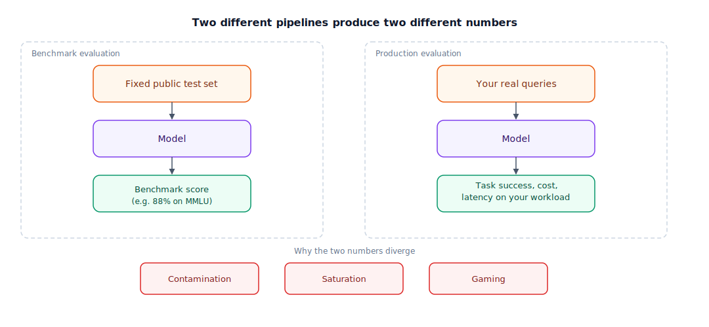

## The 30-second version

A benchmark score is a single number produced under fixed, known conditions — which makes it exactly as trustworthy, and exactly as gameable, as any other standardized test. Three things quietly erode what a leaderboard number tells you: **contamination** (test questions leaking into training data), **saturation** (frontier models clustering within a point or two of each other, so the number stops discriminating), and **gaming** (tuning specifically toward the benchmarks reporters cite). None of that makes benchmarks useless — they're a legitimate first filter. It means the real evaluation is the one you build yourself, on your own data, measuring the thing you actually ship.

## The analogy

Every new car sold in the US carries a window sticker with an official fuel-economy number, produced by running the car through a fixed, standardized lab test: a specific speed profile, a specific temperature, a dynamometer instead of real roads. That number is genuinely useful for comparing two cars quickly — but it is not a promise about your mileage.

Three things break the connection between the sticker and your driveway. First, **the test is fixed and public** — manufacturers know exactly what conditions it's run under, and they can, and do, tune specifically for it. The most notorious version of this wasn't subtle tuning at all: a "defeat device" that detected when a car was on the test cycle and switched to a cleaner, lower-power mode it never used on the road. That's what benchmark gaming looks like — not lying about the number, but optimizing specifically toward how the number gets measured.

Second, **every car on the lot has converged toward the same number.** Once every manufacturer knows the test and optimizes for it, sticker numbers cluster near the top of what the test can measure, and stop telling you much about which car is actually more efficient. That's saturation — when everyone scores 29–31 mpg, the sticker stops discriminating between a genuinely efficient car and one that's merely well-tuned for the test cycle.

Third, and this is the one that actually decides your fuel bill: **your driving doesn't look like the test cycle.** Stop-and-go city traffic, hills, a roof rack, a winter that needs the heater running — none of that is in the lab number. Two cars with an identical 30 mpg sticker can differ by 20% in what you actually get, because your commute isn't the dynamometer's speed profile. The only number that actually predicts your fuel bill is the one you measure yourself, on your own commute, over a few real tanks of gas.

| Fuel-economy sticker | Benchmark score |
|---|---|
| EPA's fixed lab test cycle | A public benchmark's fixed question set |
| The window-sticker mpg number | A leaderboard score (e.g., "88% on MMLU") |
| A defeat device tuned to detect the test cycle | Training specifically toward, or on, benchmark questions |
| Every car's sticker clustering near the top of the scale | Benchmark saturation — frontier models within a point of each other |
| Your actual commute: traffic, hills, cargo, weather | Your actual production traffic: domain, format, cost/latency limits |
| A test drive on your own kind of roads | Your own held-out eval set on your actual use case |

## How it actually works

The diagram's left side is what a leaderboard measures; the right side is what you actually need to know. Three mechanisms widen the gap between them.

**Contamination.** Pretraining corpora scrape a huge share of the public internet, and popular benchmarks — their questions, and often their answer keys — are on the public internet too. A model can score well partly because it memorized rather than reasoned. Newer, held-out benchmarks and contamination-detection techniques exist, but you can't fully verify a lab's contamination status from outside.

**Saturation.** As models genuinely improve, they cluster near a benchmark's ceiling — especially on tasks with a hard maximum, like multiple choice — and the remaining gap becomes noise-dominated rather than signal. A 1–2 point difference between two frontier models stops being a meaningful basis for a decision.

**Gaming.** Aggregate scores hide category-level variance. A model can be tuned — deliberately, or as a side effect of general improvement — to do disproportionately well on the specific tasks a leaderboard measures, without that improvement transferring to your domain. Add **format mismatch** on top: many popular benchmarks are multiple-choice or short-answer, while production tasks are usually free-form generation, tool use, or long-form writing — a benchmark testing a different skill than the one you need.

The fix is building your own evaluation. Define what "good" means for your task as a concrete rubric, not a vibe. Assemble 100+ real examples from your actual domain, stratified by difficulty and category. Score with a mix of methods: exact or semantic match where ground truth is objective, LLM-as-judge for open-ended quality, and a sampled human review to catch judge blind spots. Keep a held-out slice you never touch during prompt or model tuning, so you don't fall into the same leakage problem a contaminated benchmark has, self-inflicted. Then validate in production — shadow traffic before it's user-facing, a real A/B test once you're confident, and ongoing monitoring, because eval-time and live performance still diverge under real traffic and adversarial inputs.

## A concrete example

You're picking a model for a support-ticket triage classifier. On MMLU, the two finalists differ by 1.4 points — 86.9% vs. 88.3% — which is inside the noise band for a saturated benchmark; it tells you almost nothing.

You build a 150-ticket held-out set stratified across your five ticket categories (billing, technical, returns, account, refund-policy), score each response against a defined correctness rubric using an LLM-as-judge, and audit 20% of the judged output by hand. You also measure latency and cost per ticket.

The result: **Model A** resolves 91% of billing tickets correctly but only 74% of the rarer, higher-stakes refund-policy category. **Model B** is flatter across categories — 85% on both — at 40% lower cost per ticket. The benchmark said "roughly tied." Your own evaluation said "use Model B for the general queue, and route refund-policy tickets specifically to Model A" — a decision the aggregate MMLU score had no way to surface, because it never broke performance down by category or measured cost at all.

## The tradeoffs that matter

| Evaluation method | What it buys | What it costs |
|---|---|---|
| Public benchmark filtering | Fast, cheap, zero setup | Contamination/saturation/gaming risk; doesn't reflect your domain |
| Custom eval set (100+ examples) | Reflects your actual task and domain | Real upfront cost to build; needs periodic refresh as your product changes |
| LLM-as-judge | Scales to thousands of examples cheaply | Can share blind spots with the model being judged; needs a rubric and periodic calibration against humans |
| Full human review | Most trustworthy on subjective quality | Slow and expensive; doesn't scale past a sample |
| Shadow mode / A/B in production | The only true measure of real-world performance | Requires live traffic and real user risk exposure; slow to reach significance |

## Where people go wrong

1. **Picking a model off a leaderboard difference inside the noise band.** A 1–2 point gap on a saturated benchmark isn't a basis for a decision — run your own comparison.
2. **Treating an aggregate score as uniform.** The model that wins on average can be the weaker choice on the one category that matters most to you.
3. **Evaluating quality without evaluating cost and latency in the same table.** A model that's 2 points better and 5x more expensive isn't automatically the right call.
4. **Reusing the same examples for both prompt tuning and final evaluation.** That's the same leakage problem as benchmark contamination, just self-inflicted.
5. **Running each candidate once and calling it a comparison.** LLM outputs are stochastic; a single run per model tells you less than you think — rerun at temperature > 0 and look at the spread.

## The interview lens

Interviewers use this topic to see whether you treat a benchmark score as evidence to be weighed, or as a verdict to be trusted.

A strong sound bite: *"A benchmark number is a lab test result, not a road test — it tells me a model can perform under fixed conditions I don't operate under, so before I trust a leaderboard gap I check whether it's bigger than the noise, and either way I still build my own eval on my own traffic before I ship."*

Likely follow-ups:

- Why is MMLU insufficient for evaluating a production use case? (Domain and format mismatch, contamination risk, and an aggregate score that hides category-level variance.)
- How would you build an evaluation pipeline for a new use case in a week? (Define a rubric, assemble a stratified 100+ example set, score with LLM-as-judge plus a human-audited sample, hold out a slice you never tune against.)
- How do you handle LLM-judge bias? (Calibrate the judge against human ratings on a sample, watch for the judge favoring its own model family's style, and keep a human-reviewed slice as a check.)

## Go deeper

- [Model Taxonomy](./model-taxonomy.mdx) — the axes that make two models genuinely different, which a single benchmark score collapses into one number.
- [Model Selection Guide](./model-selection-guide.mdx) — turning an evaluation result into a production model choice.
- [Pricing and Costs](./pricing-and-costs.mdx) — folding cost into the quality comparison, not just accuracy.
- Upstream reference: [Capability Assessment — AI System Design Guide](https://github.com/ombharatiya/ai-system-design-guide/blob/main/02-model-landscape/02-capability-assessment.md) (MIT; see [CREDITS](../../../CREDITS.md)).
