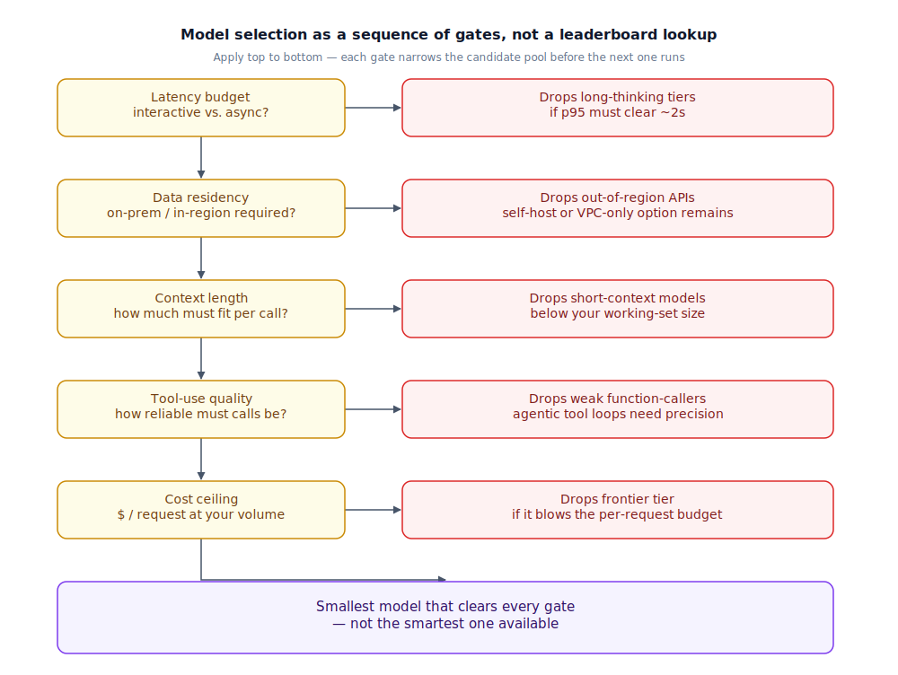

## The 30-second version

Picking a model for production isn't "which one wins the leaderboard" — it's a sequence of hard constraints that eliminate candidates before quality even gets a vote. Latency budget rules out anything too slow for your p95. Compliance rules out anything that can't legally touch your data. Context length rules out anything that can't hold your working set. Tool-use quality rules out anything that fumbles the calls your system depends on. Cost ceiling rules out anything you can't afford at your real volume. Whatever survives all five gates is your candidate pool — inside it, pick the cheapest, fastest model that clears your quality bar, not the smartest one available. "Just use the smartest model" is the most common mistake here, because it skips every gate that actually decides whether the system works in production.

## The analogy

Think about how you actually choose a doctor, not in the abstract, but for a specific problem you have right now.

For a sinus infection, you don't request the hospital's most decorated specialist — the chief of a subspecialty department, booked three weeks out, at a specialist copay. You see a general practitioner today, for a fraction of the cost, and you're better by Friday. The chief surgeon isn't wrong for anything; they're wrong for *this* case, which doesn't need that much capability, can't wait three weeks, and doesn't justify the cost.

Now swap the case: a rare autoimmune condition that's stumped two other doctors. The GP is now the wrong choice — not incompetent, just built for a different scale of problem. You wait the three weeks and pay the specialist rate, because the case demands that capability.

Every choice in between is a real decision. Same-day telehealth, or an in-person exam next month? In-network, or out — the medical equivalent of a provider whose data-handling terms compliance won't sign off on? Credentialed to prescribe, or only able to give advice — the difference between a model that reliably calls your production tools and one that just describes what it would do? Booking the most credentialed specialist for a problem a GP handles fine isn't caution; it's a slower, pricier path to the same outcome.

| Choosing a doctor | Choosing a model |
|---|---|
| General practitioner, same-day appointment | A smaller, faster, cheaper model for routine requests |
| Subspecialist, three-week wait, specialist copay | A frontier flagship model for genuinely hard requests |
| "Can this be a same-day telehealth visit?" | Latency budget: does the task tolerate a few seconds, or need sub-second response? |
| In-network vs. out-of-network insurance | Data residency / compliance: can this provider legally touch your data at all? |
| A doctor who needs your full chart vs. one who just needs today's symptoms | Context length: how much has to fit in a single call? |
| Credentialed to prescribe vs. only able to give advice | Tool-use quality: can it reliably call your production functions? |
| Booking the chief surgeon for a sinus infection | Defaulting to the flagship model for every request, regardless of need |
| A rare condition that genuinely needs the specialist | A task that genuinely needs frontier-tier reasoning, and is worth the wait and the cost |

## How it actually works

The diagram walks five gates top to bottom — apply them in order, each one narrowing the candidate pool before the next even runs.

**Gate 1 — latency budget.** Interactive (a user watching a screen, p95 near 2 seconds) or asynchronous (a batch job, an overnight run)? This alone eliminates every maximum-reasoning tier — models that spend seconds to minutes on internal "thinking" tokens — from any interactive path, however good their answers are.

**Gate 2 — data residency and compliance.** Can the provider legally touch this data at all? A closed API processing outside a required jurisdiction is eliminated here, full stop, before quality is measured — sometimes forcing self-hosting or a VPC-only deployment even when an API would otherwise win.

**Gate 3 — context length.** How much must fit in one call — a ticket, or a repository plus history? A model whose *effective* context is smaller than your working set is out — effective, not advertised: several models list a million-token window but degrade well before they reach it.

**Gate 4 — tool-use quality.** If the system calls functions or drives an agent loop, this matters as much as raw reasoning. A model formatting arguments correctly 95% of the time behaves very differently than one at 80% — failures compound across a trajectory. Test on your own schema, not a benchmark's.

**Gate 5 — cost ceiling.** What survives the first four gates gets priced at your real volume and token mix (see [pricing and costs](./pricing-and-costs.mdx) for why the sticker price won't tell you this). A capable-enough model can still be cut here if it blows the per-request budget at your actual volume.

What's left is rarely one model — often two or three candidates spanning the tiers in [model taxonomy](./model-taxonomy.mdx). The final move: pick the smallest, cheapest one that meets your quality bar on your own evaluation set, reserving anything larger for the genuinely hard slice of traffic. That's model routing, not a single global choice — most traffic is a same-day GP visit, a minority a specialist referral.

## A concrete example

You're building a customer-support agent: it reads a ticket, calls two internal tools (order lookup, refund up to $50 without approval), and replies. Volume: 200,000 tickets/month. Policy: PII can't leave EU infrastructure. Target: p95 under 3 seconds. Budget: capped at $6,000/month.

- **Gate 1 (latency):** p95 under 3s rules out any extended-thinking tier — those routinely take 5–30+ seconds per call. Pool narrows to standard chat models.
- **Gate 2 (compliance):** EU-only PII rules out any provider without a contracted EU region — cutting the pool roughly in half.
- **Gate 3 (context):** ticket plus history plus the last five messages runs ~3,000 tokens — trivial for everyone left. Nothing eliminated; it would matter for a 50-page contract-review task instead.
- **Gate 4 (tool-use):** testing on 100 real tickets per candidate, one mid-tier model gets the refund schema wrong 12% of the time — occasionally refunding without the required order ID. Eliminated on reliability, despite being the cheapest option left.
- **Gate 5 (cost):** two candidates survive. At 3,000 input / 300 output tokens per ticket, 200,000/month: Model A, a flagship at $5.00/$25.00 per 1M, costs $0.0225/ticket → **$4,500/month**. Model B, a smaller sibling at $1.00/$5.00 per 1M, costs $0.0045/ticket → **$900/month**. Both cleared the tool-use bar. Model B wins.

The flagship would have looked like the obvious pick on any leaderboard. It never got the chance, because gates 1, 2, and 4 had already shaped the pool before cost decided — and the cheaper survivor won by 5x.

## The tradeoffs that matter

| Decision | What you gain | What it costs | Breaks down when |
|---|---|---|---|
| Always defaulting to the flagship model | Simplicity — one model, no routing logic | Frontier prices for requests that never needed frontier capability | Volume grows and the cost gap stops being a rounding error |
| Routing by task complexity to a smaller model | Large blended savings, often 5–10x on the routed slice | A misrouted "simple" request gets a worse answer, silently | Your complexity classifier is only marginally better than a coin flip |
| Choosing by benchmark leaderboard rank | Fast to decide, easy to defend in a doc | Benchmarks rarely test your tools, your domain, your failure modes | The benchmark winner isn't the model that reliably calls your refund API |
| Self-hosting to clear the compliance gate | Full control over data; no per-token bill | GPU procurement and real on-call — usually 0.5–1 FTE minimum | Volume is too low to justify the fixed engineering cost |
| Picking the largest advertised context window | Headline capacity for big documents | Effective context is often far smaller before recall degrades | You trust the max-context number instead of testing recall at your document length |

Every row is a bet that some assumption — traffic complexity, classifier accuracy, how much of the advertised context you'll actually use — stays true after you ship. Re-run the gates when volume, task mix, or pricing changes; a decision correct at launch quietly goes wrong six months later if nobody revisits it.

## Where people go wrong

1. **Reaching for the smartest model as the default, not the exception.** It optimizes for "this will definitely work" over "this will work at the cost and latency this system needs" — usually diagnosed by a bill, not a design review.
2. **Trusting the advertised context window instead of testing effective recall.** A million-token window can still lose details buried mid-call. Test retrieval at your real document length first.
3. **Evaluating tool-use quality on a generic benchmark instead of your own schema.** Function-calling accuracy varies by how your tools are named and typed — excellent on toy tools, fumbling yours.
4. **Treating compliance as a checkbox handled after picking the model.** If a candidate can't legally touch the data, it was never a candidate — running that gate last wastes the whole prior effort.
5. **Choosing once and never revisiting.** Prices, context windows, and tool-use quality all move quarter to quarter. A gate that eliminated a model in January can flip by June.

## The interview lens

Interviewers asking "how would you pick a model for X" rarely care whether you know today's leaderboard — that's stale within a quarter. They're grading whether you reach for constraints before a model name, and whether you can justify eliminating a strong model for a reason unrelated to its quality.

A strong sound bite: *"I don't ask which model is smartest — I ask which constraints eliminate candidates first, then pick the cheapest survivor."*

Likely follow-ups:

- The client insists on the flagship model regardless of cost — how do you push back? (Show the gates it never needed to clear, and propose routing: flagship only for requests that actually fail on the cheaper model.)
- Two models tie on your evaluation set — how do you break the tie? (Cost at real volume, then rate limits at your P99, SDK maturity, provider reliability.)
- A regulatory change suddenly requires in-region processing — what breaks? (Whatever passed gate 2 before might not now — the argument for an abstraction layer that makes swapping models a config change, not a rewrite.)

## Go deeper

- [Pricing and costs](./pricing-and-costs.mdx) — the cost-ceiling gate, worked in real numbers.
- [Capability assessment](./capability-assessment.mdx) — testing the tool-use-quality gate on your own tasks, not a benchmark.
- [LLM internals](../foundations/llm-internals.mdx) — why architecture (dense vs. mixture-of-experts) drives the latency and cost gates.
- Upstream reference: [Model Selection Guide — AI System Design Guide](https://github.com/ombharatiya/ai-system-design-guide/blob/main/02-model-landscape/04-model-selection-guide.md) (MIT; see [CREDITS](../../../CREDITS.md)).
