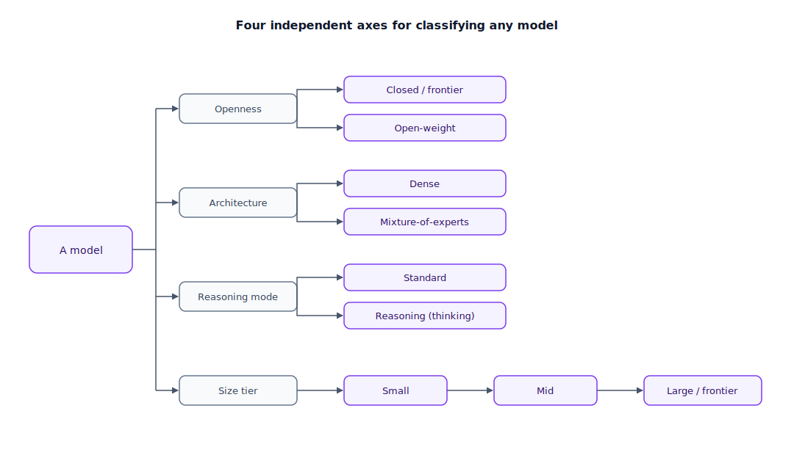

## The 30-second version

The model landscape looks chaotic from the outside — new names every month — but it collapses into a handful of independent axes you can classify almost any model along: **closed/frontier vs. open-weight** (who controls the weights and how you access them), **dense vs. mixture-of-experts** (how much of the network activates per token), **standard vs. reasoning ("thinking")** (whether it deliberates internally before answering), and **size tier** (how much capability, latency, and cost you're buying). None of these axes tells you which model is "best" — each tells you which tradeoff a given model made, so you can match a model's shape to your problem's shape instead of chasing a leaderboard.

## The analogy

Imagine a record label deciding how to staff a session for a new album, and sort every act on its roster along the same four questions you'd ask about a model.

First: who owns the master recording, and how do you get access to it? A label's flagship act is signed to an exclusive contract — their tracks only reach you through the label's release calendar and licensing terms, and you never see the raw stems. That's a **closed/frontier model**: you call it through an API, you never see the weights, and the provider controls the release schedule and price. Contrast that with an independent artist who releases every stem under an open license — anyone can download the raw files, remix them, or run them entirely offline. That's an **open-weight model**: the weights are yours to download, inspect, and modify, whether or not the license lets you resell what you build.

Second: how does the act actually make a track? A bedroom solo producer plays every instrument on every song personally — guitar, bass, drums, synths — whether the song needs all of them or not. That's a **dense model**: every parameter does some work on every token you send it. Compare that to a producer running a session band: for a funk track they call in the bassist and horn section; for a string ballad they call the strings and leave the horns at home. Most of the roster stays off the clock for any given song, but the right specialists show up when needed. That's a **mixture-of-experts (MoE) model**: the network is carved into many "expert" sub-networks, and a lightweight router activates only a handful per token, so total capacity can be enormous while compute per token stays small.

Third: how much do they think before committing? A jingle writer dashes off a usable 30-second radio spot in one pass — fast, serviceable, no revisions. A film composer works through multiple draft passes, discarding chord progressions that don't serve the scene, before committing to a final score. Both are legitimate; you hire the jingle writer when speed matters and the composer when the piece needs to hold up under scrutiny. That's **standard generation vs. reasoning ("thinking") models**: a standard model answers from learned reflexes, while a reasoning model spends extra internal steps — sometimes a visible scratchpad, sometimes hidden — working through the problem first, at real cost in latency and tokens.

Fourth: what scale of production is this? A bedroom demo, a mid-size studio session, and a full orchestral recording all make music, but they suit completely different jobs and budgets. That's **size tier**: small models for cheap, low-latency, narrow tasks; mid-size as the default workhorse; large/frontier for the hardest reasoning, at a real cost premium.

| Record-label decision | Model taxonomy axis |
|---|---|
| Exclusive-contract superstar, API-only access | Closed / frontier model |
| Independent artist releasing open-license stems | Open-weight model |
| Solo producer playing every instrument on every track | Dense model — every parameter active, every token |
| Session-band leader calling in only the players a song needs | Mixture-of-experts model — sparse, per-token routing |
| Jingle writer, one pass, no revisions | Standard (non-reasoning) generation |
| Film composer drafting and revising before the final score | Reasoning / "thinking" model |
| Bedroom demo → studio session → full orchestra | Size tier: small → mid → large/frontier |

## How it actually works

Follow the diagram's four branches. Each is a genuinely independent question — a real model is a specific combination of answers, not a single label.

**Closed vs. open-weight.** Closed models are accessed via API only; the provider controls versioning and deprecation, and you pay per token. Open-weight models ship actual parameter files (typically via Hugging Face) under some license — Apache 2.0, MIT, or a custom "modified" commercial term — so you can self-host, fine-tune, and run offline, but you own the operational burden: GPU procurement, a serving stack, your own upgrade cadence. This isn't the same as "open source" in the classic code sense — a license can restrict commercial use even though the weights are freely downloadable.

**Dense vs. mixture-of-experts.** In a dense model, total parameters equal active parameters — every request pays for the whole network. In an MoE model, total parameters can be an order of magnitude larger than active parameters: a router picks a handful of expert sub-networks per token, so compute cost tracks *active* parameters while capability tracks something closer to *total* parameters. The catch is memory, not compute — you still need enough GPU memory to hold every expert, including the ones sitting idle this token.

**Standard vs. reasoning.** Standard models produce output directly from one forward pass per token. Reasoning models generate an internal chain of reasoning tokens before or interleaved with the final answer — sometimes an inspectable scratchpad, sometimes hidden and simply billed as extra output tokens. This measurably improves accuracy on multi-step math, debugging, and planning (see [Capability Assessment](./capability-assessment.mdx) for how much), at a real multiple in latency and token spend.

**Size tiers.** Usually described informally — small/mid/large, or provider-specific naming like "flash" or "mini" — rather than by a hard parameter cutoff, because MoE routing has decoupled total parameter count from serving cost. What distinguishes a tier in practice is the latency/cost/capability envelope it's priced into, and that envelope isn't standardized across providers.

## A concrete example

Three real, recent releases span three of these axes cleanly enough to make the tradeoffs concrete.

A closed, dense, frontier model prices around **$5 per 1M input tokens / $25 per 1M output tokens** — every token you send pays for the full network, and you're buying peak reasoning quality with zero operational burden.

An open-weight MoE release from the same period ships roughly **1.6T total parameters with only about 49B active per token**, priced around **$0.435 / $0.87 per 1M tokens**. Do the ratio: that's roughly **11x cheaper on input and 29x cheaper on output** than the closed dense example — not because the open model is smaller (it's actually larger in total parameters), but because you pay compute for the ~49B active, not the 1.6T total, and open-weight distribution skips the frontier-lab margin entirely.

A separate open-weight MoE model built for long context activates about **17B parameters per token while offering a 10M-token context window**, and fits on a single high-end GPU — a size/context combination that would be impractical for a same-quality dense model, because sparse activation decouples "how much the model knows" from "how much compute one token costs."

None of this makes open-weight strictly better — the closed frontier model may still win on the hardest reasoning tasks, and self-hosting trades a token bill for a GPU fleet and an ops team. But the axes explain *why* the price gap exists, which a raw leaderboard number never tells you.

## The tradeoffs that matter

| Axis choice | What it buys | What it costs |
|---|---|---|
| Closed / frontier | Zero ops burden, always current | Per-token cost, no offline option, vendor deprecation risk |
| Open-weight | Self-host, fine-tune, data never leaves your infra | You own GPU procurement, serving, security patching, upgrades |
| Dense | Simple to reason about capacity and serving | Every token costs the full network's compute |
| Mixture-of-experts | Huge total capacity at a fraction of the active-parameter compute cost | Must hold every expert in memory even when idle; routing can be uneven and harder to debug |
| Standard | Fast, cheap, a good default | Weaker on genuinely multi-step problems |
| Reasoning / thinking | Materially higher accuracy on hard multi-step tasks | Real latency and token-cost multiplier; can "overthink" trivial questions if not gated |

## Where people go wrong

1. **Assuming "open-weight" means "free to use however you want."** Check the license — Apache 2.0 is permissive; a custom "modified" term can restrict commercial use even though the weights are downloadable.
2. **Assuming bigger total parameter count always wins.** A well-routed MoE model with a modest active-parameter count regularly beats a larger dense model on both cost and latency for the same task.
3. **Turning on reasoning mode for every request "to be safe."** You pay the latency and token tax even on questions a standard model answers correctly in one pass — route by difficulty instead (see [Capability Assessment](./capability-assessment.mdx)).
4. **Picking a size tier off a marketing name rather than your own budget.** "Mini," "flash," and "nano" naming isn't standardized across providers.
5. **Conflating mixture-of-experts with multi-agent orchestration.** MoE routing happens inside one model's forward pass, per token; it is not dispatching a task across multiple independent agent calls, even though both involve "routing to a specialist."

## The interview lens

Interviewers use this topic to see whether you can place an unfamiliar model release along stable axes instead of reciting a leaderboard rank that will be stale within weeks.

A strong sound bite: *"I don't ask whether a model is 'good' — I ask where it sits on four axes: who controls the weights, how much of the network activates per token, whether it reasons before answering, and what size tier it's priced into. Those four answers tell me more about fit than any single benchmark score."*

Likely follow-ups:

- Why does mixture-of-experts save compute but not memory? (Only a subset of experts run per token, but every expert still has to sit resident in GPU memory in case the router picks it.)
- What's the actual risk in treating an open-weight model as "free"? (License terms can restrict commercial use or redistribution even when weights are downloadable.)
- When is a reasoning model worth its latency multiplier? (Genuinely multi-step tasks — math, debugging, planning — not questions a standard model already answers correctly in one pass.)

## Go deeper

- [Capability Assessment](./capability-assessment.mdx) — how to measure whether the axis tradeoffs above actually pay off on your task.
- [Model Selection Guide](./model-selection-guide.mdx) — turning this taxonomy into an actual production decision.
- [Pricing and Costs](./pricing-and-costs.mdx) — the cost side of the closed-vs-open and dense-vs-MoE tradeoffs in detail.
- Upstream reference: [Model Taxonomy — AI System Design Guide](https://github.com/ombharatiya/ai-system-design-guide/blob/main/02-model-landscape/01-model-taxonomy.md) (MIT; see [CREDITS](../../../CREDITS.md)).
