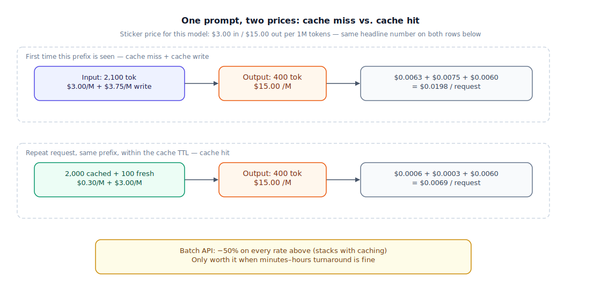

## The 30-second version

Every LLM API quotes two numbers — dollars per million input tokens and dollars per million output tokens — and it's tempting to treat that pair as "the price." It isn't. Output tokens typically cost three to eight times more than input tokens, a cached prefix can cost a tenth of a fresh one, and a batch job can cost half of a real-time one. The number on the pricing page is a rate card, not a bill: your actual cost per request depends on your input:output ratio, how often you repeat the same prefix, and whether the caller can tolerate a delay. Two teams calling the identical model, at the identical advertised rate, can pay wildly different amounts per request — and the gap is entirely explained by facts the rate card never shows.

## The analogy

Picture a neighborhood print shop with one price sheet taped to the counter: "$0.05 a page." A customer who drops off a flyer to scan and a stack of glossy posters to print pays a very different real amount than that sheet suggests, because the shop doesn't charge $0.05 for everything with "page" in the name.

Scanning your original in is cheap and fast — the machine just reads what's already there. Printing a brand-new page out costs more: toner, paper, drying time, a quality pass before it's handed back. A repeat customer running the same flyer every week gets their plate kept mounted on the press, and reprints from a mounted plate cost a fraction of a from-scratch setup — but only while the plate stays mounted. Leave it too long between visits and they take the plate down; your next job pays the full setup fee again. And if you don't need same-day pickup, the shop runs a cheaper overnight batch: presses that would otherwise sit idle run at half the walk-in price for anyone willing to wait until morning.

The price sheet never mentions any of this. "$0.05 a page" is true for exactly one specific mix of scanning, printing, plate reuse, and turnaround — and misleading for almost everyone who reads it and just multiplies by their page count.

| Print shop | LLM pricing |
|---|---|
| Scanning your original in | Input tokens (cheaper per unit — read, not produced) |
| Printing a brand-new page out | Output tokens (pricier per unit — generated, not read) |
| Plate mounted on the press from your last visit | A cached prompt prefix, inside its cache-TTL window |
| Full setup fee when there's no mounted plate | The cache write fee, charged the first time a prefix is cached |
| Taking the plate down after too long between visits | A cache entry expiring (typically a 5-minute or 1-hour TTL) |
| Overnight batch run at half the walk-in price | Batch API pricing — usually 50% off real-time rates |
| "$0.05 a page" on the counter sheet | The advertised $/1M-token rate — true for one token mix, not necessarily yours |

## How it actually works

The diagram prices one real request two different ways on the same rate card — $3.00 per million input tokens, $15.00 per million output tokens, a typical 5x input/output split for a mid-tier frontier model. Follow the top row for the first time a prefix is used, the bottom row for a repeat within the cache window.

**Top row — cache miss.** The request is a 2,000-token system prompt plus retrieved context, plus a 100-token user question. Because this is the first time the provider has seen this exact prefix, the 2,000 cacheable tokens bill at a one-time cache-write rate — typically 1.25x to 2x the standard input rate, depending on the TTL you request (a 5-minute cache is cheaper to write than a 1-hour one) — replacing the standard rate for that portion, not stacking on top of it. The 100 tokens that aren't part of the reusable prefix bill at the standard $3.00/M rate, and the 400-token response bills at $15.00/M. Total: $0.0138 — more than the naive "$3.00 in, $15.00 out" math suggests, because that math forgets the write fee exists.

**Bottom row — cache hit.** The identical prefix, requested again inside the cache window, prices the 2,000 cached tokens at roughly 10% of standard input — $0.30/M — while the 100 fresh tokens that change every request still cost the full $3.00/M. Output is unchanged. Total: $0.0069 — barely a third of the cache-miss price for the same amount of generation work.

Two mechanics explain the gap. Output tokens cost more because they cost more to produce: each one needs a full forward pass conditioned on everything before it, generated one at a time, while input tokens are processed together during prefill (see [the inference pipeline](../foundations/inference-pipeline.mdx) for why prefill and decode have such different cost profiles). And caching only pays off on genuine repetition — a stable prefix reused across many calls before its TTL expires. A prefix that's different every request never earns the discount.

The batch API — not a third row, but real and stackable with caching — trades latency for a flat ~50% discount on both rates, in exchange for turnaround in minutes to hours instead of real time. Use it for anything that doesn't need to answer *now*: nightly re-scoring, bulk classification, offline enrichment.

## A concrete example

Take a support-bot endpoint doing 50,000 requests a day, each built from the 2,000-token prefix in the diagram (product docs plus system prompt) plus a 100-token question, answered in 400 tokens.

- **Naive sticker estimate**, ignoring caching entirely: 2,100 × $3.00/M + 400 × $15.00/M = **$0.0123/request** → 50,000 × $0.0123 = **$615/day**, about **$18,450/month**.
- **Reality with a 5-minute TTL and steady traffic:** roughly 85% of requests land inside the cache window (a hit at $0.0069) and 15% miss — TTL lapsed, or first call of a session (a miss at $0.0138, write fee included). Blended: 0.85 × $0.0069 + 0.15 × $0.0138 ≈ **$0.00794/request** → **$397/day**, about **$11,900/month** — roughly **35% below** the naive estimate, with no change to model, prompt, or traffic.
- **A second lever, stacked separately:** the same team reclassifies 2 million support tickets nightly for routing — 500 input, 50 output tokens each, no shared prefix worth caching. Real-time: (500 × $3.00 + 50 × $15.00) / 1,000,000 = $0.00225/ticket → $4,500. On the batch API overnight at 50% off: **$2,250** — half the bill, because a ticket classified at 2 a.m. doesn't need a sub-second response.

Same model, same rate card, three real costs — $18,450/month, $11,900/month, and $2,250-instead-of-$4,500 — none of it visible in the headline $3.00/$15.00 price.

## The tradeoffs that matter

| Choice | Upside | Cost | Breaks down when |
|---|---|---|---|
| Aggressive prefix caching | Up to ~90% off the cached portion's input cost | Write fee on first use; stale answers if the underlying doc changes and the cache doesn't | Prefix differs on nearly every request — nothing to reuse |
| Batch API | ~50% off input and output, stacks with caching | Turnaround in minutes to hours, not seconds | A user is waiting on the other end of the request |
| Routing simple requests to a cheaper model | Large blended savings if most traffic really is simple | A misrouted "simple" request gets a worse answer, silently | Your complexity classifier is only a little better than random |
| Trimming the system prompt | Saves on every single request, no infrastructure needed | Under-specified prompts degrade quality in ways that are easy to miss | You cut instructions that were quietly preventing a failure mode |
| Capping output length | Output is the expensive side of the ledger — direct savings | Truncated answers, cut off mid-reasoning or mid-list | The task genuinely needs a long answer |

None of these levers is free: caching needs genuine repetition to earn back its write fee, batch needs a workload that can wait, routing needs a classifier you trust more than the savings number. The common failure isn't picking the wrong lever — it's picking one, measuring the win once, and never re-checking the assumption behind it once traffic patterns shift.

## Where people go wrong

1. **Quoting the input/output rate as "the price" and multiplying by expected volume** — without accounting for cache hit rate or the write fee, exactly the gap between the naive and real numbers above.
2. **Assuming caching is free once configured.** It has a write fee and a TTL; a prefix reused less often than the TTL allows for is a net loss, not a saving.
3. **Treating reasoning tokens as invisible.** Extended-thinking modes bill for internal tokens the user never sees, sometimes 2–10x the visible response length; an unset `budget_tokens` cap can turn one query into ten queries' worth of spend.
4. **Sizing a self-hosting decision off the sticker $/token price instead of engineering time.** The API-versus-self-host crossover moves by an order of magnitude once GPU procurement, on-call, and the 0.5–1 FTE it takes to run a serving stack get priced in.
5. **Comparing two models by input price alone on an output-heavy workload.** The model with the cheaper input rate can still lose on total cost once output dominates the token mix.

## The interview lens

Interviewers rarely ask you to recite a pricing table — the numbers move every quarter and everyone knows it. What they're testing is whether you reach for token distribution and repeat rate before you reach for a model name.

A strong sound bite: *"The sticker price tells you the rate card, not the bill — I ask for the real input:output ratio and repeat rate before I compare two models on cost."*

Likely follow-ups:

- Your blended cost per request just doubled with no traffic increase — where do you look first? (Cache hit rate dropping, a prompt or tool schema that grew, more reasoning tokens being spent, or traffic shifting toward longer outputs.)
- When does context caching stop being worth it? (When the shared prefix changes too often to survive its TTL, or volume is too low or too spread across distinct prefixes to earn back the write fee.)
- A client wants a guaranteed monthly cost, not a per-token bill — how do you get there? (Commitment/reserved pricing tiers, a hard output-length ceiling, model routing with a cost floor, and moving predictable non-interactive volume to the batch API.)

## Go deeper

- [Model selection guide](./model-selection-guide.mdx) — cost ceiling is one gate among several once you're actually choosing a model.
- [Inference pipeline](../foundations/inference-pipeline.mdx) — the prefill-versus-decode mechanics behind why output tokens cost more.
- [Production RAG at scale](../retrieval/production-rag-at-scale.mdx) — the same caching instinct, applied to a full retrieval pipeline instead of one API call.
- Upstream reference: [Pricing and Costs — AI System Design Guide](https://github.com/ombharatiya/ai-system-design-guide/blob/main/02-model-landscape/03-pricing-and-costs.md) (MIT; see [CREDITS](../../../CREDITS.md)).
