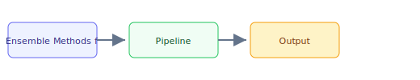

## The 30-second version

Ensemble methods are critical for production reliability. This chapter covers multi-model coordination patterns that improve accuracy and reduce hallucinations.

## The analogy

Think of **Ensemble Methods for LLM Reliability** like running a kitchen during rush hour: you cannot memorize every recipe change, so you keep reference cards (retrieval), a head chef who improvises within guardrails (the model), and a quality check before plates leave the pass (evaluation). The technical system mirrors that flow — separate what you **store**, what you **retrieve**, and what you **generate**.

## How it actually works

Ensemble methods are critical for production reliability. This chapter covers multi-model coordination patterns that improve accuracy and reduce hallucinations.

## A concrete example

Ensemble methods are critical for production reliability. This chapter covers multi-model coordination patterns that improve accuracy and reduce hallucinations.

## The tradeoffs that matter

| Choice | Upside | Cost |
|--------|--------|------|
| Simpler design | Faster to ship | Less resilient |
| Heavier retrieval | Better grounding | More latency |
| Bigger model | Higher quality | Higher $/query |

## Where people go wrong

- Skipping evaluation and hoping demos generalize
- Ignoring latency/cost until production traffic arrives
- Treating retrieval quality as a generation problem

## The interview lens

### Q: When would you use Self-Consistency vs Best-of-N?

**Strong answer:**

"These serve different purposes:

**Self-Consistency** is for tasks with extractable, verifiable answers:
- Math problems: Extract final number, majority vote
- Classification: Vote on labels
- Short-form QA: Vote on answer

The key is you can compare answers for equality. Temperature 0.5-0.8 provides diversity while maintaining coherence. I use k=5-10 for most tasks.

**Best-of-N** is for open-ended generation where there is no single right answer:
- Creative writing
- Explanations
- Code that could be written many ways

Here I need a reward model or judge to score candidates since I cannot just compare for equality. N=8-16 typically. The challenge is avoiding reward hacking, so I use reward model ensembles with conservative aggregation.

I would not use Self-Consistency for creative writing (no extractable answer) or Best-of-N for math (just use voting, simpler)."

### Q: How do you prevent reward hacking in Best-of-N?

**Strong answer:**

"Reward hacking is when the model exploits weaknesses in the reward model rather than genuinely improving quality.

**My mitigations:**

1. **Reward model ensemble**: Use 3+ diverse reward models. A sample that hacks one RM is unlikely to hack all of them.

2. **Conservative aggregation**: Instead of using the mean score, use the 25th percentile or minimum. This selects samples that score well across all RMs, not just one.

3. **Diversity monitoring**: Track sample diversity. If diversity drops too low, the model may be exploiting a narrow reward hack. I adjust temperature or use different prompts.

4. **Human calibration**: Periodically validate that RM-selected samples actually match human preferences.

5. **Multiple dimensions**: Score on multiple criteria (quality, safety, relevance) and require good scores on all, not just composite.

The key insight is that any single reward signal can be gamed. Ensembles make gaming much harder."

## Go deeper

- [Upstream chapter (Ensemble Methods for LLM Reliability)](https://github.com/ombharatiya/ai-system-design-guide/blob/main/13-reliability-and-safety/02-ensemble-methods.md)
- Related questions in the [question bank](/questions)
- Practice with [SPIDER walkthrough](/practice) or [mock interview](/mock)
