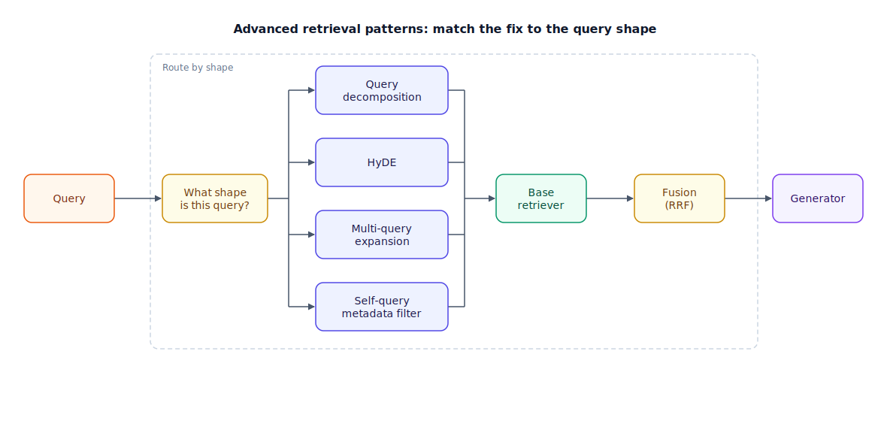

## The 30-second version

Once chunking, embedding, and a base retriever are solid, a family of query-time patterns can squeeze out more recall and precision: query decomposition (splitting a compound question into sub-queries), HyDE (Hypothetical Document Embeddings — embed a fabricated answer instead of the query), multi-query expansion (asking the same question several different ways), self-query with metadata filters (letting the LLM (large language model) turn part of the question into a structured filter), and fusion (combining ranked lists with reciprocal rank fusion). None of these is a default. Each spends extra latency and LLM calls to fix a *specific* mismatch between how users phrase questions and how documents are written — and each can also burn tokens for zero gain, or actively hurt, if that mismatch isn't the one you actually have.

## The analogy

You're at a hardware store with a vague problem: "my kitchen faucet drips." A good clerk doesn't hand you one universal tool. They ask what's actually wrong and reach into a different drawer depending on the answer.

If your real question is really three separate questions bundled together — "is it the washer, the cartridge, or the supply line?" — the clerk splits it into three separate lookups instead of searching for "drips" as one blob. If you can't describe the part in the store's vocabulary at all — you know what it does but not its name — the clerk sketches what the part probably looks like and searches the catalog by that sketch instead of your fumbling words. If you ask the same thing five different ways because you're not sure which phrasing will land, the clerk runs all five past the catalog and keeps whatever shows up on multiple lists — that's corroboration, not repetition. If you say "the drip is bad, and I only want parts under $20, in stock, for a 1998 model," the clerk narrows the entire catalog to that aisle before doing anything else — a filter, not a search. And if none of that fixes it, the clerk hands you a bag of "possibly relevant" parts and lets you sort them by fit at the counter — that's fusion, deferring the final judgment call to a later, more careful step.

Every one of these costs the clerk extra time. A clerk who does all five for every customer, including the one who just needs a single #10 washer, is a slower store, not a better one.

| Hardware-store move | Retrieval pattern |
|---|---|
| Splitting one problem into three separate lookups | Query decomposition (multi-query) |
| Sketching the part you can't name and searching by the sketch | HyDE |
| Asking the same thing five ways and trusting what repeats | Multi-query expansion |
| Narrowing to an aisle by hard facts (price, stock, model year) first | Self-query / metadata filtering |
| Handing over a mixed bag and sorting by fit at the counter | Fusion (e.g., reciprocal rank fusion) |
| The clerk who runs every move for every customer | Burning tokens and latency for no gain |

## How it actually works

The diagram is a routing map: a query enters at the left, and its shape decides which pattern (if any) it needs before hitting the base retriever.

**Query decomposition** targets compound questions — "compare Q3 vs Q4 revenue and explain the drop" is really three questions wearing one sentence. An LLM call splits it into sub-queries ("Q3 revenue," "Q4 revenue," "reasons for Q4 variance"), each retrieves independently, and the results are aggregated before generation.

**HyDE** targets the asymmetry between short queries and long documents. A three-to-ten-word query and a 300-to-500-word chunk live in different regions of embedding space, so their similarity score understates the true match. HyDE asks the LLM to write a one-paragraph hypothetical answer to the query, then embeds *that* instead — the hypothetical answer's vocabulary and length resemble a real document, which pulls it into the right neighborhood. The catch: if the query describes something that doesn't exist in the corpus, the LLM still writes a plausible-sounding hypothetical answer, and that hallucination becomes the search vector, confidently retrieving the wrong thing. The standard hedge is to also run the real query as a literal keyword search and fuse the two result lists rather than trusting HyDE alone.

**Multi-query expansion** rewrites one query into several paraphrases, retrieves for each, and merges. It softens the risk of a single unlucky phrasing missing the right chunk, at the cost of running the retriever N times.

**Self-query with metadata filters** has the LLM parse the query into a semantic part and a structured part. "Enterprise contracts signed after 2024 mentioning termination clauses" becomes a filter (`year > 2024 AND doc_type = contract`) applied *before* the semantic search runs over "termination clauses." This is cheap and often the highest-leverage move of the whole list, because it shrinks the candidate pool with zero embedding-space guesswork.

**Fusion** — usually reciprocal rank fusion (RRF) — is the pattern that lets you use several of the above at once without picking a winner up front. Score each document by summing `1 / (k + rank)` across every ranked list it appears in (k = 60 is the standard constant), which rewards documents that rank well in multiple lists over one that tops a single list and appears nowhere else.

## A concrete example

A support-search team debugs one recurring failure: users searching "why is my invoice wrong" get nothing useful, even though the answer exists in the knowledge base as a specific article about proration.

Baseline dense retrieval on the literal query scores the proration article at rank 41 out of 50 — below the top-5 cutoff the UI shows. Two fixes, tested independently on a 200-query eval set:

- **HyDE**: the LLM writes a hypothetical paragraph — "This invoice discrepancy is likely caused by mid-cycle plan changes resulting in prorated charges..." — and that gets embedded. The proration article jumps to rank 3. Cost: one extra LLM call per query, roughly 200–400ms added latency.
- **Multi-query (4 paraphrases)**: "invoice discrepancy," "billing amount incorrect," "why did my charge change," plus the original. Fused with RRF, the proration article lands at rank 2. Cost: four retrieval calls instead of one, plus one LLM call to generate the paraphrases — comparable latency to HyDE, more retrieval-infrastructure load.

Both work. The team picked multi-query because their vector database handles concurrent queries cheaply but their LLM budget was the tighter constraint, and multi-query's paraphrase-generation call is a single short completion versus HyDE's full hypothetical-document generation. Recall@5 on the eval set rose from 71% to 89%; latency budget grew from ~180ms to ~410ms per query — a tradeoff worth measuring, not assuming.

## The tradeoffs that matter

| Pattern | Fixes | Extra cost per query | Failure mode when misapplied |
|---|---|---|---|
| Query decomposition | Compound, multi-part questions | 1 LLM call + N retrievals | Splits a genuinely simple query, adds latency for nothing |
| HyDE | Short-query / long-document asymmetry | 1 LLM call (full generation) | Hallucinated hypothetical pulls in confidently wrong results |
| Multi-query expansion | Single unlucky phrasing missing a match | 1 LLM call + N retrievals | Redundant paraphrases just re-rank the same near-misses |
| Self-query / metadata filter | Structured constraints hidden in free text | 1 LLM call (cheap, structured output) | Misparses a filter and silently excludes the right documents |
| Fusion (RRF) | Combining multiple ranked lists safely | Near-zero (arithmetic over existing lists) | Fusing lists that are all wrong just produces a differently-wrong list |

The throughline: every pattern here is a query-time tax, paid on every request, versus something like [contextual retrieval](./contextual-retrieval.mdx) or better chunking, which is an ingestion-time tax paid once. For high-QPS systems that difference dominates the decision — a pattern that adds 300ms and an LLM call per query is a different bet at 10 queries/day than at 10,000 queries/minute.

## Where people go wrong

1. **Stacking every pattern by default.** Decomposition, HyDE, multi-query, and self-query filtering all running on every request multiplies latency and LLM cost for questions that needed none of it. Match the pattern to a diagnosed failure mode, the same way you would with [reranking](./reranking.mdx).
2. **Trusting HyDE on out-of-corpus questions.** If the corpus doesn't contain the answer, HyDE still generates a fluent hypothetical — and confidently retrieves whatever is *nearest* to a hallucination. Always pair it with a literal-query fallback.
3. **Treating self-query filters as free precision.** A misparsed filter (wrong date field, wrong enum value) doesn't degrade gracefully — it silently drops the correct document from the candidate set before semantic search even runs.
4. **Multi-query without deduplication.** Four paraphrases that all surface the same three chunks add latency without adding recall; check paraphrase diversity before shipping.
5. **Skipping fusion when combining signals.** Picking "whichever list ranks the top result higher" instead of RRF throws away corroboration — the signal that a document ranking well across multiple query formulations is more trustworthy than one that only ever appears in a single list.

## The interview lens

Interviewers bring up this grab-bag to see whether you reach for the specific fix or the whole toolbox. The tell of a senior answer is naming the mismatch a pattern solves, not reciting the pattern's name.

A strong sound bite: *"These patterns aren't a stack you always run — each one fixes a named mismatch between how people ask and how documents are written, and each one costs a query-time LLM call, so I only add one after I've diagnosed which mismatch is actually causing the misses."*

Likely follow-ups:

- Why does HyDE work, mechanistically? (Queries and documents live in different regions of embedding space; a hypothetical answer written like a document closes that gap.)
- How do you combine HyDE and a literal keyword search safely? (Run both, fuse with RRF — corroboration protects against a hallucinated hypothetical dominating the result.)
- When is self-query filtering strictly better than semantic search alone? (When the query has explicit structured constraints — dates, categories, IDs — that a filter enforces exactly, where embeddings only approximate.)

## Go deeper

- [Hybrid Search](./hybrid-search.mdx) — the dense-plus-lexical fusion these patterns often sit on top of.
- [Reranking](./reranking.mdx) — the complementary precision layer applied after these patterns produce a candidate pool.
- [Contextual Retrieval](./contextual-retrieval.mdx) — the ingestion-time alternative that fixes some of the same mismatches for a one-time cost instead of a per-query one.
- Upstream reference: [Advanced Retrieval Patterns — AI System Design Guide](https://github.com/ombharatiya/ai-system-design-guide/blob/main/06-retrieval-systems/09-advanced-retrieval-patterns.md) (MIT; see [CREDITS](../../../CREDITS.md)).
