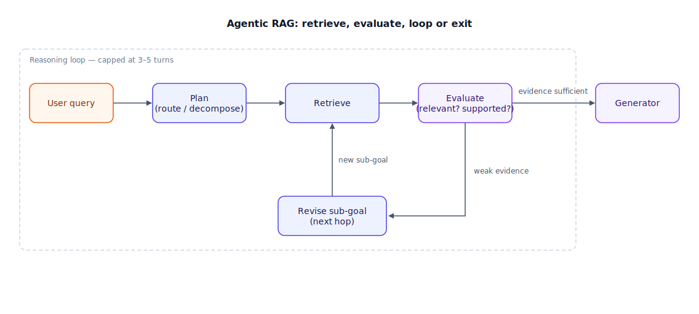

## The 30-second version

Plain RAG (Retrieval-Augmented Generation) retrieves once and generates once — a straight pipeline. Agentic RAG puts an LLM (large language model) in charge of the retrieval step itself: it decides whether to search at all, what to search for, whether the results are good enough, and when to search again with a different query. The three production patterns worth knowing are Self-RAG (the model critiques its own retrieved evidence and its own answer), Corrective RAG (a reliability check routes weak retrievals to a fallback like web search), and multi-hop decomposition (breaking one question into a chain of dependent searches). The upside is queries that a single retrieval pass cannot answer. The cost is real: a 3–4 iteration loop typically runs 8–12 seconds, so the honest engineering move is routing — send easy queries down the fast, linear path and reserve the loop for queries that actually need it.

## The analogy

Think about how you research a topic you don't yet understand, versus how you look up a fact you already know the shape of.

Looking up a fact is one trip to the shelf: you know the book, you know roughly the page, you grab it and you're done. That's plain RAG — one retrieval, one answer. Now think about researching something genuinely unfamiliar: "why did our biggest customer's usage drop last quarter?" You don't walk to one shelf. You pull the usage-metrics report first. Reading it, you realize the drop started after a support ticket spike, so *that* sends you to the support queue, not because you planned it up front but because the first answer told you where to look next. In the support queue you find an unresolved billing complaint, which sends you to the billing system. Three trips, each one chosen because the previous trip's result demanded it — and at any point, if a shelf turns out empty or the document doesn't actually answer your question, you go back and try a different shelf instead of reporting failure.

That back-and-forth, evidence-driven research process — not a fixed itinerary decided in advance — is agentic RAG. The discipline that keeps it from becoming an afternoon lost in the library is the same discipline a good researcher imposes on themselves: a hard cap on how many trips you'll take before you write up what you have.

| Research habit | Agentic RAG element |
|---|---|
| One trip to a known shelf | Plain (linear) RAG |
| Reading a report and deciding what to check next | Retrieval planning / query decomposition |
| Judging whether a source actually answers the question | Self-critique (Self-RAG's reflection step) |
| Empty shelf → try the library next door | Corrective routing (fallback to web/other source) |
| A three-hop chain: metrics → tickets → billing | Multi-hop reasoning loop |
| A self-imposed "I'll take at most 4 trips" rule | Turn budget |
| Knowing some questions need zero trips to the shelf | Adaptive routing (skip the loop entirely) |

## How it actually works

The diagram traces one query through the loop, with the exit ramps that keep it from running forever.

**Plan.** The agent looks at the query and decides its retrieval strategy: one search, a decomposed chain of searches, or — for queries it can answer without any lookup — no search at all. This is the router that Adaptive RAG formalizes: classify query difficulty first, and only pay for the loop when the query needs it.

**Retrieve.** A search runs against the index (vector, hybrid, whatever the underlying system already does — agentic RAG sits on top of retrieval, it doesn't replace it).

**Evaluate.** This is the step linear RAG skips entirely. Self-RAG trains the model to emit critique tokens: is this evidence *relevant* to the sub-goal, and once an answer is drafted, is it actually *supported* by the retrieved text? Corrective RAG (CRAG) runs a similar check but routes on the verdict — correct evidence goes straight to generation, ambiguous evidence gets supplemented with an external search, and incorrect evidence gets discarded in favor of a fallback source entirely.

**Loop or exit.** If evaluation says the evidence is weak, the agent updates its sub-goal and retrieves again — this is where multi-hop questions get solved: "who acquired Figma" resolves to "Adobe," which becomes the input to the next search, "who is the CEO of Adobe." If evaluation says the evidence supports an answer, the loop exits to the generator. Either way, a turn budget — typically 3 to 5 iterations — forces an exit regardless, so a stuck loop still produces an answer instead of spinning.

## A concrete example

A support-ops team wires agentic RAG in front of their internal wiki and ticketing system, budgeted at 4 turns.

Query: *"Why did the EU rollout for Project Atlas get delayed, and is it related to the vendor contract issue from last month?"*

- **Turn 1 — plan + retrieve:** The agent decomposes this into two sub-goals and starts with "Project Atlas EU rollout delay." Retrieval returns a status doc citing "blocked on data-residency sign-off."
- **Turn 2 — evaluate + retrieve:** Self-critique flags this as relevant but insufficient to answer the second half of the question. New sub-goal: "vendor contract issue last month." Retrieval returns a procurement email about a DPA (data processing agreement) renegotiation with the EU hosting vendor.
- **Turn 3 — evaluate + retrieve:** The agent connects the two: the data-residency sign-off is blocked *because* the DPA renegotiation hasn't closed. It issues one more targeted search — "DPA renegotiation status" — and gets a one-line update: "expected to close Friday."
- **Turn 4 — generate:** Evidence is now sufficient. The agent answers with the causal chain and cites all three sources.

Four turns, three retrievals, roughly 9 seconds end to end at typical LLM latencies. A linear RAG system given the same query would retrieve once against the combined question, likely surface the status doc alone, and answer only the first half — because nothing in a single-pass pipeline notices the answer is incomplete.

## The tradeoffs that matter

| Dimension | Linear RAG | Agentic RAG |
|---|---|---|
| Structure | Fixed sequence | Dynamic loop, model-directed |
| Self-correction | None | Re-retrieves on weak evidence |
| Query complexity it handles | Single-step lookup | Multi-step, compound, causal-chain questions |
| Latency | Low, fixed (~1–2s) | Variable — a 3–4 turn loop runs ~8–12s |
| Determinism | High — same query, same path | Lower — the model chooses its own path each time |
| Cost | One retrieval + one generation | N retrievals + N reasoning turns |

The determinism cost is easy to underweight until it bites: a small rewording of the same user question can send the agent down a different search path and back with an answer in a different shape. The standard mitigation is not to relax the model's freedom but to constrain the *graph of possible paths* — frameworks like LangGraph or DSPy fix which states and transitions are legal, even though which one gets picked is still the model's call. And because the loop is the expensive path, the honest default is Adaptive RAG: classify the query first, and route anything that looks like a single-fact lookup straight to the linear pipeline. Reserve the loop for compound and multi-hop questions, and cap it at 3–5 turns so a confused agent fails fast instead of burning budget in circles.

## Where people go wrong

1. **Running every query through the loop.** Most production queries are simple lookups. Routing all of them through a 4-turn agent multiplies latency and cost for zero quality gain — classify first.
2. **No turn budget.** An ungoverned loop can retrieve indefinitely when evidence never quite satisfies the critique step. Cap iterations and force a final answer from whatever evidence exists.
3. **Treating "agentic" as a synonym for "better."** Agentic RAG adds non-determinism and cost to buy multi-step reasoning. If your failures are single-hop retrieval misses, the fix is a better retriever, not a loop on top of a weak one.
4. **Skipping the evaluation step.** An agent that retrieves and immediately generates without a relevance/support check isn't agentic RAG — it's linear RAG with extra latency. The critique step is what earns the "agentic" name.
5. **Ignoring speculative retrieval.** Naive loops retrieve strictly one turn at a time, paying full round-trip latency per hop. Predicting the next likely sub-goal and retrieving for it in parallel with the current step cuts wall-clock time without changing the reasoning.

## The interview lens

Interviewers reach for agentic RAG to see whether you can reason about the cost of giving a model control, not just the capability it unlocks. They're listening for a routing story and a bound on the loop, not just "the agent retrieves until it's confident."

A strong sound bite: *"Agentic RAG trades a fixed, cheap retrieval for a model-directed loop that can re-query and self-correct — so I only route to it once I've classified the query as needing multiple hops, and I always cap the loop at a few turns so a confused agent still returns an answer instead of spinning."*

Likely follow-ups:

- How do you keep an agentic loop from being non-deterministic in production? (Constrain the state graph with a framework like LangGraph; the *path chosen* can vary, the *set of legal paths* doesn't.)
- When would you choose Corrective RAG over Self-RAG? (CRAG when you have a reliable fallback source like web search to route ambiguous or wrong retrievals to; Self-RAG when the model itself needs to learn to judge its own evidence quality.)
- How do you bound latency for a UX that needs sub-3-second responses? (Adaptive routing to skip the loop for simple queries, plus speculative retrieval for the queries that do need it.)

## Go deeper

- [RAG Fundamentals](./rag-fundamentals.mdx) — the linear pipeline this loop wraps around.
- [GraphRAG](./graph-rag.mdx) — the other route to multi-hop questions: pre-built structure instead of iterative search.
- [Advanced Retrieval Patterns](./advanced-retrieval-patterns.mdx) — query expansion and decomposition techniques an agent can call as tools.
- Upstream reference: [Agentic RAG — AI System Design Guide](https://github.com/ombharatiya/ai-system-design-guide/blob/main/06-retrieval-systems/08-agentic-rag.md) (MIT; see [CREDITS](../../../CREDITS.md)).
