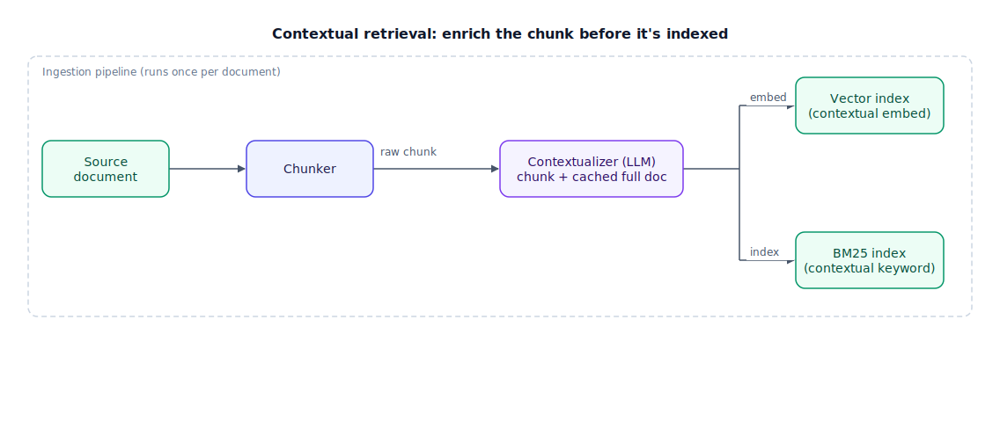

## The 30-second version

Contextual retrieval is an ingestion-time fix for the single most common cause of RAG (Retrieval-Augmented Generation) failure: a chunk that made perfect sense inside its document loses that sense the moment it's cut out. "It costs $200/month" is meaningless in isolation — costs *what*? Contextual retrieval has an LLM (large language model) read the chunk alongside its full source document and write a short situating sentence ("this chunk is from Acme's Q3 pricing section, describing the Standard plan"), which gets prepended before the chunk is embedded and indexed for keyword search. Anthropic's published measurements: contextual embeddings alone cut retrieval failures 35%; adding contextual keyword search reaches 49%; adding a reranker on top reaches 67%. The technique costs money at ingestion — prompt caching brings that down by roughly 90% — and pays it back once, on every query, forever after.

## The analogy

Think about a box of old family photographs with nothing written on the back.

A single print showing a cake and some balloons tells you almost nothing on its own — whose birthday, which year, which house. Now imagine someone had gone through the box once, and on the back of each photo, in pencil, written one line: "Grandma's 70th, our old kitchen, 1998." Suddenly a photo that was a mystery becomes searchable — you can now find "the one from Grandma's 70th" by flipping through captions instead of squinting at every print hoping to recognize the wallpaper. Writing those captions took an afternoon, once, for the whole box. Every time anyone searches the box afterward — this year, next year, for any reason — that one afternoon of captioning keeps paying for itself.

That's the whole technique. The captioning pass happens once, at index time; every query benefits from it forever. And there's a cheap version too: if the photos already came in a labeled album with "1998 — Family" printed on each page, you can copy that printed label onto the back without needing anyone to look at the photo and think — a free, structural caption instead of a hand-written, judgment-based one.

| Photo-box habit | Contextual retrieval element |
|---|---|
| An uncaptioned print, meaningless alone | A raw chunk, stripped of its document |
| Writing one pencil caption per photo | LLM-generated context string per chunk |
| The captioning afternoon, done once | Ingestion-time cost (paid once) |
| Every future search benefiting from the captions | Every future query benefiting from the embedding |
| Reading the caption to find "Grandma's 70th" | Contextual embedding match |
| Also being able to search by handwriting on the caption itself | Contextual BM25 (keyword) match |
| Copying a printed album label instead of writing a new caption | Contextual chunk headers (deterministic, no LLM) |
| Photographing the whole box once instead of captioning | Prompt caching the full document across chunk calls |

## How it actually works

The diagram follows one document through the ingestion pipeline and shows where the context string gets attached before the two indexes are built.

**The problem it targets.** Chunk a financial report and a naive splitter might produce: "The Standard plan costs $200/month" in one chunk and "The Enterprise plan includes SSO and audit logs for $800/month" in the next. Split slightly differently, you get a chunk that just says "It costs $200/month" — no "Acme," no "Standard," no "Q3." A user searching "how much does the Acme Standard plan cost" embeds a query full of exactly those missing words, and the embedding of "It costs $200/month" sits nowhere near it in vector space. The chunk is correct. It's just unfindable.

**The fix.** At ingestion, for every chunk, send the *full document* plus that one chunk to an LLM with a short instruction: write a succinct sentence situating this chunk within the document, for the purpose of improving search retrieval. The model returns something like "This chunk is from the Acme Corp Q3 2025 Financial Report, Section 4 on Product Pricing, describing the Standard plan." That sentence gets prepended to the chunk's text — the chunk stored and shown to the LLM at answer time is still the original, but the version that gets embedded and keyword-indexed now carries "Acme," "Standard plan," and "Q3" that the raw chunk never had.

**Two indexes, same fix.** The context string helps both retrieval channels: **contextual embeddings** put the enriched chunk into a better neighborhood in vector space, and **contextual BM25** gives the keyword index the exact proper nouns and jargon (product names, section headers) that a raw chunk like "It costs $200/month" would never match on. Both indexes get built from the same contextualized text, then queried together and combined with reciprocal rank fusion, same as any [hybrid search](./hybrid-search.mdx) setup — contextual retrieval is a preprocessing step underneath hybrid search, not a replacement for it.

**The cost lever.** The obvious way to run this — sending the full document with every single chunk — means paying for the document's tokens once per chunk. Prompt caching fixes this: cache the full document as a stable prefix, and only the small per-chunk instruction varies between calls, so the document's tokens are billed once instead of once per chunk. For documents ingested repeatedly this is the difference between a one-time chore and a recurring bill.

## A concrete example

A 10,000-token internal wiki page gets split into 30 chunks (roughly 330 tokens each). Contextualizing every chunk needs one LLM call per chunk, each carrying the full 10,000-token document as input.

Without caching: 30 calls × 10,000 input tokens ≈ 300,000 input tokens billed, plus 30 short outputs. Using a fast, cheap model at roughly $0.0003 per chunk once caching handles the shared document prefix, a 10,000-chunk knowledge base (the scale where this matters) costs on the order of $3 total to contextualize — versus roughly $20 with a mid-tier model and no caching discipline, or over $100 with a frontier model on every chunk. The lever that actually matters is model choice plus caching, in that order: the context string is short, factual, and doesn't need a frontier model's judgment, and caching removes the redundant document tokens that would otherwise dominate the bill. Anthropic's own benchmark reports roughly 90% cost reduction from caching alone, on top of whatever the cheaper model already saves.

On quality: at knowledge-base scale, the same benchmark reports top-20 retrieval failure dropping from a 5.7% baseline to 3.7% with contextual embeddings alone (a 35% relative reduction), to 2.9% adding contextual BM25 (49% total), to 1.9% adding a reranker on top (67% total) — meaning roughly 1 in 18 queries failing to surface the right chunk becomes roughly 1 in 53.

## The tradeoffs that matter

| Approach | Retrieval improvement | Cost | When to reach for it |
|---|---|---|---|
| Raw chunking (baseline) | — | None | Self-contained chunks (FAQ pairs, product cards) |
| Contextual chunk headers (deterministic) | ~10–20% | None — no LLM call | Well-structured docs with real headings (Markdown, HTML) |
| Contextual embeddings (LLM-generated) | ~35% | $ per chunk, one-time | Unstructured prose, ambiguous section boundaries |
| + Contextual BM25 | ~49% cumulative | Marginal — same LLM call | Corpora with jargon, IDs, proper nouns dense-only search misses |
| + Reranker | ~67% cumulative | Adds reranking latency per query | Retrieval failure rate still above your target after the above |

The load-bearing distinction is *when* you pay. Contextual retrieval spends money at ingestion, once per chunk, ever. Query-time patterns like HyDE (see [advanced retrieval patterns](./advanced-retrieval-patterns.mdx)) spend money on every single query. At 10,000 queries a day against a 50,000-chunk corpus, the ingestion cost amortizes into irrelevance; a per-query LLM call does not. That asymmetry is why the strongest systems typically do both — enrich the documents once, and reserve query-time tricks for the queries that still need help after enrichment.

## Where people go wrong

1. **Reaching for a frontier model to write context strings.** The output is a short, factual, situating sentence — a fast, cheap model does this job as well as an expensive one. Save the frontier model's budget for something that needs judgment.
2. **Sending the full document on every call without caching.** This is the single biggest avoidable cost in the whole technique — cache the document prefix once, don't re-bill it per chunk.
3. **Applying it to chunks that were never ambiguous.** FAQ pairs and product cards are already self-contained; contextualizing them adds ingestion cost for a failure mode they don't have.
4. **Treating it as a replacement for hybrid search or reranking.** Contextual retrieval makes both index channels better; it doesn't remove the need for fusion or reranking on top — the 67% figure only shows up with all three layered together.
5. **Skipping the deterministic option when structure already exists.** If a document already has clean headings, prepending "Document: X / Section: Y" costs nothing and captures much of the same signal an LLM would generate — save the LLM call for genuinely unstructured text.

## The interview lens

Interviewers use this topic to check whether you understand *why* a chunk fails to retrieve — not just that "adding context helps." The strong answer names context dilution specifically and can place the cost correctly against alternatives.

A strong sound bite: *"A chunk can be perfectly correct and still be unfindable, because it lost the words a query would actually use to look for it — so I write a short situating sentence per chunk at ingestion time, prepend it before embedding and before BM25 indexing, and pay for it once with prompt caching instead of paying a retrieval tax on every query forever."*

Likely follow-ups:

- Why does this help BM25 as much as embeddings? (BM25 needs the literal proper nouns and product names a raw chunk may not contain; the context string supplies them.)
- How do you keep ingestion cost bounded at 50,000+ documents? (Cheap model for context generation, prompt-cache the document prefix, and skip LLM contextualization entirely for well-structured docs in favor of deterministic headers.)
- How does this compare to HyDE? (Opposite side of the same problem — this enriches documents once at ingestion; HyDE enriches the query, and pays a cost on every request.)

## Go deeper

- [Chunking Strategies](./chunking-strategies.mdx) — the splitting decision this technique sits downstream of.
- [Hybrid Search](./hybrid-search.mdx) — the dense-plus-BM25 fusion this pipeline feeds.
- [Advanced Retrieval Patterns](./advanced-retrieval-patterns.mdx) — the query-time counterparts (HyDE, multi-query) and how their cost profile differs.
- Upstream reference: [Contextual Retrieval — AI System Design Guide](https://github.com/ombharatiya/ai-system-design-guide/blob/main/06-retrieval-systems/10-contextual-retrieval.md) (MIT; see [CREDITS](../../../CREDITS.md)).
