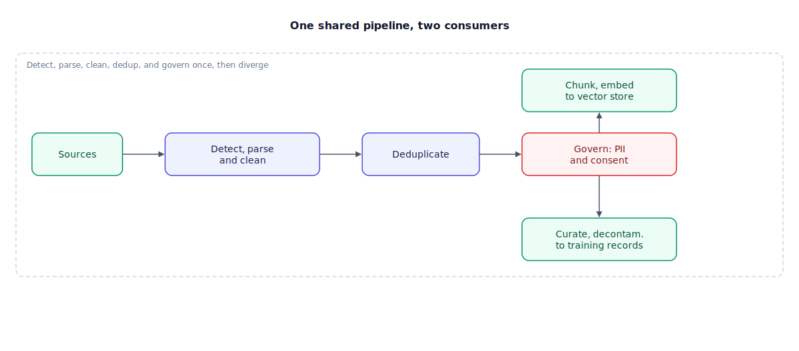

## The 30-second version

Every RAG system and every fine-tuning run gets fed by the same unglamorous machinery: detect what a document is, extract its content, clean it, deduplicate it, scrub sensitive information, filter for quality, and only then hand it to whichever consumer needs it. Most visible engineering effort goes into retrieval and prompting, but the actual quality ceiling is set upstream, in a pipeline nobody demos. Skip a stage — trust a file extension over real content, skip Unicode normalization, filter too aggressively, forget to check whether your "fresh" test set is secretly in the training data — and the failure shows up as a mysteriously bad model or a RAG system quietly serving stale answers for months.

## The analogy

Picture a materials-recovery facility — the sorting plant that turns a truckload of mixed recycling into clean bales of one material each, ready to sell.

Every load arrives as a chaotic mix: bottles, cardboard, scrap metal, and things that should never have been tossed in the bin at all. Before any of it becomes a bale a buyer will pay for, the facility runs a fixed sequence. **Intake screening** figures out what each item actually is — an optical sorter reads the object itself, not whichever bin a confused resident chose for it (never trust the bin someone picked over what the material actually is). **Sorting** separates the stream into typed categories — paper, aluminum, PET plastic — the way a parser extracts typed elements from a raw file. **Cleaning** rinses off food residue and strips labels before anything gets baled, or a whole bale gets rejected downstream. **Contaminant removal** pulls out duplicate scans and anything a magnet or eddy current shows doesn't belong, because one bale of mixed materials is worthless to every buyer. Anything hazardous — batteries, medical waste — goes into a **quarantine bin** with strict handling, never the open sorting line. And the facility actively **rejects stock that's degraded past use** — a bale so contaminated it will spoil an entire batch shouldn't ship next to clean material pretending to be equivalent.

One more discipline matters when the facility certifies new sorting-line staff on a quality-control test: the sample items used in that test can never be items the trainee already secretly sorted and memorized the answer key for — if they have, the score is meaningless. That's decontamination, and it's why a "test batch" quietly overlapping the "training batch" invalidates the whole certification.

| Materials-recovery facility | AI data engineering |
|---|---|
| Optical sort reading the object, not the bin it arrived in | Content-based (magic-byte) file-type detection, not extension |
| Sorting into typed material categories | Parsing: typed elements, layout, structure extraction |
| Rinsing and de-labeling before baling | Cleaning: boilerplate strip, encoding fixes, Unicode |
| Removing duplicate scans and damaged loads | Deduplication cascade: exact, then fuzzy, then semantic |
| The quarantine bin for hazardous material | PII detection, redaction, consent and provenance metadata |
| Rejecting stock that's degraded past use | Freshness, CDC-driven reindexing, document lifecycle |
| Test items can't be items staff already secretly sorted | Eval-set decontamination against training data |

## How it actually works

Follow the diagram left to right: one pipeline, two consumers, diverging only at the end.

**Detect and parse.** Raw sources — web pages, PDFs, office documents, database exports — get identified by sniffing actual file content (magic-number detection, the technique behind the Unix `file` command), not by trusting the extension a file happens to carry. Content type then determines the parser: text-extractable PDFs take a fast path, scanned pages get OCR (optical character recognition) or a multimodal pass (see [multimodal RAG](./multimodal-rag.mdx)), and office formats get format-specific handlers.

**Clean and normalize.** Strip navigation chrome, ads, and boilerplate from HTML — extracting from the raw page beats extracting from someone else's pre-stripped version, which tends to leave boilerplate behind. Fix encoding issues, normalize Unicode so identical-looking strings compare as equal, and filter by language confidence. Counterintuitively, more filtering isn't automatically better — aggressive filters can discard genuinely high-quality content, so every filter needs validation against a downstream eval, not trust by reputation.

**Deduplicate**, as a cascade of increasingly expensive passes: exact hashing catches verbatim copies; MinHash with locality-sensitive hashing (LSH) catches near-duplicates by estimating similarity over shingled text; semantic embedding-based dedup catches paraphrases that look nothing alike lexically but mean the same thing. This pays off three ways downstream: RAG stops wasting context window on duplicate chunks, fine-tuning needs fewer steps and memorizes less, and deduplicating against your own benchmarks removes train-test overlap — dedup doubles as decontamination.

**Govern.** Detect and redact personally identifiable information (PII), and attach source, license, consent, and timestamp metadata from the moment a record enters the pipeline — not as a final gate bolted on before shipping.

**Diverge.** Only here does the pipeline split. The RAG branch chunks, enriches with metadata, embeds, and writes to a vector store kept fresh through incremental Change Data Capture (CDC) — reprocessing only documents that changed, not a full re-index. The fine-tuning branch curates and labels examples, generates synthetic data where useful, decontaminates against every eval set the model will be judged on, and balances the result into training records.

## A concrete example

You're standing up ingestion for a 100,000-document knowledge base pulled from wikis, PDFs, and old email exports.

- **Detection and parsing:** magic-byte sniffing routes ~60,000 text-native documents to a fast parser, 15,000 scanned PDFs to OCR, and 25,000 office/email documents to format-specific handlers. Cost is dominated by OCR — a few cents per scanned page across 15,000 documents.
- **Deduplication:** exact hashing removes an easy 8,000 verbatim duplicates (copy-pasted wiki pages). MinHash/LSH catches another 12,000 near-duplicates (the same policy doc exported three times with header changes). Semantic dedup catches a further 3,000 paraphrased duplicates lexical methods miss entirely. You end up indexing roughly 77,000 genuinely distinct documents — 23% smaller, which is 23% less embedding cost and 23% less noise crowding out real answers in retrieval.
- **PII governance:** an automated scan (entity recognition plus regex and checksum rules) flags ~4% of documents — old HR emails and support tickets with names and account numbers — for redaction before indexing, not after.
- **Decontamination, if this feeds fine-tuning:** check the training set against your eval benchmark using embedding similarity, not just n-gram overlap — a rephrased or translated test question slips past exact-match checks and can quietly inflate a benchmark score when the model has simply seen the answer before.

## The tradeoffs that matter

| Decision | Gain | Cost | Breaks down when |
|---|---|---|---|
| Magic-byte detection over file extensions | Correct parser routing, no silent garbage | Marginal added latency per file | Never — close to a strict upgrade |
| Full dedup cascade (exact → fuzzy → semantic) | Smaller corpus; dedup doubles as decontamination | Semantic dedup is the most compute-expensive tier | Corpus is small enough the compute isn't worth it |
| Aggressive heuristic quality filtering | Removes obvious junk cheaply | Can discard high-quality content as false positives | You haven't ablated the filter against a downstream eval |
| CDC-based incremental reindexing | Minutes-fresh index, no full reprocessing | More orchestration complexity than nightly re-run | Change volume is low enough nightly batch is just as fresh |
| N-gram-only decontamination | Fast, simple, catches verbatim leaks | Misses rephrased or translated test items | Any paraphrase of a benchmark question exists |

The honest framing: nearly every stage here trades upfront engineering effort for a failure mode otherwise invisible until it's expensive — a model that quietly memorized its own exam, or an index stale for a month with nobody noticing because nothing crashed.

## Where people go wrong

1. **Trusting the file extension.** A `.pdf` that's actually a scanned image parsed with a text-only path returns empty or garbled content, with no error thrown. Detect by content, not name.
2. **Skipping Unicode normalization.** Two visually identical strings that aren't byte-identical silently break both deduplication and exact-match filtering, invisible until you ask why "duplicate" documents weren't caught.
3. **Trusting a quality classifier by reputation.** A model-based filter can be miscalibrated and confidently discard content that's actually fine. Every filter needs ablation against a real downstream eval, not blind trust.
4. **Full reindexing instead of CDC.** Re-embedding an entire corpus on every document change is slow and unnecessary — track what changed and reprocess only that.
5. **N-gram-only decontamination.** Assuming exact-match overlap is enough is exactly what lets rephrased or translated test items slip into training data and inflate benchmark scores.

## The interview lens

This is the part of a RAG design interview candidates skip to get to the "interesting" retrieval architecture — and it's exactly what separates a mid-level answer from a senior one. Interviewers asking "walk me through ingestion" are checking whether you treat freshness, deduplication, and governance as first-class decisions or an afterthought.

A strong sound bite: *"Deduplication is the highest-leverage stage in the pipeline — one pass shrinks the RAG index, cuts fine-tuning steps and memorization, and doubles as decontamination against your own eval sets."*

Likely follow-ups:

- How do you keep a RAG index fresh without a full nightly reindex? (Change Data Capture: detect changed, new, and deleted documents, and reprocess only the delta.)
- Your dedup pipeline only uses exact hashing. What's it missing? (Near-duplicates and paraphrases — add MinHash/LSH, then semantic dedup, and measure corpus shrinkage.)
- How would you prove a fine-tuned model didn't just memorize your eval set? (Decontaminate with embedding or LLM-based matching, not just n-gram overlap.)

## Go deeper

- [Multimodal RAG](./multimodal-rag.mdx) — where the parsing stage forks toward vision-based ingestion.
- [Chunking strategies](./chunking-strategies.mdx) — the RAG-side stage that immediately follows this pipeline's governance step.
- [Production RAG at scale](./production-rag-at-scale.mdx) — how CDC-based freshness shows up as an operational concern in a live system.
- Upstream reference: [Data Engineering for AI — AI System Design Guide](https://github.com/ombharatiya/ai-system-design-guide/blob/main/06-retrieval-systems/15-data-engineering-for-ai.md) (MIT; see [CREDITS](../../../CREDITS.md)).
