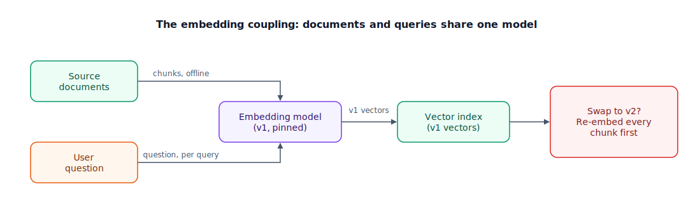

## The 30-second version

An embedding model turns text into a vector — a list of 768 to 3,072 numbers placed so that similar meanings land close together. Every retrieval system stands on one, and the choice is stickier than it looks: query vectors and document vectors are only comparable if the *same model, same version* produced both, so changing models later means re-embedding your entire corpus. Benchmark leaderboards like MTEB (Massive Text Embedding Benchmark) tell you who files general text well, not who files *your* text well — a small in-domain evaluation set beats a leaderboard delta every time. Start off-the-shelf; fine-tune only when your vocabulary is genuinely alien to general text and your evals prove the gap.

## The analogy

An embedding model is a library's cataloging system, and the model itself is the librarian applying it.

Every book that enters the library gets a call number — an address that encodes what the book is *about*, so that books on similar topics end up shelved side by side. Find one useful book and its neighbors are probably useful too. That's what an embedding does: assign text an address in a space where nearby means related.

The address's length is your dimension count. A short address — building and floor — is cheap to write and store, and gets you to roughly the right area. A long one — building, floor, aisle, shelf, slot — pinpoints the book, but every label costs more ink and every catalog drawer gets fatter.

Now the awards. Each year a panel names a "librarian of the year" by testing candidates on a standard set of collections: novels, cookbooks, travel guides. That's the MTEB leaderboard. Winning proves general skill — not that the winner can sensibly shelve your patent filings or incident reports. A law firm hires a law librarian for a reason: someone who knows "consideration" is a term of art, not a politeness. That's domain fit, and at the extreme, fine-tuning.

And the trap that catches teams off guard: call numbers only mean something *within one cataloging system*. Walk into a Library-of-Congress building holding a Dewey Decimal number and you'll march confidently to the wrong shelf. Switch systems, and someone must re-label every book in the building before lookups work again. That is the re-embedding coupling — the most operationally important fact about embedding models.

| Library element | Technical element |
|---|---|
| Cataloging system + librarian | Embedding model (and its version) |
| Call number on a book | A chunk's embedding vector |
| Address length (floor vs. shelf-slot) | Dimension count (768 vs. 3,072) |
| Books on similar topics shelved together | Semantic similarity = geometric closeness |
| "Librarian of the year" on standard collections | MTEB leaderboard score |
| Law firm hiring a law librarian | Domain-fit model choice / fine-tuning |
| Dewey number in a Library-of-Congress building | Query embedded with a different model than the index |
| Re-labeling every book to switch systems | Re-embedding the whole corpus |

## How it actually works

The diagram has two doors and one machine. Follow both arrows into the center: document chunks arrive offline during ingestion, user questions arrive live at query time, and *both* pass through the same pinned embedding model before touching the vector index. Similarity search is just geometry — cosine similarity between the query vector and stored vectors — and geometry only works if every point was placed by the same mapmaker. The red box on the right is the consequence: introduce model v2, and every v1 vector in the index is instantly stale. Vectors from different models don't mix even slightly.

Beyond the coupling, four properties drive the choice:

**Dimensions.** Each dimension is a 4-byte float32, so storage and search cost scale linearly with dimension count, forever, on every query. Newer models soften this with Matryoshka Representation Learning (MRL): they're trained to pack the most important information into the earliest dimensions, so you can index a cheap truncated prefix (say, the first 64 of 1,536 dims) for a fast first pass and re-score finalists with full vectors — roughly a 20x memory cut for under a 2% accuracy loss. Quantization goes further: int8 shrinks storage 4x, and binary embeddings compress it 32x further, since comparing bit vectors with Hamming distance is roughly an order of magnitude quicker on typical CPU hardware than computing cosine similarity over floats.

**Evaluation.** MTEB averages performance across many general tasks. Top models cluster within a couple of points of each other, public benchmarks leak into training data over time, and none of it measures your domain. The professional move is a tiny in-domain eval: 50–100 real user queries, each labeled with the chunks that actually answer them, measured as recall@k. An afternoon of labeling beats a month of leaderboard-watching.

**Domain fit.** Embeddings can only place terms they learned during training. A product name coined last quarter, an internal codename, a fresh model identifier — these get vague, generic vectors. That's usually a job for hybrid search's keyword arm (see [hybrid search](./hybrid-search.mdx)), not a reason to switch embedding models.

**Fine-tuned vs. off-the-shelf.** Commercial APIs give you managed infrastructure and a stable service; open-weight models (now matching commercial APIs on public benchmarks) win when per-query cost at volume or data residency matters. Fine-tuning your own sits at the far end: real gains in specialized domains — legal, biomedical, dense internal jargon — but you become the model's maintainer, and every fine-tune release triggers another full re-embed.

## A concrete example

Take a corpus of 10 million chunks averaging 512 tokens each.

- **At 1,536 dimensions:** 10M × 1,536 × 4 bytes ≈ 61 GB of raw vectors. With graph-index overhead on top, serving this from memory needs a machine in the ~80 GB RAM class.
- **At 768 dimensions:** ~31 GB — half the footprint and roughly half the search compute, at a quality cost you should measure, not guess.
- **Binary-quantized:** ~1.9 GB (32x smaller), with faster distance math — often good enough for a first-pass retrieval that full-precision vectors then re-rank.
- **The swap bill:** re-embedding 10M chunks × 512 tokens = 5.12 billion tokens. At 2025-era embedding prices of roughly $0.02–$0.10 per million tokens, that's about $100–$510. The dollars are the small part. The real cost is the migration: run old and new indexes side by side, dual-write during transition, cut queries over atomically, and keep a `model_version` field on every vector so you can even tell them apart.

Notice the asymmetry: the *first* embedding run is cheap and invisible. It's the second one — the one you didn't plan for — that hurts.

## The tradeoffs that matter

| Choice | You gain | You pay |
|---|---|---|
| Small dims (384–768) | Half the storage, faster search at scale | Lower quality ceiling on nuanced queries |
| Large dims (1,536–3,072) | Better separation of close meanings | Linear cost on every stored vector and every query, forever |
| Commercial API | Managed infra, SLAs, zero hosting work | Per-token fees at volume; data leaves your boundary |
| Open-weight, self-hosted | Low unit cost at high volume, data stays home | You own GPUs, scaling, and upgrades |
| Off-the-shelf model | Works today, maintained by someone else | Generic treatment of your jargon |
| Fine-tuned model | Real gains on specialized vocabulary | You maintain it; every update = full re-embed |

Behind the table: every row is taxed by the coupling. You are not picking a library dependency you can bump next sprint — you are picking the coordinate system your entire index is written in. That's why boring choices (a mid-size, well-supported model, version-pinned) tend to beat clever ones.

## Where people go wrong

1. **Choosing the MTEB #1 without an in-domain eval.** A 1.5-point leaderboard gap is noise once your acronyms, tickets, and half-English logs enter the picture. Measure on your queries or you're choosing by vibes.
2. **Treating dimensions as free quality.** Doubling dims doubles RAM and slows every ANN (approximate nearest neighbor) query for the life of the system. Buy dimensions only after evals show you need them.
3. **Letting the model version float.** One service quietly upgrades its embedding client; queries now search v2-against-v1 and results degrade silently — no errors, just worse answers. Pin the version everywhere and store it in index metadata.
4. **Fine-tuning first.** Fine-tuning is the highest-maintenance lever in retrieval. Exhaust chunking, hybrid search, and reranking first; they're cheaper and reversible.
5. **Blaming the embedding for vocabulary it never saw.** New terms get generic vectors — that's structural. The fix is a keyword arm and a reranker, not a frantic model swap.

## The interview lens

Interviewers rarely ask "what is an embedding?" They probe whether you understand the operational blast radius: how you'd choose, how you'd evaluate, and what happens the day you upgrade.

A strong sound bite: *"An embedding model is a schema decision, not a library import — every vector in my index is written in that model's dialect, so I pin the version, keep a small in-domain eval, and budget a full re-embed and dual-index cutover before I ever swap models."*

Likely follow-ups:

- You need to migrate 100 million vectors to a new embedding model with zero downtime. Walk me through it.
- Your model tops MTEB but retrieval quality in production is poor. How do you debug?
- When is fine-tuning an embedding model actually worth it, versus hybrid search plus reranking?

## Go deeper

- [Vector Databases](./vector-databases.mdx) — where these vectors live, and how they're searched at scale.
- [ColBERT & Late Interaction](./colbert-late-interaction.mdx) — what you give up with one-vector-per-chunk, and the token-level alternative.
- [RAG Evaluation](./rag-evaluation.mdx) — building the in-domain eval set this chapter keeps insisting on.
- Upstream reference: [Embedding Models — AI System Design Guide](https://github.com/ombharatiya/ai-system-design-guide/blob/main/06-retrieval-systems/03-embedding-models.md) (MIT; see [CREDITS](../../../CREDITS.md)).
