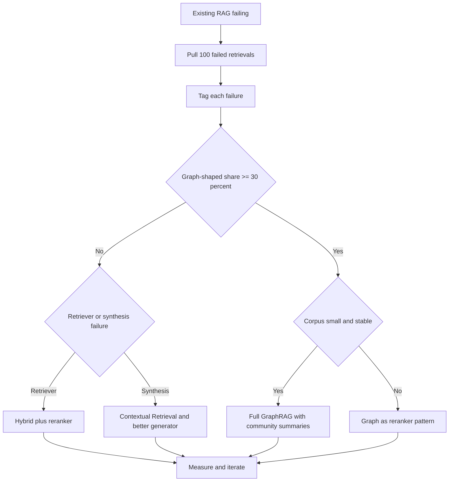
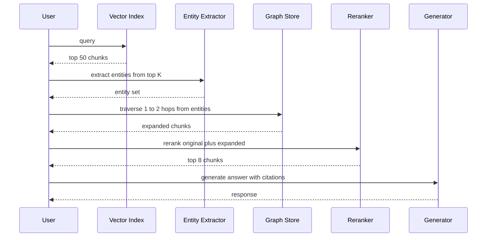

## The 30-second version

GraphRAG is the combination of Knowledge Graphs (KG) and Retrieval-Augmented Generation. While vector RAG is good at "finding a specific chunk," GraphRAG is designed for Global Reasoning across an entire dataset.

## How it actually works

GraphRAG is the combination of **Knowledge Graphs (KG)** and **Retrieval-Augmented Generation**. While vector RAG is good at "finding a specific chunk," GraphRAG is designed for **Global Reasoning** across an entire dataset.

## When GraphRAG Actually Wins (and When It Doesn't)

GraphRAG is a specialized tool for graph-shaped questions, not a default upgrade over vector RAG. For roughly 80% of production retrieval workloads, a hybrid BM25-plus-dense retriever followed by a cross-encoder reranker is cheaper to build, cheaper to operate, and competitive on answer quality. The graph is worth building only when the question genuinely requires multi-hop traversal that vector similarity cannot recover.

The decision should be data-driven, not aesthetic. Pull 100 failed retrievals from your existing RAG system, tag each failure into one of three buckets, and let the distribution decide:

1. **Lexical or chunking failures**: the answer was in the corpus but the retriever did not surface it. Fix the retriever (better embeddings, hybrid scoring, larger top-k, a reranker, or Contextual Retrieval).
2. **Synthesis failures**: the retriever surfaced the right chunks but the generator combined them poorly. Fix the prompt, the reranker, or the model.
3. **Graph-shaped failures**: the answer required following a chain of relationships across documents that share no surface text. This is the GraphRAG bucket.

If the third bucket is less than 30% of failures, do not build a graph. The construction and maintenance cost will not pay back. If it is 30% or more, GraphRAG (or a graph-as-reranker hybrid, covered below) is the right next investment.

### Workloads Where GraphRAG Is the Right Tool

The pattern across these is the same: the question requires connecting entities that do not co-occur in any single chunk, and the relationships themselves carry semantic weight that surface embeddings do not capture.

- **Drug discovery and biomedical research**: tracing pathways across genes, proteins, compounds, and diseases. UMLS-grounded variants like GraLC-RAG are tuned for this domain.
- **Financial fraud rings**: connecting accounts, devices, locations, and transactions across documents that never name each other.
- **Legal precedent chains**: following case citations through multiple jurisdictional layers, where each case only references its immediate parents.
- **Enterprise org charts and policy ownership**: questions like "who approves an exception to policy X in region Y" require traversing reporting lines and policy-ownership edges.
- **Code intelligence at repo scale**: call graphs, type hierarchies, and dependency relationships are inherently graph-shaped; vector similarity over source-code chunks loses the structure that makes the answer findable.

### Decision Flow

### The Maintenance Tail

GraphRAG's hidden cost is not extraction; it is maintenance. The corpus drifts: new documents arrive, entities change names, relationships get rewritten. A graph built in January is meaningfully wrong by April. Plan for a quarterly refresh that re-runs extraction on changed documents and reconciles entity identity across the diff. Budget the LLM cost and the engineering time for this refresh up front, or do not build the graph. Teams that skip this step end up with a graph that retrieves confidently and wrongly, which is worse than no graph at all.

## Graph as Reranker Pattern (May 2026)

The dominant production pattern in 2026 is not full GraphRAG. It is graph-as-reranker, which delivers most of the multi-hop benefit at a fraction of the construction cost. The intuition is that you do not need a graph index over the entire corpus; you need a graph that covers the entities that show up in the top-k vector results, expanded just enough to find connected evidence.

The flow is:

1. Vector retrieves the top-50 chunks for the user query, using whatever hybrid scoring you already have.
2. An entity extractor (a small fine-tuned model or a structured-output LLM call) pulls the named entities from those 50 chunks.
3. A graph traversal from those entities, one or two hops deep, returns connected entities and the chunks where they appear.
4. The expanded candidate set (original 50 plus graph-expanded chunks) goes to a cross-encoder reranker.
5. The top-k reranked chunks feed the generator.

You build only the slice of graph that the query touches, lazily, rather than a global graph index. Construction cost drops by an order of magnitude. The maintenance tail shrinks because you are not re-indexing untouched regions. Empirically, teams report 70-80% of full GraphRAG's quality lift at roughly 20% of the upfront cost.

### Pattern Flow

### Recent Variants (2024 to 2026)

A short tour of the variants worth knowing:

- **HippoRAG and HippoRAG 2** (Princeton, 2024 and 2025): treat retrieval as a Personalized PageRank problem over a memory graph, with strong results on multi-hop benchmarks at lower index cost than Microsoft GraphRAG.
- **LightRAG** (HKU, 2024): entity-centric retrieval with a simpler indexing pipeline; trades some recall on global questions for substantially faster construction and updates.
- **GraLC-RAG** (March 2026): graph-aware late chunking paired with UMLS grounding for biomedical use cases, strong published result on multi-hop biomedical QA.
- **Microsoft GraphRAG indexing pipeline v2** (2025): the original community-summarization approach, rearchitected for incremental updates and significantly cheaper extraction; this is what to use if you genuinely need global summarization rather than local multi-hop.

The general direction across all four variants is the same: less monolithic indexing, more incremental and lazy graph construction, and a clearer separation between "global summary" workloads (where Microsoft-style communities still win) and "local multi-hop" workloads (where HippoRAG-style traversal is cheaper and competitive).

**Sources:**
- [Microsoft GraphRAG](https://microsoft.github.io/graphrag)
- [HippoRAG: Neurobiologically Inspired Long-Term Memory](https://arxiv.org/abs/2405.14831)
- [Edge et al., From Local to Global: A GraphRAG Approach](https://arxiv.org/abs/2404.16130)
- [Graph-aware late chunking (arXiv 2603.22633)](https://arxiv.org/html/2603.22633v1)
- [Anthropic Contextual Retrieval (Sep 2024)](https://www.anthropic.com/news/contextual-retrieval)

## The Limitations of Vector RAG

Vector RAG operates on "points" in space. This fails for questions like:
- *"What are the primary themes across all 500 employee reviews?"*
- *"Show me all connections between Project Alpha and the Q3 budget cuts."*

**The Problem**: Vector search finds "similar text," but it doesn't understand "connected entities."

## GraphRAG Architecture

A modern GraphRAG pipeline consists of three phases:

1. **Extraction (VLB)**: An LLM scans the text and extracts **Entities** (People, Projects, Dates) and **Relationships** (e.g., "Person A *works on* Project B").
2. **Graph Construction**: The entities are stored as nodes and relationships as edges in a Graph Database (Neo4j, Memgraph).
3. **Querying**: 
   - **Local Search**: Find a node and its neighbors.
   - **Global Search**: Use **Community Summaries** to answer high-level questions.

## Community Summarization

 popularized by Microsoft, this technique involves:
1. Identifying clusters of related nodes (Communities) using graph algorithms (e.g., Leiden).
2. Generating a natural language summary for *each* community.
3. At query time, searching the **summaries** instead of the raw chunks.

**The Win**: This allows the model to answer "Big Picture" questions without reading 1M tokens.

## Entity-Relationship Retrieval

Production stacks use **Hybrid Graph-Vector Search**.
- **Dense Pass**: Find the most similar nodes via embeddings.
- **Graph Pass**: Traverse the edges of those nodes to find relevant "supporting" info that might not be semantically similar to the query but is logically connected.

## When to Use GraphRAG

| Feature | Vector RAG | GraphRAG |
|---------|------------|----------|
| **Data Type** | Unstructured text | Highly connected data |
| **Query Type**| "Find X" | "Explain the relationship between X and Y" |
| **Scale** | Petabytes | Millions of entities |
| **Cost** | Low | High (Extraction is expensive) |

**2025 Recommendation**: Use GraphRAG for **Internal Knowledge Bases** (Wikis, Codebases, Legal repositories) where the connections between documents are as important as the content itself.

## References
- Edge et al. "From Local to Global: A GraphRAG Approach" (Microsoft Research, 2024)
- Neo4j. "Generative AI and Graph Databases" (2025)
- WhyHow AI. "Deterministic RAG with Knowledge Graphs" (2024)

*Next: [Agentic RAG](08-agentic-rag.md)*

## The interview lens

### Q: Why is the "Extraction" phase the bottleneck for GraphRAG?

**Strong answer:**
Knowledge Graph extraction is extremely token-intensive. To build a high-quality graph, you must process every document with a "Frontier" model to ensure you don't miss subtle entity connections. For a 10,000-page dataset, this can cost thousands of dollars in LLM API calls. The standard mitigation is **SLM-based Extraction** (Small Language Models) for the initial pass, with giant models reserved for "conflict resolution" between overlapping entities. Microsoft's LazyGraphRAG further delays community-summarization cost by deferring it until query time.

### Q: How does GraphRAG solve the "Context Window" limit for aggregate questions?

**Strong answer:**
For aggregate questions (e.g., "Summarize the sentiment of 1,000 documents"), a standard RAG system would have to feed 1,000 chunks into the context window, which is impossible or prohibitively expensive. GraphRAG solves this by **Pre-Summarization**. It hierarchically summarizes the clusters of information in the graph (Communities). When the user asks a global question, the system only retrieves the high-level community summaries, which are compact and rich in information, allowing the model to "see" the entire dataset through a condensed lens.

## Go deeper

- [Upstream chapter (GraphRAG)](https://github.com/ombharatiya/ai-system-design-guide/blob/main/06-retrieval-systems/07-graph-rag.md)
- Related questions in the [question bank](/questions)
- Practice with [SPIDER walkthrough](/practice) or [mock interview](/mock)
