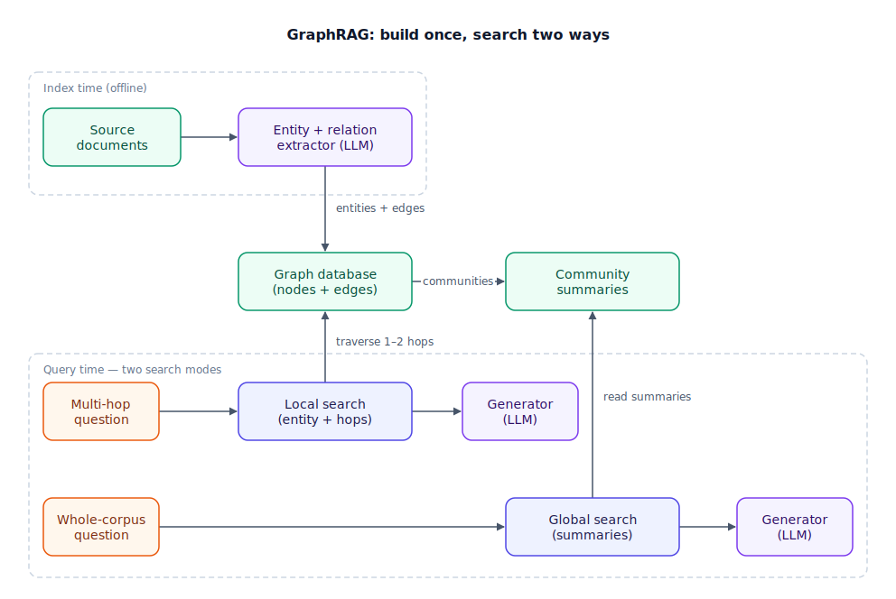

## The 30-second version

GraphRAG bolts a knowledge graph onto retrieval. At index time an LLM (large language model) reads the corpus and extracts entities plus the relationships between them; a graph database stores the result; at query time the system walks those connections instead of only matching similar text. That targets the two question types vector RAG handles worst: multi-hop questions, where the evidence is scattered across documents that share no vocabulary, and whole-corpus questions, which no top-k of chunks can cover. The price is steep — extraction burns serious LLM tokens, and the graph drifts out of date as documents change. Treat it as a specialist tool: for most workloads a [hybrid retriever](./hybrid-search.mdx) plus [reranker](./reranking-strategies.mdx) wins, and when a graph is justified, the lazy graph-as-reranker variant usually beats building the full index.

## The analogy

Picture a genealogist tracing a family through history, versus someone holding only a stack of individual birth certificates.

A single birth certificate tells you a name, a date, a place of birth — full stop. It doesn't tell you that this person's grandmother was the sister of a landowner three counties over, and that connection is exactly what explains why a disputed parcel of land ended up in this family's hands. No single certificate says that; the fact lives in the *chain* of relationships between certificates. A genealogist doesn't reread every scattered document from a courthouse archive to answer "how is this person connected to that estate?" — they consult the family tree they've already built: named people as nodes, marriages and parentage as edges, and they walk the tree hop by hop from the question to the answer.

The tree earns its keep a second way. When a historian asks "summarize this family's rise and fall across three centuries," the genealogist doesn't reread every original certificate — each branch of the tree already has a written summary of that generation's major events, and the answer is built from those branch summaries. But building the tree in the first place took months of archive work, and it goes stale: a birth recorded in one archive but never linked to a later marriage record leaves a real relationship missing, and a genealogist working from an incomplete tree will confidently declare two branches unrelated when they aren't.

| Genealogy element | GraphRAG element |
|---|---|
| A named person on the family tree | Entity node (person, company, policy) |
| A marriage or parentage line between two people | Relationship edge with a type ("owns", "reports to") |
| Reading archives to build the tree | LLM extraction pass at index time |
| A tightly connected branch of the family | Community (graph cluster) |
| The written summary of one branch's history | Community summary |
| Walking the tree, hop by hop, to a distant relative | Local search (multi-hop traversal) |
| Answering "summarize this family" from branch summaries | Global search over summaries |
| Adding newly discovered certificates to the tree | Graph refresh and entity reconciliation |
| An unlinked record leaving two branches wrongly "unrelated" | A stale graph answering confidently |

## How it actually works

The pipeline has three phases — extract, build, query. In the diagram below, the top row is the offline build; the bottom rows are the two online search modes reaching back up into the stores they need.

**Extract.** An LLM scans every document and emits entities (people, projects, dates) and typed relationships ("Person A works on Project B"). This is the budget line that hurts: catching subtle connections wants a strong model, and running a frontier model over a 10,000-page corpus can cost thousands of dollars in API calls. The standard mitigation is a small, cheap model for the first pass, with a big model reserved for reconciling duplicate or conflicting entities. Microsoft's LazyGraphRAG goes further and defers summarization work until query time.

**Build.** Entities become nodes and relationships become edges in a graph database (Neo4j, Memgraph). A clustering algorithm — Leiden is the usual choice — carves the graph into communities, and an LLM writes a natural-language summary for each one, hierarchically.

**Query** comes in two modes. *Local search* handles multi-hop questions: find the entities the query mentions, traverse one to two hops outward, and hand the resulting subgraph plus its source chunks to the generator. *Global search* handles aggregate questions: instead of retrieving raw chunks, search the community summaries — a condensed lens over the whole corpus that fits in a context window. Production stacks run graph and vector search together: the dense pass finds text similar to the query, and the traversal pass adds evidence that is logically connected but semantically nothing like the query.

There's a cheaper variant that has become the dominant production pattern: **graph-as-reranker**. Retrieve the top 50 chunks with your existing vector or hybrid setup, extract the entities appearing in them, traverse one to two hops from those entities to pull in connected chunks, then send the expanded pool through a cross-encoder reranker down to the top 8 or so. You only ever build the slice of graph that queries actually touch. Teams report roughly 70–80% of full GraphRAG's quality lift at about 20% of the upfront cost, with far less to keep fresh.

## A concrete example

Two teams, same decision procedure: pull 100 failed retrievals from the existing RAG system and bucket each failure.

**Team A (customer support KB):** 61 failures were plain retriever misses — the answer existed but never surfaced; 22 were synthesis problems — right chunks, bad answer; only 17 genuinely required chaining relationships across documents. Seventeen percent is below the ~30% line where a graph pays back. The fix was boring and cheap: hybrid scoring, a reranker, and [contextual retrieval](./contextual-retrieval.mdx).

**Team B (supplier compliance, ~10,000 pages of contracts):** 38 of 100 failures were questions like "which suppliers inherit the EU data-residency clause through a subcontractor?" — chains of relationships no chunk states outright. That clears the bar. Their options, priced against the corpus's scale: full extraction with a frontier model runs into the thousands of dollars, plus a recurring reconciliation pass (a graph built in January is meaningfully wrong by April). Graph-as-reranker instead costs on the order of one-fifth of that upfront and delivers most of the lift — so they shipped that first, and reserved the full community-summary build for the quarterly "portfolio risk overview" reports that genuinely need whole-corpus answers.

## The tradeoffs that matter

| Approach | Multi-hop questions | Whole-corpus questions | Build cost | Upkeep | Reach for it when |
|---|---|---|---|---|---|
| Vector / hybrid RAG | Weak past one hop | Poor — top-k is a keyhole | Low | Re-embed changed docs | The default; most workloads |
| Graph-as-reranker | Strong for 1–2 hops | No help | ~20% of full GraphRAG | Only touched slices | Multi-hop bucket ≥30%, corpus keeps changing |
| Full GraphRAG + communities | Strongest | Strong via summaries | High — extraction dominates | Scheduled refresh + entity reconciliation | Multi-hop *and* aggregate questions, stable corpus |

Two more asymmetries worth naming. Scale: vector indexes stretch to petabytes of text, while graph pipelines are practical up to millions of entities — the graph is the boutique option. And failure modes: a weak vector index fails visibly (bad chunks), while a stale graph fails invisibly — it returns a confident, well-structured, wrong answer, which is worse than no graph at all.

## Where people go wrong

1. **Building the graph because it's impressive.** The decision is a measurement, not a taste. Bucket 100 real failures first; below roughly 30% relationship-chain failures, the graph never pays back its construction and upkeep.
2. **Budgeting extraction but not maintenance.** Corpora drift — new documents, renamed entities, rewritten relationships. If you can't fund a recurring re-extraction and reconciliation pass, don't build the index.
3. **Treating the graph as a replacement for vector search.** It's a complement. Traversal finds connected evidence; the dense pass still finds similar evidence. Production systems run both.
4. **Running the frontier model over everything.** Extraction is the token furnace. Small models handle the first pass fine; save the expensive model for entity conflict resolution.
5. **Answering "find X" questions through community summaries.** Global search is for aggregate questions. Routing a lookup through summaries adds cost and blurs precision — match the search mode to the question shape.

## The interview lens

Interviewers use GraphRAG to test whether you upgrade architectures on evidence or on excitement. The strong signal is a decision procedure: what failure data would make you build a graph, and which cheaper fix you'd try first.

A strong sound bite: *"A graph only pays for itself when the evidence for a question never co-occurs in one chunk — so I'd bucket a hundred failed retrievals first, and unless about a third need relationship chains, I fix the retriever instead. If they do, I start with graph-as-reranker and only build community summaries when whole-corpus questions demand them."*

Likely follow-ups:

- Why is extraction the bottleneck? (Token-intensive frontier-model passes over every document; mitigate with small-model first pass and deferred summarization.)
- How do community summaries beat the context-window limit? (Hierarchical pre-summarization — the model reads compact cluster digests instead of a million raw tokens.)
- How do you keep the graph honest as documents change? (Scheduled re-extraction on the diff, entity deduplication, and eval queries that catch stale edges.)

## Go deeper

- [RAG Fundamentals](./rag-fundamentals.mdx) — the vector baseline the graph is measured against.
- [Agentic RAG](./agentic-rag.mdx) — the other answer to multi-hop questions: iterate searches instead of pre-building structure.
- Upstream reference: [GraphRAG — AI System Design Guide](https://github.com/ombharatiya/ai-system-design-guide/blob/main/06-retrieval-systems/07-graph-rag.md) (MIT; see [CREDITS](../../../CREDITS.md)).
- [Design a Production RAG System](../../walkthroughs/design-a-production-rag-system.mdx) — where this decision shows up in a full interview loop.
